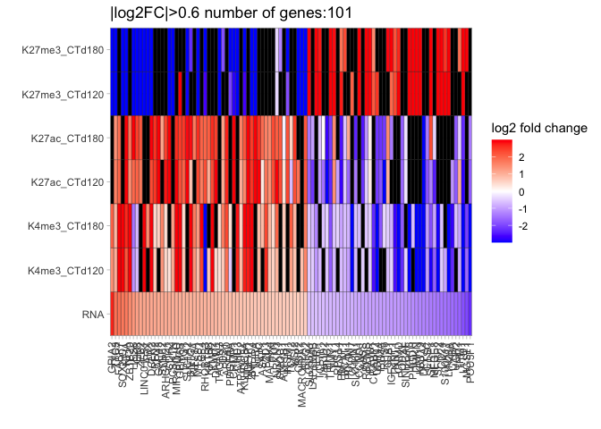
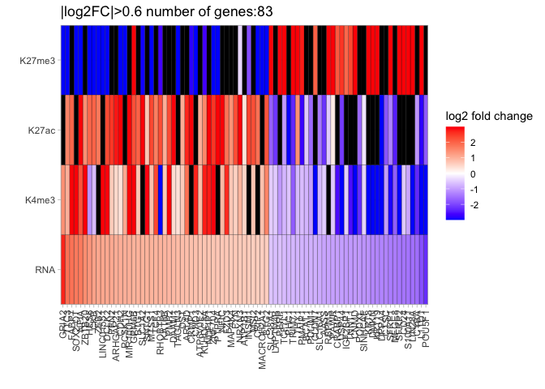
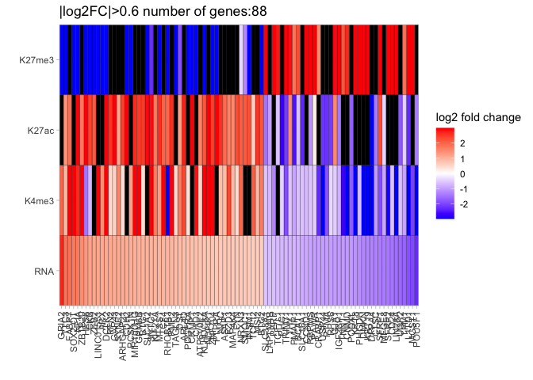

Plot_heatmap_RNA_chromatin
================
2024-07-12

### load library

``` r
library(dplyr)
library(tidyr)
library(stringr)
library(tidyverse)
library(ggplot2)
library(ggrepel)
library(RColorBrewer)
library(pheatmap)
library(VennDiagram)
```

### read in gene expression data

``` r
#folder with gene expression data
ifolder <- "output/DE/"

#folder to store filtered gene list for genomic coverage plotting with deeptools later
ofolder <- "output/CUT&Tag/genomicCoverage/"

#read in the MAST differential expression result of scRNA-seq 
ALLgene <- read.table(paste(ifolder, "GPC.vs.PSC.allFC.txt", sep = "/"), header = TRUE)
ALLgene <- na.omit(ALLgene)
colnames(ALLgene) <- c("Gene", "RNA_p-value", "RNA_FDR", "RNA_Log2FC")
ALLgene$Gene <- factor(ALLgene$Gene)

#get the percentage of cell expression from scRNA-seq
DEgene_expr <- read.table(paste(ifolder, "expressionFractionsFilt.PSC_GPC.txt", sep = "/"), header = TRUE, sep = "\t")
DEgene_expr$id <- factor(DEgene_expr$id)
DEgene_expr$features.plot <- factor(DEgene_expr$features.plot)
DEgene_expr_sumary <- DEgene_expr %>% group_by(features.plot) %>% dplyr::summarize(RNA_pct_max=max(pct.exp), RNA_exp_max=max(avg.exp))
colnames(DEgene_expr_sumary) <- c("Gene", "RNA_pct_max", "RNA_exp_max")

#combine log2FC and PCT into one data frame
ALLgene_plot <- inner_join(ALLgene, DEgene_expr_sumary, by = "Gene")

#keep genes with PCT cutoff of 30%, expression cutoff of 0.3
ALLgene_plot <- ALLgene_plot[ALLgene_plot$RNA_pct_max > 30 & ALLgene_plot$RNA_exp_max > 0.3, ]

#log2FC cutoff of 0.25
cutoff=0.25

###
#write control genes to output for plotting genomic coverage of the three histone marks
###
#write out control genes(|log2fc| < 0.25) for plotting genomic coverage of the three histone marks
out_control <- ALLgene_plot[ALLgene_plot$RNA_Log2FC < cutoff & ALLgene_plot$RNA_Log2FC > (-cutoff), ]
write.table(out_control[, c("Gene","RNA_Log2FC")], file = paste0(ofolder, "/GPC.vs.PSC.GeneList.filter_PCT0.3_expr0.3_log2FC", cutoff, "_control.txt"), sep = "\t", quote = F, row.names = F, col.names = F)


#filter for significantly differential genes (FDR<0.01, |log2fc| > 0.25)
DEgene_plot <- ALLgene_plot[ALLgene_plot$RNA_FDR<0.01 & (ALLgene_plot$RNA_Log2FC > cutoff | ALLgene_plot$RNA_Log2FC < (-cutoff)),]

###
#write up and down-regulated genes separately to output for plotting genomic coverage of the three histone marks
###
out <- DEgene_plot
write.table(out[out$RNA_Log2FC > cutoff, c("Gene","RNA_Log2FC")], file = paste0(ofolder, "/GPC.vs.PSC.GeneList.filter_PCT0.3_expr0.3_log2FC", cutoff, "_up.txt"), sep = "\t", quote = F, row.names = F, col.names = F)
write.table(out[out$RNA_Log2FC < (-cutoff), c("Gene","RNA_Log2FC")], file = paste0(ofolder, "/GPC.vs.PSC.GeneList.filter_PCT0.3_expr0.3_log2FC", cutoff, "_down.txt"), sep = "\t", quote = F, row.names = F, col.names = F)
```

### 

### CTd120

### 

### read in Bulk CUT&Tag data and combine with RNA expression data together

``` r
#folder with chromatin data
ofolder <- "output/CUT&Tag/DiffBind/"
itime <- "CTd120"
  
###
#for histone marke K4me3
###
mark="K4me3"
#read in differential peak annotation
peakAnnot <- read.table(paste0(ofolder, mark, "_", itime, "_diff_peak_annotation_promoter.txt"), header = T, sep = "\t")
peakAnnot <- peakAnnot[peakAnnot$V7<0.05,]

#keep differential peaks annotated to promoter region
peakAnnot <- peakAnnot[str_split_fixed(peakAnnot$annotation, " ", 2)[,1]=="Promoter",]

#keep columns of gene name and log2fc
peakAnnot_plot <- peakAnnot[,c("SYMBOL", "V5")]
colnames(peakAnnot_plot) <- c("Gene", "HistoneMark_log2FC")

#collapses multiple peaks for the genes by average
peakAnnot_plot_uniq <- peakAnnot_plot %>% group_by(Gene) %>% dplyr::summarize("HistoneMark_log2FC"=mean(HistoneMark_log2FC))
peakAnnot_plot1 <- peakAnnot_plot_uniq
colnames(peakAnnot_plot1) <- c("Gene", "K4me3_promoter")


###
#for histone marke K27me3 
###
mark="K27me3"
#read in differential peak annotation
peakAnnot <- read.table(paste0(ofolder, mark, "_", itime, "_diff_peak_annotation_promoter.txt"), header = T, sep = "\t")
peakAnnot <- peakAnnot[peakAnnot$V7<0.05,]

#keep differential peaks annotated to promoter region
peakAnnot <- peakAnnot[str_split_fixed(peakAnnot$annotation, " ", 2)[,1]=="Promoter",]

#keep columns of gene name and log2fc
peakAnnot_plot <- peakAnnot[,c("SYMBOL", "V5")]
colnames(peakAnnot_plot) <- c("Gene", "HistoneMark_log2FC")

#collapses multiple peaks for the genes by average
peakAnnot_plot_uniq <- peakAnnot_plot %>% group_by(Gene) %>% dplyr::summarize("HistoneMark_log2FC"=mean(HistoneMark_log2FC))
peakAnnot_plot2 <- peakAnnot_plot_uniq
colnames(peakAnnot_plot2) <- c("Gene", "K27me3_promoter")


###
#for histone marke K27ac
###
mark="K27ac"
#read in differential peak annotation
peakAnnot <- read.table(paste0(ofolder, mark, "_", itime, "_diff_peak_annotation_enhancer.txt"), header = FALSE, sep = "\t")
peakAnnot <- peakAnnot[peakAnnot$V13<0.05,]

#keep columns of GHid and log2fc
peakAnnot <- peakAnnot[,c("V4", "V11")]
colnames(peakAnnot) <- c("GHid", "HistoneMark_log2FC")
#collapses multiple peaks for the GHid by average 
peakAnnot_uniq <- peakAnnot %>% group_by(GHid) %>% dplyr::summarize("HistoneMark_log2FC"=mean(HistoneMark_log2FC))

#get gene name from enhancer-gene associatoin info from GeneHancer database
associationGene <- read.table("data_for_import/CUT&Tag/GeneHancer_AnnotSV_gene_association_scores_v5.18_elite.txt", header = F)
associationGene <- associationGene[,c(1,2)]
colnames(associationGene) <- c("GHid", "Gene")
#reference GHid to gene names
peakAnnot_plot <- inner_join(peakAnnot_uniq, associationGene, by="GHid", relationship = "one-to-many")

#collapses genes with multiple peaks by average
peakAnnot_plot_uniq <- peakAnnot_plot %>% group_by(Gene) %>% summarize("HistoneMark_log2FC"=mean(HistoneMark_log2FC))
peakAnnot_plot4 <- peakAnnot_plot_uniq
colnames(peakAnnot_plot4) <- c("Gene", "K27ac_enhacner")

#merge histone mark data and RNA expression data together
peakAnnot_list <- list(DEgene_plot, peakAnnot_plot1, peakAnnot_plot2, peakAnnot_plot4)
total <- peakAnnot_list %>% purrr::reduce(left_join, by = "Gene") 

total_120 <- total
```

### 

### CTd180

### 

### read in Bulk CUT&Tag data and combine with RNA expression data together

``` r
#folder with chromatin data
ofolder <- "output/CUT&Tag/DiffBind/"
itime <- "CTd180"
  
###
#for histone marke K4me3
###
mark="K4me3"
#read in differential peak annotation
peakAnnot <- read.table(paste0(ofolder, mark, "_", itime, "_diff_peak_annotation_promoter.txt"), header = T, sep = "\t")
peakAnnot <- peakAnnot[peakAnnot$V7<0.05,]

#keep differential peaks annotated to promoter region
peakAnnot <- peakAnnot[str_split_fixed(peakAnnot$annotation, " ", 2)[,1]=="Promoter",]

#keep columns of gene name and log2fc
peakAnnot_plot <- peakAnnot[,c("SYMBOL", "V5")]
colnames(peakAnnot_plot) <- c("Gene", "HistoneMark_log2FC")

#collapses multiple peaks for the genes by average
peakAnnot_plot_uniq <- peakAnnot_plot %>% group_by(Gene) %>% dplyr::summarize("HistoneMark_log2FC"=mean(HistoneMark_log2FC))
peakAnnot_plot1 <- peakAnnot_plot_uniq
colnames(peakAnnot_plot1) <- c("Gene", "K4me3_promoter")


###
#for histone marke K27me3 
###
mark="K27me3"
#read in differential peak annotation
peakAnnot <- read.table(paste0(ofolder, mark, "_", itime, "_diff_peak_annotation_promoter.txt"), header = T, sep = "\t")
peakAnnot <- peakAnnot[peakAnnot$V7<0.05,]

#keep differential peaks annotated to promoter region
peakAnnot <- peakAnnot[str_split_fixed(peakAnnot$annotation, " ", 2)[,1]=="Promoter",]

#keep columns of gene name and log2fc
peakAnnot_plot <- peakAnnot[,c("SYMBOL", "V5")]
colnames(peakAnnot_plot) <- c("Gene", "HistoneMark_log2FC")

#collapses multiple peaks for the genes by average
peakAnnot_plot_uniq <- peakAnnot_plot %>% group_by(Gene) %>% dplyr::summarize("HistoneMark_log2FC"=mean(HistoneMark_log2FC))
peakAnnot_plot2 <- peakAnnot_plot_uniq
colnames(peakAnnot_plot2) <- c("Gene", "K27me3_promoter")


###
#for histone marke K27ac
###
mark="K27ac"
#read in differential peak annotation
peakAnnot <- read.table(paste0(ofolder, mark, "_", itime, "_diff_peak_annotation_enhancer.txt"), header = FALSE, sep = "\t")
peakAnnot <- peakAnnot[peakAnnot$V13<0.05,]

#keep columns of GHid and log2fc
peakAnnot <- peakAnnot[,c("V4", "V11")]
colnames(peakAnnot) <- c("GHid", "HistoneMark_log2FC")
#collapses multiple peaks for the GHid by average 
peakAnnot_uniq <- peakAnnot %>% group_by(GHid) %>% dplyr::summarize("HistoneMark_log2FC"=mean(HistoneMark_log2FC))

#get gene name from enhancer-gene associatoin info from GeneHancer database
associationGene <- read.table("data_for_import/CUT&Tag/GeneHancer_AnnotSV_gene_association_scores_v5.18_elite.txt", header = F)
associationGene <- associationGene[,c(1,2)]
colnames(associationGene) <- c("GHid", "Gene")
#reference GHid to gene names
peakAnnot_plot <- inner_join(peakAnnot_uniq, associationGene, by="GHid", relationship = "one-to-many")

#collapses genes with multiple peaks by average
peakAnnot_plot_uniq <- peakAnnot_plot %>% group_by(Gene) %>% summarize("HistoneMark_log2FC"=mean(HistoneMark_log2FC))
peakAnnot_plot4 <- peakAnnot_plot_uniq
colnames(peakAnnot_plot4) <- c("Gene", "K27ac_enhacner")

#merge histone mark data and RNA expression data together
peakAnnot_list <- list(DEgene_plot, peakAnnot_plot1, peakAnnot_plot2, peakAnnot_plot4)
total <- peakAnnot_list %>% purrr::reduce(left_join, by = "Gene") 

total_180 <- total
```

### combine CTd120 and CTd180 data together

``` r
#variable to store DIV 120 data
summary_120 <- total_120

#variable to store DIV 120 data
summary_180 <- total_180

#combine CTd120 and CTd180 data together
colnames(total_120) <- c("Gene", "RNA_p-value", "RNA_FDR", "RNA_Log2FC", "RNA_pct_max", "RNA_exp_max", "K4me3_promoter_120", "K27me3_promoter_120", "K27ac_enhacner_120" )

total_180 <- total_180[, c("Gene", "K4me3_promoter", "K27me3_promoter", "K27ac_enhacner")]
colnames(total_180) <- c("Gene", "K4me3_promoter_180", "K27me3_promoter_180", "K27ac_enhacner_180" )

total_120$Gene
```

    ##    [1] "TPM2"            "POU3F3"          "ERP29"           "CYBA"           
    ##    [5] "HP1BP3"          "RO60"            "PLCG2"           "ATP5F1A"        
    ##    [9] "MIF"             "GDI1"            "CDKN1B"          "CNTFR"          
    ##   [13] "LIN28A"          "EIF3A"           "TMEM147"         "SINHCAF"        
    ##   [17] "MIR302CHG"       "CNIH4"           "HMGA1"           "SPAG9"          
    ##   [21] "ADGRG1"          "ATP1B3"          "SLF2"            "CDH2"           
    ##   [25] "ALKBH7"          "APOE"            "SRGAP2C"         "PDIA3"          
    ##   [29] "IFNAR1"          "ELOVL2"          "FAM89B"          "PHYHIPL"        
    ##   [33] "PPP1CC"          "CORO2B"          "FXYD6"           "VEZF1"          
    ##   [37] "GDI2"            "NPC2"            "SNHG8"           "SMCHD1"         
    ##   [41] "MACROH2A1"       "EPCAM"           "MGST1"           "TPM1"           
    ##   [45] "MYL12A"          "PABPC1"          "RSL1D1"          "NCAN"           
    ##   [49] "CACYBP"          "MAGI1"           "DST"             "NUMA1"          
    ##   [53] "DLX1"            "C4orf48"         "SSU72"           "APRT"           
    ##   [57] "NFIX"            "TNNT1"           "GAS5"            "PDIA6"          
    ##   [61] "SIRT2"           "RFTN1"           "NNT-AS1"         "EPB41L4A-AS1"   
    ##   [65] "KIF5B"           "EIF4B"           "SRGAP2B"         "TUBA1C"         
    ##   [69] "SCRG1"           "ARFGAP3"         "KMT2C"           "SLC1A2"         
    ##   [73] "LIMA1"           "L1TD1"           "IGF2BP1"         "BOD1"           
    ##   [77] "OSTC"            "KIF21A"          "PFDN4"           "RPSAP58"        
    ##   [81] "SFRP2"           "IMPDH2"          "GOLM2"           "TRAF3IP2-AS1"   
    ##   [85] "GSTM3"           "MAP2"            "NDFIP1"          "SNCAIP"         
    ##   [89] "EPS8"            "NNAT"            "FBL"             "UBXN2A"         
    ##   [93] "FGD5-AS1"        "THAP12"          "SEPTIN7"         "ATP6V0E2"       
    ##   [97] "MIR99AHG"        "SNRPC"           "HOOK3"           "ASAP1"          
    ##  [101] "PGP"             "H1-4"            "ZMAT3"           "SPOP"           
    ##  [105] "RNF19A"          "SPCS1"           "IGF2BP3"         "MAP1A"          
    ##  [109] "ADD1"            "SETBP1"          "NFIA"            "KRT18"          
    ##  [113] "TUBA1A"          "RBPMS"           "LINC01551"       "SRPK2"          
    ##  [117] "ACAP3"           "PSMB4"           "ADGRB3-DT"       "IPO5"           
    ##  [121] "MARVELD3"        "HSP90B1"         "DLEU2"           "PNRC1"          
    ##  [125] "TOMM20"          "KPNB1"           "UBB"             "PIH1D1"         
    ##  [129] "RBMS1"           "SNRPN"           "FLJ37453"        "POU3F2"         
    ##  [133] "RND3"            "CHCHD1"          "LCORL"           "POLR1D"         
    ##  [137] "RND2"            "FAM110B"         "SGCB"            "COA1"           
    ##  [141] "PMF1"            "AKIRIN1"         "CLDN7"           "ZMIZ1"          
    ##  [145] "MICU1"           "GSE1"            "C1QBP"           "TXNDC17"        
    ##  [149] "INAFM1"          "EIF2S3"          "NR6A1"           "VCL"            
    ##  [153] "TKT"             "PCBP1"           "SNRPA"           "CDKN1A"         
    ##  [157] "IER5"            "MSH6"            "CEP97"           "NKAIN3"         
    ##  [161] "PHGDH"           "CSRP2"           "PLEKHJ1"         "FBXW7"          
    ##  [165] "PPP2R5C"         "DDOST"           "VPS37B"          "LEMD1"          
    ##  [169] "CGGBP1"          "ZEB1"            "CFL2"            "LMAN1"          
    ##  [173] "CDK5RAP2"        "NRCAM"           "C11orf96"        "RNF180"         
    ##  [177] "PSD3"            "DAZAP1"          "EIF3D"           "TCEA2"          
    ##  [181] "FAM107B"         "KLF13"           "YAF2"            "PLEKHO1"        
    ##  [185] "SOX6"            "VPS13C"          "SMC5"            "TEAD1"          
    ##  [189] "G3BP2"           "NOP53"           "PRMT1"           "TSTD1"          
    ##  [193] "SCARB2"          "CCT8"            "EIF5A"           "EEF1E1"         
    ##  [197] "PMAIP1"          "RSPRY1"          "RB1"             "CENPC"          
    ##  [201] "TMEM131"         "MED28"           "ARX"             "EPN2"           
    ##  [205] "PAK3"            "RTL8C"           "P4HB"            "RAP2A"          
    ##  [209] "LNPK"            "ZEB2"            "TPM3"            "LRRN3"          
    ##  [213] "CNN2"            "FKBP1A"          "H2AC15"          "LAPTM4A"        
    ##  [217] "SOS2"            "ELAVL3"          "CPNE2"           "TMEM205"        
    ##  [221] "XRCC6"           "PSMD7"           "IFI16"           "ANAPC16"        
    ##  [225] "SRGAP2"          "SLC35F1"         "EIF3E"           "SNRNP27"        
    ##  [229] "HIRIP3"          "SSR3"            "FAM171B"         "LSAMP"          
    ##  [233] "CTSC"            "NUCB2"           "ARL2BP"          "PRSS8"          
    ##  [237] "PHC2"            "LAMTOR3"         "HR"              "VPS35"          
    ##  [241] "CDKN1C"          "SOX8"            "NEDD4L"          "GLRX5"          
    ##  [245] "BCL2L12"         "LZIC"            "RHOBTB3"         "SPIRE1"         
    ##  [249] "FOXH1"           "ERG28"           "MSH2"            "GLCCI1"         
    ##  [253] "EMD"             "CDKN2D"          "PPP1CB"          "ENSG00000254277"
    ##  [257] "MDH1"            "INSM1"           "LY6E"            "C16orf87"       
    ##  [261] "SMARCE1"         "MPC1"            "CUEDC2"          "H2AC20"         
    ##  [265] "MRPL14"          "SMARCC2"         "BMERB1"          "CCT4"           
    ##  [269] "LINC00665"       "DOCK7"           "ZNF581"          "C5orf24"        
    ##  [273] "NR2F1"           "CEP57L1"         "NOPCHAP1"        "TP53I11"        
    ##  [277] "LSM6"            "RAB8B"           "QKI"             "PFDN1"          
    ##  [281] "ABRACL"          "POU5F1"          "DDR1"            "GPSM2"          
    ##  [285] "KCTD20"          "CORO1C"          "ARHGAP21"        "CRIP2"          
    ##  [289] "BLOC1S6"         "SYT11"           "SUZ12"           "RAB14"          
    ##  [293] "DSG2"            "KLHDC8A"         "DVL3"            "ANKRD36C"       
    ##  [297] "HMGB3"           "ZMYND11"         "NASP"            "DCTN3"          
    ##  [301] "JAM2"            "TCF25"           "CAMK2N1"         "TERF1"          
    ##  [305] "SYNRG"           "ATF4"            "ITGB1BP1"        "HES4"           
    ##  [309] "LYRM2"           "DLX2"            "ZFYVE16"         "CCNG1"          
    ##  [313] "MKLN1"           "MYEF2"           "QPRT"            "CCDC28B"        
    ##  [317] "CCNB1IP1"        "DPYSL5"          "UBE2QL1"         "CKAP5"          
    ##  [321] "SOX9"            "ZNF428"          "TRIM28"          "APC"            
    ##  [325] "DAZAP2"          "MAML2"           "EIF1AX"          "RNF7"           
    ##  [329] "ENSG00000289479" "STK39"           "SORT1"           "CPLANE1"        
    ##  [333] "SAP18"           "C18orf32"        "POLR2H"          "XACT"           
    ##  [337] "FABP7"           "FKBP4"           "DPPA4"           "PIK3R3"         
    ##  [341] "MLEC"            "RNF181"          "PLCB1"           "ZBTB18"         
    ##  [345] "RABAC1"          "SELENOK"         "MED19"           "CAPN7"          
    ##  [349] "PWWP3A"          "MFSD10"          "MIS18A"          "ARL8A"          
    ##  [353] "PGAM1"           "MRPS15"          "AFF4"            "RABEP1"         
    ##  [357] "MTCH1"           "SANBR"           "MEAF6"           "SALL4"          
    ##  [361] "KRT19"           "NAMPT"           "SSR4"            "LINC00461"      
    ##  [365] "IPO9"            "TTC37"           "APLP2"           "PRRC2B"         
    ##  [369] "FRYL"            "PAWR"            "CCT3"            "LINC01003"      
    ##  [373] "PSME3IP1"        "TMCO1"           "SERBP1"          "CNPY2"          
    ##  [377] "BORCS7"          "SEC11A"          "NAE1"            "STIM2"          
    ##  [381] "PRELID1"         "LYPLA1"          "COX5A"           "ARL2"           
    ##  [385] "CCDC88A"         "GSTA4"           "MSI2"            "LAPTM4B"        
    ##  [389] "DSC2"            "ASCL1"           "POLR2I"          "PKN2"           
    ##  [393] "MED10"           "XRN2"            "NFIC"            "SYNE2"          
    ##  [397] "SSB"             "BICD1"           "RAB34"           "GAB1"           
    ##  [401] "PSMA3"           "CNMD"            "MAPK1"           "SNHG7"          
    ##  [405] "EBP"             "ARL4C"           "EXOSC7"          "SS18L2"         
    ##  [409] "ATP5IF1"         "MAP7D1"          "GPATCH11"        "VBP1"           
    ##  [413] "PMP2"            "FAM168A"         "AHCY"            "HSPE1"          
    ##  [417] "S100A13"         "MDM2"            "SMARCC1"         "MAP4K4"         
    ##  [421] "CELSR2"          "H4C5"            "RTF1"            "MRPS26"         
    ##  [425] "CYCS"            "NSD2"            "FBXO2"           "AKT3"           
    ##  [429] "ERBIN"           "ADAM9"           "HSPA13"          "IGF2BP2"        
    ##  [433] "TSPAN5"          "DNMT3B"          "STOML2"          "CCP110"         
    ##  [437] "ARL4D"           "CERS6"           "PIGX"            "NSD1"           
    ##  [441] "BBIP1"           "PEA15"           "BMP7"            "FAM210B"        
    ##  [445] "WSB1"            "RANBP1"          "PRDX6"           "POLR3GL"        
    ##  [449] "FAM136A"         "CCSER2"          "CCT5"            "TIMM13"         
    ##  [453] "STAT3"           "SOBP"            "KMT5A"           "HSPD1"          
    ##  [457] "F2R"             "COA4"            "MSI1"            "FZD7"           
    ##  [461] "ZBTB20"          "SMARCA2"         "FAM204A"         "SCP2"           
    ##  [465] "DANCR"           "G3BP1"           "GPM6A"           "H4C3"           
    ##  [469] "HIPK2"           "TMED4"           "RSF1"            "STX12"          
    ##  [473] "MCM3"            "CRB1"            "FBXW11"          "FNDC3A"         
    ##  [477] "SRPK1"           "S100A11"         "USO1"            "TAGLN"          
    ##  [481] "PAK2"            "DDX21"           "CCNL1"           "MRPL11"         
    ##  [485] "CALR"            "SLC50A1"         "IDH1"            "NTHL1"          
    ##  [489] "ELF2"            "TMEM160"         "CHMP3"           "C3orf14"        
    ##  [493] "SMC6"            "NFIB"            "TET2"            "IFT81"          
    ##  [497] "CCSAP"           "PAICS"           "SPINT2"          "BAZ1B"          
    ##  [501] "SNRPB"           "CRYL1"           "SSBP1"           "PBDC1"          
    ##  [505] "RBM3"            "CTBP2"           "HNRNPD"          "SNHG4"          
    ##  [509] "PRKDC"           "PDZRN3"          "RCC2"            "OAZ2"           
    ##  [513] "PHB"             "TNRC18"          "TSEN34"          "ROBO2"          
    ##  [517] "KIF2A"           "MAN1A2"          "PNPLA8"          "PJA2"           
    ##  [521] "ECHS1"           "ISCA2"           "AP2S1"           "ARHGAP5"        
    ##  [525] "AGO3"            "COL18A1"         "ZHX1"            "WSB2"           
    ##  [529] "TBC1D5"          "TTC3"            "IFITM2"          "ANAPC13"        
    ##  [533] "DCLK2"           "NT5DC1"          "TSPAN3"          "APPBP2"         
    ##  [537] "BRD9"            "PALM"            "TOMM40"          "GPM6B"          
    ##  [541] "GGCT"            "EBPL"            "TAOK3"           "GAL"            
    ##  [545] "DNAJC2"          "IARS1"           "PLPP2"           "SRM"            
    ##  [549] "LRRCC1"          "FARP1"           "UGP2"            "ENC1"           
    ##  [553] "FOXD3-AS1"       "EIF2S2"          "NR2F6"           "PET100"         
    ##  [557] "PSMC5"           "NDUFS1"          "SNTG1"           "SETD2"          
    ##  [561] "OXR1"            "ESRG"            "PNMA2"           "CCDC14"         
    ##  [565] "TCOF1"           "KRTCAP3"         "CRABP2"          "WDR13"          
    ##  [569] "PPP6R2"          "EIF2AK4"         "FAM177A1"        "NRIP1"          
    ##  [573] "DYNLRB1"         "NNT"             "SNX4"            "MFAP2"          
    ##  [577] "MRPS34"          "BDP1"            "DMKN"            "SNHG3"          
    ##  [581] "MTRFR"           "ARHGAP33"        "C20orf27"        "VPS36"          
    ##  [585] "KAT6B"           "GCSH"            "ZADH2"           "MAGI3"          
    ##  [589] "RP9"             "KIF1A"           "DHX40"           "DYNC1I2"        
    ##  [593] "MPG"             "YBX3"            "VPS28"           "KIAA1586"       
    ##  [597] "SNRPA1"          "FAM174C"         "TTLL7"           "PANTR1"         
    ##  [601] "ATRNL1"          "FKBP8"           "NRXN2"           "SOCS4"          
    ##  [605] "ASRGL1"          "TUT4"            "PHB2"            "DPY30"          
    ##  [609] "SH3BGRL"         "SCOC"            "OCIAD2"          "MED4"           
    ##  [613] "CYB5A"           "PRKCA"           "RNF187"          "RTRAF"          
    ##  [617] "HSPA9"           "DHRS7"           "DPYSL4"          "SAMD8"          
    ##  [621] "MRPL3"           "NOP56"           "ABCD3"           "RFTN2"          
    ##  [625] "SNU13"           "SOX2-OT"         "CD24"            "MTSS1"          
    ##  [629] "RPAIN"           "EIF3K"           "CTDSPL2"         "EI24"           
    ##  [633] "CLDN3"           "PPM1G"           "GAP43"           "OLFML3"         
    ##  [637] "DNAJC19"         "STMN3"           "SNHG5"           "BTG2"           
    ##  [641] "COMMD3"          "SDCBP"           "GLRX3"           "BCL7A"          
    ##  [645] "NME3"            "SMPDL3B"         "CAPZB"           "CCT7"           
    ##  [649] "USP16"           "NCBP2AS2"        "SLC25A39"        "PKIA"           
    ##  [653] "TCEAL3"          "PYCARD"          "CFAP97"          "ITM2C"          
    ##  [657] "CCDC82"          "ITGB8"           "SNAPC3"          "RNF5"           
    ##  [661] "POMP"            "ID4"             "DCTN4"           "ENSG00000280707"
    ##  [665] "PSMA4"           "KITLG"           "MRPS16"          "EXOC1"          
    ##  [669] "FER"             "ZSCAN10"         "HSPA5"           "CCDC50"         
    ##  [673] "ACTR1A"          "MXRA7"           "SUGP2"           "MUS81"          
    ##  [677] "TUFM"            "THY1"            "SEPTIN11"        "DCAF13"         
    ##  [681] "MRPL20"          "RNH1"            "CMPK1"           "MRPS9"          
    ##  [685] "PSMB3"           "NDUFA3"          "WFDC2"           "RFX3"           
    ##  [689] "NPDC1"           "MXI1"            "EIF3G"           "SENP7"          
    ##  [693] "CUX1"            "MRPL28"          "NME4"            "JAM3"           
    ##  [697] "FRA10AC1"        "UQCRFS1"         "NIPSNAP1"        "VOPP1"          
    ##  [701] "EZH2"            "DFFA"            "AASS"            "VPS26B"         
    ##  [705] "CYFIP2"          "PTOV1"           "XPA"             "CAMK2D"         
    ##  [709] "PGRMC1"          "ATN1"            "LZTS1"           "CASK"           
    ##  [713] "HAGH"            "REX1BD"          "CACNG4"          "EIF3B"          
    ##  [717] "DKC1"            "GADD45GIP1"      "POLR2E"          "PIBF1"          
    ##  [721] "PDGFRA"          "RAB3B"           "NSD3"            "STMN4"          
    ##  [725] "RPL22L1"         "PGK1"            "DYNLT2B"         "MDN1"           
    ##  [729] "ZKSCAN1"         "EIF3M"           "TWF1"            "POU3F4"         
    ##  [733] "NEMF"            "PALLD"           "CDK6"            "TIMP2"          
    ##  [737] "GIHCG"           "BSG"             "USP47"           "TCF7L1"         
    ##  [741] "PRDX1"           "ATP2B4"          "NDUFAF3"         "CYTH1"          
    ##  [745] "EXOC5"           "SALL1"           "C22orf39"        "NDUFB10"        
    ##  [749] "CEROX1"          "ERLEC1"          "BAZ2B"           "CDC42BPA"       
    ##  [753] "LAMTOR4"         "ZDHHC21"         "H1-2"            "TMED9"          
    ##  [757] "NDN"             "PPP1CA"          "WDR43"           "FGFR1"          
    ##  [761] "BRD1"            "KATNBL1"         "LINC01405"       "THRA"           
    ##  [765] "ISOC2"           "MIR9-1HG"        "CHCHD3"          "WASHC3"         
    ##  [769] "SON"             "ENSG00000288749" "CLCN3"           "ARMCX3"         
    ##  [773] "SBDS"            "RPAP2"           "CHASERR"         "IFI27L2"        
    ##  [777] "TGIF1"           "ACP1"            "SLC25A6"         "MPPED2"         
    ##  [781] "PRDX3"           "SMIM20"          "PMM1"            "THAP5"          
    ##  [785] "GSX2"            "BRD8"            "NCOA1"           "ESRP1"          
    ##  [789] "PCBP4"           "NRXN3"           "WDR47"           "CCDC167"        
    ##  [793] "RRBP1"           "RBPMS2"          "FYTTD1"          "SLAIN2"         
    ##  [797] "MDH2"            "PFN1"            "CADM4"           "LINC01896"      
    ##  [801] "PPP4R3B"         "CD47"            "PRPF18"          "JADE1"          
    ##  [805] "C1GALT1"         "BRI3"            "ATP5F1B"         "MTCH2"          
    ##  [809] "OTUD6B-AS1"      "SMCO4"           "IMP3"            "GOPC"           
    ##  [813] "CTSD"            "SLC22A17"        "RBM22"           "MEGF9"          
    ##  [817] "H2AC6"           "MYL9"            "ENSG00000249790" "SOX1"           
    ##  [821] "SHOC2"           "CTSV"            "NCAM1"           "PTPRA"          
    ##  [825] "PARP2"           "ACAA2"           "ASXL1"           "HDDC2"          
    ##  [829] "SARS1"           "SNHG16"          "LRRC3B"          "KPNA3"          
    ##  [833] "SLTM"            "ZSCAN16-AS1"     "SNRPF"           "LONP2"          
    ##  [837] "SPAG7"           "IMPA2"           "METTL5"          "BIRC2"          
    ##  [841] "PHACTR4"         "PARP1"           "TMEM106C"        "TCAF1"          
    ##  [845] "ELAVL4"          "NOVA2"           "TRMT112"         "JUN"            
    ##  [849] "CHD3"            "TSPAN6"          "PDHB"            "DAAM1"          
    ##  [853] "XIAP"            "ENSG00000283103" "FKBP1B"          "MTPN"           
    ##  [857] "SLC25A1"         "PFN2"            "MCPH1"           "CILK1"          
    ##  [861] "NIN"             "DLL3"            "VAT1"            "MAP3K2"         
    ##  [865] "EIF4EBP1"        "HELLS"           "RALA"            "CDH1"           
    ##  [869] "GAS2L3"          "ADSS2"           "SND1"            "FMC1"           
    ##  [873] "IFITM3"          "NPY"             "ADK"             "LDHA"           
    ##  [877] "MSANTD3"         "NF1"             "CFAP95"          "AP1M2"          
    ##  [881] "ANKRD26"         "COL1A1"          "TPST2"           "FYN"            
    ##  [885] "PPAT"            "AKR1A1"          "TTC28"           "DIP2C"          
    ##  [889] "USP44"           "S100A10"         "TTL"             "PTRHD1"         
    ##  [893] "ARHGEF9"         "GOLIM4"          "ATIC"            "SMDT1"          
    ##  [897] "PSMA5"           "RSRC1"           "MDK"             "KMT2E"          
    ##  [901] "LHFPL6"          "FASN"            "HSD17B12"        "REV3L"          
    ##  [905] "RCN1"            "GPX1"            "TALDO1"          "MRPL12"         
    ##  [909] "RPA3"            "DDX5"            "RAB25"           "PLAAT3"         
    ##  [913] "RTN3"            "CALU"            "MEIS3"           "SUCLG1"         
    ##  [917] "NPM3"            "USP34"           "SEMA6A"          "SIVA1"          
    ##  [921] "INTU"            "SOGA1"           "SNAPIN"          "PPP2CB"         
    ##  [925] "GYPC"            "GAD1"            "UNG"             "CD2AP"          
    ##  [929] "TTC9B"           "ENSG00000254339" "MESD"            "SRSF2"          
    ##  [933] "CRNKL1"          "ACLY"            "LSM4"            "KDELR1"         
    ##  [937] "PRR13"           "CEP170"          "KRAS"            "ENO1"           
    ##  [941] "B3GAT2"          "UBE2I"           "GJA1"            "PRPF4B"         
    ##  [945] "PSMB5"           "DSP"             "MAGED1"          "SEPHS1"         
    ##  [949] "MRPL34"          "TTC21B"          "BOLA3"           "RMI1"           
    ##  [953] "LINC00545"       "NETO2"           "ZBTB41"          "ME2"            
    ##  [957] "UQCRH"           "KAT6A"           "CHMP5"           "DSEL"           
    ##  [961] "DCUN1D5"         "BFAR"            "CLDN6"           "VRTN"           
    ##  [965] "MAD2L2"          "SCAPER"          "PIK3R1"          "ARPC5"          
    ##  [969] "STX2"            "BAZ1A"           "ADD3"            "HNRNPF"         
    ##  [973] "FAM172A"         "EIF4G3"          "CDKN2AIPNL"      "CLTB"           
    ##  [977] "EVL"             "NDUFA1"          "MFSD3"           "SRGAP3"         
    ##  [981] "TMEM97"          "NAGK"            "DYNC1LI2"        "DDAH2"          
    ##  [985] "CAVIN3"          "CCT2"            "SH3GLB1"         "MEIS2"          
    ##  [989] "MED13"           "RBM23"           "EPRS1"           "SNRPD1"         
    ##  [993] "TRAPPC2L"        "STRAP"           "MIR100HG"        "NT5DC2"         
    ##  [997] "MRPL47"          "SAP30"           "MAP2K2"          "ZC2HC1A"        
    ## [1001] "STAG1"           "CHIC2"           "MARK3"           "JOSD1"          
    ## [1005] "GET1"            "FAM50A"          "TULP4"           "KIF1B"          
    ## [1009] "SLC3A2"          "RAN"             "NDUFA7"          "C2orf49"        
    ## [1013] "ACVR2B"          "DCX"             "SOX4"            "HNRNPR"         
    ## [1017] "PODXL"           "LNCPRESS1"       "DPF1"            "LMAN2"          
    ## [1021] "DIP2B"           "AGTRAP"          "CHD9"            "MAPT"           
    ## [1025] "CPVL"            "JAK1"            "AIP"             "TNNI3"          
    ## [1029] "SERP1"           "CCDC112"         "PHC1"            "CMC2"           
    ## [1033] "XRN1"            "FOXO3"           "MTA3"            "THOC6"          
    ## [1037] "AFAP1"           "DLX6"            "PKDCC"           "SCD"            
    ## [1041] "FOXG1"           "NCOR1"           "SCCPDH"          "NDUFAB1"        
    ## [1045] "MT-ND4L"         "FRAT2"           "FLT1"            "LRRTM2"         
    ## [1049] "PKM"             "MPHOSPH8"        "PRRC2C"          "TRIM71"         
    ## [1053] "POLR3G"          "ARHGEF12"        "SNRPD2"          "MRPL17"         
    ## [1057] "CBX4"            "ANK2"            "ACOT13"          "RHOB"           
    ## [1061] "NOTCH1"          "LYRM4"           "APBB2"           "COPG2IT1"       
    ## [1065] "ID1"             "MRPS12"          "TRIM13"          "MRPL13"         
    ## [1069] "TARS1"           "IMMP1L"          "NIPBL"           "RUVBL1"         
    ## [1073] "MTRNR2L12"       "CLASP2"          "BAD"             "HNRNPDL"        
    ## [1077] "PPP1R10"         "FGF2"            "OPHN1"           "KPNA2"          
    ## [1081] "ZNF37A"          "PRMT2"           "CDC123"          "MFGE8"          
    ## [1085] "GABARAPL2"       "EIF6"            "PXMP2"           "ZNF24"          
    ## [1089] "S100A4"          "RGS12"           "PHF20L1"         "PBRM1"          
    ## [1093] "KIF5C"           "GABARAP"         "ENSG00000282048" "AURKAIP1"       
    ## [1097] "NOL7"            "SNHG1"           "PKIB"            "SLC16A1"        
    ## [1101] "RPL39L"          "MECP2"           "PBK"             "MAP6"           
    ## [1105] "DCTN2"           "ACBD5"           "SHMT2"           "SLIRP"          
    ## [1109] "ENSA"            "RABGAP1"         "KDM5A"           "POLK"           
    ## [1113] "NAP1L1"          "DHPS"            "TIPRL"           "RAB11B"         
    ## [1117] "NFE2L2"          "RASD1"           "CCNG2"           "NANS"           
    ## [1121] "WDR82"           "ASB8"            "NDUFS6"          "JAKMIP2"        
    ## [1125] "CNOT4"           "TRIP12"          "BMPR2"           "KLHL9"          
    ## [1129] "SPECC1"          "SOX5"            "NEDD8"           "KLF9"           
    ## [1133] "RBM5"            "PDPN"            "TMEM167A"        "ZNF704"         
    ## [1137] "MAGEH1"          "DENND5A"         "MARCHF5"         "ZFP42"          
    ## [1141] "NT5C"            "RUFY3"           "PHF21A"          "MAN2A1"         
    ## [1145] "PFDN6"           "LSR"             "UBL3"            "KIAA0232"       
    ## [1149] "NKAIN4"          "CUTA"            "SLC2A1"          "BCAT1"          
    ## [1153] "USP1"            "SLC25A5"         "LPIN2"           "PLEKHA3"        
    ## [1157] "MIR205HG"        "NCOA6"           "CMIP"            "ROCK2"          
    ## [1161] "NOSIP"           "ENSG00000260834" "KIAA1109"        "REXO2"          
    ## [1165] "ENSG00000289413" "KRT8"            "MRPS6"           "DCAF7"          
    ## [1169] "APOC1"           "TRAP1"           "SCN3A"           "ZNF148"         
    ## [1173] "IRX2"            "ABAT"            "GNL3"            "SAMD1"          
    ## [1177] "GNPNAT1"         "NOB1"            "GADD45G"         "MRPS2"          
    ## [1181] "GULP1"           "HNRNPUL1"        "SERPINH1"        "NOL4"           
    ## [1185] "MEF2A"           "IFI27L1"         "KNOP1"           "LRRC58"         
    ## [1189] "GAD2"            "LYAR"            "LPGAT1"          "CBX1"           
    ## [1193] "ROBO1"           "AMER2"           "ATF7IP"          "CSGALNACT2"     
    ## [1197] "NOP10"           "FXYD5"           "RPS17"           "DESI2"          
    ## [1201] "HMGA2"           "MACROH2A2"       "DLGAP1-AS2"      "MAP4K5"         
    ## [1205] "SLC38A2"         "ATP5PB"          "LRPPRC"          "C8orf33"        
    ## [1209] "MCUB"            "TRIM36"          "WLS"             "ARL3"           
    ## [1213] "TXNL4A"          "PCCA-DT"         "ARHGAP35"        "PRDX4"          
    ## [1217] "RAB6A"           "HIKESHI"         "CHD2"            "SLC39A6"        
    ## [1221] "TIAM2"           "MAL2"            "SSRP1"           "ASH1L"          
    ## [1225] "TCEAL4"          "VAMP2"           "SMAP2"           "ENSG00000288895"
    ## [1229] "JARID2"          "JUND"            "CDC42SE1"        "GANAB"          
    ## [1233] "HSD17B4"         "ACAT2"           "ST8SIA5"         "RALGAPA1"       
    ## [1237] "SNRNP40"         "CLVS2"           "PTPRS"           "CD320"          
    ## [1241] "ARID3A"          "HIP1"            "PRR34-AS1"       "N4BP2L2"        
    ## [1245] "ST18"            "CD63"            "SELENOW"         "CXCR4"          
    ## [1249] "LITAF"           "ENSG00000289195" "CKS1B"           "ZNF711"         
    ## [1253] "TCF12"           "EPC2"            "LINC00678"       "RSRC2"          
    ## [1257] "R3HDM2"          "APBA2"           "LAMTOR1"         "GPC2"           
    ## [1261] "GATAD2B"         "SRSF7"           "ZFHX4"           "SLC2A3"         
    ## [1265] "NQO2"            "PSME2"           "CEMIP2"          "POP7"           
    ## [1269] "CHCHD10"         "TMPO"            "HEBP2"           "TMEM161B-DT"    
    ## [1273] "CUL5"            "PTMS"            "GPN3"            "MAP1B"          
    ## [1277] "PPP2R3C"         "PCNX4"           "DHCR24"          "HSF2"           
    ## [1281] "TUBB2A"          "STOX2"           "ACTR10"          "GNG2"           
    ## [1285] "PERP"            "USP11"           "PCM1"            "LCMT1"          
    ## [1289] "PAFAH1B1"        "MYH9"            "EHBP1"           "ALPL"           
    ## [1293] "C6orf62"         "CXXC4"           "FLYWCH2"         "RBPJ"           
    ## [1297] "CAMSAP1"         "OAZ1"            "CLTA"            "KIFAP3"         
    ## [1301] "UBE3A"           "ENSG00000289205" "ARL6IP1"         "HSP90AB1"       
    ## [1305] "MSL1"            "TOMM22"          "HK1"             "SACS"           
    ## [1309] "H2AC11"          "DPM3"            "CRMP1"           "RERE"           
    ## [1313] "DLX6-AS1"        "PNMA1"           "SSBP2"           "ZNF433-AS1"     
    ## [1317] "LAGE3"           "FRG1"            "TOX3"            "RBBP4"          
    ## [1321] "TCF7L2"          "LMO4"            "SMAD5"           "TERF2IP"        
    ## [1325] "MRPL10"          "CKAP2"           "CLIP3"           "ZNF511"         
    ## [1329] "MRPL50"          "ARHGEF7"         "ARL6IP5"         "NIPSNAP2"       
    ## [1333] "TRA2A"           "BRD2"            "NOVA1"           "MRPL52"         
    ## [1337] "PCDH9"           "CDK19"           "SALL2"           "DNAJA1"         
    ## [1341] "ATP1B1"          "MRPL51"          "USP9X"           "CHD7"           
    ## [1345] "DPYSL2"          "CD81"            "GOLGA7"          "RAD23A"         
    ## [1349] "GNG4"            "SAC3D1"          "MARCKS"          "DNAJC15"        
    ## [1353] "IDH2"            "RASSF2"          "UQCRQ"           "LY6H"           
    ## [1357] "PCDHGB6"         "SECISBP2L"       "PMEPA1"          "TUBB2B"         
    ## [1361] "RBM6"            "C14orf132"       "PRH1"            "SSH2"           
    ## [1365] "PSMA3-AS1"       "ZNF821"          "ZIC2"            "GMPR2"          
    ## [1369] "VCP"             "NECTIN2"         "BTG3"            "DMAC1"          
    ## [1373] "ERCC6L2"         "ATP1B2"          "ATP5MC3"         "BIRC5"          
    ## [1377] "MT-CO3"          "GALNT7"          "PRDM2"           "ITFG1"          
    ## [1381] "TBCB"            "GPC3"            "PTBP1"           "DIAPH2"         
    ## [1385] "FBXO11"          "CGNL1"           "LRRN1"           "CALM2"          
    ## [1389] "APC2"            "CAMK1D"          "EFNB2"           "LINC00632"      
    ## [1393] "TSC22D2"         "PABPC4"          "CLIC1"           "FUNDC2"         
    ## [1397] "ACTN1"           "AKAP11"          "MLLT11"          "CARHSP1"        
    ## [1401] "FAM200B"         "H4C4"            "CCND1"           "CELF2"          
    ## [1405] "UBE2B"           "MAP7"            "ZYG11B"          "GTF2B"          
    ## [1409] "MDM4"            "ID3"             "SUMO1"           "POGK"           
    ## [1413] "ZC3H8"           "LINC00342"       "MRPL41"          "QARS1"          
    ## [1417] "NOP58"           "TSPAN7"          "VEGFB"           "HAPLN3"         
    ## [1421] "PANK3"           "CAMSAP2"         "ALG3"            "PMEL"           
    ## [1425] "ETV1"            "H3C2"            "CMTM6"           "PEG10"          
    ## [1429] "ENSG00000289474" "SOS1"            "KLF7"            "SCD5"           
    ## [1433] "CXADR"           "ST8SIA2"         "YIPF4"           "UQCR11"         
    ## [1437] "ENSG00000247134" "EEF1D"           "RPLP0"           "DUSP23"         
    ## [1441] "TOP2B"           "TMEM30A"         "RPL23"           "VGLL4"          
    ## [1445] "TSTD2"           "ACYP1"           "ODC1"            "KIAA2026"       
    ## [1449] "KLF12"           "TMSB15A"         "KCMF1"           "RSBN1L"         
    ## [1453] "KMT2A"           "ZNF302"          "SPAST"           "GPR176"         
    ## [1457] "MEST"            "DYNLT1"          "HSPA4"           "TBL1XR1"        
    ## [1461] "NDUFB3"          "KDM6B"           "SESTD1"          "NTPCR"          
    ## [1465] "SDC2"            "CLASP1"          "HECTD4"          "MBOAT2"         
    ## [1469] "FSD1L"           "PTGES3"          "STK26"           "ZMYND8"         
    ## [1473] "RPL4"            "AAK1"            "EIF3I"           "CDK5R1"         
    ## [1477] "KIF3A"           "PHACTR1"         "MTHFD2"          "ATL1"           
    ## [1481] "TAF9"            "FZD3"            "EGR1"            "PCDHGA10"       
    ## [1485] "HERC2"           "EGFL7"           "PIK3CA"          "CDC26"          
    ## [1489] "CHCHD7"          "MARCHF6"         "SRGAP1"          "SLC1A5"         
    ## [1493] "PDLIM1"          "UBTF"            "PCSK1N"          "SMOC1"          
    ## [1497] "BTG1"            "SPATS2"          "CCNC"            "MAGI2-AS3"      
    ## [1501] "RPS19BP1"        "TPI1"            "TSPAN4"          "ATCAY"          
    ## [1505] "RNF24"           "RGS16"           "NLN"             "PDE4DIP"        
    ## [1509] "PAXBP1"          "H1-0"            "SLC7A8"          "SPEN"           
    ## [1513] "MACF1"           "TNKS"            "TMEM223"         "UQCC3"          
    ## [1517] "VASP"            "TXN"             "PREPL"           "SLC29A1"        
    ## [1521] "DCK"             "PDS5B"           "TTC14"           "PODXL2"         
    ## [1525] "FST"             "HPRT1"           "MT1X"            "AP2B1"          
    ## [1529] "GMPS"            "SLC25A3"         "MSRA"            "TMOD2"          
    ## [1533] "TRIP6"           "SKA2"            "GTF2I"           "CDCA7L"         
    ## [1537] "NSRP1"           "PSAT1"           "TRIM24"          "PCLAF"          
    ## [1541] "FLNA"            "PTPN2"           "COMMD2"          "ANKIB1"         
    ## [1545] "PCDHB2"          "SPINT1"          "ALDH9A1"         "CTDSPL"         
    ## [1549] "SPATC1L"         "CCNB2"           "ENSG00000289308" "PDCD2"          
    ## [1553] "RUFY2"           "SEPTIN3"         "CDK1"            "FUOM"           
    ## [1557] "RRAS2"           "H2AC17"          "NORAD"           "PPP1R14A"       
    ## [1561] "BCAP31"          "NSG2"            "ADRM1"           "TMSB15B"        
    ## [1565] "MIX23"           "GPATCH4"         "GPATCH2L"        "SEC62"          
    ## [1569] "TMF1"            "SLC4A8"          "MT-ATP8"         "ARID4A"         
    ## [1573] "TAOK1"           "RBMX"            "CKS2"            "PSMB1"          
    ## [1577] "SET"             "CCT6A"           "APLP1"           "ARHGDIA"        
    ## [1581] "CRACD"           "C1orf122"        "PSMB2"           "TIMP1"          
    ## [1585] "SHC1"            "MRPL37"          "RPL7"            "ASXL3"          
    ## [1589] "RNF145"          "CTNND2"          "GNG3"            "CNFN"           
    ## [1593] "TANC2"           "GNAQ"            "HOMER3"          "TMEM158"        
    ## [1597] "RALGDS"          "RTCB"            "MRPL21"          "PTEN"           
    ## [1601] "CHCHD2"          "SFRP1"           "HLA-DPB1"        "LIX1L"          
    ## [1605] "CPEB4"           "FZD5"            "NCS1"            "MID1IP1"        
    ## [1609] "EMC6"            "UBE2S"           "SCGB3A2"         "NCL"            
    ## [1613] "ISYNA1"          "KANSL1"          "KIAA1549"        "MIR124-2HG"     
    ## [1617] "USP33"           "LINC00667"       "DDX24"           "FJX1"           
    ## [1621] "CIAO2B"          "YPEL1"           "MLLT3"           "SNAP25"         
    ## [1625] "EMSLR"           "ARID4B"          "SNX5"            "VAMP8"          
    ## [1629] "MT-CO2"          "TAGLN3"          "RAB18"           "MALAT1"         
    ## [1633] "LTA4H"           "UCHL1"           "PDIA4"           "PTBP3"          
    ## [1637] "LIN28B"          "ATP9A"           "CEP290"          "HDGFL3"         
    ## [1641] "SNHG14"          "FDFT1"           "CASTOR2"         "S100A6"         
    ## [1645] "RAC3"            "ATP6V0A1"        "AKAP6"           "VPS53"          
    ## [1649] "TMEM35A"         "MMADHC"          "LRRC4B"          "SNHG6"          
    ## [1653] "EEF2"            "AKAP12"          "SYT6"            "SLC38A1"        
    ## [1657] "BCL11A"          "FLNB"            "ATG12"           "ATP6V1F"        
    ## [1661] "ENSG00000288876" "DNM1L"           "EEF1B2"          "GPR161"         
    ## [1665] "HTATIP2"         "HLTF"            "FIRRE"           "SEC31A"         
    ## [1669] "VPS25"           "SP9"             "GSK3B"           "PDCD7"          
    ## [1673] "PHKB"            "AASDHPPT"        "LCOR"            "BMS1"           
    ## [1677] "MIR181A1HG"      "MAP9"            "SLX9"            "CCND2"          
    ## [1681] "BASP1"           "RPS20"           "SLC39A10"        "ERBB2"          
    ## [1685] "CXXC5"           "PLEKHA5"         "HMGN5"           "EPC1"           
    ## [1689] "CERK"            "ZNF91"           "GSTZ1"           "KPNA5"          
    ## [1693] "ZNF770"          "RABGAP1L"        "TCF4"            "PRKCI"          
    ## [1697] "DRAXIN"          "UCHL3"           "RRM1"            "PHPT1"          
    ## [1701] "TRIM44"          "CTXN1"           "RB1CC1"          "SPTAN1"         
    ## [1705] "SYPL1"           "ATAD2"           "SERINC1"         "MEX3A"          
    ## [1709] "CLDN10"          "SLC27A5"         "EML4"            "ZNF737"         
    ## [1713] "PNKP"            "NFE2L3"          "RNASEH2B"        "MRPL32"         
    ## [1717] "RPS16"           "MGMT"            "PPIB"            "HILPDA"         
    ## [1721] "HMGN3"           "BCAM"            "CST3"            "UPP1"           
    ## [1725] "IGFBPL1"         "ATAT1"           "BCL11B"          "SNHG15"         
    ## [1729] "NR2F2"           "DLGAP4"          "CENPH"           "CHD6"           
    ## [1733] "SELENOM"         "CRABP1"          "GNG5"            "MRPL33"         
    ## [1737] "TSPYL4"          "C4orf3"          "TAF7"            "PSMB6"          
    ## [1741] "FKBP11"          "COMTD1"          "LMO3"            "YARS1"          
    ## [1745] "TRIM2"           "CEBPZ"           "MYO5A"           "HERC1"          
    ## [1749] "RPS12"           "TMEM141"         "FEZ1"            "RSBN1"          
    ## [1753] "TRIO"            "FGFBP3"          "ZNRD2"           "CSAD"           
    ## [1757] "RPL36AL"         "IDO1"            "TMEM123"         "IFITM1"         
    ## [1761] "SLC6A6"          "SLC35E2B"        "RPS5"            "GPX4"           
    ## [1765] "HLA-C"           "HRAS"            "DLGAP5"          "ZDHHC12"        
    ## [1769] "GPI"             "GARS1"           "TSPO"            "GOT2"           
    ## [1773] "SLCO5A1"         "GNAO1"           "EPB41"           "RPL27A"         
    ## [1777] "GNAS"            "XBP1"            "SOX11"           "NDUFA11"        
    ## [1781] "PLTP"            "SLC7A3"          "ENSG00000260664" "NPM1"           
    ## [1785] "H2AZ1"           "LDHB"            "RARRES2"         "CPE"            
    ## [1789] "ETF1"            "USP22"           "DPH3"            "H1-10"          
    ## [1793] "ZFHX3"           "DPYSL3"          "CCNB1"           "MRPL15"         
    ## [1797] "RPSA"            "USP3"            "NMRAL1"          "GRID2"          
    ## [1801] "HNRNPC"          "ARG2"            "GNB1"            "MT-CO1"         
    ## [1805] "ANXA2"           "PLS3"            "OSBPL1A"         "KIDINS220"      
    ## [1809] "RPLP1"           "PYCR1"           "ABI2"            "SMC4"           
    ## [1813] "GCHFR"           "TLE1"            "EID1"            "EPM2AIP1"       
    ## [1817] "NAA38"           "SEZ6"            "OSBPL8"          "ITGA6"          
    ## [1821] "HIP1R"           "RMI2"            "AIF1L"           "VEZT"           
    ## [1825] "LYPLA2"          "KRT10"           "IGFBP2"          "DYNC1H1"        
    ## [1829] "SOX2"            "NMT1"            "RNASET2"         "TLE5"           
    ## [1833] "MT1G"            "CADM1"           "LINC01356"       "UBC"            
    ## [1837] "KALRN"           "ENSG00000282885" "EZR"             "ANKRD12"        
    ## [1841] "COX6C"           "KCNQ1OT1"        "ARRDC3"          "MCRIP2"         
    ## [1845] "IRF2BPL"         "SHTN1"           "ZNF292"          "LRCH2"          
    ## [1849] "SERINC5"         "FAM214A"         "SURF2"           "CDC20"          
    ## [1853] "KLC1"            "TNFRSF12A"       "JPT1"            "PTMA"           
    ## [1857] "RPL12"           "TRIR"            "AKAP1"           "RTN4"           
    ## [1861] "PSMG1"           "NDUFA6"          "FAM162A"         "KMT5B"          
    ## [1865] "RPL15"           "CALM3"           "FAM229B"         "DLX5"           
    ## [1869] "MCM4"            "PAK1"            "WWC2"            "CBX3"           
    ## [1873] "HES6"            "DCLK1"           "KIF5A"           "MAD2L1"         
    ## [1877] "AP1S2"           "PTTG1"           "GSTP1"           "ZC3H6"          
    ## [1881] "RPL22"           "RPL10A"          "CCNI"            "SUCO"           
    ## [1885] "YWHAE"           "SYNC"            "CEBPZOS"         "RPS18"          
    ## [1889] "REST"            "NEAT1"           "SMARCD1"         "UBL5"           
    ## [1893] "CIB2"            "STAG2"           "HAT1"            "FABP5"          
    ## [1897] "NENF"            "UXT"             "VKORC1"          "CHEK1"          
    ## [1901] "GPX8"            "TXNIP"           "STX7"            "RNF165"         
    ## [1905] "PGAP1"           "RPL21"           "PSRC1"           "RPL8"           
    ## [1909] "CASC15"          "ZIC1"            "SIPA1L2"         "SEC11C"         
    ## [1913] "RPL18A"          "DARS1"           "COX7C"           "STMN1"          
    ## [1917] "SNHG29"          "BTF3"            "FRY"             "SPARC"          
    ## [1921] "BEX1"            "ZNF254"          "CENPW"           "STXBP1"         
    ## [1925] "RPS13"           "INA"             "DCXR"            "IDI1"           
    ## [1929] "APEH"            "PHACTR2"         "USP15"           "RPL24"          
    ## [1933] "COX8A"           "VSNL1"           "MZT2B"           "ISG15"          
    ## [1937] "SBK1"            "PTN"             "ATP5F1E"         "SCG3"           
    ## [1941] "BEX4"            "RPS27A"          "STMN2"           "IRF2BP2"        
    ## [1945] "DBI"             "CYP2S1"          "SLAIN1"          "TRAPPC6A"       
    ## [1949] "FTL"             "XRCC5"           "H2AX"            "ZSCAN18"        
    ## [1953] "FLVCR1"          "RPS14"           "ARRDC4"          "LRRC7"          
    ## [1957] "RPL23A"          "DANT1"           "BST2"            "CFL1"           
    ## [1961] "PHF14"           "RPS2"            "POU3F1"          "HPS1"           
    ## [1965] "ATP5MK"          "BEX2"            "LUZP1"           "METRN"          
    ## [1969] "RPL27"           "RPL28"           "RPS23"           "YTHDC1"         
    ## [1973] "RPL11"           "TCEAL9"          "TOP2A"           "NRXN1"          
    ## [1977] "H2AJ"            "PAX6"            "BLOC1S1"         "PTPRF"          
    ## [1981] "SLC1A3"          "CKB"             "RPS9"            "BZW2"           
    ## [1985] "MYCBP2"          "EIF4G2"          "MCM5"            "HMGN1"          
    ## [1989] "CTNNAL1"         "CBX5"            "ELOB"            "RPS3A"          
    ## [1993] "ADGRL2"          "EEA1"            "PDLIM2"          "ATP5MG"         
    ## [1997] "RPL3"            "H2AZ2"           "VAX1"            "COTL1"          
    ## [2001] "DNAJC1"          "RPL29"           "STARD4-AS1"      "ANOS1"          
    ## [2005] "GPC4"            "RTN1"            "RPL14"           "NDUFB1"         
    ## [2009] "MT-ND4"          "DDX6"            "ETFB"            "HEBP1"          
    ## [2013] "ANXA5"           "GABRB3"          "HLA-B"           "PSMA7"          
    ## [2017] "RPL13A"          "RPS6"            "CNTNAP2"         "RPLP2"          
    ## [2021] "ADM"             "PLIN3"           "RPL5"            "PLIN2"          
    ## [2025] "RPS27L"          "RPL19"           "NUDT3"           "RPS25"          
    ## [2029] "SCGN"            "RPS3"            "BNIP3L"          "MT-ATP6"        
    ## [2033] "NTM"             "VIM"             "ARID1B"          "FTX"            
    ## [2037] "H1-3"            "EEF1A1"          "NDUFS5"          "PTGR1"          
    ## [2041] "EPB41L2"         "MAPK10"          "XPR1"            "CDT1"           
    ## [2045] "CSRNP3"          "SLC25A13"        "CECR2"           "C12orf57"       
    ## [2049] "RPS7"            "ATRX"            "WDR54"           "RPL31"          
    ## [2053] "SERF2"           "B2M"             "NREP"            "SRI"            
    ## [2057] "SRP14"           "FSTL1"           "TNRC6B"          "RPL35"          
    ## [2061] "NACA"            "TSC22D1"         "MT-CYB"          "HMGN2"          
    ## [2065] "ZNF462"          "TMSB10"          "HLA-A"           "RDX"            
    ## [2069] "RPL18"           "RPL13"           "PPDPF"           "RPL35A"         
    ## [2073] "RACK1"           "MT-ND1"          "DDIT4"           "BOD1L1"         
    ## [2077] "NDUFA4"          "BLVRB"           "AKAP9"           "VASH2"          
    ## [2081] "SNHG25"          "PTPRZ1"          "AK4"             "RPL9"           
    ## [2085] "MAGED2"          "APELA"           "ENSG00000258649" "ENSG00000289533"
    ## [2089] "ENSG00000230623" "TDGF1"           "GRIA2"

``` r
total <- full_join(total_120, total_180, by = "Gene")
```

### filter genes for plotting in heatmap

``` r
plot <- total

#log2FC cutoff for heatmap plot
cutoff=0.6

#filter genes overlap with at least 2 marks
plot <- plot[(plot$RNA_Log2FC > cutoff | plot$RNA_Log2FC < (-cutoff)),]

#filter genes overlap with at least 2 marks
plot1 <- plot[(plot$RNA_Log2FC>0 & (plot$K4me3_promoter_120>0 | plot$K4me3_promoter_180>0) & (plot$K27ac_enhacner_120>0 | plot$K27ac_enhacner_180>0)),]
plot1 <- plot1[!is.na(plot1$Gene),]

plot2 <- plot[(plot$RNA_Log2FC>0 & (plot$K4me3_promoter_120>0 | plot$K4me3_promoter_180>0) & (plot$K27me3_promoter_120<0 | plot$K27me3_promoter_180<0)),]
plot2 <- plot2[!is.na(plot2$Gene),]

plot3 <- plot[(plot$RNA_Log2FC>0 & (plot$K27ac_enhacner_120>0 | plot$K27ac_enhacner_180>0) & (plot$K27me3_promoter_120<0 | plot$K27me3_promoter_180<0)),]
plot3 <- plot3[!is.na(plot3$Gene),]

plot4 <- plot[(plot$RNA_Log2FC<0 & (plot$K4me3_promoter_120<0 | plot$K4me3_promoter_180<0) & (plot$K27ac_enhacner_120<0 | plot$K27ac_enhacner_180<0)),]
plot4 <- plot4[!is.na(plot4$Gene),]

plot5 <- plot[(plot$RNA_Log2FC<0 & (plot$K4me3_promoter_120<0 | plot$K4me3_promoter_180<0) & (plot$K27me3_promoter_120>0 | plot$K27me3_promoter_180>0)),]
plot5 <- plot5[!is.na(plot5$Gene),]

plot6 <- plot[(plot$RNA_Log2FC<0 & (plot$K27ac_enhacner_120<0 | plot$K27ac_enhacner_180<0) & (plot$K27me3_promote_120r>0 | plot$K27me3_promoter_180>0)),]
plot6 <- plot6[!is.na(plot6$Gene),]

#combine together
plotList <- list(plot1, plot2, plot3, plot4, plot5, plot6)
Toplot <- plotList %>% bind_rows()  %>% unique()

summary(Toplot)
```

    ##      Gene            RNA_p-value           RNA_FDR            RNA_Log2FC      
    ##  Length:101         Min.   :0.000e+00   Min.   :0.000e+00   Min.   :-2.29189  
    ##  Class :character   1st Qu.:0.000e+00   1st Qu.:6.000e-10   1st Qu.:-0.98810  
    ##  Mode  :character   Median :1.200e-09   Median :1.440e-08   Median : 0.61827  
    ##                     Mean   :3.329e-05   Mean   :4.602e-05   Mean   : 0.02686  
    ##                     3rd Qu.:1.227e-07   3rd Qu.:6.032e-07   3rd Qu.: 0.95365  
    ##                     Max.   :1.619e-03   Max.   :2.061e-03   Max.   : 2.70153  
    ##                                                                               
    ##   RNA_pct_max      RNA_exp_max      K4me3_promoter_120 K27me3_promoter_120
    ##  Min.   : 37.69   Min.   : 0.9629   Min.   :-8.8985    Min.   :-8.2127    
    ##  1st Qu.: 83.77   1st Qu.: 1.8831   1st Qu.:-1.0983    1st Qu.:-4.6970    
    ##  Median : 96.60   Median : 2.7580   Median :-0.4144    Median :-0.3808    
    ##  Mean   : 89.48   Mean   : 4.9187   Mean   :-0.2899    Mean   :-0.4053    
    ##  3rd Qu.: 99.63   3rd Qu.: 3.9885   3rd Qu.: 1.2821    3rd Qu.: 3.3280    
    ##  Max.   :100.00   Max.   :58.9314   Max.   : 6.4154    Max.   : 6.3543    
    ##                                     NA's   :18         NA's   :48         
    ##  K27ac_enhacner_120 K4me3_promoter_180 K27me3_promoter_180 K27ac_enhacner_180
    ##  Min.   :-3.7251    Min.   :-9.8393    Min.   :-9.2002     Min.   :-3.2602   
    ##  1st Qu.:-1.3853    1st Qu.:-1.2114    1st Qu.:-4.4786     1st Qu.:-0.6276   
    ##  Median : 1.4200    Median :-0.4493    Median :-1.2603     Median : 1.7220   
    ##  Mean   : 0.7221    Mean   :-0.1296    Mean   :-0.7615     Mean   : 0.9877   
    ##  3rd Qu.: 2.3128    3rd Qu.: 1.6847    3rd Qu.: 3.4516     3rd Qu.: 2.4710   
    ##  Max.   : 4.7584    Max.   : 7.8974    Max.   : 5.9734     Max.   : 4.8226   
    ##  NA's   :27         NA's   :15         NA's   :44          NA's   :27

### plot heatmap with both gene expression and chromatin data

``` r
plot <- Toplot

plot <- plot %>% arrange(RNA_Log2FC)
geneOrder <- na.omit(plot$Gene)

plot <- plot[,c("Gene", "RNA_Log2FC", "K4me3_promoter_120", "K27me3_promoter_120", "K27ac_enhacner_120", "K4me3_promoter_180", "K27me3_promoter_180", "K27ac_enhacner_180")]
plot_long <- pivot_longer(plot, cols = c(RNA_Log2FC, K4me3_promoter_120, K27me3_promoter_120, K27ac_enhacner_120, K4me3_promoter_180, K27me3_promoter_180, K27ac_enhacner_180), names_to = "Type", values_to = "Value") 

plot_long$Type <- factor(plot_long$Type, levels = c("RNA_Log2FC", "K4me3_promoter_120", "K4me3_promoter_180", "K27ac_enhacner_120", "K27ac_enhacner_180", "K27me3_promoter_120", "K27me3_promoter_180"), labels = c("RNA", "K4me3_CTd120", "K4me3_CTd180", "K27ac_CTd120", "K27ac_CTd180", "K27me3_CTd120" , "K27me3_CTd180"))
plot_long$Gene <- factor(plot_long$Gene, levels = rev(geneOrder))

i <- length(unique(plot_long$Gene))

write.csv(plot_long, "output/CUT&Tag/plot_long.csv", quote = F, row.names = F)

#plot
ggplot(plot_long, aes(Gene, Type)) + 
  geom_tile(aes(fill = Value), color = "black") + 
  xlab("") +
  ylab("") +
  scale_fill_gradient2(low = "blue", mid = "white", high = "red", midpoint = 0, limits=c(-3,3), breaks=c(-2,-1,0,1,2), name="log2 fold change", na.value="black", oob = scales::squish) +
  theme_light() +
  scale_x_discrete(expand = c(0, 0), guide = guide_axis(angle = 90)) + scale_y_discrete(expand = c(0, 0)) +
  ggtitle(paste("|log2FC|>", cutoff, " number of genes:", i, sep = ""))
```

<!-- -->

``` r
#Save for later reconstruction
write.csv(plot_long, file = "output/CUT&Tag/plot_long.csv", row.names = F, quote = F)
```

### plot CTd120 data by itself

``` r
plot <- summary_120

colnames(plot) <- c("Gene", "RNA_p-value", "RNA_FDR", "RNA_Log2FC", "RNA_pct_max", "RNA_exp_max", "K4me3_promoter", "K27me3_promoter", "K27ac_enhacner")

#log2FC cutoff for heatmap plot
cutoff=0.6

#filter genes overlap with at least 2 marks
plot <- plot[(plot$RNA_Log2FC > cutoff | plot$RNA_Log2FC < (-cutoff)),]
plot <- plot[(plot$RNA_Log2FC>0 & plot$K4me3_promoter>0  & plot$K27ac_enhacner>0) | (plot$RNA_Log2FC>0 & plot$K4me3_promoter>0 & plot$K27me3_promoter<0) |(plot$RNA_Log2FC>0 & plot$K27ac_enhacner>0 & plot$K27me3_promoter<0) | (plot$RNA_Log2FC<0 & plot$K4me3_promoter<0 & plot$K27ac_enhacner<0) | (plot$RNA_Log2FC<0 & plot$K4me3_promoter<0 & plot$K27me3_promoter>0) | (plot$RNA_Log2FC<0 & plot$K27ac_enhacner<0 & plot$K27me3_promoter>0),]

plot <- plot[!is.na(plot$Gene),]
summary(plot)
```

    ##      Gene            RNA_p-value           RNA_FDR            RNA_Log2FC      
    ##  Length:83          Min.   :0.000e+00   Min.   :0.000e+00   Min.   :-2.29189  
    ##  Class :character   1st Qu.:0.000e+00   1st Qu.:7.000e-10   1st Qu.:-0.96478  
    ##  Mode  :character   Median :8.000e-10   Median :1.120e-08   Median : 0.65967  
    ##                     Mean   :1.272e-05   Mean   :1.897e-05   Mean   : 0.08979  
    ##                     3rd Qu.:8.490e-08   3rd Qu.:4.519e-07   3rd Qu.: 0.95547  
    ##                     Max.   :7.856e-04   Max.   :1.071e-03   Max.   : 2.70153  
    ##                                                                               
    ##   RNA_pct_max      RNA_exp_max      K4me3_promoter     K27me3_promoter  
    ##  Min.   : 37.69   Min.   : 0.9629   Min.   :-8.89846   Min.   :-8.2127  
    ##  1st Qu.: 84.67   1st Qu.: 1.8758   1st Qu.:-1.27130   1st Qu.:-4.9211  
    ##  Median : 95.57   Median : 2.6515   Median :-0.03425   Median :-0.3808  
    ##  Mean   : 89.63   Mean   : 3.5868   Mean   :-0.32022   Mean   :-0.4669  
    ##  3rd Qu.: 99.49   3rd Qu.: 3.7138   3rd Qu.: 1.19421   3rd Qu.: 3.3280  
    ##  Max.   :100.00   Max.   :16.5305   Max.   : 6.41541   Max.   : 6.3543  
    ##                                     NA's   :7          NA's   :34       
    ##  K27ac_enhacner   
    ##  Min.   :-3.7251  
    ##  1st Qu.:-1.2027  
    ##  Median : 1.6024  
    ##  Mean   : 0.8684  
    ##  3rd Qu.: 2.3398  
    ##  Max.   : 4.7584  
    ##  NA's   :20

``` r
#plot heatmap with both gene expression and chromatin data
plot <- plot %>% arrange(RNA_Log2FC)
geneOrder <- na.omit(plot$Gene)

plot <- plot[,c("Gene", "RNA_Log2FC", "K4me3_promoter", "K27me3_promoter", "K27ac_enhacner")]
plot_long <- pivot_longer(plot, cols = c(RNA_Log2FC, K4me3_promoter, K27me3_promoter, K27ac_enhacner), names_to = "Type", values_to = "Value") 

plot_long$Type <- factor(plot_long$Type, levels = c("RNA_Log2FC", "K4me3_promoter", "K27ac_enhacner", "K27me3_promoter"), labels = c("RNA", "K4me3", "K27ac", "K27me3"))
plot_long$Gene <- factor(plot_long$Gene, levels = rev(geneOrder))

i <- length(unique(plot_long$Gene))

#ggplot
ggplot(plot_long, aes(Gene, Type)) + 
  geom_tile(aes(fill = Value), color = "black") + 
  xlab("") +
  ylab("") +
  scale_fill_gradient2(low = "blue", mid = "white", high = "red", midpoint = 0, limits=c(-3,3), breaks=c(-2,-1,0,1,2), name="log2 fold change", na.value="black", oob = scales::squish) +
  theme_light() +
  scale_x_discrete(expand = c(0, 0), guide = guide_axis(angle = 90)) + scale_y_discrete(expand = c(0, 0)) +
  ggtitle(paste("|log2FC|>", cutoff, " number of genes:", i, sep = ""))
```

<!-- -->

### plot CTd180 data by itself

``` r
plot <- summary_180

colnames(plot) <- c("Gene", "RNA_p-value", "RNA_FDR", "RNA_Log2FC", "RNA_pct_max", "RNA_exp_max", "K4me3_promoter", "K27me3_promoter", "K27ac_enhacner")

#log2FC cutoff for heatmap plot
cutoff=0.6

#filter genes overlap with at least 2 marks
plot <- plot[(plot$RNA_Log2FC > cutoff | plot$RNA_Log2FC < (-cutoff)),]
plot <- plot[(plot$RNA_Log2FC>0 & plot$K4me3_promoter>0  & plot$K27ac_enhacner>0) | (plot$RNA_Log2FC>0 & plot$K4me3_promoter>0 & plot$K27me3_promoter<0) |(plot$RNA_Log2FC>0 & plot$K27ac_enhacner>0 & plot$K27me3_promoter<0) | (plot$RNA_Log2FC<0 & plot$K4me3_promoter<0 & plot$K27ac_enhacner<0) | (plot$RNA_Log2FC<0 & plot$K4me3_promoter<0 & plot$K27me3_promoter>0) | (plot$RNA_Log2FC<0 & plot$K27ac_enhacner<0 & plot$K27me3_promoter>0),]

plot <- plot[!is.na(plot$Gene),]
summary(plot)
```

    ##      Gene            RNA_p-value           RNA_FDR            RNA_Log2FC      
    ##  Length:88          Min.   :0.000e+00   Min.   :0.000e+00   Min.   :-2.29189  
    ##  Class :character   1st Qu.:0.000e+00   1st Qu.:6.000e-10   1st Qu.:-0.99214  
    ##  Mode  :character   Median :1.000e-09   Median :1.330e-08   Median : 0.67726  
    ##                     Mean   :3.200e-05   Mean   :4.396e-05   Mean   : 0.08034  
    ##                     3rd Qu.:1.135e-07   3rd Qu.:5.663e-07   3rd Qu.: 0.97046  
    ##                     Max.   :1.619e-03   Max.   :2.061e-03   Max.   : 2.70153  
    ##                                                                               
    ##   RNA_pct_max      RNA_exp_max      K4me3_promoter      K27me3_promoter  
    ##  Min.   : 37.69   Min.   : 0.9629   Min.   :-9.839284   Min.   :-8.4404  
    ##  1st Qu.: 82.61   1st Qu.: 1.8795   1st Qu.:-1.078922   1st Qu.:-4.4339  
    ##  Median : 95.38   Median : 2.6832   Median :-0.001839   Median :-0.8275  
    ##  Mean   : 88.94   Mean   : 4.7226   Mean   :-0.024196   Mean   :-0.5756  
    ##  3rd Qu.: 99.62   3rd Qu.: 4.0542   3rd Qu.: 1.771920   3rd Qu.: 3.8552  
    ##  Max.   :100.00   Max.   :58.9314   Max.   : 7.897449   Max.   : 5.9734  
    ##                                     NA's   :8           NA's   :34       
    ##  K27ac_enhacner   
    ##  Min.   :-3.2602  
    ##  1st Qu.:-0.8145  
    ##  Median : 1.8533  
    ##  Mean   : 1.0502  
    ##  3rd Qu.: 2.5269  
    ##  Max.   : 4.8226  
    ##  NA's   :21

``` r
#plot heatmap with both gene expression and chromatin data
plot <- plot %>% arrange(RNA_Log2FC)
geneOrder <- na.omit(plot$Gene)

plot <- plot[,c("Gene", "RNA_Log2FC", "K4me3_promoter", "K27me3_promoter", "K27ac_enhacner")]
plot_long <- pivot_longer(plot, cols = c(RNA_Log2FC, K4me3_promoter, K27me3_promoter, K27ac_enhacner), names_to = "Type", values_to = "Value") 

plot_long$Type <- factor(plot_long$Type, levels = c("RNA_Log2FC", "K4me3_promoter", "K27ac_enhacner", "K27me3_promoter"), labels = c("RNA", "K4me3", "K27ac", "K27me3"))
plot_long$Gene <- factor(plot_long$Gene, levels = rev(geneOrder))

i <- length(unique(plot_long$Gene))

#ggplot
ggplot(plot_long, aes(Gene, Type)) + 
  geom_tile(aes(fill = Value), color = "black") + 
  xlab("") +
  ylab("") +
  scale_fill_gradient2(low = "blue", mid = "white", high = "red", midpoint = 0, limits=c(-3,3), breaks=c(-2,-1,0,1,2), name="log2 fold change", na.value="black", oob = scales::squish) +
  theme_light() +
  scale_x_discrete(expand = c(0, 0), guide = guide_axis(angle = 90)) + scale_y_discrete(expand = c(0, 0)) +
  ggtitle(paste("|log2FC|>", cutoff, " number of genes:", i, sep = ""))
```

<!-- -->

``` r
## Write out for plotting later
```

``` r
sessionInfo()
```

    ## R version 4.2.3 (2023-03-15)
    ## Platform: aarch64-apple-darwin20 (64-bit)
    ## Running under: macOS Ventura 13.2.1
    ## 
    ## Matrix products: default
    ## BLAS:   /Library/Frameworks/R.framework/Versions/4.2-arm64/Resources/lib/libRblas.0.dylib
    ## LAPACK: /Library/Frameworks/R.framework/Versions/4.2-arm64/Resources/lib/libRlapack.dylib
    ## 
    ## locale:
    ## [1] en_US.UTF-8/en_US.UTF-8/en_US.UTF-8/C/en_US.UTF-8/en_US.UTF-8
    ## 
    ## attached base packages:
    ## [1] grid      stats     graphics  grDevices utils     datasets  methods  
    ## [8] base     
    ## 
    ## other attached packages:
    ##  [1] VennDiagram_1.7.3   futile.logger_1.4.3 pheatmap_1.0.12    
    ##  [4] RColorBrewer_1.1-3  ggrepel_0.9.3       lubridate_1.9.2    
    ##  [7] forcats_1.0.0       purrr_1.0.1         readr_2.1.4        
    ## [10] tibble_3.2.1        ggplot2_3.4.4       tidyverse_2.0.0    
    ## [13] stringr_1.5.0       tidyr_1.3.0         dplyr_1.1.1        
    ## 
    ## loaded via a namespace (and not attached):
    ##  [1] Rcpp_1.0.10          highr_0.10           formatR_1.14        
    ##  [4] pillar_1.9.0         compiler_4.2.3       futile.options_1.0.1
    ##  [7] tools_4.2.3          digest_0.6.31        timechange_0.2.0    
    ## [10] evaluate_0.20        lifecycle_1.0.3      gtable_0.3.3        
    ## [13] pkgconfig_2.0.3      rlang_1.1.0          cli_3.6.1           
    ## [16] rstudioapi_0.14      yaml_2.3.7           xfun_0.38           
    ## [19] fastmap_1.1.1        withr_2.5.0          knitr_1.42          
    ## [22] generics_0.1.3       vctrs_0.6.1          hms_1.1.3           
    ## [25] rprojroot_2.0.3      tidyselect_1.2.0     glue_1.6.2          
    ## [28] R6_2.5.1             fansi_1.0.4          rmarkdown_2.21      
    ## [31] farver_2.1.1         lambda.r_1.2.4       tzdb_0.3.0          
    ## [34] magrittr_2.0.3       scales_1.3.0         htmltools_0.5.5     
    ## [37] colorspace_2.1-0     utf8_1.2.3           stringi_1.7.12      
    ## [40] munsell_0.5.0
