PSC vs GPC Figure Assembly
================
John Mariani
12/6/2023

``` r
library(Seurat)
library(tidyr)
library(MAST)
library(ggplot2)
library(scPlottingTools)
library(patchwork)
library(ggrastr)


source("Scripts/HelperFunctions.R")
source("Scripts/StyleSettings.R")
```

# Load In Vivo Data

``` r
mergedH <- readRDS("output/RDS/mergedH.rds")

table(mergedH$stage)
```

    ## 
    ##                   In Vitro - GPC Stage In Vitro - Pluripotent Stem Cell Stage 
    ##                                  37805                                  17105 
    ##                                In Vivo 
    ##                                   5337

``` r
# Only use v3.1 for this analysis
GPC_PSC <- subset(mergedH, subset = stage != "In Vivo")
GPC_PSC <- subset(GPC_PSC, subset = chemistry == "v3.1")

table(GPC_PSC$stage)
```

    ## 
    ##                   In Vitro - GPC Stage In Vitro - Pluripotent Stem Cell Stage 
    ##                                  33408                                  17105

``` r
DefaultAssay(GPC_PSC) <- "RNA"
GPC_PSC <- NormalizeData(GPC_PSC)
```

### Import scvi embeddings and leiden clusters

``` r
embeddings <- read.csv("output/scVI/Pluripotent_GPC_umapEmbeddings.csv", header = F)

names(embeddings) <- c("UMAP_1", "UMAP_2")
row.names(embeddings) <- Cells(GPC_PSC)

GPC_PSC[['umap']] <- CreateDimReducObject(embeddings = as.matrix(embeddings), key = "UMAP_", assay = "RNA")
DimPlot(GPC_PSC, reduction = "umap", split.by = "line") + NoLegend()
```

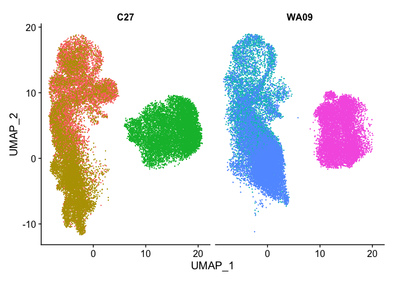<!-- -->

``` r
leidenClusters <- read.csv("output/scVI/Pluripotent_GPC_leiden.csv")
GPC_PSC$leidenClusters <- leidenClusters$leiden_scVI
```

### Make descriptive plots

``` r
GPC_PSC$stageDim <- ifelse(GPC_PSC$stage == "In Vitro - Pluripotent Stem Cell Stage", "In Vitro - PSC Stage", "In Vitro - GPC Stage")
GPC_PSC$lineDim <- ifelse(GPC_PSC$line == "C27", "iPSC (C27)", "WA09 - (ESC)")


Fig1B <- DimPlotCustom(GPC_PSC, group.by = "stageDim", label = T, label.size = labelSize) + 
  theme_manuscript() + 
  scale_fill_manual(values = manuscriptPalette) + 
  labs(tag = "B") & 
  NoLegend() & 
  ggtitle("Integrated In Vitro PSC & GPC Stages")
Fig1B
```

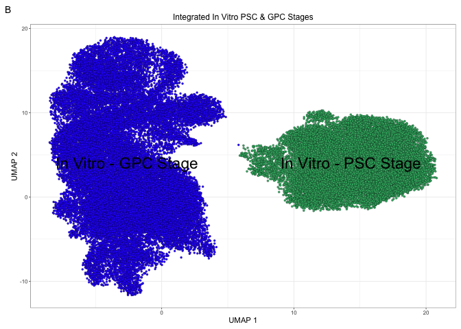<!-- -->

``` r
Fig1C <- DimPlotCustom(GPC_PSC, group.by = "stageDim", split.by = "stageDim", ncol = 1) & 
  theme_manuscript() & 
  scale_fill_manual(values = manuscriptPalette) & 
  NoLegend() & 
  theme(axis.title.y = element_blank(), axis.text.y = element_blank())

Fig1C[[1]] <- Fig1C[[1]] + labs(tag = "C") + theme(axis.title.x = element_blank(), axis.text.x = element_blank())

Fig1C
```

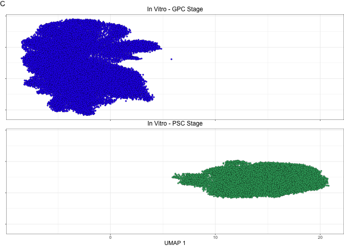<!-- -->

``` r
Fig1D <- DimPlotCustom(GPC_PSC, split.by = "lineDim", group.by = "stageDim", ncol = 1) & 
  theme_manuscript() & 
  scale_fill_manual(values = manuscriptPalette) & 
  NoLegend() & 
  theme(axis.title.y = element_blank(), axis.text.y = element_blank()) 
Fig1D[[1]] <- Fig1D[[1]] + labs(tag = "D") + theme(axis.title.x = element_blank(), axis.text.x = element_blank())
Fig1D
```

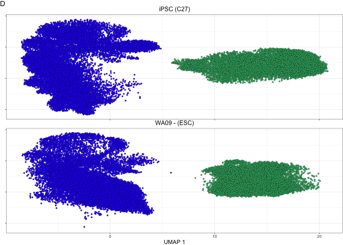<!-- -->

``` r
top <- (plot_spacer() | Fig1B | Fig1C | Fig1D) + plot_layout(widths = c(1, 1,.5,.5))
top
```

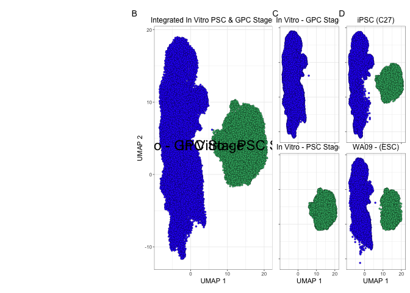<!-- -->

## Make Middle

``` r
### Feature Plots
Fig1E <- FeaturePlotCustom(GPC_PSC, genes = c("LIN28A", "POU5F1")) & 
  theme_manuscript() &
  theme(legend.position= "bottom")

Fig1E[[1]] <- Fig1E[[1]] + labs(tag = "E") 
Fig1E[[2]] <- Fig1E[[2]] + theme(legend.position = "none")

Fig1E
```

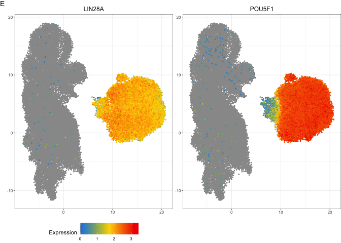<!-- -->

``` r
### Coexpression Plots
scatterData <- FetchData(GPC_PSC, c("LIN28A", "POU5F1"), slot = "counts")
scatterData <- merge(scatterData, GPC_PSC@meta.data, by.x = 0, by.y = "cellName")

prop.table(table(scatterData[scatterData$stageDim == "In Vitro - PSC Stage",]$LIN28A > 0, scatterData[scatterData$stageDim == "In Vitro - PSC Stage",]$POU5F1 > 0)) * 100
```

    ##        
    ##               FALSE        TRUE
    ##   FALSE  0.00000000  0.01753873
    ##   TRUE   0.63724057 99.34522070

``` r
Fig1F_PSC <- ggplot(scatterData[scatterData$stageDim == "In Vitro - PSC Stage",], aes(x = LIN28A, y = POU5F1)) + 
  #ggrastr::rasterise(ggplot2::geom_point(fill = "mediumseagreen", size = 1, colour = "black", stroke = .1, shape = 21)) +
  ggrastr::rasterise(ggplot2::geom_point(colour = "mediumseagreen", size = 1), dpi = 600) +
  theme_manuscript() + 
  xlim(0,max(scatterData$LIN28A)) + 
  ylim(0, max(scatterData$POU5F1)) + 
  ggtitle("PSC Stage") + 
  labs(tag = "F") + 
  annotation_custom(grob = grid::textGrob("99.3% Co-expression", x = unit(1, "npc"), rot = 270, gp = grid::gpar(fontsize = baseSize * axisTitleSize)))
Fig1F_PSC
```

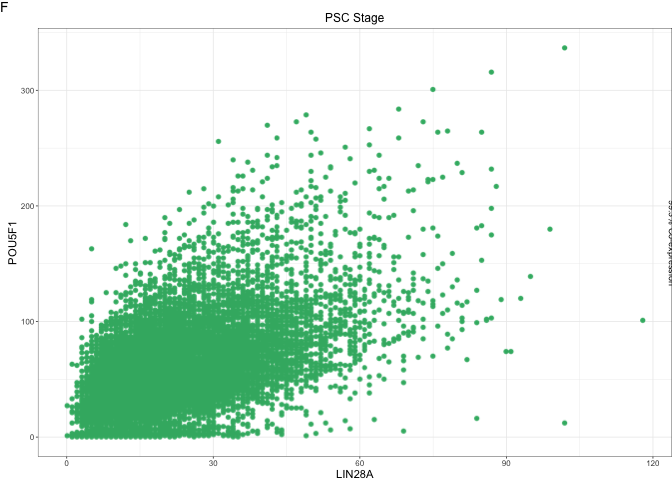<!-- -->

``` r
prop.table(table(scatterData[scatterData$stageDim == "In Vitro - GPC Stage",]$LIN28A > 0, scatterData[scatterData$stageDim == "In Vitro - GPC Stage",]$POU5F1 > 0)) * 100
```

    ##        
    ##              FALSE       TRUE
    ##   FALSE 99.0301724  0.6465517
    ##   TRUE   0.3232759  0.0000000

``` r
Fig1F_GPC <- ggplot(scatterData[scatterData$stageDim == "In Vitro - GPC Stage",], aes(x = LIN28A, y = POU5F1)) + 
  ggrastr::rasterise(ggplot2::geom_point(colour = "#2E30FF", size = 1), dpi = 600) +
  theme_manuscript() + 
  xlim(0,max(scatterData$LIN28A)) + 
  ylim(0, max(scatterData$POU5F1)) + 
  ggtitle("GPC Stage") + 
  annotation_custom(grob = grid::textGrob("0% Co-expression", x = unit(1, "npc"), rot = 270, gp = grid::gpar(fontsize = baseSize * axisTitleSize)))

Fig1F_GPC
```

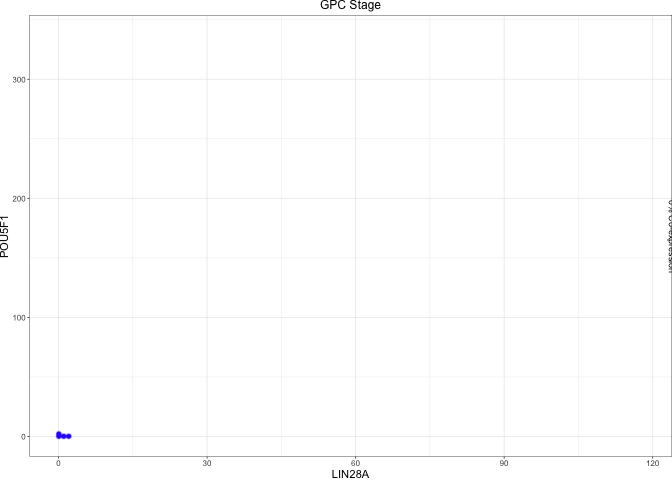<!-- -->

``` r
middle <- (free(Fig1E) | (Fig1F_PSC / Fig1F_GPC) | plot_spacer()) + plot_layout(widths = c(.75,.5,1))

middle
```

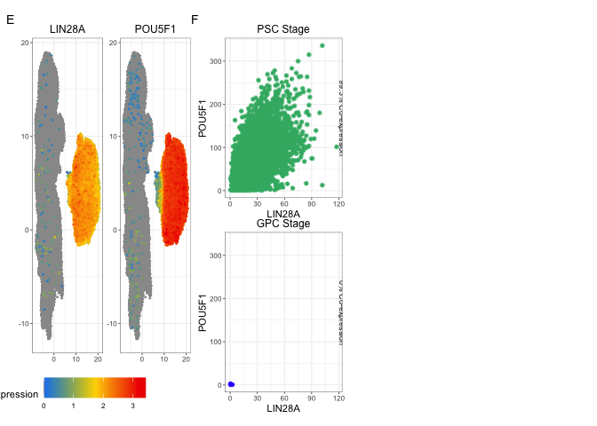<!-- -->

``` r
top / middle
```

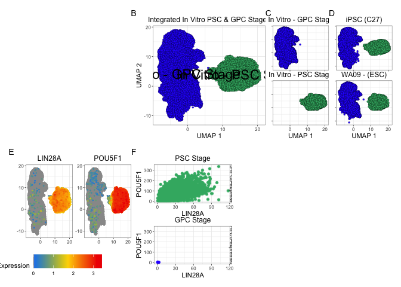<!-- -->

## Bottom HM

``` r
plot_long <- read.csv("output/CUT&Tag/plot_long.csv")

plot_long$Gene <- factor(plot_long$Gene, levels = unique(plot_long$Gene))
plot_long$Type <- factor(plot_long$Type, levels = c("RNA", "K4me3_CTd120", "K4me3_CTd180", "K27ac_CTd120", "K27ac_CTd180", "K27me3_CTd120", "K27me3_CTd180"))

bottom <- ggplot(plot_long, aes(Gene, Type)) + 
  theme_manuscript() +
  geom_tile(aes(fill = Value), color = "black") + 
  scale_fill_gradient2(low = "#2E30FF", mid = "white", high = "mediumseagreen", midpoint = 0, limits=c(-3,3), breaks=c(-2,-1,0,1,2), name="log2 fold change", na.value="black", oob = scales::squish, guide = guide_colorbar(barwidth = .5)) +
  scale_x_discrete(expand = c(0, 0), guide = guide_axis(angle = 90)) + scale_y_discrete(expand = c(0, 0)) +
  theme(axis.title = element_blank(), legend.title = element_blank())

bottom
```

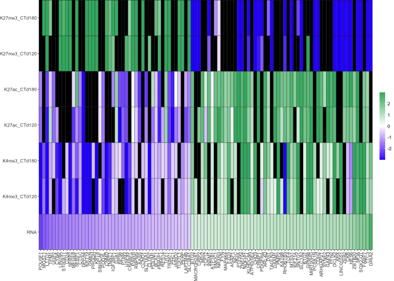<!-- -->

## Assemble Figure

``` r
if (!dir.exists("output/Figures/GPC_PSC")) {
  dir.create("output/Figures/GPC_PSC")
}

GPC_PSC.fig <- top / middle / free(bottom)


ggsave(GPC_PSC.fig, filename  = "output/Figures/GPC_PSC/GPC_PSC_fig.pdf", width = 8.5, height = 11, units = "in")
```

``` r
sessionInfo()
```

    ## R version 4.2.3 (2023-03-15)
    ## Platform: aarch64-apple-darwin20 (64-bit)
    ## Running under: macOS Ventura 13.2.1
    ## 
    ## Matrix products: default
    ## BLAS:   /Library/Frameworks/R.framework/Versions/4.2-arm64/Resources/lib/libRblas.0.dylib
    ## LAPACK: /Library/Frameworks/R.framework/Versions/4.2-arm64/Resources/lib/libRlapack.dylib
    ## 
    ## locale:
    ## [1] en_US.UTF-8/en_US.UTF-8/en_US.UTF-8/C/en_US.UTF-8/en_US.UTF-8
    ## 
    ## attached base packages:
    ## [1] stats4    stats     graphics  grDevices utils     datasets  methods  
    ## [8] base     
    ## 
    ## other attached packages:
    ##  [1] ggrastr_1.0.2               patchwork_1.3.0.9000       
    ##  [3] scPlottingTools_0.0.0.9000  ggplot2_3.4.4              
    ##  [5] MAST_1.24.1                 SingleCellExperiment_1.20.1
    ##  [7] SummarizedExperiment_1.28.0 Biobase_2.58.0             
    ##  [9] GenomicRanges_1.50.2        GenomeInfoDb_1.34.9        
    ## [11] IRanges_2.32.0              S4Vectors_0.36.2           
    ## [13] BiocGenerics_0.44.0         MatrixGenerics_1.10.0      
    ## [15] matrixStats_0.63.0          tidyr_1.3.0                
    ## [17] SeuratObject_4.1.3          Seurat_4.3.0               
    ## 
    ## loaded via a namespace (and not attached):
    ##   [1] systemfonts_1.0.4      plyr_1.8.8             igraph_2.0.3          
    ##   [4] lazyeval_0.2.2         sp_1.6-0               splines_4.2.3         
    ##   [7] listenv_0.9.0          scattermore_0.8        digest_0.6.31         
    ##  [10] htmltools_0.5.5        fansi_1.0.4            magrittr_2.0.3        
    ##  [13] tensor_1.5             cluster_2.1.4          ROCR_1.0-11           
    ##  [16] globals_0.16.2         spatstat.sparse_3.0-3  colorspace_2.1-0      
    ##  [19] ggrepel_0.9.3          textshaping_0.3.6      xfun_0.38             
    ##  [22] dplyr_1.1.1            RCurl_1.98-1.12        jsonlite_1.8.4        
    ##  [25] progressr_0.13.0       spatstat.data_3.0-4    survival_3.5-5        
    ##  [28] zoo_1.8-11             glue_1.6.2             polyclip_1.10-4       
    ##  [31] gtable_0.3.3           zlibbioc_1.44.0        XVector_0.38.0        
    ##  [34] leiden_0.4.3           DelayedArray_0.24.0    future.apply_1.10.0   
    ##  [37] abind_1.4-5            scales_1.3.0           DBI_1.1.3             
    ##  [40] spatstat.random_3.2-3  miniUI_0.1.1.1         Rcpp_1.0.10           
    ##  [43] viridisLite_0.4.1      xtable_1.8-4           reticulate_1.34.0     
    ##  [46] htmlwidgets_1.6.2      httr_1.4.5             RColorBrewer_1.1-3    
    ##  [49] ellipsis_0.3.2         ica_1.0-3              pkgconfig_2.0.3       
    ##  [52] farver_2.1.1           uwot_0.1.14            deldir_1.0-6          
    ##  [55] utf8_1.2.3             tidyselect_1.2.0       labeling_0.4.2        
    ##  [58] rlang_1.1.0            reshape2_1.4.4         later_1.3.0           
    ##  [61] munsell_0.5.0          tools_4.2.3            cli_3.6.1             
    ##  [64] generics_0.1.3         ggridges_0.5.4         evaluate_0.20         
    ##  [67] stringr_1.5.0          fastmap_1.1.1          ragg_1.2.5            
    ##  [70] yaml_2.3.7             goftest_1.2-3          knitr_1.42            
    ##  [73] fitdistrplus_1.1-8     purrr_1.0.1            RANN_2.6.1            
    ##  [76] pbapply_1.7-0          future_1.32.0          nlme_3.1-162          
    ##  [79] mime_0.12              compiler_4.2.3         rstudioapi_0.14       
    ##  [82] beeswarm_0.4.0         plotly_4.10.1          png_0.1-8             
    ##  [85] spatstat.utils_3.1-0   tibble_3.2.1           stringi_1.7.12        
    ##  [88] highr_0.10             lattice_0.21-8         Matrix_1.5-4          
    ##  [91] vctrs_0.6.1            pillar_1.9.0           lifecycle_1.0.3       
    ##  [94] spatstat.geom_3.2-9    lmtest_0.9-40          RcppAnnoy_0.0.20      
    ##  [97] data.table_1.14.8      cowplot_1.1.1          bitops_1.0-7          
    ## [100] irlba_2.3.5.1          httpuv_1.6.9           R6_2.5.1              
    ## [103] promises_1.2.0.1       KernSmooth_2.23-20     gridExtra_2.3         
    ## [106] vipor_0.4.7            parallelly_1.35.0      codetools_0.2-19      
    ## [109] MASS_7.3-58.3          rprojroot_2.0.3        withr_2.5.0           
    ## [112] sctransform_0.3.5      GenomeInfoDbData_1.2.9 parallel_4.2.3        
    ## [115] grid_4.2.3             rmarkdown_2.21         Cairo_1.6-2           
    ## [118] Rtsne_0.16             spatstat.explore_3.2-7 shiny_1.7.4           
    ## [121] ggbeeswarm_0.7.2
