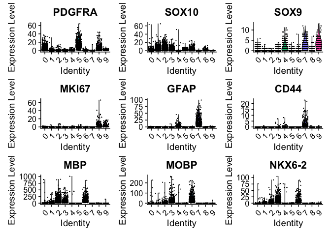

Initial Analysis of Human Cells out of Shiverer Chimeras
================
John Mariani
12/6/2022

``` r
library(Seurat)


library(scPlottingTools)
library(ggplot2)
library(tidyr)
library(dplyr)
library(MAST)
library(plyr)
library(xlsx)
library(patchwork)
library(ggplot2)
library(scales)
library(ggVennDiagram)
library(data.table)
library(slingshot)
library(tradeSeq)
library(tidyr)
library(dplyr)
library(plyr)
library(magrittr)
library(viridis)
library(tidyr)
library(EnhancedVolcano)

`%not in%` <- function(x, table) is.na(match(x, table, nomatch = NA_integer_))


axisTitleSize <- 24
axisTextSize <- 18
labelFont = 18
titleFont = 22
tagSize = 26

source("Scripts/HelperFunctions.R")

theme_manuscript <-  theme(axis.text = element_text(size = axisTextSize), 
        axis.title = element_text(size = axisTitleSize), 
        title = element_text(size = titleFont), 
        legend.title = element_text(size = titleFont),
        legend.text = element_text(size = axisTitleSize),
        plot.tag = element_text(size = tagSize))

manuscriptPalette <- c("In Vivo" = "red2", 
                       "In Vitro - GPC Stage" = "#2E30FF",
                       "NPC" = "magenta",
                       "GPC1" = "forestgreen",
                       "GPC2" = "darkorange",
                       "GPC3" = "firebrick2",
                       "GPC4" = "turquoise",
                       "Astrocyte" = "dodgerblue2",
                       "imOL" = "gold",
                       "maOL" = "darkorchid4",
                       "GPC" = "turquoise",
                       "imAstrocyte" = "firebrick2",
                       "cGPC" = "darkorange",
                       "cAPC" = "forestgreen")
```

## Load, subset, and plug in SCVI data

``` r
merged <- readRDS("output/RDS/mergedH.rds")
invivo <- subset(merged, subset = stage %in% c("In Vivo"))

embeddings <- read.csv("output/scVI/Invivo_umapEmbeddings.csv", header = F)
names(embeddings) <- c("UMAP_1", "UMAP_2")
row.names(embeddings) <- Cells(invivo)

invivo[['umap']] <- CreateDimReducObject(embeddings = as.matrix(embeddings), key = "UMAP_", assay = "RNA")

leidenClusters <- read.csv("output/scVI/Invivo_leidenClusters.csv")
invivo$leiden_clusters <- as.factor(leidenClusters$leiden_scVI)

invivo <- SetIdent(invivo, value = "leiden_clusters")
```

## Import SCENIC AUCs

``` r
invivoAUC <- read.csv("output/SCENIC/auc_forInVivo_cells_only.txt", row.names = 1)
dim(invivoAUC)
```

    ## [1] 5337  397

``` r
names(invivoAUC) <- gsub(pattern = "\\.\\.\\.", replacement = "", x = names(invivoAUC))
invivoAUC <- t(as.matrix(invivoAUC))
identical(colnames(invivoAUC), Cells(invivo))
```

    ## [1] TRUE

``` r
invivoAUC <- CreateAssayObject(data = invivoAUC)

invivo[["SCENIC"]] <- invivoAUC
```

## Initial Cell Type markers for simplification

``` r
VlnPlot(invivo, group.by = "leiden_clusters", c("PDGFRA", "SOX10", "SOX9", "MKI67", "GFAP", "CD44", "MBP", "MOBP", "NKX6-2"))
```

<!-- -->

## Assign Celltype names

``` r
invivo <- RenameIdents(invivo, c("0" = "GPC",
                          "5" = "GPC",
                          "8" = "cGPC",
                          "9" = "cAPC",
                          "4" = "imAstrocyte",
                          "7" = "Astrocyte",
                          "1" = "imOL",
                          "2" = "imOL",
                          "6" = "maOL",
                          "3" = "maOL"))


Idents(invivo) <- factor(Idents(invivo), levels = c("Astrocyte", "imAstrocyte", "cAPC", "cGPC", "GPC", "imOL", "maOL"))

invivo$cellType <- Idents(invivo)

DimPlot(invivo)
```

<!-- -->

``` r
saveRDS(invivo, "output/RDS/invivo.rds")
```

``` r
sessionInfo()
```

    ## R version 4.2.3 (2023-03-15)
    ## Platform: aarch64-apple-darwin20 (64-bit)
    ## Running under: macOS Ventura 13.2.1
    ## 
    ## Matrix products: default
    ## BLAS:   /Library/Frameworks/R.framework/Versions/4.2-arm64/Resources/lib/libRblas.0.dylib
    ## LAPACK: /Library/Frameworks/R.framework/Versions/4.2-arm64/Resources/lib/libRlapack.dylib
    ## 
    ## locale:
    ## [1] en_US.UTF-8/en_US.UTF-8/en_US.UTF-8/C/en_US.UTF-8/en_US.UTF-8
    ## 
    ## attached base packages:
    ## [1] stats4    stats     graphics  grDevices utils     datasets  methods  
    ## [8] base     
    ## 
    ## other attached packages:
    ##  [1] EnhancedVolcano_1.16.0      ggrepel_0.9.3              
    ##  [3] viridis_0.6.2               viridisLite_0.4.1          
    ##  [5] magrittr_2.0.3              tradeSeq_1.12.0            
    ##  [7] slingshot_2.6.0             TrajectoryUtils_1.6.0      
    ##  [9] princurve_2.1.6             data.table_1.14.8          
    ## [11] ggVennDiagram_1.2.2         scales_1.3.0               
    ## [13] patchwork_1.3.0.9000        xlsx_0.6.5                 
    ## [15] plyr_1.8.8                  MAST_1.24.1                
    ## [17] SingleCellExperiment_1.20.1 SummarizedExperiment_1.28.0
    ## [19] Biobase_2.58.0              GenomicRanges_1.50.2       
    ## [21] GenomeInfoDb_1.34.9         IRanges_2.32.0             
    ## [23] S4Vectors_0.36.2            BiocGenerics_0.44.0        
    ## [25] MatrixGenerics_1.10.0       matrixStats_0.63.0         
    ## [27] dplyr_1.1.1                 tidyr_1.3.0                
    ## [29] ggplot2_3.4.4               scPlottingTools_0.0.0.9000 
    ## [31] SeuratObject_4.1.3          Seurat_4.3.0               
    ## 
    ## loaded via a namespace (and not attached):
    ##   [1] igraph_2.0.3           lazyeval_0.2.2         sp_1.6-0              
    ##   [4] splines_4.2.3          BiocParallel_1.32.6    listenv_0.9.0         
    ##   [7] scattermore_0.8        digest_0.6.31          htmltools_0.5.5       
    ##  [10] fansi_1.0.4            tensor_1.5             cluster_2.1.4         
    ##  [13] ROCR_1.0-11            limma_3.54.2           globals_0.16.2        
    ##  [16] spatstat.sparse_3.0-3  RVenn_1.1.0            colorspace_2.1-0      
    ##  [19] xfun_0.38              RCurl_1.98-1.12        jsonlite_1.8.4        
    ##  [22] progressr_0.13.0       spatstat.data_3.0-4    survival_3.5-5        
    ##  [25] zoo_1.8-11             glue_1.6.2             polyclip_1.10-4       
    ##  [28] gtable_0.3.3           zlibbioc_1.44.0        XVector_0.38.0        
    ##  [31] leiden_0.4.3           DelayedArray_0.24.0    future.apply_1.10.0   
    ##  [34] abind_1.4-5            edgeR_3.40.2           DBI_1.1.3             
    ##  [37] spatstat.random_3.2-3  miniUI_0.1.1.1         Rcpp_1.0.10           
    ##  [40] xtable_1.8-4           reticulate_1.34.0      htmlwidgets_1.6.2     
    ##  [43] httr_1.4.5             RColorBrewer_1.1-3     ellipsis_0.3.2        
    ##  [46] ica_1.0-3              pkgconfig_2.0.3        rJava_1.0-6           
    ##  [49] farver_2.1.1           uwot_0.1.14            deldir_1.0-6          
    ##  [52] locfit_1.5-9.7         utf8_1.2.3             labeling_0.4.2        
    ##  [55] tidyselect_1.2.0       rlang_1.1.0            reshape2_1.4.4        
    ##  [58] later_1.3.0            munsell_0.5.0          tools_4.2.3           
    ##  [61] cli_3.6.1              generics_0.1.3         ggridges_0.5.4        
    ##  [64] evaluate_0.20          stringr_1.5.0          fastmap_1.1.1         
    ##  [67] yaml_2.3.7             goftest_1.2-3          knitr_1.42            
    ##  [70] fitdistrplus_1.1-8     purrr_1.0.1            RANN_2.6.1            
    ##  [73] pbapply_1.7-0          future_1.32.0          nlme_3.1-162          
    ##  [76] mime_0.12              ggrastr_1.0.2          compiler_4.2.3        
    ##  [79] rstudioapi_0.14        beeswarm_0.4.0         plotly_4.10.1         
    ##  [82] png_0.1-8              spatstat.utils_3.1-0   tibble_3.2.1          
    ##  [85] stringi_1.7.12         highr_0.10             lattice_0.21-8        
    ##  [88] Matrix_1.5-4           vctrs_0.6.1            pillar_1.9.0          
    ##  [91] lifecycle_1.0.3        spatstat.geom_3.2-9    lmtest_0.9-40         
    ##  [94] RcppAnnoy_0.0.20       cowplot_1.1.1          bitops_1.0-7          
    ##  [97] irlba_2.3.5.1          httpuv_1.6.9           R6_2.5.1              
    ## [100] promises_1.2.0.1       KernSmooth_2.23-20     gridExtra_2.3         
    ## [103] vipor_0.4.7            parallelly_1.35.0      codetools_0.2-19      
    ## [106] MASS_7.3-58.3          xlsxjars_0.6.1         rprojroot_2.0.3       
    ## [109] withr_2.5.0            sctransform_0.3.5      GenomeInfoDbData_1.2.9
    ## [112] mgcv_1.8-42            parallel_4.2.3         grid_4.2.3            
    ## [115] rmarkdown_2.21         Rtsne_0.16             spatstat.explore_3.2-7
    ## [118] shiny_1.7.4            ggbeeswarm_0.7.2
