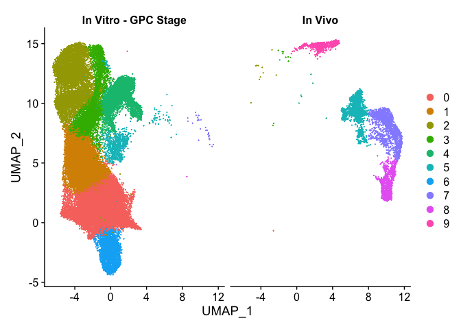
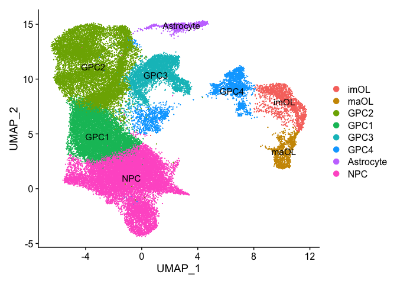
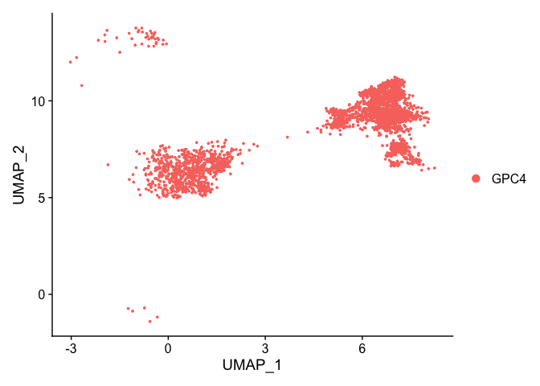
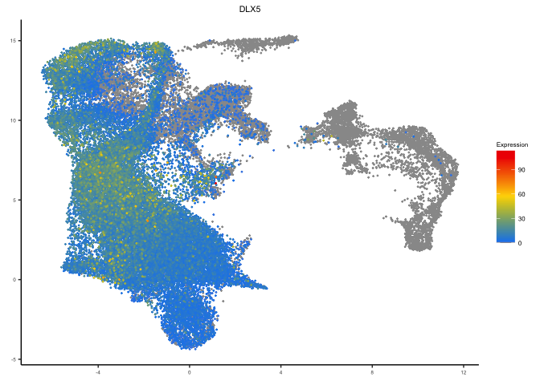
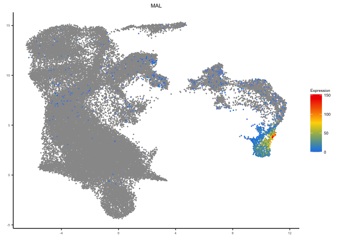
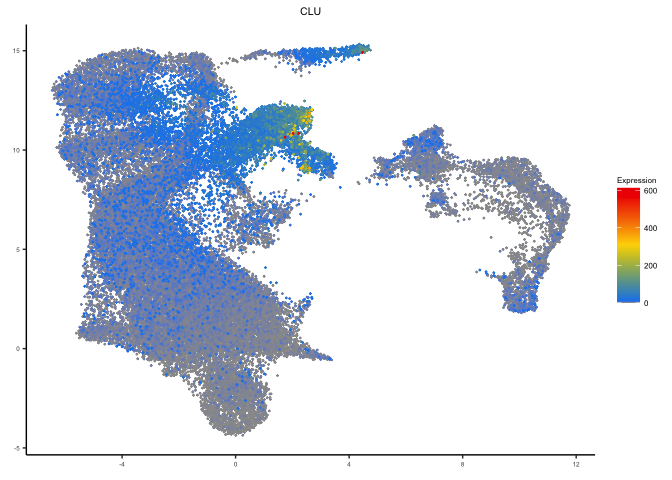
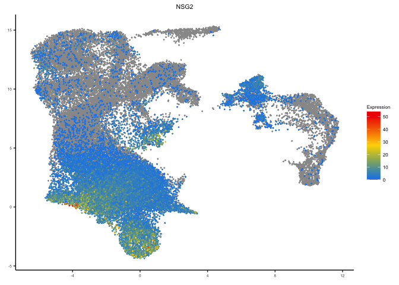

Initial Analysis of Human Cells out of Shiverer Chimeras
================
John Mariani
12/6/2022

``` r
library(dplyr)
library(Seurat)
library(devtools)
library(ggplot2)
library(RColorBrewer)
library(cowplot)
library(biomaRt)
library(tidyr)
library(ggplotify)
library(biomaRt)
#library(RPushbullet)
library(patchwork)
library(dplyr)
library(SeuratDisk)
library(MAST)
library(data.table)
library(scPlottingTools)
library(scales)
#BiocManager::install("slingshot")
library(slingshot)
#BiocManager::install("tradeSeq")
library(tradeSeq)
library(MAST)

`%not in%` <- function(x, table) is.na(match(x, table, nomatch = NA_integer_))

axisTitleSize <- 8
axisTextSize <- 6
labelFont = 6
titleFont = 10
tagSize = 10

source("Scripts/HelperFunctions.R")
```

## Prep invitroInvivo

``` r
merged <- readRDS("output/RDS/mergedH.rds")
invitroInvivo <- subset(merged, subset = stage %in% c("In Vivo", "In Vitro - GPC Stage"))

embeddings <- read.csv("output/scVI/Invitro_Invivo_umapEmbeddings.csv", header = F)
names(embeddings) <- c("UMAP_1", "UMAP_2")
row.names(embeddings) <- Cells(invitroInvivo)
invitroInvivo[['umap']] <- CreateDimReducObject(embeddings = as.matrix(embeddings), key = "UMAP_", assay = "RNA")

leidenClusters <- read.csv("output/scVI/Invitro_Invivo_leiden.csv")
invitroInvivo$leiden_clusters <- as.factor(leidenClusters$leiden_scVI)
Idents(invitroInvivo) <- invitroInvivo$leiden_clusters


DimPlot(invitroInvivo, split.by = "stage")
```

<!-- -->

``` r
invitroInvivo <- RenameIdents(invitroInvivo,
                              "7" = "imOL",
                              "8" = "maOL",
                              "2" = "GPC2",
                              "1" = "GPC1", 
                              "4" = "GPC3",
                              "5" = "GPC4",
                              "9" = "Astrocyte",
                              "3" = "GPC2",
                              "0" = "NPC",
                              "6" = "NPC")

DimPlot(invitroInvivo, label = T)
```

<!-- -->

``` r
Idents(invitroInvivo) <- factor(Idents(invitroInvivo), levels = c("NPC", "GPC1", "GPC2", "GPC3", "GPC4", "imOL", "maOL", "Astrocyte"))
```

## Make GPC4 Transition subset with information from invivo

``` r
invitroInvivo$cellType <- Idents(invitroInvivo)

invitroInvivoMeta <- invitroInvivo@meta.data

## Load In Vivo only object
invivo <- readRDS("output/RDS/invivo.rds")

invivoMeta <- invivo@meta.data

table(invivoMeta$cellType)
```

    ## 
    ##   Astrocyte imAstrocyte        cAPC        cGPC         GPC        imOL 
    ##         290         376         112         261        1584        1717 
    ##        maOL 
    ##         997

``` r
temp <- invivoMeta$cellName

names(temp) <- invivoMeta$cellType


invitroInvivoMeta$invivoCellType <- plyr::mapvalues(x = as.character(invitroInvivoMeta$cellName), from = temp, to =  names(temp))

invitroInvivoMeta[invitroInvivoMeta$invivoCellType %not in% levels(invivo$cellType),]$invivoCellType <- "invitro"

table(invitroInvivoMeta$invivoCellType)
```

    ## 
    ##   Astrocyte        cAPC        cGPC         GPC imAstrocyte        imOL 
    ##         290         112         261        1584         376        1717 
    ##     invitro        maOL 
    ##       37805         997

``` r
identical(invitroInvivoMeta$cellName, Cells(invitroInvivo))
```

    ## [1] TRUE

``` r
invitroInvivo@meta.data <- invitroInvivoMeta

### Make Transition

transition <- subset(invitroInvivo, subset = leiden_clusters == 5)

table(transition$invivoCellType)
```

    ## 
    ##        cAPC        cGPC         GPC imAstrocyte        imOL     invitro 
    ##           1         258        1570           2          16         880 
    ##        maOL 
    ##           1

``` r
transition <- subset(transition, subset = invivoCellType %in% c("GPC", "cGPC", "invitro"))

DimPlot(transition)
```

<!-- -->

``` r
saveRDS(transition, "output/RDS/GPC4_Cluster.rds")
saveRDS(invitroInvivo, "output/RDS/invitroInvivo.rds")
```

## Expression for palantir starting and terminal cells

``` r
FeaturePlotCustom(invitroInvivo, "DLX5")
```

<!-- -->

``` r
FeaturePlotCustom(invitroInvivo, "MAL")
```

<!-- -->

``` r
FeaturePlotCustom(invitroInvivo, "CLU")
```

<!-- -->

``` r
FeaturePlotCustom(invitroInvivo, "NSG2")
```

<!-- -->

``` r
palantirMarkers <- c("DLX5", "MOBP", "AGT", "NSG2")

palantirMarkers <- FetchData(invitroInvivo, vars = palantirMarkers, slot = "data")

max_row_names <- apply(palantirMarkers, 2, function(x) rownames(palantirMarkers)[which.max(x)])
max_row_names
```

    ##                                   DLX5                                   MOBP 
    ## "CTGCGAGTCCTTCACG_Sample_CD140_WA09_5"           "CCCAACTAGTTGCGAG_GOL2976A5" 
    ##                                    AGT                                   NSG2 
    ##     "CCCTCCTTCCTTTCGG_Sample_unsorted"   "ATGCGATGTCGTTGCG_Sample_C27_DAPI_3"

``` r
sessionInfo()
```

    ## R version 4.2.3 (2023-03-15)
    ## Platform: aarch64-apple-darwin20 (64-bit)
    ## Running under: macOS Ventura 13.2.1
    ## 
    ## Matrix products: default
    ## BLAS:   /Library/Frameworks/R.framework/Versions/4.2-arm64/Resources/lib/libRblas.0.dylib
    ## LAPACK: /Library/Frameworks/R.framework/Versions/4.2-arm64/Resources/lib/libRlapack.dylib
    ## 
    ## locale:
    ## [1] en_US.UTF-8/en_US.UTF-8/en_US.UTF-8/C/en_US.UTF-8/en_US.UTF-8
    ## 
    ## attached base packages:
    ## [1] stats4    stats     graphics  grDevices utils     datasets  methods  
    ## [8] base     
    ## 
    ## other attached packages:
    ##  [1] tradeSeq_1.12.0             slingshot_2.6.0            
    ##  [3] TrajectoryUtils_1.6.0       princurve_2.1.6            
    ##  [5] scales_1.3.0                scPlottingTools_0.0.0.9000 
    ##  [7] data.table_1.14.8           MAST_1.24.1                
    ##  [9] SingleCellExperiment_1.20.1 SummarizedExperiment_1.28.0
    ## [11] Biobase_2.58.0              GenomicRanges_1.50.2       
    ## [13] GenomeInfoDb_1.34.9         IRanges_2.32.0             
    ## [15] S4Vectors_0.36.2            BiocGenerics_0.44.0        
    ## [17] MatrixGenerics_1.10.0       matrixStats_0.63.0         
    ## [19] SeuratDisk_0.0.0.9020       patchwork_1.3.0.9000       
    ## [21] ggplotify_0.1.0             tidyr_1.3.0                
    ## [23] biomaRt_2.54.1              cowplot_1.1.1              
    ## [25] RColorBrewer_1.1-3          ggplot2_3.4.4              
    ## [27] devtools_2.4.5              usethis_2.1.6              
    ## [29] SeuratObject_4.1.3          Seurat_4.3.0               
    ## [31] dplyr_1.1.1                
    ## 
    ## loaded via a namespace (and not attached):
    ##   [1] utf8_1.2.3             spatstat.explore_3.2-7 reticulate_1.34.0     
    ##   [4] tidyselect_1.2.0       RSQLite_2.3.1          AnnotationDbi_1.60.2  
    ##   [7] htmlwidgets_1.6.2      BiocParallel_1.32.6    grid_4.2.3            
    ##  [10] Rtsne_0.16             munsell_0.5.0          codetools_0.2-19      
    ##  [13] ica_1.0-3              future_1.32.0          miniUI_0.1.1.1        
    ##  [16] withr_2.5.0            spatstat.random_3.2-3  colorspace_2.1-0      
    ##  [19] progressr_0.13.0       filelock_1.0.2         highr_0.10            
    ##  [22] knitr_1.42             rstudioapi_0.14        ROCR_1.0-11           
    ##  [25] tensor_1.5             listenv_0.9.0          labeling_0.4.2        
    ##  [28] GenomeInfoDbData_1.2.9 polyclip_1.10-4        bit64_4.0.5           
    ##  [31] farver_2.1.1           rprojroot_2.0.3        parallelly_1.35.0     
    ##  [34] vctrs_0.6.1            generics_0.1.3         xfun_0.38             
    ##  [37] BiocFileCache_2.6.1    R6_2.5.1               locfit_1.5-9.7        
    ##  [40] hdf5r_1.3.8            bitops_1.0-7           spatstat.utils_3.1-0  
    ##  [43] cachem_1.0.7           gridGraphics_0.5-1     DelayedArray_0.24.0   
    ##  [46] promises_1.2.0.1       gtable_0.3.3           globals_0.16.2        
    ##  [49] processx_3.8.0         goftest_1.2-3          rlang_1.1.0           
    ##  [52] splines_4.2.3          lazyeval_0.2.2         spatstat.geom_3.2-9   
    ##  [55] yaml_2.3.7             reshape2_1.4.4         abind_1.4-5           
    ##  [58] httpuv_1.6.9           tools_4.2.3            ellipsis_0.3.2        
    ##  [61] sessioninfo_1.2.2      ggridges_0.5.4         Rcpp_1.0.10           
    ##  [64] plyr_1.8.8             progress_1.2.2         zlibbioc_1.44.0       
    ##  [67] purrr_1.0.1            RCurl_1.98-1.12        ps_1.7.4              
    ##  [70] prettyunits_1.1.1      deldir_1.0-6           viridis_0.6.2         
    ##  [73] pbapply_1.7-0          urlchecker_1.0.1       zoo_1.8-11            
    ##  [76] ggrepel_0.9.3          cluster_2.1.4          fs_1.6.1              
    ##  [79] magrittr_2.0.3         scattermore_0.8        lmtest_0.9-40         
    ##  [82] RANN_2.6.1             fitdistrplus_1.1-8     pkgload_1.3.2         
    ##  [85] hms_1.1.3              mime_0.12              evaluate_0.20         
    ##  [88] xtable_1.8-4           XML_3.99-0.14          gridExtra_2.3         
    ##  [91] compiler_4.2.3         tibble_3.2.1           KernSmooth_2.23-20    
    ##  [94] crayon_1.5.2           htmltools_0.5.5        mgcv_1.8-42           
    ##  [97] later_1.3.0            DBI_1.1.3              dbplyr_2.3.2          
    ## [100] MASS_7.3-58.3          rappdirs_0.3.3         Matrix_1.5-4          
    ## [103] cli_3.6.1              parallel_4.2.3         igraph_2.0.3          
    ## [106] pkgconfig_2.0.3        sp_1.6-0               plotly_4.10.1         
    ## [109] spatstat.sparse_3.0-3  xml2_1.3.3             XVector_0.38.0        
    ## [112] yulab.utils_0.0.6      stringr_1.5.0          callr_3.7.3           
    ## [115] digest_0.6.31          sctransform_0.3.5      RcppAnnoy_0.0.20      
    ## [118] spatstat.data_3.0-4    Biostrings_2.66.0      rmarkdown_2.21        
    ## [121] leiden_0.4.3           edgeR_3.40.2           uwot_0.1.14           
    ## [124] curl_5.0.0             shiny_1.7.4            lifecycle_1.0.3       
    ## [127] nlme_3.1-162           jsonlite_1.8.4         limma_3.54.2          
    ## [130] viridisLite_0.4.1      fansi_1.0.4            pillar_1.9.0          
    ## [133] lattice_0.21-8         KEGGREST_1.38.0        fastmap_1.1.1         
    ## [136] httr_1.4.5             pkgbuild_1.4.0         survival_3.5-5        
    ## [139] glue_1.6.2             remotes_2.4.2          png_0.1-8             
    ## [142] bit_4.0.5              stringi_1.7.12         profvis_0.3.7         
    ## [145] blob_1.2.4             memoise_2.0.1          irlba_2.3.5.1         
    ## [148] future.apply_1.10.0
