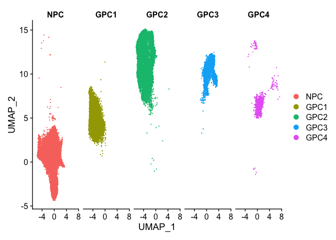
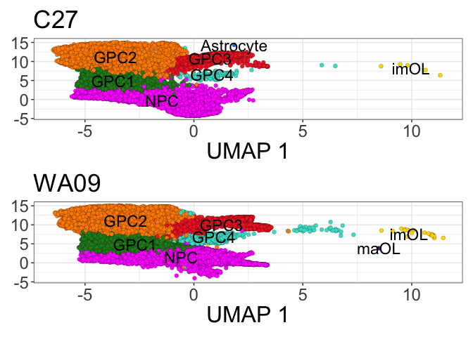

Initial Analysis of Human Cells out of Shiverer Chimeras
================
John Mariani
12/6/2022

``` r
library(Seurat)
library(scPlottingTools)
library(ggplot2)
library(tidyr)
library(dplyr)
library(MAST)
library(plyr)
library(xlsx)
library(patchwork)
library(ggplot2)
library(scales)
library(ggVennDiagram)
library(data.table)
library(slingshot)
library(tradeSeq)
library(tidyr)
library(dplyr)
library(plyr)
library(magrittr)
library(viridis)
library(tidyr)
library(EnhancedVolcano)

`%not in%` <- function(x, table) is.na(match(x, table, nomatch = NA_integer_))

axisTitleSize <- 24
axisTextSize <- 18
labelFont = 18
titleFont = 26
tagSize = 26
fig.pt.size = 2

theme_manuscript <-  theme(axis.text = element_text(size = axisTextSize), 
        axis.title = element_text(size = axisTitleSize), 
        title = element_text(size = titleFont), 
        legend.title = element_text(size = titleFont),
        legend.text = element_text(size = axisTitleSize),
        plot.tag = element_text(size = tagSize))

manuscriptPalette <- c("In Vivo" = "red2", 
                       "In Vitro - GPC Stage" = "#2E30FF",
                       "NPC" = "magenta",
                       "GPC1" = "forestgreen",
                       "GPC2" = "darkorange",
                       "GPC3" = "firebrick2",
                       "GPC4" = "turquoise",
                       "Astrocyte" = "dodgerblue2",
                       "imOL" = "gold",
                       "maOL" = "darkorchid4")

source("Scripts/HelperFunctions.R")
```

## Make invitro only subset

``` r
invitroInvivo <- readRDS("output/RDS/invitroInvivo.rds")

invitro <- subset(invitroInvivo, subset = stage == "In Vitro - GPC Stage")

DimPlot(invitro, split.by = "cellType")
```

<!-- -->

``` r
invitroDE <- subset(invitro, subset = cellType %in% c("NPC", "GPC1", "GPC2", "GPC3", "GPC4"))

DimPlot(invitroDE, split.by = "cellType")
```

<!-- -->

## Determine Gene Expresion Fractions and keep those that are present in 10% of any of the in vitro clusters

``` r
invitroDE <- subset(invitro, subset = cellType %in% c("NPC", "GPC1", "GPC2", "GPC3", "GPC4"))

expressionFractions <- DotPlot(invitroDE, assay = "RNA", features = row.names(invitro))$data
```

    ## Warning in asMethod(object): sparse->dense coercion: allocating vector of size
    ## 11.1 GiB

``` r
names(expressionFractions)
```

    ## [1] "avg.exp"        "pct.exp"        "features.plot"  "id"            
    ## [5] "avg.exp.scaled"

``` r
expressionFractionsFilt <- expressionFractions[expressionFractions$pct.exp > 10,]
highFraction <- unique(expressionFractionsFilt$features.plot)

expressionFractionsDF <- pivot_wider(data = expressionFractions, values_from = pct.exp, names_from = id, id_cols = "features.plot")
```

``` r
# invitro.sca <- makeSCA(invitroDE, highFraction) 
# dim(invitro.sca)
```

## Fit mixed model with fixed cell line, 10x chemistry, and feature complexity effects and a capture random effect

``` r
# options(mc.cores=8)
# getOption("mc.cores")
# 
# modelMAST <- as.formula(object = "~cellType+line+chemistry+ngeneson+(1|orig.ident)")
# 
# ZLM.invitro <-MAST::zlm(formula = modelMAST, sca = invitro.sca, method='glmer',ebayes = F,
#                                             strictConvergence = FALSE, parallel = T)
# 
# #saveRDS(ZLM.invitro, "output/DE/ZLM.invitro.rds")
# ZLM.invitro <- readRDS("output/DE/ZLM.invitro.rds")
# colnames(ZLM.invitro@coefC)
```

## DE for enrichment in each cell state

``` r
# options(mc.cores=8)
# getOption("mc.cores")
# 
# #NPC vs rest 
# temp <- colnames(ZLM.invitro@coefC)
# names(temp) <- temp
# temp[] <- c(0,-1/4,-1/4,-1/4,-1/4,0,0,0)
# temp
# 
# runLR(ZLM.invitro, lrContrast = c(0,-1/4,-1/4,-1/4,-1/4,0,0,0),
#       contrast1 = c(1,0,0,0,0,1/2,1/2,0), 
#       contrast0 = c(1,1/4,1/4,1/4,1/4,1/2,1/2,0), FDR = 0.01, logFC = .25, fileName = "NPC.vs.Rest")
# 
# # GPC4 vs rest
# temp[] <- c(0, -1/4, -1/4, -1/4, 1,0,0,0)
# temp
# 
# runLR(ZLM.invitro, lrContrast = c(0, -1/4, -1/4, -1/4, 1,0,0,0),
#       contrast1 = c(1,0,0,0,1,1/2,1/2,0), 
#       contrast0 = c(1,1/4,1/4,1/4,0,1/2,1/2,0), FDR = 0.01, logFC = .25, fileName = "GPC4.vs.Rest")
# 
# 
# # GPC1 vs rest
# temp[] <- c(0, 1, -1/4, -1/4, -1/4,0,0,0)
# temp
# 
# runLR(ZLM.invitro, lrContrast = c(0, 1, -1/4, -1/4, -1/4,0,0,0),
#       contrast1 = c(1,1,0,0,0,1/2,1/2,0), 
#       contrast0 = c(1, 0, 1/4, 1/4, 1/4,1/2,1/2,0), FDR = 0.01, logFC = .25, fileName = "GPC1.vs.Rest")
#  
# # GPC2 vs rest
# temp[] <- c(0, -1/4, 1, -1/4, -1/4,0,0,0)
# temp
# 
# runLR(ZLM.invitro, lrContrast = c(0, -1/4, 1, -1/4, -1/4,0,0,0),
#       contrast1 = c(1,0,1,0,0,1/2,1/2,0), 
#       contrast0 = c(1, 1/4, 0, 1/4, 1/4,1/2,1/2,0), FDR = 0.01, logFC = .25, fileName = "GPC2.vs.Rest")
#  
# #GPC3 vs rest
# temp[] <- c(0, -1/4, -1/4, 1, -1/4,0,0,0)
# temp
# 
# runLR(ZLM.invitro, lrContrast = c(0, -1/4, -1/4, 1, -1/4,0,0,0),
#       contrast1 = c(1,0,0,1,0,1/2,1/2,0), 
#       contrast0 = c(1, 1/4, 1/4, 0, 1/4,1/2,1/2,0), FDR = 0.01, logFC = .25, fileName = "GPC3.vs.Rest")
```

## Reload DE to save time

``` r
invitroComparisons <- c("GPC4.vs.Rest", "NPC.vs.Rest", "GPC1.vs.Rest", "GPC2.vs.Rest", "GPC3.vs.Rest")

for(i in invitroComparisons){
  temp <- assign(i, read.delim(paste0("output/DE/",i,".txt")))
  print(dim(temp))
  temp$comparison <- i
  temp <- temp[order(temp$logFC, decreasing = T),]
  assign(paste0(i,".sig"), temp[temp$FDR < 0.01 & abs(temp$logFC) > .25,])
}
```

    ## [1] 11687     4
    ## [1] 11687     4
    ## [1] 11687     4
    ## [1] 11687     4
    ## [1] 11687     4

``` r
for(i in invitroComparisons){
  temp <- read.delim(paste0("output/DE/",i,".txt"))
  temp$comparison <- i
  temp <- temp[order(temp$logFC, decreasing = T),]
  assign(i, temp)
  assign(paste0(i,".sig"), temp[temp$FDR < 0.01 & abs(temp$logFC) > .25,])
}
```

## Expression HM

``` r
# How many top genes to show in heatmap
howMany <- 11

topHowMany <- GPC4.vs.Rest.sig$gene[1:howMany]
topHowMany <- c(topHowMany, GPC3.vs.Rest.sig[GPC3.vs.Rest.sig$gene %not in% topHowMany,]$gene[1:howMany])
topHowMany <- c(topHowMany, GPC2.vs.Rest.sig[GPC2.vs.Rest.sig$gene %not in% topHowMany,]$gene[1:howMany])
topHowMany <- c(topHowMany, GPC1.vs.Rest.sig[GPC1.vs.Rest.sig$gene %not in% topHowMany & !grepl(pattern = "ENSG", GPC1.vs.Rest.sig$gene),]$gene[1:howMany])
topHowMany <- c(topHowMany, NPC.vs.Rest.sig[NPC.vs.Rest.sig$gene %not in% topHowMany & !grepl(pattern = "ENSG", NPC.vs.Rest.sig$gene),]$gene[1:howMany])


allDE <- rbindlist(list(GPC4.vs.Rest, GPC3.vs.Rest, GPC2.vs.Rest, GPC1.vs.Rest, NPC.vs.Rest))
allDE <- allDE[allDE$gene %in% topHowMany,]
allDE$comparison <- gsub(x = allDE$comparison, pattern = ".vs.Rest", replacement = "")
allDE$comparison <- factor(allDE$comparison, levels = rev(c("NPC", "GPC1", "GPC2", "GPC3","GPC4")))
allDE$gene <- factor(allDE$gene, levels = rev(topHowMany))

allDE$sig <- symnum(allDE$FDR, cutpoints = c(0, 0.0001,
    0.001, 0.01, 0.05, 1), symbols = c("****","***", "**", "*"," "))

allDE$sig <- ifelse(abs(allDE$logFC) < .25, " ", allDE$sig)

expressionHMFig <- ggplot(allDE, aes(y = comparison, x = gene, fill = logFC)) + geom_tile(colour = "black") + scale_fill_gradient2(low = "dodgerblue2", mid = "white", high = "red2", midpoint = 0) + scale_y_discrete(expand = c(0,0)) +theme_bw() + theme_manuscript + theme(axis.title = element_blank(), axis.text.x = element_text(angle = 45, hjust = 1), legend.key.height = unit(1, "inch")) + geom_text(aes(label = sig), angle = 90, vjust = 1, size = 12) + guides(fill=guide_colorbar(title="Log2FC Enrichment", title.position = "left", title.theme = element_text(angle = 90, hjust = .5)))

expressionHMFig
```

<!-- -->

## Integrated Dim Plot

``` r
dim(invitroInvivo)
```

    ## [1] 39605 43142

``` r
integratedDimFig <- DimPlotCustom(invitroInvivo, group.by = "cellType", label = T, pt.size = fig.pt.size) + theme_bw() + theme_manuscript + theme(legend.position = "bottom") + labs(title = "Integrated - 43,142 Cells") + scale_fill_manual(values = manuscriptPalette, aes(legend.title = "CellType")) + guides(fill = guide_legend(override.aes = list(size = 5)))

integratedDimFig
```

<!-- -->

## Dim Plot Split by stage

``` r
stageDimFig <- DimPlotCustom(invitroInvivo, split.by = "stage", group.by = "cellType", ncol = 1, pt.size = fig.pt.size) & theme_bw() & theme_manuscript & NoLegend() & theme(axis.title.y = element_blank())  & scale_fill_manual(values = manuscriptPalette)

table(invitroInvivo$stage)
```

    ## 
    ## In Vitro - GPC Stage              In Vivo 
    ##                37805                 5337

``` r
stageDimFig[[1]] <- stageDimFig[[1]] + labs(title = "In Vivo - 5,337 Cells") 
stageDimFig[[2]] <- stageDimFig[[2]] + xlab("UMAP 1") + labs(title = "In Vitro - 37,805 Cells")
stageDimFig
```

<!-- -->

``` r
stageDimFig[[2]] | stageDimFig[[1]]
```

<!-- -->

## Stacked Plot Cell Type by Stage

``` r
StackedCellType <- as.data.frame(table(invitroInvivo$stage, invitroInvivo$cellType))

unique(StackedCellType$Var1)
```

    ## [1] In Vitro - GPC Stage In Vivo             
    ## Levels: In Vitro - GPC Stage In Vivo

``` r
stackedPlotInvitroInvivo <- ggplot(StackedCellType, aes(fill = Var2, y = Freq, x = Var1))+
  geom_bar(position = "fill", stat = "identity")+
  guides(fill = guide_legend(override.aes = list(size = .6))) + theme_bw() + theme_manuscript + scale_y_continuous(expand = c(0,0))  + labs(y = "Fraction Celltype", x = "Stage", fill = "Cell Type") + theme(legend.key.size = unit(.6, "lines")) + xlab(element_blank()) + NoLegend() & scale_fill_manual(values = manuscriptPalette)

stackedPlotInvitroInvivo 
```

<!-- -->

## Violin Plots

``` r
gpcViolins <- (VlnPlot(invitroDE, c("PDGFRA"), pt.size = 0) & coord_flip() & scale_fill_manual(values = manuscriptPalette)& scale_y_continuous(expand = c(0,0), limits = c(0,3.75)) & theme_bw() & theme_manuscript & NoLegend() +  theme(axis.title.y = element_blank(), axis.title.x = element_blank())) /
(VlnPlot(invitroDE, c("NEUROD1"), pt.size = .01) & coord_flip() & scale_fill_manual(values = manuscriptPalette) & scale_y_continuous(expand = c(0,0), limits = c(0,3.75)) & theme_bw() & theme_manuscript & NoLegend() + theme(axis.title.y = element_blank()))
```

    ## Scale for y is already present.
    ## Adding another scale for y, which will replace the existing scale.
    ## Scale for y is already present.
    ## Adding another scale for y, which will replace the existing scale.

## Load in Palantir Data and update seurat metadata

``` r
palantirMetadata <- read.csv("output/Palantir/palantirInvitroInvivoMetadata.csv", row.names = 1)
palantirMetadata <- palantirMetadata[,c(14:21)]

invitroInvivoMeta <- invitroInvivo@meta.data
invitroInvivoMeta <- merge(invitroInvivoMeta, palantirMetadata, by.x = 0, by.y = 0)
row.names(invitroInvivoMeta) <- invitroInvivoMeta$Row.names
invitroInvivoMeta$Row.names <- NULL

identical(row.names(invitroInvivoMeta), Cells(invitroInvivo))
```

    ## [1] FALSE

``` r
invitroInvivoMeta <- invitroInvivoMeta[match(Cells(invitroInvivo), row.names(invitroInvivoMeta)),]

identical(row.names(invitroInvivoMeta), Cells(invitroInvivo))
```

    ## [1] TRUE

``` r
cellLevels <-c("Unselected", "NPC", "GPC1", "GPC2", "GPC3", "GPC4", "imOL", "maOL", "Astrocyte")


invitroInvivoMeta$NPC_branch <- factor(ifelse(invitroInvivoMeta$NPC_branch == T, as.character(invitroInvivoMeta$cellType), "Unselected"), levels = cellLevels)
invitroInvivoMeta$Oligo_branch <- factor(ifelse(invitroInvivoMeta$Oligo_branch == T, as.character(invitroInvivoMeta$cellType), "Unselected"), levels = cellLevels)
invitroInvivoMeta$Astro_branch <- factor(ifelse(invitroInvivoMeta$Astro_branch == T, as.character(invitroInvivoMeta$cellType), "Unselected"), levels = cellLevels)


invitroInvivoMeta$NPC_branch <- factor(invitroInvivoMeta$NPC_branch , levels = cellLevels)
invitroInvivoMeta$Oligo_branch <- factor(invitroInvivoMeta$Oligo_branch , levels = cellLevels)
invitroInvivoMeta$Astro_branch <- factor(invitroInvivoMeta$Astro_branch , levels = cellLevels)


levels(invitroInvivoMeta$NPC_branch)
```

    ## [1] "Unselected" "NPC"        "GPC1"       "GPC2"       "GPC3"      
    ## [6] "GPC4"       "imOL"       "maOL"       "Astrocyte"

``` r
invitroInvivo@meta.data <- invitroInvivoMeta
```

``` r
xmin <- min(invitroInvivo@reductions$umap@cell.embeddings[,1])
xmax <- max(invitroInvivo@reductions$umap@cell.embeddings[,1])

ymin <- min(invitroInvivo@reductions$umap@cell.embeddings[,2])
ymax <- max(invitroInvivo@reductions$umap@cell.embeddings[,2])


third <- (DimPlotCustom(subset(invitroInvivo, subset = Oligo_branch != "Unselected"), group.by = "Oligo_branch", label = T, pt.size = fig.pt.size) & scale_fill_manual(values = manuscriptPalette) & ggtitle("Oligodendrocyte Branch") & labs(tag = "G") | 
DimPlotCustom(subset(invitroInvivo, subset = Astro_branch != "Unselected"), group.by = "Astro_branch", label = T, pt.size = fig.pt.size) & scale_fill_manual(values = manuscriptPalette) & ggtitle("Astrocyte Branch") & labs(tag = "I") |
DimPlotCustom(subset(invitroInvivo, subset = NPC_branch != "Unselected"), group.by = "NPC_branch", label = T, pt.size = fig.pt.size) & scale_fill_manual(values = manuscriptPalette) & ggtitle("NPC Branch") & labs(tag = "K")) & theme_bw() & theme_manuscript & NoLegend() & xlim(xmin, xmax) & ylim(ymin, ymax)
```

    ## Scale for x is already present.
    ## Adding another scale for x, which will replace the existing scale.
    ## Scale for x is already present.
    ## Adding another scale for x, which will replace the existing scale.
    ## Scale for x is already present.
    ## Adding another scale for x, which will replace the existing scale.
    ## Scale for y is already present.
    ## Adding another scale for y, which will replace the existing scale.
    ## Scale for y is already present.
    ## Adding another scale for y, which will replace the existing scale.
    ## Scale for y is already present.
    ## Adding another scale for y, which will replace the existing scale.

``` r
third[[2]] <- third[[2]] & theme(axis.title.y = element_blank())

third[[3]] <- third[[3]] & theme(axis.title.y = element_blank())

third
```

<!-- -->

``` r
levels(invitroInvivoMeta$Oligo_branch)
```

    ## [1] "Unselected" "NPC"        "GPC1"       "GPC2"       "GPC3"      
    ## [6] "GPC4"       "imOL"       "maOL"       "Astrocyte"

``` r
invitroInvivoMeta$Oligo_branch <- factor(invitroInvivoMeta$Oligo_branch, levels = cellLevels)

bottom <- (ggplot(invitroInvivoMeta, aes(x = invitroInvivoMeta$palantir_pseudotime, y = invitroInvivoMeta$Oligo_bp, colour = invitroInvivoMeta$Oligo_branch, group = invitroInvivoMeta$Oligo_branch)) + geom_point(size = 3) + scale_color_manual(values = manuscriptPalette) & labs(tag = "H") |
ggplot(invitroInvivoMeta, aes(x = invitroInvivoMeta$palantir_pseudotime, y = invitroInvivoMeta$Astro_bp, colour = invitroInvivoMeta$Astro_branch)) + geom_point(size = 3) + scale_color_manual(values = manuscriptPalette) & labs(tag = "J") | 
ggplot(invitroInvivoMeta, aes(x = invitroInvivoMeta$palantir_pseudotime, y = invitroInvivoMeta$NPC_bp, colour = invitroInvivoMeta$NPC_branch)) + geom_point(size = 3) + scale_color_manual(values = manuscriptPalette) & labs(tag = "L")) & theme_bw() & theme_manuscript & NoLegend() & labs(x = "Pseudotime", y = "Branch Probability")

bottom[[2]] <- bottom[[2]] & theme(axis.title.y = element_blank())

bottom[[3]] <- bottom[[3]] & theme(axis.title.y = element_blank())

bottom
```

<!-- -->

## Piece together main figure

``` r
integratedDimFig <- integratedDimFig + labs(tag = "A")
stageDimFig[[2]] <- stageDimFig[[2]] + labs(tag = "B")
stageDimFig[[1]] <- stageDimFig[[1]] + labs(tag = "C")
stackedPlotInvitroInvivo <- stackedPlotInvitroInvivo + labs(tag = "D")
gpcViolins[[1]] <- gpcViolins[[1]] + labs(tag = "E")


top <- (integratedDimFig | stageDimFig[[2]] | stageDimFig[[1]] | (stackedPlotInvitroInvivo / gpcViolins))  + plot_layout(widths = c(1,1,1,.45))

second <- (expressionHMFig + labs(tag = "F") + plot_spacer()) + plot_layout(widths = c(1,.001))

(top / second / third / bottom) + plot_layout(heights = c(1,.5,1,.5))
```

    ## Warning: Removed 17030 rows containing non-finite values (`stat_ydensity()`).

    ## Warning: Removed 18766 rows containing non-finite values (`stat_ydensity()`).

    ## Warning: Removed 18766 rows containing missing values (`geom_point()`).

<!-- -->

``` r
ggsave("output/Figures/Invitro/invitroFig.pdf", width = 30, height = 40)
```

    ## Warning: Removed 17030 rows containing non-finite values (`stat_ydensity()`).

    ## Warning: Removed 18766 rows containing non-finite values (`stat_ydensity()`).

    ## Warning: Removed 18766 rows containing missing values (`geom_point()`).

# Supplementary Plots

## Leiden Cluster plot

``` r
dimLeidenFig <- DimPlotCustom(invitroInvivo, group.by = "leiden_clusters", ncol = 1, pt.size = fig.pt.size, label = T) & theme_bw() & theme_manuscript & NoLegend()  & ggtitle("In Vitro and In Vivo Leiden Clusters")

dimLeidenFig
```

<!-- -->

## Split by line dim plot

``` r
dimLineFig <- DimPlotCustom(invitro, split.by = "line", group.by = "cellType", ncol = 1, pt.size = fig.pt.size, label = T) & theme_bw() & theme_manuscript & NoLegend() & theme(axis.title.y = element_blank()) & scale_fill_manual(values = manuscriptPalette)

dimLineFig
```

<!-- -->

``` r
table(invitro$line)
```

    ## 
    ##   C27  WA09 
    ## 16808 20997

``` r
dimLineFig[[1]] <- dimLineFig[[1]] + labs(title = "iPSC (C27) - 16,808 In Vitro Cells") + theme(axis.text.x = element_blank(), axis.title.x = element_blank())
dimLineFig[[2]] <- dimLineFig[[2]] + xlab("UMAP 1") + labs(title = "ESC (WA09) - 20,997 In Vitro Cells")
dimLineFig
```

<!-- -->

## Sort

``` r
StackedSort <- as.data.frame(table(invitro$sort, invitro$cellType))
StackedSort$Var1 <- relevel(StackedSort$Var1, "DAPI-")

unique(StackedSort$Var1)
```

    ## [1] CD140a+ DAPI-  
    ## Levels: DAPI- CD140a+

``` r
StackedSortPlot <- ggplot(StackedSort, aes(fill = Var2, y = Freq, x = Var1))+
  geom_bar(position = "fill", stat = "identity")+
  guides(fill = guide_legend(override.aes = list(size = .6))) + theme_bw() + theme_manuscript + scale_y_continuous(expand = c(0,0)) + ylab("Percent Identity") + labs(y = "Percent", x = "Stage", fill = "Cell Type", tag = "C") + theme(legend.key.size = unit(.6, "lines")) + xlab(element_blank()) + NoLegend() & scale_fill_manual(values = manuscriptPalette)  & ggtitle("Sort Cell Type Fractions")

StackedSortPlot
```

<!-- -->

## Cell Cycle Scoring

``` r
s.genes <- cc.genes$s.genes
g2m.genes <- cc.genes$g2m.genes

#MLF1IP
s.genes[s.genes %not in% invitro@assays$RNA@counts@Dimnames[[1]]] <- "CENPU"
s.genes[s.genes %not in% invitro@assays$RNA@counts@Dimnames[[1]]]
```

    ## character(0)

``` r
#FAM64A HN1
g2m.genes[g2m.genes %not in% invitro@assays$RNA@counts@Dimnames[[1]]] <- c("PIMREG", "JPT1")
g2m.genes[g2m.genes %not in% invitro@assays$RNA@counts@Dimnames[[1]]]
```

    ## character(0)

``` r
invitro <- CellCycleScoring(invitro, s.features = s.genes, g2m.features = g2m.genes, set.ident = F)


DimPlotCustom(invitro, split.by = "Phase", label = T, group.by = "cellType") 
```

<!-- -->

``` r
cellCycleVlnGG <- VlnPlot(invitro, c("G2M.Score", "S.Score"), pt.size = 0, idents = c("NPC", "GPC1", "GPC2", "GPC3", "GPC4")) & theme_bw() & theme_manuscript & NoLegend() & theme(axis.title.x = element_blank(), axis.text.x = element_text(angle = 90, vjust = 0.5, hjust = 1))

cellCycleVlnGG[[1]] <- cellCycleVlnGG[[1]] + ggtitle("G2M Phase Score")
cellCycleVlnGG[[2]] <- cellCycleVlnGG[[2]] + ggtitle("S Phase Score")

cellCycleVlnGG
```

<!-- -->

``` r
color0 = "grey60"
colPalette = c("dodgerblue2", 
        "gold", "red2")

cellCycleFeatureGG <- FeaturePlot(invitro, c("G2M.Score", "S.Score"), order = T, pt.size = fig.pt.size) & scale_colour_gradientn(colors = c(color0, colorRampPalette(colPalette)(100))) & theme_bw() & theme_manuscript & theme(legend.position = "bottom", legend.key.width = unit(.5, "inch")) & xlab("UMAP 1") & ylab("UMAP 2")
```

    ## Scale for colour is already present.
    ## Adding another scale for colour, which will replace the existing scale.
    ## Scale for colour is already present.
    ## Adding another scale for colour, which will replace the existing scale.

``` r
cellCycleFeatureGG[[1]] <- cellCycleFeatureGG[[1]] + ggtitle ("G2M Phase Score")
cellCycleFeatureGG[[2]] <- cellCycleFeatureGG[[2]] + ggtitle ("S Phase Score")


cellCycleFeatureGG
```

<!-- -->

## Mature NPC Feature Plots

``` r
npcFeaturePlots <- FeaturePlotCustom(invitro, c("SYT1", "MEIS2", "BCL11B"), plotLegend = "shared", pt.size = fig.pt.size)   & theme_bw() & theme_manuscript & theme(legend.position = "bottom", legend.key.width = unit(.5, "inch"))

npcFeaturePlots[[1]] <- npcFeaturePlots[[1]] + ylab("UMAP 2")
npcFeaturePlots <- npcFeaturePlots & xlab("UMAP 1")

npcFeaturePlots
```

<!-- -->

## Supplemental Figure

``` r
dimLeidenFig <- dimLeidenFig + labs(tag = "A")
dimLineFig[[1]] <- dimLineFig[[1]] + labs(tag = "B")
dimLineFig[[2]] <- dimLineFig[[2]] + labs(tag = "C")
StackedSortPlot <- StackedSortPlot + labs(tag = "D")
cellCycleFeatureGG[[1]] <- cellCycleFeatureGG[[1]] + labs(tag = "E")
cellCycleVlnGG[[1]] <- cellCycleVlnGG[[1]] + labs(tag = "F")
npcFeaturePlots[[1]] <- npcFeaturePlots[[1]] + labs(tag = "G")


top <- dimLeidenFig | dimLineFig[[1]] | dimLineFig[[2]] | StackedSortPlot

middle <- cellCycleFeatureGG | cellCycleVlnGG

bottom <- npcFeaturePlots

top / middle / bottom
```

<!-- -->

``` r
ggsave("output/Figures/Invitro/invitroSuppFig.pdf", width = 30, height = 40)
```

``` r
sessionInfo()
```

    ## R version 4.2.3 (2023-03-15)
    ## Platform: aarch64-apple-darwin20 (64-bit)
    ## Running under: macOS Ventura 13.2.1
    ## 
    ## Matrix products: default
    ## BLAS:   /Library/Frameworks/R.framework/Versions/4.2-arm64/Resources/lib/libRblas.0.dylib
    ## LAPACK: /Library/Frameworks/R.framework/Versions/4.2-arm64/Resources/lib/libRlapack.dylib
    ## 
    ## locale:
    ## [1] en_US.UTF-8/en_US.UTF-8/en_US.UTF-8/C/en_US.UTF-8/en_US.UTF-8
    ## 
    ## attached base packages:
    ## [1] stats4    stats     graphics  grDevices utils     datasets  methods  
    ## [8] base     
    ## 
    ## other attached packages:
    ##  [1] EnhancedVolcano_1.16.0      ggrepel_0.9.3              
    ##  [3] viridis_0.6.2               viridisLite_0.4.1          
    ##  [5] magrittr_2.0.3              tradeSeq_1.12.0            
    ##  [7] slingshot_2.6.0             TrajectoryUtils_1.6.0      
    ##  [9] princurve_2.1.6             data.table_1.14.8          
    ## [11] ggVennDiagram_1.2.2         scales_1.3.0               
    ## [13] patchwork_1.3.0.9000        xlsx_0.6.5                 
    ## [15] plyr_1.8.8                  MAST_1.24.1                
    ## [17] SingleCellExperiment_1.20.1 SummarizedExperiment_1.28.0
    ## [19] Biobase_2.58.0              GenomicRanges_1.50.2       
    ## [21] GenomeInfoDb_1.34.9         IRanges_2.32.0             
    ## [23] S4Vectors_0.36.2            BiocGenerics_0.44.0        
    ## [25] MatrixGenerics_1.10.0       matrixStats_0.63.0         
    ## [27] dplyr_1.1.1                 tidyr_1.3.0                
    ## [29] ggplot2_3.4.4               scPlottingTools_0.0.0.9000 
    ## [31] SeuratObject_4.1.3          Seurat_4.3.0               
    ## 
    ## loaded via a namespace (and not attached):
    ##   [1] systemfonts_1.0.4      igraph_2.0.3           lazyeval_0.2.2        
    ##   [4] sp_1.6-0               splines_4.2.3          BiocParallel_1.32.6   
    ##   [7] listenv_0.9.0          scattermore_0.8        digest_0.6.31         
    ##  [10] htmltools_0.5.5        fansi_1.0.4            tensor_1.5            
    ##  [13] cluster_2.1.4          ROCR_1.0-11            limma_3.54.2          
    ##  [16] globals_0.16.2         spatstat.sparse_3.0-3  RVenn_1.1.0           
    ##  [19] colorspace_2.1-0       textshaping_0.3.6      xfun_0.38             
    ##  [22] RCurl_1.98-1.12        jsonlite_1.8.4         progressr_0.13.0      
    ##  [25] spatstat.data_3.0-4    survival_3.5-5         zoo_1.8-11            
    ##  [28] glue_1.6.2             polyclip_1.10-4        gtable_0.3.3          
    ##  [31] zlibbioc_1.44.0        XVector_0.38.0         leiden_0.4.3          
    ##  [34] DelayedArray_0.24.0    future.apply_1.10.0    abind_1.4-5           
    ##  [37] edgeR_3.40.2           DBI_1.1.3              spatstat.random_3.2-3 
    ##  [40] miniUI_0.1.1.1         Rcpp_1.0.10            xtable_1.8-4          
    ##  [43] reticulate_1.34.0      htmlwidgets_1.6.2      httr_1.4.5            
    ##  [46] RColorBrewer_1.1-3     ellipsis_0.3.2         ica_1.0-3             
    ##  [49] pkgconfig_2.0.3        rJava_1.0-6            farver_2.1.1          
    ##  [52] uwot_0.1.14            deldir_1.0-6           locfit_1.5-9.7        
    ##  [55] utf8_1.2.3             labeling_0.4.2         tidyselect_1.2.0      
    ##  [58] rlang_1.1.0            reshape2_1.4.4         later_1.3.0           
    ##  [61] munsell_0.5.0          tools_4.2.3            cli_3.6.1             
    ##  [64] generics_0.1.3         ggridges_0.5.4         evaluate_0.20         
    ##  [67] stringr_1.5.0          fastmap_1.1.1          ragg_1.2.5            
    ##  [70] yaml_2.3.7             goftest_1.2-3          knitr_1.42            
    ##  [73] fitdistrplus_1.1-8     purrr_1.0.1            RANN_2.6.1            
    ##  [76] pbapply_1.7-0          future_1.32.0          nlme_3.1-162          
    ##  [79] mime_0.12              ggrastr_1.0.2          compiler_4.2.3        
    ##  [82] rstudioapi_0.14        beeswarm_0.4.0         plotly_4.10.1         
    ##  [85] png_0.1-8              spatstat.utils_3.1-0   tibble_3.2.1          
    ##  [88] stringi_1.7.12         highr_0.10             lattice_0.21-8        
    ##  [91] Matrix_1.5-4           vctrs_0.6.1            pillar_1.9.0          
    ##  [94] lifecycle_1.0.3        spatstat.geom_3.2-9    lmtest_0.9-40         
    ##  [97] RcppAnnoy_0.0.20       cowplot_1.1.1          bitops_1.0-7          
    ## [100] irlba_2.3.5.1          httpuv_1.6.9           R6_2.5.1              
    ## [103] promises_1.2.0.1       KernSmooth_2.23-20     gridExtra_2.3         
    ## [106] vipor_0.4.7            parallelly_1.35.0      codetools_0.2-19      
    ## [109] MASS_7.3-58.3          xlsxjars_0.6.1         rprojroot_2.0.3       
    ## [112] withr_2.5.0            sctransform_0.3.5      GenomeInfoDbData_1.2.9
    ## [115] mgcv_1.8-42            parallel_4.2.3         grid_4.2.3            
    ## [118] rmarkdown_2.21         Rtsne_0.16             spatstat.explore_3.2-7
    ## [121] shiny_1.7.4            ggbeeswarm_0.7.2
