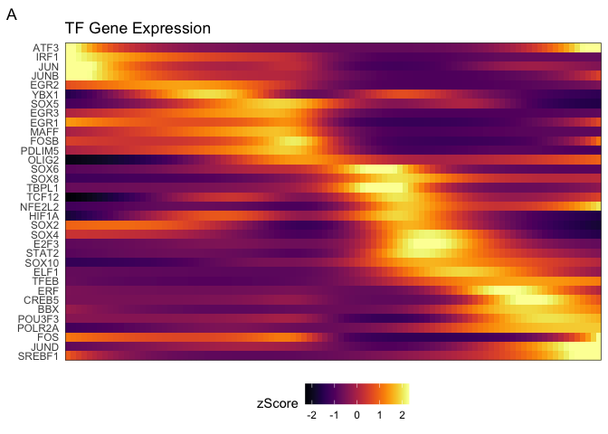
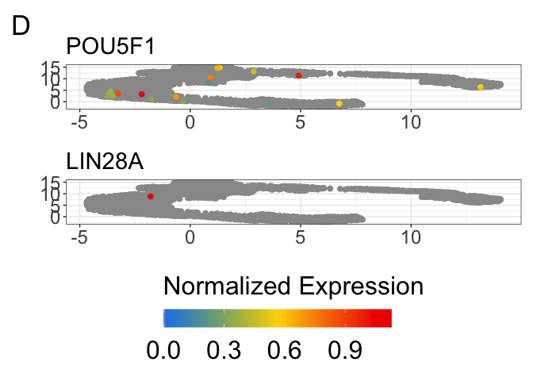
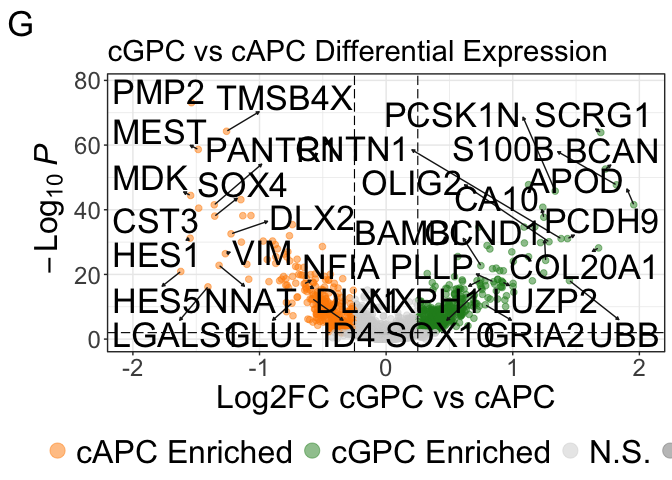

Initial Analysis of Human Cells out of Shiverer Chimeras
================
John Mariani
12/6/2022

``` r
library(Seurat)
library(scPlottingTools)
library(ggplot2)
library(tidyr)
library(dplyr)
library(MAST)
library(plyr)
library(xlsx)
library(patchwork)
library(ggplot2)
library(scales)
library(ggVennDiagram)
library(data.table)
library(slingshot)
library(tradeSeq)
library(tidyr)
library(dplyr)
library(plyr)
library(magrittr)
library(viridis)
library(tidyr)
library(EnhancedVolcano)
library(ggalluvial)


axisTitleSize <- 20
axisTextSize <- 18
labelFont = 18
titleFont = 24
tagSize = 34

source("Scripts/HelperFunctions.R")

theme_manuscript <-  theme(axis.text = element_text(size = axisTextSize), 
        axis.title = element_text(size = axisTitleSize), 
        title = element_text(size = titleFont), 
        legend.title = element_text(size = axisTitleSize),
        legend.text = element_text(size = axisTitleSize),
        plot.tag = element_text(size = tagSize),
        plot.title = element_text(size = titleFont))

manuscriptPalette <- c("In Vivo" = "red2", 
                       "In Vitro - GPC Stage" = "#2E30FF",
                       "NPC" = "magenta",
                       "GPC1" = "forestgreen",
                       "GPC2" = "darkorange",
                       "GPC3" = "firebrick2",
                       "GPC4" = "turquoise",
                       "Astrocyte" = "dodgerblue2",
                       "imOL" = "gold",
                       "maOL" = "darkorchid4",
                       "GPC" = "turquoise",
                       "imAstrocyte" = "firebrick2",
                       "cGPC" = "darkorange",
                       "cAPC" = "forestgreen")
```

``` r
DimPlotPseudotimeKnots <- function(seurat, group.by = "orig.ident", pt.size = 1, curve = sds, models = gamFit){
  p <- DimPlotCustom(seurat, group.by = group.by, pt.size = pt.size)
  for (i in seq_along(slingCurves(curve))) {
    curve_i <- slingCurves(curve)[[i]]
    curve_i <- curve_i$s[curve_i$ord, seq_len(2)]
    #colnames(curve_i) <- c("dim1", "dim2")
    p <- p + geom_path(data = as.data.frame(curve_i), col = "black", size = 1)
    #If I feel like adding an arrow again
    #p <- p + geom_path(data = as.data.frame(curve_i), col = "black", size = 1, arrow = arrow())
  }
  # Adding the knots
  nCurves <- length(slingCurves(curve))
  knots <- S4Vectors::metadata(models)$tradeSeq$knots
  knots_dim <- matrix(ncol = 2, nrow = nCurves * length(knots))
  for (ii in seq_along(slingCurves(curve))) {
    S <- project_to_curve(x = slingCurves(curve)[[ii]]$s,
                          s = slingCurves(curve)[[ii]]$s[slingCurves(curve)[[ii]]$ord, ],
                          stretch = 0)
    for (jj in seq_along(knots)) {
      kn <- knots[jj]
      times <- S$lambda
      knot <- which.min(abs(times - kn))
      knots_dim[jj + (ii-1)*length(knots), ] <- S$s[knot, seq_len(2)]
    }
  }
  knots_dim <- as.data.frame(knots_dim)
  colnames(knots_dim) <- c("UMAP_1", "UMAP_2")
  p <- p +
    geom_point(data = knots_dim, col = "black", size = 2)
  return(p)
}
```

# Load In Vivo Data

``` r
invivo <- readRDS("output/RDS/invivo.rds")
invivo <- NormalizeData(invivo)
```

## Determine Gene Expresion Fractions

``` r
expressionFractions <- DotPlot(invivo, assay = "RNA", features = row.names(invivo))$data
```

    ## Warning in asMethod(object): sparse->dense coercion: allocating vector of size
    ## 1.6 GiB

``` r
names(expressionFractions)
```

    ## [1] "avg.exp"        "pct.exp"        "features.plot"  "id"            
    ## [5] "avg.exp.scaled"

``` r
expressionFractionsFilt <- expressionFractions[expressionFractions$pct.exp > 10,]
highFraction <- unique(expressionFractionsFilt$features.plot)

expressionFractionsDF <- pivot_wider(data = expressionFractions, values_from = pct.exp, names_from = id, id_cols = "features.plot")
```

## Setup MAST ZLM for DE

``` r
# invivo.sca <- makeSCA(invivo, highFraction)
# 

# modelMAST <- as.formula(object = "~cellType+line+chemistry+ngeneson+(1|orig.ident)")
# 
# ZLM.invivo <-MAST::zlm(formula = modelMAST, sca = invivo.sca, method='glmer',ebayes = F,
#                                             strictConvergence = FALSE, parallel = T)
# 
# colnames(ZLM.invivo@coefC)
# 
# 
# 
# saveRDS(ZLM.invivo, "RDS/ZLM.invivo")
# ZLM.invivo <- readRDS("RDS/ZLM.invivo")
```

``` r
# runLR(ZLM.invivo, c(0,1,0,0,0,0,0,0,0,0), 
#       contrast0 = c(1,1,0,0,0,0,0,.5,.5,0), 
#       contrast1 = c(1,0,0,0,0,0,0,.5,.5,0), 
#       fileName = "Astrocyte.vs.imAstrocyte")
# 
# 
# 
# temp <- colnames(ZLM.invivo@coefC)
# names(temp) <- temp
# temp[] <- c(0,1,0,0,-1,0,0,0,0,0)
# 
# runLR(ZLM.invivo, c(0,1,0,0,-1,0,0,0,0,0), 
#       contrast0 = c(1,0,0,0,1,0,0,.5,.5,0), 
#       contrast1 = c(1,1,0,0,0,0,0,.5,.5,0), 
#       fileName = "imAstrocyte.vs.GPC")
# 
# 
# temp[] <- c(0,1,-1,0,0,0,0,0,0,0)
# temp
# 
# runLR(ZLM.invivo, c(0,1,-1,0,0,0,0,0,0,0), 
#       contrast0 = c(1,0,1,0,0,0,0,.5,.5,0), 
#       contrast1 = c(1,1,0,0,0,0,0,.5,.5,0), 
#       fileName = "imAstrocyte.vs.cAPC")
# 
# temp[] <- c(0,0,0,1,-1,0,0,0,0,0)
# temp
# 
# runLR(ZLM.invivo, c(0,0,0,1,-1,0,0,0,0,0), 
#       contrast0 = c(1,0,0,0,1,0,0,.5,.5,0), 
#       contrast1 = c(1,0,0,1,0,0,0,.5,.5,0), 
#       fileName = "cGPC.vs.GPC")
# 
# temp[] <- c(0,0,-1,1,0,0,0,0,0,0)
# temp
# 
# runLR(ZLM.invivo, c(0,0,-1,1,0,0,0,0,0,0), 
#       contrast0 = c(1,0,1,0,0,0,0,.5,.5,0), 
#       contrast1 = c(1,0,0,1,0,0,0,.5,.5,0), 
#       fileName = "cGPC.vs.cAPC")
# 
# temp[] <-c(0,0,0,0,-1,1,0,0,0,0)
# temp
# 
# runLR(ZLM.invivo, c(0,0,0,0,-1,1,0,0,0,0), 
#       contrast0 = c(1,0,0,0,1,0,0,.5,.5,0), 
#       contrast1 = c(1,0,0,0,0,1,0,.5,.5,0), 
#       fileName = "imOL.vs.GPC")
# 
# temp[] <-c(0,0,0,0,0,-1,1,0,0,0)
# temp
# 
# runLR(ZLM.invivo, c(0,0,0,0,0,-1,1,0,0,0), 
#       contrast0 = c(1,0,0,0,0,1,0,.5,.5,0), 
#       contrast1 = c(1,0,0,0,0,0,1,.5,.5,0), 
#       fileName = "maOL.vs.imOL")
# 
# temp[] <- c(0,0,0,-1,0,1,0,0,0,0)
# temp
# 
# runLR(ZLM.invivo, c(0,0,0,-1,0,1,0,0,0,0), 
#       contrast0 = c(1,0,0,1,0,0,0,.5,.5,0), 
#       contrast1 = c(1,0,0,0,0,1,0,.5,.5,0), 
#       fileName = "imOL.vs.cGPC")
# 
# 
# 
# temp[] <- c(0,0,1,0,-1,0,0,0,0,0)
# temp
# 
# runLR(ZLM.invivo, c(0,0,1,0,-1,0,0,0,0,0), 
#       contrast0 = c(1,0,0,0,1,0,0,.5,.5,0), 
#       contrast1 = c(1,0,1,0,0,0,0,.5,.5,0), 
#       fileName = "cAPC.vs.GPC")
# 
```

## Reload DE

``` r
invivoComparisons <- c("imOL.vs.GPC", "maOL.vs.imOL", "imAstrocyte.vs.GPC", "Astrocyte.vs.imAstrocyte", "cGPC.vs.GPC", "cGPC.vs.cAPC", "imAstrocyte.vs.cAPC", "cAPC.vs.GPC", "imOL.vs.cGPC")


for(i in invivoComparisons){
  temp <- assign(i, read.delim(paste0("output/DE/",i,".txt")))
  temp <- temp[complete.cases(temp),]
  temp$comparison <- i
  ident.1 <- sub("\\..*", "", i)
  ident.2 <- sub(".*\\.", "", i)
  tempExpDF <- expressionFractionsDF[,c("features.plot",ident.1, ident.2)]
  tempExpDF <- tempExpDF[tempExpDF[,2] > 10 | tempExpDF[,3] > 10,]
  tempSig <- temp[temp$FDR < 0.01 & abs(temp$logFC) > .25 & temp$gene %in% tempExpDF$features.plot,]
  tempSig2 <- temp[temp$FDR < 0.01 & abs(temp$logFC) > .25,]
  assign(paste0(i,".sig"), tempSig)
  write.table(tempSig, paste0("output/DE/", i, ".sig.txt"), sep = "\t", row.names = F, quote = F) # Write sig to output
}
```

## SCENIC DE

``` r
#### SCENIC DE
DefaultAssay(invivo) <- "SCENIC"

DimPlot(invivo)
```

<!-- -->

``` r
imOL.vs.GPC.SCENIC <- FindMarkers(invivo, ident.1 = "imOL", ident.2 = "GPC", logfc.threshold = 0, min.pct = 0)
imOL.vs.GPC.SCENIC$TF <- row.names(imOL.vs.GPC.SCENIC)
imOL.vs.GPC.SCENIC.sig <- imOL.vs.GPC.SCENIC[imOL.vs.GPC.SCENIC$p_val_adj < 0.01,]
write.table(imOL.vs.GPC.SCENIC.sig, "output/DE/imOL.vs.GPC.SCENIC.sig.txt", quote = F, sep = "\t", row.names = F)


maOL.vs.imOL.SCENIC <- FindMarkers(invivo, ident.1 = "maOL", ident.2 = "imOL", logfc.threshold = 0, min.pct = 0)
maOL.vs.imOL.SCENIC$TF <- row.names(maOL.vs.imOL.SCENIC)
maOL.vs.imOL.SCENIC.sig <- maOL.vs.imOL.SCENIC[maOL.vs.imOL.SCENIC$p_val_adj < 0.01,]
write.table(maOL.vs.imOL.SCENIC.sig, "output/DE/maOL.vs.imOL.SCENIC.sig.txt", quote = F, sep = "\t", row.names = F)


imAstro.vs.GPC.SCENIC <- FindMarkers(invivo, ident.1 = "imAstrocyte", ident.2 = "GPC", logfc.threshold = 0, min.pct = 0)
imAstro.vs.GPC.SCENIC$TF <- row.names(imAstro.vs.GPC.SCENIC)
imAstro.vs.GPC.SCENIC.sig <- imAstro.vs.GPC.SCENIC[imAstro.vs.GPC.SCENIC$p_val_adj < 0.01,]
write.table(imAstro.vs.GPC.SCENIC.sig, "output/DE/imAstro.vs.GPC.SCENIC.sig.txt", quote = F, sep = "\t", row.names = F)


Astro.vs.imAstro.SCENIC <- FindMarkers(invivo, ident.1 = "Astrocyte", ident.2 = "imAstrocyte", logfc.threshold = 0, min.pct = 0)
Astro.vs.imAstro.SCENIC$TF <- row.names(Astro.vs.imAstro.SCENIC)
Astro.vs.imAstro.SCENIC.sig <- Astro.vs.imAstro.SCENIC[Astro.vs.imAstro.SCENIC$p_val_adj < 0.01,]
write.table(Astro.vs.imAstro.SCENIC.sig, "output/DE/Astro.vs.imAstro.SCENIC.sig.txt", quote = F, sep = "\t", row.names = F)
```

## Make Specification Network

``` r
#### SCENIC AUC DE
library(jsonlite)
regs <- read_json("output/SCENIC/invivoRegulonsTarget.json", simplifyVector = T) 
weight <- read_json("output/SCENIC/invivoRegulonsWeight.json", simplifyVector = T) # TF to gene2weight based on target order
names(regs) <- gsub("\\(.*", "", names(regs))
names(weight) <- gsub("\\(.*", "", names(weight))


### Make a data frame of all transcription factors and their respective targets and weights
reg_res <- data.frame(TF=character(), Target=character(), Weight=numeric())
for (i in 1:length(regs)) {
  tf <- names(regs)[i]
  numTarget <- length(regs[[i]])
  tmp <- data.frame(TF=rep(tf, numTarget), Target=as.character(regs[[i]]), Weight=as.numeric(weight[[i]]))
  reg_res <- rbind(reg_res, tmp)
}

#E Make a df of TFs, their AUCs, and their targets that are appropriately activated
mergeTFgene <- function(gene, SCENIC, comparison){
  temp <- merge(SCENIC, gene, by.x = "TF", by.y = "gene")
  temp <- temp[temp$logFC * temp$avg_log2FC > 0,]
  temp <- temp[,c(1,6,3,8,9)]
  names(temp) <- c("TF","FDR_AUC", "Log2FC_AUC", "FDR_TF", "Log2FC_TF")
  temp <-  merge(temp, reg_res, by.x = "TF", by.y = "TF")
  temp <- merge(temp, gene, by.x = "Target", by.y = "gene")
  temp <- temp[temp$Log2FC_AUC * temp$logFC > 0,]
  temp$comparison <- comparison
  temp <- temp[,c(2,1,3,4,5,6,9,10,11)]
  names(temp)[7:8] <- c("FDR_Target", "Log2FC_Target")
  temp <- temp[order(temp$Log2FC_Target, decreasing = T),]
  return(temp)
}


imOL.vs.GPC.tf <- mergeTFgene(imOL.vs.GPC.sig, imOL.vs.GPC.SCENIC.sig, "imOL.vs.GPC")
imOL.vs.GPC.tf[imOL.vs.GPC.tf$Log2FC_Target < 0,]$comparison <- "GPC.vs.imOL"
write.table(imOL.vs.GPC.tf, "output/Networks/Invivo/imOL.vs.GPC.tf.txt", sep = "\t", row.names = F, quote = F)


imAstro.vs.GPC.tf <- mergeTFgene(imAstrocyte.vs.GPC.sig, imAstro.vs.GPC.SCENIC.sig, "imAstro.vs.GPC")
imAstro.vs.GPC.tf[imAstro.vs.GPC.tf$Log2FC_Target < 0,]$comparison <- "GPC.vs.imAstro"
write.table(imAstro.vs.GPC.tf, "output/Networks/Invivo/imAstro.vs.GPC.tf.txt", sep = "\t", row.names = F, quote = F)


maOL.vs.imOL.tf <- mergeTFgene(maOL.vs.imOL.sig, maOL.vs.imOL.SCENIC.sig, "maOL.vs.imOL")
maOL.vs.imOL.tf[maOL.vs.imOL.tf$Log2FC_Target < 0,]$comparison <- "imOL.vs.maOL"
write.table(maOL.vs.imOL.tf, "output/Networks/Invivo/maOL.vs.imOL.tf.txt", sep = "\t", row.names = F, quote = F)


Astro.vs.imAstro.tf <- mergeTFgene(Astrocyte.vs.imAstrocyte.sig, Astro.vs.imAstro.SCENIC.sig, "Astro.vs.imAstro")
Astro.vs.imAstro.tf[Astro.vs.imAstro.tf$Log2FC_Target < 0,]$comparison <- "imAstro.vs.Astro"
write.table(imAstro.vs.GPC.tf, "output/Networks/Invivo/Astro.vs.imAstro.tf.txt", sep = "\t", row.names = F, quote = F)
```

## Oligo Differentiation

``` r
TFs <- read.csv("data_for_import/TF_Functions.csv")
activators <- TFs$Activators
repressors <- TFs$Repressors
repressors <- repressors[repressors != ""]

specification.tf.oligo <- rbindlist(list(imOL.vs.GPC.tf, maOL.vs.imOL.tf))
specification.tf.oligo$Log2FC_AUC <- abs(specification.tf.oligo$Log2FC_AUC )
specification.tf.oligo$Log2FC_TF <- abs(specification.tf.oligo$Log2FC_TF )
specification.tf.oligo$Log2FC_Target <- abs(specification.tf.oligo$Log2FC_Target )

temp <- unique(specification.tf.oligo$comparison)
names(temp) <- c("imOL.GPC", "GPC", "maOL", "imOL.maOL")
specification.tf.oligo$enriched <- plyr::mapvalues(x = specification.tf.oligo$comparison, from = temp, to = names(temp))
specification.tf.oligo$type <- "SCENIC"
```

## Oligo Network

``` r
makeTFnetwork <- function(spec.filt, cellType, TFnodeDegree = 2, nTarget = 25, topGene = 11){
  temp.filt <- spec.filt[spec.filt$enriched == cellType,]
  temp.filt <- temp.filt[temp.filt$TF %not in% repressors,]
  temp.filt <- temp.filt[order(temp.filt$Log2FC_Target, decreasing = T),]
  #This takes the first nTarget that are targeted by TFnodeDegree
  tempTarget <- c()
  targets <- c()
  tempTF <- c()
  TFnodeDegree
  for(i in unique(temp.filt$Target)){
    tempTarget <- c(tempTarget, i)
    tempTF <- c(tempTF, temp.filt[temp.filt$Target == i,]$TF)
    keepTF <- unique(tempTF[table(tempTF) >= TFnodeDegree])
    tempTarget <- tempTarget[tempTarget %not in% keepTF]
    if(length(tempTarget) >= nTarget){
      break
    }
  }
  
  temp.filt <- temp.filt[temp.filt$Target %in% tempTarget | temp.filt$Target %in% keepTF,]
  temp.filt <- temp.filt[temp.filt$TF %in% keepTF,]
  
  highGene <- temp.filt[order(temp.filt$Log2FC_Target, decreasing = T),]
  highGene <- highGene[highGene$Target %in% tempTarget,]
  highGene <- highGene[!duplicated(highGene$Target),]
  highGene <- highGene %>% dplyr::slice(1:topGene)
  
  temp.edges <- temp.filt[,c(1,2,9,11)]
  names(temp.edges) <- c("Source", "Target", "Comparison", "Type")
  temp.edges$tempSource <- paste0(temp.edges$Source, "_", cellType)
  temp.edges$tempTarget <- paste0(temp.edges$Target, "_", cellType)
  
  temp.nodes <- data.frame(node = unique(c(temp.edges$Source, temp.edges$Target)))
  temp.nodes$type <- ifelse(temp.nodes$node %in% temp.edges$Source, "TF", "Gene")
  temp.nodes$show <- ifelse(temp.nodes$node %in% c(highGene$Target, keepTF), "Show", "Hide")
  temp.nodes$tempLabel <- paste0(temp.nodes$node, "_", cellType)
  temp.nodes$cellType <- cellType

  network <- list(as.data.frame(temp.edges), as.data.frame(temp.nodes))
  return(network)
}


GPCnetwork <- makeTFnetwork(spec.filt = specification.tf.oligo, cellType = "GPC", topGene = 10)
imOL.vs.GPC.network <- makeTFnetwork(spec.filt = specification.tf.oligo[specification.tf.oligo$comparison == "imOL.vs.GPC",], cellType = "imOL.GPC", topGene = 10)
imOL.vs.maOL.network <- makeTFnetwork(spec.filt = specification.tf.oligo[specification.tf.oligo$comparison == "imOL.vs.maOL",], cellType = "imOL.maOL", topGene = 10)
maOLnetwork <- makeTFnetwork(spec.filt = specification.tf.oligo, cellType = "maOL", topGene = 10)


oligoEdges <- rbindlist(list(GPCnetwork[[1]], imOL.vs.GPC.network[[1]], imOL.vs.maOL.network[[1]], maOLnetwork[[1]]))
oligoNodes <- rbindlist(list(GPCnetwork[[2]], imOL.vs.GPC.network[[2]], imOL.vs.maOL.network[[2]], maOLnetwork[[2]]))

highTF <- unique(oligoNodes[oligoNodes$type == "TF" & oligoNodes$show == "Show",]$node)
highGene <-  unique(oligoNodes[oligoNodes$type == "Gene" & oligoNodes$show == "Show",]$node)

highTF[highTF %not in% activators]
```

    ## character(0)

``` r
write.table(oligoEdges, "output/Networks/Invivo/oligoEdges.txt", quote = F , row.names = F, sep = "\t")
write.table(oligoNodes, "output/Networks/Invivo/oligoNodes.txt", quote = F , row.names = F, sep = "\t")
```

## Astro Differentiation

``` r
specification.tf.astro <- rbindlist(list(imAstro.vs.GPC.tf, Astro.vs.imAstro.tf))
specification.tf.astro$Log2FC_AUC <- abs(specification.tf.astro$Log2FC_AUC )
specification.tf.astro$Log2FC_TF <- abs(specification.tf.astro$Log2FC_TF )
specification.tf.astro$Log2FC_Target <- abs(specification.tf.astro$Log2FC_Target )

temp <- unique(specification.tf.astro$comparison)
names(temp) <- c("imAstro.GPC", "GPC", "Astro", "imAstro.Astro")
specification.tf.astro$enriched <- plyr::mapvalues(x = specification.tf.astro$comparison, from = temp, to = names(temp))
specification.tf.astro$type <- "SCENIC"
```

## Astro Network

``` r
astroGPC.network <- makeTFnetwork(spec.filt = specification.tf.astro, cellType = "GPC", topGene = 10)
imAstro.vs.GPC.network <- makeTFnetwork(spec.filt = specification.tf.astro[specification.tf.astro$comparison == "imAstro.vs.GPC",], cellType = "imAstro.GPC", topGene = 10)
imAstro.vs.Astro.network <- makeTFnetwork(spec.filt = specification.tf.astro[specification.tf.astro$comparison == "imAstro.vs.Astro",], cellType = "imAstro.Astro", topGene = 10)
astro.network <- makeTFnetwork(spec.filt = specification.tf.astro, cellType = "Astro", topGene = 10)


astroEdges <- rbindlist(list(astroGPC.network[[1]], imAstro.vs.GPC.network[[1]], imAstro.vs.Astro.network[[1]], astro.network[[1]]))
astroNodes <- rbindlist(list(astroGPC.network[[2]], imAstro.vs.GPC.network[[2]], imAstro.vs.Astro.network[[2]], astro.network[[2]]))

highTF.astro <- unique(astroNodes[astroNodes$type == "TF" & astroNodes$show == "Show",]$node)
highGene.astro <-  unique(astroNodes[astroNodes$type == "Gene" & astroNodes$show == "Show",]$node)

highTF.astro[highTF.astro %not in% activators]
```

    ## character(0)

``` r
write.table(astroEdges, "output/Networks/Invivo/astroEdges.txt", quote = F , row.names = F, sep = "\t")
write.table(astroNodes, "output/Networks/Invivo/astroNodes.txt", quote = F , row.names = F, sep = "\t")
```

## Invivo Pseudotime

``` r
sds <- slingshot(data = invivo@reductions$umap@cell.embeddings, clusterLabels = invivo$cellType)

sds@metadata$lineages
```

    ## $Lineage1
    ## [1] "Astrocyte"   "imAstrocyte" "cAPC"        "cGPC"        "GPC"        
    ## [6] "imOL"        "maOL"

``` r
genes.keep <- unique(c(highTF, highGene, highTF.astro, highGene.astro))

pseudotime <- slingPseudotime(sds, na = FALSE)
cellWeights <- slingCurveWeights(sds)

gamFit <- fitGAM(counts = invivo@assays$RNA@counts, pseudotime = pseudotime, cellWeights = cellWeights, nknots = 6, verbose = T, parallel=F, genes = which(row.names(invivo@assays$RNA@counts) %in% genes.keep))
```

    ## Warning in asMethod(object): sparse->dense coercion: allocating vector of size
    ## 1.6 GiB

## Gene smoothed HM Oligo

``` r
identical(row.names(colData(gamFit)), row.names(invivo@meta.data))
```

    ## [1] TRUE

``` r
colData(gamFit)$cellType <- invivo$cellType


yhatSmooth <- predictSmooth(gamFit, gene = genes.keep, nPoints = 100, tidy = F)

m <-  apply(yhatSmooth, 1, mean, na.rm = T)
s <-  apply(yhatSmooth, 1, sd, na.rm = T)
zScore <- (yhatSmooth - m) / s


zScoreLong <- zScore %>% set_rownames(row.names(.))  %>%
  as_tibble(rownames = "row") %>%
  pivot_longer(-row, names_to = "Pseudotime", values_to = "zScore")

zScoreLongGene <- zScoreLong[zScoreLong$row %in% highGene,]
#zScoreLongGene$row <- factor(zScoreLongGene$row, levels = genePseudotime)
zScoreLongGene$Pseudotime <- factor(zScoreLongGene$Pseudotime, levels = colnames(zScore))

zScoreLongTF <- zScoreLong[zScoreLong$row %in% highTF,]
#zScoreLongTF$row <- factor(zScoreLongTF$row, levels = tfPseudotime)
zScoreLongTF$Pseudotime <- factor(zScoreLongTF$Pseudotime, levels = colnames(zScore))

min(zScoreLongTF$zScore)
```

    ## [1] -2.294869

``` r
min(zScoreLongGene$zScore)
```

    ## [1] -1.820644

``` r
max(zScoreLongTF$zScore)
```

    ## [1] 3.575419

``` r
max(zScoreLongGene$zScore)
```

    ## [1] 5.069208

``` r
# New order of genes/tfs based on 3rd max zScore
zScoreOrder <- zScoreLong
zScoreOrder$pseudo <- rep(1:100, nrow(zScore))
#zScoreOrder <- zScoreOrder %>% group_by(row) %>% filter(zScore == max(zScore))
zScoreOrder <- zScoreOrder %>% group_by(row) %>% filter(zScore == sort(zScore,partial=100-2)[100-2])
zScoreOrder <- zScoreOrder[order(zScoreOrder$pseudo, decreasing = F),]

zScoreLongGene$row <- factor(zScoreLongGene$row, levels = rev(zScoreOrder$row))
zScoreLongTF$row <- factor(zScoreLongTF$row, levels = rev(zScoreOrder$row))


zScoreLongTF[zScoreLongTF$zScore >2.3,]$zScore <- 2.3
zScoreLongGene[zScoreLongGene$zScore >2.3,]$zScore <- 2.3


temp <- zScoreLongTF[!duplicated(zScoreLongTF$row),]
temp <- temp[match(levels(zScoreLongTF$row), temp$row),]
temp <- temp[complete.cases(temp),]


tfHMgg <- ggplot(zScoreLongTF, aes(Pseudotime, row)) + theme_bw() + geom_tile(aes(fill = zScore), colour = NA)  + theme(legend.position = "bottom", legend.direction = "horizontal", axis.text.x = element_blank(), axis.ticks = element_blank(), axis.title = element_blank())  + 
  scale_fill_viridis(limits = c(-2.3,2.3), option = "inferno")  + scale_x_discrete(expand = c(0,0)) + scale_y_discrete(expand = c(0,0)) + labs(title = "TF Gene Expression", tag = "A")


tfHMgg
```

<!-- -->

``` r
temp <- zScoreLongGene[!duplicated(zScoreLongGene$row),]
temp <- temp[match(levels(zScoreLongGene$row), temp$row),]
temp <- temp[complete.cases(temp),]

geneHMgg <- ggplot(zScoreLongGene, aes(Pseudotime, row)) + theme_bw() + geom_tile(aes(fill = zScore), colour = NA) + theme(legend.position = "bottom", legend.direction = "horizontal", axis.text.x = element_blank(), axis.ticks = element_blank(), axis.title = element_blank())  + 
  scale_fill_viridis(limits = c(-2.3,2.3), option = "magma")  + 
  scale_x_discrete(expand = c(0,0)) + scale_y_discrete(expand = c(0,0)) + labs(title = "Target Gene Expression", tag = "C")

geneHMgg
```

<!-- -->

``` r
tfHMgg | geneHMgg
```

<!-- -->

``` r
zScoreLongGene.astro <- zScoreLong[zScoreLong$row %in% highGene.astro,]
#zScoreLongGene$row <- factor(zScoreLongGene$row, levels = genePseudotime)
zScoreLongGene.astro$Pseudotime <- factor(zScoreLongGene.astro$Pseudotime, levels = colnames(zScore))

zScoreLongTF.astro <- zScoreLong[zScoreLong$row %in% highTF.astro,]
#zScoreLongTF$row <- factor(zScoreLongTF$row, levels = tfPseudotime)
zScoreLongTF.astro$Pseudotime <- factor(zScoreLongTF.astro$Pseudotime, levels = colnames(zScore))

min(zScoreLongTF.astro$zScore)
```

    ## [1] -2.118566

``` r
min(zScoreLongTF.astro$zScore)
```

    ## [1] -2.118566

``` r
max(zScoreLongTF.astro$zScore)
```

    ## [1] 4.012205

``` r
max(zScoreLongTF.astro$zScore)
```

    ## [1] 4.012205

``` r
zScoreLongGene.astro$row <- factor(zScoreLongGene.astro$row, levels = rev(zScoreOrder$row))
zScoreLongTF.astro$row <- factor(zScoreLongTF.astro$row, levels = rev(zScoreOrder$row))


zScoreLongTF.astro[zScoreLongTF.astro$zScore >2.3,]$zScore <- 2.3
zScoreLongGene.astro[zScoreLongGene.astro$zScore >2.3,]$zScore <- 2.3


tfHMgg.astro <- ggplot(zScoreLongTF.astro, aes(Pseudotime, row)) + theme_bw() + geom_tile(aes(fill = zScore), colour = NA)  + theme(legend.position = "bottom", legend.direction = "horizontal", axis.text.x = element_blank(), axis.ticks = element_blank(), axis.title = element_blank())  + 
  scale_fill_viridis(limits = c(-2.3,2.3), option = "inferno")  + scale_x_discrete(expand = c(0,0)) + scale_y_discrete(expand = c(0,0)) + labs(title = "TF Gene Expression", tag = "A")


tfHMgg.astro
```

<!-- -->

``` r
geneHMgg.astro <- ggplot(zScoreLongGene.astro, aes(Pseudotime, row)) + theme_bw() + geom_tile(aes(fill = zScore), colour = NA) + theme(legend.position = "bottom", legend.direction = "horizontal", axis.text.x = element_blank(), axis.ticks = element_blank(), axis.title = element_blank())  + 
  scale_fill_viridis(limits = c(-2.3,2.3), option = "magma")  + scale_x_discrete(expand = c(0,0)) + scale_y_discrete(expand = c(0,0)) + labs(title = "Target Gene Expression", tag = "C")

geneHMgg.astro
```

<!-- -->

``` r
tfHMgg.astro | geneHMgg.astro
```

<!-- -->

## AUC pseudotime

``` r
# Fit GAM for SCENIC AUCs using slingshot based on gene expression
gamFitAUC <- fitGAM(counts = invivo@assays$SCENIC@data, pseudotime = pseudotime, cellWeights = cellWeights, nknots = 6, verbose = T, parallel=F, genes = which(row.names(invivo@assays$SCENIC@data) %in% unique(c(highTF, highTF.astro))))

identical(row.names(colData(gamFitAUC)), row.names(invivo@meta.data))
```

    ## [1] TRUE

``` r
colData(gamFitAUC)$cellType <- invivo$cellType

yhatSmooth <- predictSmooth(gamFitAUC, gene = unique(c(highTF, highTF.astro)), nPoints = 100, tidy = F)

m <-  apply(yhatSmooth, 1, mean, na.rm = T)
s <-  apply(yhatSmooth, 1, sd, na.rm = T)
zScore <- (yhatSmooth - m) / s


zScoreLongAUC <- zScore %>% set_rownames(row.names(.))  %>%
  as_tibble(rownames = "row") %>%
  pivot_longer(-row, names_to = "Pseudotime", values_to = "zScore")

zScoreLongAUC$row <- factor(zScoreLongAUC$row, levels = rev(zScoreOrder$row))
zScoreLongAUC$Pseudotime <- factor(zScoreLongAUC$Pseudotime, levels = colnames(zScore))

min(zScoreLongAUC$zScore)
```

    ## [1] -2.640639

``` r
max(zScoreLongAUC$zScore)
```

    ## [1] 3.817602

``` r
zScoreLongAUC[zScoreLongAUC$zScore >2.7,]$zScore <- 2.7
zScoreLongAUC[zScoreLongAUC$zScore < -2.7,]$zScore <- -2.7


aucHMgg <- ggplot(zScoreLongAUC[zScoreLongAUC$row %in% highTF,], aes(x = Pseudotime, y = row)) + theme_bw() + geom_tile(aes(fill = zScore), colour = NA) + theme(legend.position = "bottom", legend.direction = "horizontal", axis.text.x = element_blank(), axis.ticks = element_blank(), axis.title = element_blank())  + 
  scale_fill_viridis(limits = c(-2.7,2.7), option = "viridis")  + scale_x_discrete(expand = c(0,0)) + scale_y_discrete(expand = c(0,0)) + labs(title = "TF Regulon Activity", tag = "B")

aucHMgg
```

<!-- -->

``` r
aucHMgg.astro <- ggplot(zScoreLongAUC[zScoreLongAUC$row %in% highTF.astro,], aes(x = Pseudotime, y = row)) + theme_bw() + geom_tile(aes(fill = zScore), colour = NA) + theme(legend.position = "bottom", legend.direction = "horizontal", axis.text.x = element_blank(), axis.ticks = element_blank(), axis.title = element_blank())  + 
  scale_fill_viridis(limits = c(-2.7,2.7), option = "viridis")  + scale_x_discrete(expand = c(0,0)) + scale_y_discrete(expand = c(0,0)) + labs(title = "TF Regulon Activity", tag = "B")

aucHMgg.astro
```

<!-- -->

## Pseudotime bars

``` r
invivoMeta <- invivo@meta.data

pseudotimeBars <- as.data.frame(pseudotime)
pseudotimeBars <- merge(pseudotimeBars, invivoMeta[,c("cellName", "cellType")], by.x = 0, by.y = "cellName")
pseudotimeBars$pseudotime <- ceiling(pseudotimeBars$Lineage1*(99/max(pseudotimeBars$Lineage1))+1)
pseudotimeBars <- pseudotimeBars %>% group_by(pseudotime) %>% dplyr::summarise(label = names(which.max(table(cellType))))

pseudotimeGGlabel <- ggplot(pseudotimeBars, aes(x = pseudotime, fill = label, y = "Cell Type")) + geom_tile() + scale_fill_manual(values = manuscriptPalette)  + labs(x = "Pseudotime", y = element_blank()) + scale_x_discrete(expand = c(0,0)) + scale_y_discrete(expand = c(0,0)) + theme(legend.position = "none")

pseudotimeGGlabel
```

<!-- -->

## Piece together Oligo

``` r
((tfHMgg | aucHMgg  | geneHMgg) / (pseudotimeGGlabel | pseudotimeGGlabel | pseudotimeGGlabel ) / plot_spacer()) + plot_layout(heights = c(40,1.5,40))
```

<!-- -->

``` r
ggsave("output/Figures/Invivo_Oligo/invivo_oligo_differentiation.pdf", width = 8, height = 12)
```

## Piece together Astro

``` r
((tfHMgg.astro | aucHMgg.astro  | geneHMgg.astro) / (pseudotimeGGlabel | pseudotimeGGlabel | pseudotimeGGlabel ) / plot_spacer()) + plot_layout(heights = c(40,1.5,40))
```

<!-- -->

``` r
ggsave("output/Figures/Invivo_Astro/invivo_astrocyte_differentiation.pdf", width = 8, height = 12)
```

## Pseudotime DimPlot

``` r
colData(gamFit)$cellType <- invivo$cellType
dim(invivo)
```

    ## [1]  397 5337

``` r
figInvivoA <- DimPlotPseudotimeKnots(invivo, group.by = "cellType", curve = sds, models = gamFit, pt.size = 3) + xlim(c(-5,15)) + labs(tag = "A", title = "Integrated\n5,337 Cells")  + theme_bw() + theme_manuscript + theme(legend.position = "none") & scale_fill_manual(values = manuscriptPalette, name = "Cell Type") 
```

    ## Warning: Using `size` aesthetic for lines was deprecated in ggplot2 3.4.0.
    ## ℹ Please use `linewidth` instead.
    ## This warning is displayed once every 8 hours.
    ## Call `lifecycle::last_lifecycle_warnings()` to see where this warning was
    ## generated.

    ## Scale for x is already present.
    ## Adding another scale for x, which will replace the existing scale.

``` r
figInvivoA
```

<!-- -->

## Split by Line

``` r
figInvivoB <- DimPlotCustom(invivo, split.by = "line", group.by = "cellType", ncol = 2, pt.size = 3) & theme_bw() & theme_manuscript & NoLegend() & theme(axis.title.y = element_blank(), axis.text.y = element_blank())  & scale_fill_manual(values = manuscriptPalette)

table(invivo$line)
```

    ## 
    ##  C27 WA09 
    ## 2739 2598

``` r
figInvivoB[[1]] <- figInvivoB[[1]] + labs(tag = "B", title = "iPSC (C27)\n2,739 Cells") 
figInvivoB[[2]] <- figInvivoB[[2]] + xlab("UMAP 1") + labs(title = "ESC (WA09)\n2,598 Cells")
figInvivoB
```

<!-- -->

## Marker Dot Plot

``` r
DefaultAssay(invivo) <- "RNA"

canonicalMarkers <- c("GFAP", "AQP4", "SOX9", "SLC1A2", "OLIG1", "OLIG2", "MKI67", "PDGFRA", "SOX10", "GPR17", "BCAS1", "MBP", "CNP", "PLP1", "MOBP", "NKX6-2")

markerDotPlot <- DotPlot(invivo, features = canonicalMarkers)$data

markerDotPlot$id <- factor(markerDotPlot$id, levels = rev(c("Astrocyte", "imAstrocyte", "cAPC", "cGPC", "GPC", "imOL", "maOL")))


figInvivoC <- ggplot(markerDotPlot, aes(size = pct.exp, color = avg.exp.scaled, y = id, x = features.plot)) + 
  geom_point() + 
  scale_size_area(max_size = 15) + 
  scale_color_viridis() + 
  theme_bw() + 
  theme_manuscript +
  theme(axis.title = element_blank(), axis.text.x = element_text(angle = 90, hjust = 1, vjust = .5), legend.position = "bottom") +
  labs(tag = "C", title = "Canonical Marker Expression", size = "% Expressed", colour = "Scaled Expression") + 
    guides(colour = guide_colorbar(title.position = "top", title.theme = element_text(size = axisTitleSize), barwidth = 15), 
         size = guide_legend(title.position = "top", title.theme = element_text(size = axisTitleSize)))

figInvivoC <- ggplot(markerDotPlot, aes(size = pct.exp, fill = avg.exp.scaled, y = id, x = features.plot)) + 
  geom_point(color = "black", pch = 21) + 
  scale_size_area(max_size = 15) + 
  scale_fill_gradientn(colors = PurpleAndYellow()) + 
  theme_bw() + 
  theme_manuscript +
  theme(axis.title = element_blank(), axis.text.x = element_text(angle = 90, hjust = 1, vjust = .5), legend.position = "bottom") +
  labs(tag = "C", title = "Canonical Marker Expression", size = "% Expressed", colour = "Scaled Expression") + 
    guides(colour = guide_colorbar(title.position = "top", title.theme = element_text(size = axisTitleSize), barwidth = 15), 
         size = guide_legend(title.position = "top", title.theme = element_text(size = axisTitleSize)))


figInvivoC
```

<!-- -->
\## Top Figure

``` r
top <- (figInvivoA | figInvivoB | figInvivoC) + plot_layout(widths = c(1,2,1.2))

top
```

<!-- -->

``` r
ggsave(plot = top, filename  ="output/Figures/Invivo/invivoTop.pdf", width = 30, height = 12)
```

## Pluripotent Markers

``` r
figInvivoD <-  FeaturePlotCustom(invivo, genes = c("POU5F1", "LIN28A"), ncol = 1, sharedScale = "Gene", pt.size = 2, ) & theme_bw() & theme_manuscript

figInvivoD[[1]] <- figInvivoD[[1]] + NoLegend() + labs(tag = "D")
figInvivoD[[2]] <- figInvivoD[[2]] + theme(legend.position = "bottom") + guides( color = guide_colorbar(
      direction = "horizontal",
      title.position = "top", barwidth = 15, title = "Normalized Expression"))


figInvivoD
```

<!-- -->

## GPC Markers

``` r
GPCenriched <- rbind(imOL.vs.GPC.sig[imOL.vs.GPC.sig$logFC < 0,], imAstrocyte.vs.GPC.sig[imAstrocyte.vs.GPC.sig$logFC < 0,])
GPCenriched <- GPCenriched[GPCenriched$gene %in% GPCenriched[duplicated(GPCenriched$gene),]$gene
,]

GPCenriched <- GPCenriched %>% dplyr::group_by(gene) %>%
  dplyr::mutate(meanLogFC = mean(logFC))

GPCenriched <- GPCenriched[order(GPCenriched$meanLogFC, decreasing = F),]

invivo <- ScaleData(invivo, features = unique(GPCenriched$gene[1:60]))
```

    ## Centering and scaling data matrix

``` r
figInvivoE <-  DoHeatmap(subset(invivo, idents = c("imAstrocyte", "GPC", "imOL")), features = unique(GPCenriched$gene[1:60]), label = F, group.colors = c("firebrick2", "turquoise", "gold")) + 
  theme(legend.position = "bottom", axis.text = element_text(size = axisTextSize),  plot.tag = element_text(size = tagSize), legend.title = element_text(size = axisTitleSize), legend.text = element_text(size = axisTitleSize), plot.title = element_text(size = titleFont)) +
  labs(tag = "E", title = "GPC Enriched Genes") +
  guides(color = "none", fill = guide_colorbar(
      direction = "horizontal",
      title.position = "top", barwidth = 15, title = "Scaled Expression"))

figInvivoE
```

<!-- -->

## Cycling Genes

``` r
cyclingEnriched <- rbind(cGPC.vs.GPC.sig[cGPC.vs.GPC.sig$logFC > 0,], cAPC.vs.GPC.sig[cAPC.vs.GPC.sig$logFC > 0,])
cyclingEnriched <- cyclingEnriched[cyclingEnriched$gene %in% cyclingEnriched[duplicated(cyclingEnriched$gene),]$gene
,]

cyclingEnriched <- cyclingEnriched %>% dplyr::group_by(gene) %>%
  dplyr::mutate(meanLogFC = mean(logFC))

cyclingEnriched <- cyclingEnriched[order(cyclingEnriched$meanLogFC, decreasing = T),]

invivo <- ScaleData(invivo, features = unique(cyclingEnriched$gene[1:60]))
```

    ## Centering and scaling data matrix

``` r
figInvivoF <-  DoHeatmap(subset(invivo, idents = c("cGPC", "GPC", "cAPC")), features = unique(cyclingEnriched$gene[1:60]), label = F, group.colors = c("forestgreen", "darkorange", "turquoise"), ) + theme(legend.position = "bottom", axis.text = element_text(size = axisTextSize),  plot.tag = element_text(size = tagSize), legend.title = element_text(size = axisTitleSize), legend.text = element_text(size = axisTitleSize), plot.title = element_text(size = titleFont)) +
  guides(color = "none", fill = guide_colorbar(
      direction = "horizontal",
      title.position = "top", barwidth = 15, title = "Scaled Expression")) + labs(tag = "F", title = "Cycling Enriched Genes")

figInvivoF
```

<!-- -->
\## cGPC vs cAPC

``` r
 keyvals <- ifelse(
    cGPC.vs.cAPC$FDR > 0.01, 'lightgrey',
      ifelse(cGPC.vs.cAPC$logFC > .25, 'forestgreen',
        ifelse(cGPC.vs.cAPC$logFC < -.25, "darkorange", "lightgrey")))

names(keyvals)[keyvals == 'lightgrey'] <- 'N.S.'
names(keyvals)[keyvals == 'forestgreen'] <- 'cGPC Enriched'
names(keyvals)[keyvals == 'darkorange'] <- 'cAPC Enriched'

selectLab = cGPC.vs.cAPC.sig[abs(cGPC.vs.cAPC.sig$logFC) > 1.25,]$gene
selectLab <- c(selectLab, "CA10", "OLIG2", "SOX10", "CNTN1", "PLLP", "BAMBI", "LUZP2", "NXPH1", "GRIA2",
               "ID4", "GLUL", "NFIA", "DLX1", "DLX2")

figInvivoG <- EnhancedVolcano(cGPC.vs.cAPC, labSize  = 9,
                xlab = "Log2FC cGPC vs cAPC",
                lab = cGPC.vs.cAPC$gene,
                x = 'logFC',
                y = 'FDR',
                xlim = c(-2,2),
                selectLab = selectLab,
                pCutoff = 0.01,
                FCcutoff = .25,
                colCustom = keyvals,
                drawConnectors = T) + theme_bw() + theme_manuscript + theme(plot.subtitle = element_blank(), plot.caption = element_blank(), legend.position = "bottom", legend.title = element_blank()) + labs(tag = "G", title = "cGPC vs cAPC Differential Expression")

figInvivoG
```

<!-- -->

## Middle

``` r
middle <- (figInvivoD | figInvivoE | figInvivoF | figInvivoG) + plot_layout(widths = c(.8,1,1,1.3))


topMiddle <- top / middle

ggsave(topMiddle, filename  ="output/Figures/Invivo/invivoTopMiddle2.pdf", width = 30, height = 24)
```

# Supplementary Figure

## Leiden Clusters

``` r
dimLeidenFig <- DimPlotCustom(invivo, group.by = "leiden_clusters", ncol = 1, label = T, pt.size = 3) & theme_bw() & theme_manuscript & NoLegend()  & ggtitle("In Vivo Leiden Clusters") & labs(tag = "A")

dimLeidenFig
```

<!-- -->

## Leiden Markers

``` r
DefaultAssay(invivo) <- "RNA"

canonicalMarkers <- c("GFAP", "AQP4", "SOX9", "SLC1A2", "OLIG1", "OLIG2", "MKI67", "PDGFRA", "SOX10", "GPR17", "BCAS1", "MBP", "CNP", "PLP1", "MOBP", "NKX6-2")

markerDotPlotSupp <- DotPlot(invivo, features = canonicalMarkers, group.by = "leiden_clusters")$data

leidenTemp <- c("7", "4", "9", "8", "5", "0", "1", "2", "6", "3")
names(leidenTemp) <- c("7 - Astrocyte", 
                       "4 - imAstrocyte", 
                       "9 - cAPC",
                       "8 - cGPC",
                       "5 - GPC",
                       "0 - GPC",
                       "1 - imOL",
                       "2 - imOL",
                       "6 - maOL",
                       "3 - maOL")
leidenTemp
```

    ##   7 - Astrocyte 4 - imAstrocyte        9 - cAPC        8 - cGPC         5 - GPC 
    ##             "7"             "4"             "9"             "8"             "5" 
    ##         0 - GPC        1 - imOL        2 - imOL        6 - maOL        3 - maOL 
    ##             "0"             "1"             "2"             "6"             "3"

``` r
markerDotPlotSupp$id <- mapvalues(as.character(markerDotPlotSupp$id), from = leidenTemp, to = names(leidenTemp))

markerDotPlotSupp$id <- factor(markerDotPlotSupp$id, levels = rev(c("7 - Astrocyte", 
                       "4 - imAstrocyte", 
                       "9 - cAPC",
                       "8 - cGPC",
                       "5 - GPC",
                       "0 - GPC",
                       "1 - imOL",
                       "2 - imOL",
                       "6 - maOL",
                       "3 - maOL")))


figSuppMarkerPlot<- ggplot(markerDotPlotSupp, aes(size = pct.exp, fill = avg.exp.scaled, y = id, x = features.plot)) +
  geom_point(color = "black", pch = 21) + 
  scale_size_area(max_size = 15) + 
  scale_fill_gradientn(colors = PurpleAndYellow()) + 
  theme_bw() + 
  theme_manuscript +
  theme(axis.title = element_blank(), axis.text.x = element_text(angle = 90, hjust = 1, vjust = .5), legend.position = "bottom") +
  labs(tag = "B", title = "Canonical Marker Expression", size = "% Expressed", fill = "Scaled Expression") + 
    guides(colour = guide_colorbar(title.position = "top", title.theme = element_text(size = axisTitleSize), barwidth = 15), 
         size = guide_legend(title.position = "top", title.theme = element_text(size = axisTitleSize)))


figSuppMarkerPlot
```

<!-- -->

``` r
invitroInvivo <- readRDS("output/RDS/invitroInvivo.rds")

invivoAlluvial <- subset(invitroInvivo, subset = stage == "In Vivo")

invivoAlluvial <- as.data.frame(table(invivoAlluvial@meta.data$cellType, invivoAlluvial@meta.data$invivoCellType))
invivoAlluvial <- invivoAlluvial[invivoAlluvial$Var1 %in% c("GPC4", "imOL", "maOL", "Astrocyte"),]

invivoAlluvial$Var1 <- droplevels(invivoAlluvial$Var1)


invivoAlluvial$Var2 <- factor(invivoAlluvial$Var2, levels = c("GPC4", "GPC", "cGPC", "imOL", "maOL", "cAPC", "imAstrocyte", "Astrocyte"))

invivoAlluvial$Var1 <- factor(invivoAlluvial$Var1, levels = c("GPC4", "GPC", "cGPC", "imOL", "maOL", "cAPC", "imAstrocyte", "Astrocyte"))

invivoAlluvial$Var2 
```

    ##  [1] Astrocyte   Astrocyte   Astrocyte   Astrocyte   cAPC        cAPC       
    ##  [7] cAPC        cAPC        cGPC        cGPC        cGPC        cGPC       
    ## [13] GPC         GPC         GPC         GPC         imAstrocyte imAstrocyte
    ## [19] imAstrocyte imAstrocyte imOL        imOL        imOL        imOL       
    ## [25] maOL        maOL        maOL        maOL       
    ## Levels: GPC4 GPC cGPC imOL maOL cAPC imAstrocyte Astrocyte

``` r
levels(invivoAlluvial$Var2)
```

    ## [1] "GPC4"        "GPC"         "cGPC"        "imOL"        "maOL"       
    ## [6] "cAPC"        "imAstrocyte" "Astrocyte"

``` r
levels(invivoAlluvial$Var1)
```

    ## [1] "GPC4"        "GPC"         "cGPC"        "imOL"        "maOL"       
    ## [6] "cAPC"        "imAstrocyte" "Astrocyte"

``` r
figAlluvial <- ggplot(data = invivoAlluvial,
       aes(axis1 = Var1, axis2 = Var2, y = Freq)) +
  geom_alluvium(aes(fill = Var2)) +
  geom_stratum() +
  geom_text(stat = "stratum",
            aes(label = after_stat(stratum))) +
  theme_void() + scale_fill_manual(values = manuscriptPalette) + NoLegend() + labs(tag = "C", title = "Cell Type Assignment across Integrations") + theme(plot.tag = element_text(size = tagSize))

figAlluvial
```

    ## Warning in to_lodes_form(data = data, axes = axis_ind, discern =
    ## params$discern): Some strata appear at multiple axes.

    ## Warning in to_lodes_form(data = data, axes = axis_ind, discern =
    ## params$discern): Some strata appear at multiple axes.

    ## Warning in to_lodes_form(data = data, axes = axis_ind, discern =
    ## params$discern): Some strata appear at multiple axes.

<!-- -->

## Cell Cycle Scoring

``` r
DefaultAssay(invivo) <- "RNA"

#### Cell Cycle Scoring

s.genes <- cc.genes$s.genes
g2m.genes <- cc.genes$g2m.genes

#MLF1IP
s.genes[s.genes %not in% invivo@assays$RNA@counts@Dimnames[[1]]] <- "CENPU"
s.genes[s.genes %not in% invivo@assays$RNA@counts@Dimnames[[1]]]
```

    ## character(0)

``` r
#FAM64A HN1
g2m.genes[g2m.genes %not in% invivo@assays$RNA@counts@Dimnames[[1]]] <- c("PIMREG", "JPT1")
g2m.genes[g2m.genes %not in% invivo@assays$RNA@counts@Dimnames[[1]]]
```

    ## character(0)

``` r
invivo <- CellCycleScoring(invivo, s.features = s.genes, g2m.features = g2m.genes, set.ident = F)

head(invivo$G2M.Score)
```

    ## AAACCCAGTAGGCAAC_GOL-2512A5 AAACGAATCAGACCTA_GOL-2512A5 
    ##                 -0.07288905                 -0.10613115 
    ## AAACGCTTCAACCGAT_GOL-2512A5 AAACGCTTCAATGCAC_GOL-2512A5 
    ##                 -0.07976009                 -0.03242011 
    ## AAAGAACCATAACTCG_GOL-2512A5 AAAGAACCATAGCACT_GOL-2512A5 
    ##                 -0.10600767                 -0.03572961

``` r
DimPlot(invivo, group.by = "Phase")
```

<!-- -->

``` r
figInvivoCellCycle <-  VlnPlot(invivo, c("G2M.Score", "S.Score"), ncol = 1, pt.size = 0) & 
  theme_bw() &
  theme_manuscript &
  NoLegend() &
  theme(axis.title.x = element_blank()) &
  scale_fill_manual(values = manuscriptPalette)


figInvivoCellCycle[[1]] <- figInvivoCellCycle[[1]] + theme(axis.text.x = element_blank()) + labs(tag = "D", title = "G2M Phase Score")

figInvivoCellCycle[[2]] <- figInvivoCellCycle[[2]] + ggtitle("S Phase Score")

figInvivoCellCycle
```

<!-- -->

## Piece together supplemental

``` r
(dimLeidenFig | figSuppMarkerPlot) / (figAlluvial | figInvivoCellCycle)
```

    ## Warning in to_lodes_form(data = data, axes = axis_ind, discern =
    ## params$discern): Some strata appear at multiple axes.

    ## Warning in to_lodes_form(data = data, axes = axis_ind, discern =
    ## params$discern): Some strata appear at multiple axes.

    ## Warning in to_lodes_form(data = data, axes = axis_ind, discern =
    ## params$discern): Some strata appear at multiple axes.

<!-- -->

``` r
ggsave(filename  ="output/Figures/Invivo/invivoSupplemental.pdf", width = 30, height = 24)
```

    ## Warning in to_lodes_form(data = data, axes = axis_ind, discern =
    ## params$discern): Some strata appear at multiple axes.

    ## Warning in to_lodes_form(data = data, axes = axis_ind, discern =
    ## params$discern): Some strata appear at multiple axes.

    ## Warning in to_lodes_form(data = data, axes = axis_ind, discern =
    ## params$discern): Some strata appear at multiple axes.

``` r
sessionInfo()
```

    ## R version 4.2.3 (2023-03-15)
    ## Platform: aarch64-apple-darwin20 (64-bit)
    ## Running under: macOS Ventura 13.2.1
    ## 
    ## Matrix products: default
    ## BLAS:   /Library/Frameworks/R.framework/Versions/4.2-arm64/Resources/lib/libRblas.0.dylib
    ## LAPACK: /Library/Frameworks/R.framework/Versions/4.2-arm64/Resources/lib/libRlapack.dylib
    ## 
    ## locale:
    ## [1] en_US.UTF-8/en_US.UTF-8/en_US.UTF-8/C/en_US.UTF-8/en_US.UTF-8
    ## 
    ## attached base packages:
    ## [1] stats4    stats     graphics  grDevices utils     datasets  methods  
    ## [8] base     
    ## 
    ## other attached packages:
    ##  [1] jsonlite_1.8.4              ggalluvial_0.12.5          
    ##  [3] EnhancedVolcano_1.16.0      ggrepel_0.9.3              
    ##  [5] viridis_0.6.2               viridisLite_0.4.1          
    ##  [7] magrittr_2.0.3              tradeSeq_1.12.0            
    ##  [9] slingshot_2.6.0             TrajectoryUtils_1.6.0      
    ## [11] princurve_2.1.6             data.table_1.14.8          
    ## [13] ggVennDiagram_1.2.2         scales_1.3.0               
    ## [15] patchwork_1.3.0.9000        xlsx_0.6.5                 
    ## [17] plyr_1.8.8                  MAST_1.24.1                
    ## [19] SingleCellExperiment_1.20.1 SummarizedExperiment_1.28.0
    ## [21] Biobase_2.58.0              GenomicRanges_1.50.2       
    ## [23] GenomeInfoDb_1.34.9         IRanges_2.32.0             
    ## [25] S4Vectors_0.36.2            BiocGenerics_0.44.0        
    ## [27] MatrixGenerics_1.10.0       matrixStats_0.63.0         
    ## [29] dplyr_1.1.1                 tidyr_1.3.0                
    ## [31] ggplot2_3.4.4               scPlottingTools_0.0.0.9000 
    ## [33] SeuratObject_4.1.3          Seurat_4.3.0               
    ## 
    ## loaded via a namespace (and not attached):
    ##   [1] systemfonts_1.0.4         igraph_2.0.3             
    ##   [3] lazyeval_0.2.2            sp_1.6-0                 
    ##   [5] splines_4.2.3             BiocParallel_1.32.6      
    ##   [7] listenv_0.9.0             scattermore_0.8          
    ##   [9] digest_0.6.31             htmltools_0.5.5          
    ##  [11] fansi_1.0.4               tensor_1.5               
    ##  [13] cluster_2.1.4             ROCR_1.0-11              
    ##  [15] limma_3.54.2              globals_0.16.2           
    ##  [17] spatstat.sparse_3.0-3     RVenn_1.1.0              
    ##  [19] colorspace_2.1-0          textshaping_0.3.6        
    ##  [21] xfun_0.38                 crayon_1.5.2             
    ##  [23] RCurl_1.98-1.12           progressr_0.13.0         
    ##  [25] spatstat.data_3.0-4       survival_3.5-5           
    ##  [27] zoo_1.8-11                glue_1.6.2               
    ##  [29] polyclip_1.10-4           gtable_0.3.3             
    ##  [31] zlibbioc_1.44.0           XVector_0.38.0           
    ##  [33] leiden_0.4.3              DelayedArray_0.24.0      
    ##  [35] future.apply_1.10.0       abind_1.4-5              
    ##  [37] edgeR_3.40.2              DBI_1.1.3                
    ##  [39] spatstat.random_3.2-3     miniUI_0.1.1.1           
    ##  [41] Rcpp_1.0.10               xtable_1.8-4             
    ##  [43] reticulate_1.34.0         htmlwidgets_1.6.2        
    ##  [45] httr_1.4.5                RColorBrewer_1.1-3       
    ##  [47] ellipsis_0.3.2            ica_1.0-3                
    ##  [49] pkgconfig_2.0.3           rJava_1.0-6              
    ##  [51] farver_2.1.1              uwot_0.1.14              
    ##  [53] deldir_1.0-6              locfit_1.5-9.7           
    ##  [55] utf8_1.2.3                labeling_0.4.2           
    ##  [57] tidyselect_1.2.0          rlang_1.1.0              
    ##  [59] reshape2_1.4.4            later_1.3.0              
    ##  [61] munsell_0.5.0             tools_4.2.3              
    ##  [63] cli_3.6.1                 generics_0.1.3           
    ##  [65] ggridges_0.5.4            evaluate_0.20            
    ##  [67] stringr_1.5.0             fastmap_1.1.1            
    ##  [69] ragg_1.2.5                yaml_2.3.7               
    ##  [71] goftest_1.2-3             knitr_1.42               
    ##  [73] fitdistrplus_1.1-8        purrr_1.0.1              
    ##  [75] RANN_2.6.1                sparseMatrixStats_1.10.0 
    ##  [77] pbapply_1.7-0             future_1.32.0            
    ##  [79] nlme_3.1-162              mime_0.12                
    ##  [81] ggrastr_1.0.2             compiler_4.2.3           
    ##  [83] rstudioapi_0.14           beeswarm_0.4.0           
    ##  [85] plotly_4.10.1             png_0.1-8                
    ##  [87] spatstat.utils_3.1-0      tibble_3.2.1             
    ##  [89] stringi_1.7.12            highr_0.10               
    ##  [91] lattice_0.21-8            Matrix_1.5-4             
    ##  [93] vctrs_0.6.1               pillar_1.9.0             
    ##  [95] lifecycle_1.0.3           spatstat.geom_3.2-9      
    ##  [97] lmtest_0.9-40             RcppAnnoy_0.0.20         
    ##  [99] cowplot_1.1.1             bitops_1.0-7             
    ## [101] irlba_2.3.5.1             httpuv_1.6.9             
    ## [103] R6_2.5.1                  promises_1.2.0.1         
    ## [105] KernSmooth_2.23-20        gridExtra_2.3            
    ## [107] vipor_0.4.7               parallelly_1.35.0        
    ## [109] codetools_0.2-19          MASS_7.3-58.3            
    ## [111] xlsxjars_0.6.1            rprojroot_2.0.3          
    ## [113] withr_2.5.0               sctransform_0.3.5        
    ## [115] GenomeInfoDbData_1.2.9    mgcv_1.8-42              
    ## [117] parallel_4.2.3            grid_4.2.3               
    ## [119] DelayedMatrixStats_1.20.0 rmarkdown_2.21           
    ## [121] Rtsne_0.16                spatstat.explore_3.2-7   
    ## [123] shiny_1.7.4               ggbeeswarm_0.7.2
