scATAC-seq Analysis of WA09 GPCs
================
John Mariani
11/21/2024

``` r
library(Seurat)
library(ggplot2)
library(scPlottingTools)
library(patchwork)
library(Signac)
library(GenomicRanges)
library(presto)
library(AnnotationHub)
library(ggrepel)
```

``` r
source("Scripts/HelperFunctions.R")
source("Scripts/StyleSettings.R")
baseSize = 8
```

## Import scATAC data

``` r
counts <- Read10X_h5(filename = "data_for_import/scATAC/filtered_peak_bc_matrix.h5")

metadata <- read.csv(
  file = "data_for_import/scATAC/scATACmeta.csv",
  header = TRUE,
  row.names = 1
)

chrom_assay <- CreateChromatinAssay(
  counts = counts,
  fragments = "data_for_import/scATAC/fragments.tsv.gz",
  sep = c(":", "-"),
  min.cells = 10,
  min.features = 200
)
```

    ## Computing hash

``` r
chrom_assay
```

    ## ChromatinAssay data with 278298 features for 20004 cells
    ## Variable features: 0 
    ## Genome: 
    ## Annotation present: FALSE 
    ## Motifs present: FALSE 
    ## Fragment files: 1

``` r
atac <- CreateSeuratObject(
  counts = chrom_assay,
  assay = "peaks",
  meta.data = metadata
)

atac
```

    ## An object of class Seurat 
    ## 278298 features across 20004 samples within 1 assay 
    ## Active assay: peaks (278298 features, 0 variable features)
    ##  2 layers present: counts, data

## Filter to standard chromosomes

``` r
peaks.keep <- seqnames(granges(atac)) %in% standardChromosomes(granges(atac))
atac <- atac[as.vector(peaks.keep), ]

atac
```

    ## An object of class Seurat 
    ## 278178 features across 20004 samples within 1 assay 
    ## Active assay: peaks (278178 features, 0 variable features)
    ##  2 layers present: counts, data

## Annotate to Ensembl 106 to match scRNA

``` r
ah <- AnnotationHub()
```

    ## snapshotDate(): 2022-10-31

``` r
# Search for the Ensembl 106 EnsDb for Homo sapiens on AnnotationHub
query(ah, "EnsDb.Hsapiens.v106")
```

    ## AnnotationHub with 1 record
    ## # snapshotDate(): 2022-10-31
    ## # names(): AH100643
    ## # $dataprovider: Ensembl
    ## # $species: Homo sapiens
    ## # $rdataclass: EnsDb
    ## # $rdatadateadded: 2022-04-21
    ## # $title: Ensembl 106 EnsDb for Homo sapiens
    ## # $description: Gene and protein annotations for Homo sapiens based on Ensem...
    ## # $taxonomyid: 9606
    ## # $genome: GRCh38
    ## # $sourcetype: ensembl
    ## # $sourceurl: http://www.ensembl.org
    ## # $sourcesize: NA
    ## # $tags: c("106", "Annotation", "AnnotationHubSoftware", "Coverage",
    ## #   "DataImport", "EnsDb", "Ensembl", "Gene", "Protein", "Sequencing",
    ## #   "Transcript") 
    ## # retrieve record with 'object[["AH100643"]]'

``` r
ensdb_v106 <- ah[["AH100643"]]
```

    ## loading from cache

    ## require("ensembldb")

``` r
annotations <- GetGRangesFromEnsDb2(ensdb = ensdb_v106)
```

    ## Warning in .merge_two_Seqinfo_objects(x, y): The 2 combined objects have no sequence levels in common. (Use
    ##   suppressWarnings() to suppress this warning.)

    ## Warning in .merge_two_Seqinfo_objects(x, y): The 2 combined objects have no sequence levels in common. (Use
    ##   suppressWarnings() to suppress this warning.)

    ## Warning in .merge_two_Seqinfo_objects(x, y): The 2 combined objects have no sequence levels in common. (Use
    ##   suppressWarnings() to suppress this warning.)

    ## Warning in .merge_two_Seqinfo_objects(x, y): The 2 combined objects have no sequence levels in common. (Use
    ##   suppressWarnings() to suppress this warning.)

    ## Warning in .merge_two_Seqinfo_objects(x, y): The 2 combined objects have no sequence levels in common. (Use
    ##   suppressWarnings() to suppress this warning.)

    ## Warning in .merge_two_Seqinfo_objects(x, y): The 2 combined objects have no sequence levels in common. (Use
    ##   suppressWarnings() to suppress this warning.)

    ## Warning in .merge_two_Seqinfo_objects(x, y): The 2 combined objects have no sequence levels in common. (Use
    ##   suppressWarnings() to suppress this warning.)

    ## Warning in .merge_two_Seqinfo_objects(x, y): The 2 combined objects have no sequence levels in common. (Use
    ##   suppressWarnings() to suppress this warning.)

    ## Warning in .merge_two_Seqinfo_objects(x, y): The 2 combined objects have no sequence levels in common. (Use
    ##   suppressWarnings() to suppress this warning.)

    ## Warning in .merge_two_Seqinfo_objects(x, y): The 2 combined objects have no sequence levels in common. (Use
    ##   suppressWarnings() to suppress this warning.)

    ## Warning in .merge_two_Seqinfo_objects(x, y): The 2 combined objects have no sequence levels in common. (Use
    ##   suppressWarnings() to suppress this warning.)

    ## Warning in .merge_two_Seqinfo_objects(x, y): The 2 combined objects have no sequence levels in common. (Use
    ##   suppressWarnings() to suppress this warning.)

    ## Warning in .merge_two_Seqinfo_objects(x, y): The 2 combined objects have no sequence levels in common. (Use
    ##   suppressWarnings() to suppress this warning.)

    ## Warning in .merge_two_Seqinfo_objects(x, y): The 2 combined objects have no sequence levels in common. (Use
    ##   suppressWarnings() to suppress this warning.)

    ## Warning in .merge_two_Seqinfo_objects(x, y): The 2 combined objects have no sequence levels in common. (Use
    ##   suppressWarnings() to suppress this warning.)

    ## Warning in .merge_two_Seqinfo_objects(x, y): The 2 combined objects have no sequence levels in common. (Use
    ##   suppressWarnings() to suppress this warning.)

    ## Warning in .merge_two_Seqinfo_objects(x, y): The 2 combined objects have no sequence levels in common. (Use
    ##   suppressWarnings() to suppress this warning.)

    ## Warning in .merge_two_Seqinfo_objects(x, y): The 2 combined objects have no sequence levels in common. (Use
    ##   suppressWarnings() to suppress this warning.)

    ## Warning in .merge_two_Seqinfo_objects(x, y): The 2 combined objects have no sequence levels in common. (Use
    ##   suppressWarnings() to suppress this warning.)

    ## Warning in .merge_two_Seqinfo_objects(x, y): The 2 combined objects have no sequence levels in common. (Use
    ##   suppressWarnings() to suppress this warning.)

    ## Warning in .merge_two_Seqinfo_objects(x, y): The 2 combined objects have no sequence levels in common. (Use
    ##   suppressWarnings() to suppress this warning.)

    ## Warning in .merge_two_Seqinfo_objects(x, y): The 2 combined objects have no sequence levels in common. (Use
    ##   suppressWarnings() to suppress this warning.)

    ## Warning in .merge_two_Seqinfo_objects(x, y): The 2 combined objects have no sequence levels in common. (Use
    ##   suppressWarnings() to suppress this warning.)

    ## Warning in .merge_two_Seqinfo_objects(x, y): The 2 combined objects have no sequence levels in common. (Use
    ##   suppressWarnings() to suppress this warning.)

``` r
length(unique(annotations$gene_id))
```

    ## [1] 62810

``` r
seqlevels(annotations)
```

    ##  [1] "X"  "20" "1"  "6"  "3"  "7"  "12" "11" "4"  "17" "2"  "16" "8"  "19" "9" 
    ## [16] "13" "14" "5"  "22" "10" "Y"  "18" "15" "21" "MT"

``` r
humanFeatures <- read.delim("data_for_import/humanFeatures.txt")

annotations$gene_name <- plyr::mapvalues(x = annotations$gene_id, from = humanFeatures$ensembl_gene_id, to = humanFeatures$external_gene_name)
```

    ## The following `from` values were not present in `x`: ENSG00000274175, ENSG00000273554, ENSG00000275869, ENSG00000277836, ENSG00000275249, ENSG00000274792, ENSG00000276760, ENSG00000278704, ENSG00000277400, ENSG00000274847, ENSG00000276256, ENSG00000273748, ENSG00000277196, ENSG00000278817, ENSG00000276017, ENSG00000277630, ENSG00000278384, ENSG00000278633, ENSG00000276345, ENSG00000275063, ENSG00000277856, ENSG00000271254, ENSG00000268674, ENSG00000277475

``` r
# add the gene information to the object
Annotation(atac) <- annotations
```

## Run scATAC QC

``` r
atac <- NucleosomeSignal(object = atac)

# compute TSS enrichment score per cell
atac <- TSSEnrichment(object = atac, )
```

    ## Extracting TSS positions

    ## Extracting fragments at TSSs

    ## 
    ## Computing TSS enrichment score

``` r
# add fraction of reads in peaks
atac$pct_reads_in_peaks <- atac$peak_region_fragments / atac$passed_filters * 100

seqlevels(blacklist_hg38_unified) <- gsub(x = seqlevels(blacklist_hg38_unified), pattern = "chr", replacement = "")

# add blacklist ratio
atac$blacklist_ratio <- FractionCountsInRegion(
  object = atac, 
  assay = 'peaks',
  regions = blacklist_hg38_unified
)


DensityScatter(atac, x = 'nCount_peaks', y = 'TSS.enrichment', log_x = TRUE, quantiles = TRUE)
```

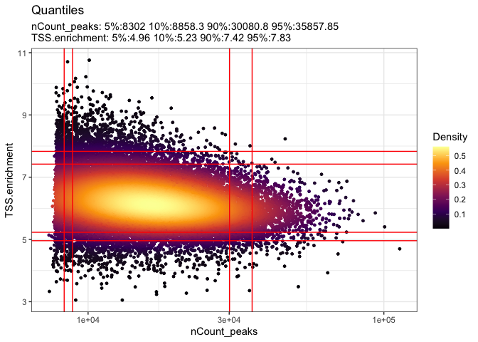<!-- -->

``` r
atac$nucleosome_group <- ifelse(atac$nucleosome_signal > 4, 'NS > 4', 'NS < 4')

table(atac$nucleosome_group)
```

    ## 
    ## NS < 4 
    ##  20004

``` r
## All nucleosome signals below 4
#FragmentHistogram(object = atac, group.by = 'nucleosome_group')
```

``` r
VlnPlot(
  object = atac,
  features = c('nCount_peaks', 'TSS.enrichment', 'blacklist_ratio', 'nucleosome_signal', 'pct_reads_in_peaks'),
  pt.size = 0.1,
  ncol = 5
)
```

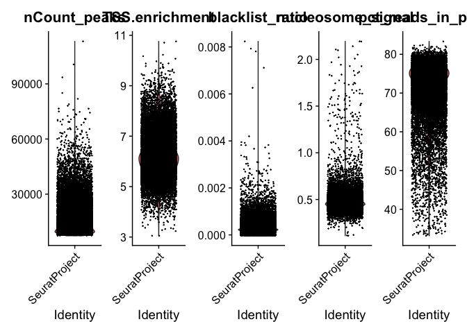<!-- -->

``` r
atac <- subset(
  x = atac,
  subset = nCount_peaks > 9000 &
    nCount_peaks < 100000 &
    pct_reads_in_peaks > 40 &
    blacklist_ratio < 0.01 &
    nucleosome_signal < 4 &
    TSS.enrichment > 4
)
atac
```

    ## An object of class Seurat 
    ## 278178 features across 17649 samples within 1 assay 
    ## Active assay: peaks (278178 features, 0 variable features)
    ##  2 layers present: counts, data

``` r
DefaultAssay(atac) <- "peaks"


atac <- RunTFIDF(atac)
```

    ## Performing TF-IDF normalization

``` r
atac <- FindTopFeatures(atac, min.cutoff = 'q0')
atac <- RunSVD(atac)
```

    ## Running SVD

    ## Scaling cell embeddings

``` r
DepthCor(atac)
```

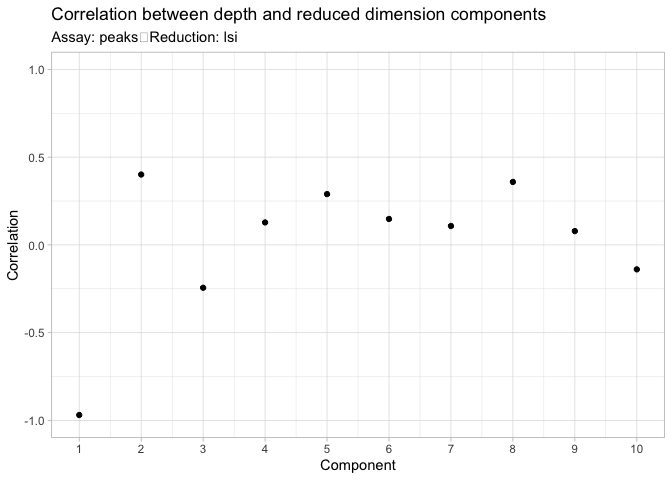<!-- -->

``` r
atac <- RunUMAP(object = atac, reduction = 'lsi', dims = 2:30, min.dist = .9)
```

    ## Warning: The default method for RunUMAP has changed from calling Python UMAP via reticulate to the R-native UWOT using the cosine metric
    ## To use Python UMAP via reticulate, set umap.method to 'umap-learn' and metric to 'correlation'
    ## This message will be shown once per session

    ## 11:19:28 UMAP embedding parameters a = 0.1649 b = 1.803

    ## Found more than one class "dist" in cache; using the first, from namespace 'spam'

    ## Also defined by 'BiocGenerics'

    ## 11:19:28 Read 17649 rows and found 29 numeric columns

    ## 11:19:28 Using Annoy for neighbor search, n_neighbors = 30

    ## Found more than one class "dist" in cache; using the first, from namespace 'spam'

    ## Also defined by 'BiocGenerics'

    ## 11:19:28 Building Annoy index with metric = cosine, n_trees = 50

    ## 0%   10   20   30   40   50   60   70   80   90   100%

    ## [----|----|----|----|----|----|----|----|----|----|

    ## **************************************************|
    ## 11:19:29 Writing NN index file to temp file /var/folders/km/qqj75h1x5997_2vdv1jnjh2r0000gq/T//RtmpaObaEv/filed19f5c2f2597
    ## 11:19:29 Searching Annoy index using 1 thread, search_k = 3000
    ## 11:19:32 Annoy recall = 100%
    ## 11:19:33 Commencing smooth kNN distance calibration using 1 thread with target n_neighbors = 30
    ## 11:19:35 Initializing from normalized Laplacian + noise (using irlba)
    ## 11:19:35 Commencing optimization for 200 epochs, with 743326 positive edges
    ## 11:19:43 Optimization finished

``` r
atac <- FindNeighbors(object = atac, reduction = 'lsi', dims = 2:30)
```

    ## Computing nearest neighbor graph
    ## Computing SNN

``` r
atac <- FindClusters(object = atac, verbose = FALSE, algorithm = 3)
DimPlot(object = atac, label = TRUE) + NoLegend()
```

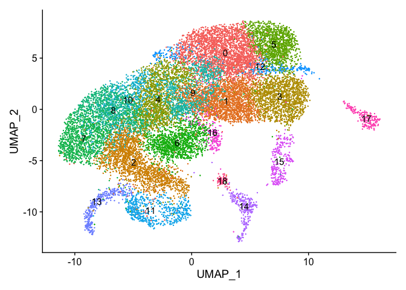<!-- -->
\## Import invitro scRNA to compare to

``` r
invitro <- readRDS("output/RDS/invitroInvivo.rds")

invitro <- subset(invitro, subset = stage == "In Vitro - GPC Stage")
invitro <- UpdateSeuratObject(invitro)
```

    ## Validating object structure

    ## Updating object slots

    ## Ensuring keys are in the proper structure

    ## Updating matrix keys for DimReduc 'umap'

    ## Ensuring keys are in the proper structure

    ## Ensuring feature names don't have underscores or pipes

    ## Updating slots in RNA

    ## Updating slots in umap

    ## Setting umap DimReduc to global

    ## Validating object structure for Assay 'RNA'

    ## Validating object structure for DimReduc 'umap'

    ## Object representation is consistent with the most current Seurat version

``` r
DefaultAssay(invitro)
```

    ## [1] "RNA"

``` r
invitro <- NormalizeData(invitro)
```

``` r
DefaultAssay(atac) <- "peaks"

gene.activities <- GeneActivity(atac, verbose = T, features = unique(Annotation(atac)$gene_name), max.width = NULL, biotypes = NULL)
```

    ## Extracting gene coordinates

    ## Extracting reads overlapping genomic regions

``` r
atac[['RNA']] <- CreateAssayObject(counts = gene.activities)
```

    ## Warning: Non-unique features (rownames) present in the input matrix, making
    ## unique

    ## Warning: Feature names cannot have underscores ('_'), replacing with dashes
    ## ('-')

    ## Warning: Feature names cannot have underscores ('_'), replacing with dashes
    ## ('-')

``` r
head(row.names(gene.activities))
```

    ## [1] "ENSG00000228572" "PLCXD1"          "GTPBP6"          "LINC00685"      
    ## [5] "PPP2R3B"         "ENSG00000281849"

``` r
row.names(gene.activities)[duplicated(row.names(gene.activities))]
```

    ##   [1] "SHOX"      "XG"        "SMPX"      "NR0B1"     "XK"        "SMC1A"    
    ##   [7] "ALAS2"     "AMER1"     "AR"        "PCDH19"    "COL4A5"    "KCNE5"    
    ##  [13] "GPR101"    "ABCD1"     "AVP"       "JAG1"      "GNAS-AS1"  "TNFRSF4"  
    ##  [19] "B3GALT6"   "KIF1B"     "MASP2"     "VPS13D"    "ATP13A2"   "SELENON"  
    ##  [25] "FCN3"      "GJB4"      "KCNQ4"     "P3H1"      "ERMAP"     "POMGNT1"  
    ##  [31] "DHCR24"    "BSND"      "TNNI3K"    "BCL10"     "F3"        "ALX3"     
    ##  [37] "RPS27"     "PKLR"      "CD247"     "NPHS2"     "PLA2G4A"   "CFHR1"    
    ##  [43] "CFHR2"     "C4BPB"     "C4BPA"     "OBSCN"     "RYR2"      "FOXF2"    
    ##  [49] "FOXC1"     "TPMT"      "C4B"       "PSMB8"     "RPS10"     "TREM2"    
    ##  [55] "IL17A"     "CD164"     "PLAGL1"    "STX11"     "MLH1"      "MYD88"    
    ##  [61] "SLC25A38"  "ILDR1"     "FOXL2"     "HPS3"      "P2RY1"     "DVL3"     
    ##  [67] "TP63"      "OPA1"      "RNF168"    "RPL35A"    "CARD11"    "MEOX2"    
    ##  [73] "TBX20"     "MPLKIP"    "NCF1"      "SEMA3E"    "GATAD1"    "TFPI2"    
    ##  [79] "PEG10"     "SMO"       "KLF14"     "SVOPL"     "KEL"       "CTAGE6"   
    ##  [85] "XRCC2"     "HTR5A"     "WNK1"      "KCNA1"     "ART4"      "SLCO1B1"  
    ##  [91] "GYS2"      "DHH"       "KRT83"     "KRT6A"     "IL22"      "BBS10"    
    ##  [97] "BTG1"      "PHLDA2"    "ARL14EP"   "CD59"      "ALX4"      "MYBPC3"   
    ## [103] "RASGRP2"   "FGF3"      "LIPT2"     "MYO7A"     "FLI1"      "MSX1"     
    ## [109] "KDR"       "SRP72"     "ENAM"      "PF4"       "DSPP"      "PYURF"    
    ## [115] "NAP1L5"    "IL21"      "GYPB"      "FBXW7"     "FGA"       "SLC25A4"  
    ## [121] "PDLIM3"    "SERPINF2"  "GP1BA"     "FXR2"      "ALOX12B"   "CTC1"     
    ## [127] "FLCN"      "SLFN14"    "CDC6"      "RARA"      "KRT12"     "MEOX1"    
    ## [133] "SOST"      "RNASEH1"   "RPS7"      "COLEC11"   "ASXL2"     "MCFD2"    
    ## [139] "FSHR"      "ATP6V1B1"  "DYSF"      "DCTN1"     "REEP1"     "IFIH1"    
    ## [145] "LRP2"      "COL3A1"    "PMS1"      "MSTN"      "BMPR2"     "ZDBF2"    
    ## [151] "BARD1"     "SMARCAL1"  "CHRNG"     "HBA2"      "HBA1"      "ZNF597"   
    ## [157] "CREBBP"    "MYH11"     "IL21R"     "AHSP"      "CYLD"      "DERPC"    
    ## [163] "FOXC2"     "PIEZO1"    "GSR"       "IKBKB"     "KLF10"     "TRAPPC9"  
    ## [169] "GNA11"     "RAX2"      "CLPP"      "S1PR2"     "F2RL3"     "PIK3R2"   
    ## [175] "SCN1B"     "COX6B1"    "SYNE4"     "IFNL3"     "CYP2B6"    "RPS19"    
    ## [181] "CEACAM16"  "CCDC8"     "FUT2"      "LHB"       "GP6"       "TNNT1"    
    ## [187] "FOXD4"     "RMRP"      "PAX5"      "PRKACG"    "GNAQ"      "HSD17B3"  
    ## [193] "CAVIN4"    "ABCA1"     "WHRN"      "LMX1B"     "AK1"       "CARD9"    
    ## [199] "NOTCH1"    "FLT3"      "FOXO1"     "CPB2"      "ZIC2"      "TPP2"     
    ## [205] "COL4A1"    "F10"       "PROZ"      "SPTB"      "SERPINA10" "RTL1"     
    ## [211] "ANKH"      "DNAJC21"   "PIK3R1"    "F2R"       "ARHGAP26"  "POU4F3"   
    ## [217] "RPS14"     "DDX41"     "SERPIND1"  "MAPK1"     "CRYBB1"    "CACNG2"   
    ## [223] "NCF4"      "TMPRSS6"   "EP300"     "CACNB2"    "MYO3A"     "BICC1"    
    ## [229] "KLLN"      "CYP26C1"   "CYP2C9"    "HPS1"      "ABCC2"     "COL17A1"  
    ## [235] "ADRA2A"    "OAT"       "ROCK1"     "ATP8B1"    "MALT1"     "LMAN1"    
    ## [241] "MC4R"      "MAGEL2"    "NDN"       "GREM1"     "DLL4"      "INO80"    
    ## [247] "CDAN1"     "EPB42"     "SEMA7A"    "CYP1A2"    "IGF1R"

``` r
atac <- NormalizeData(
  object = atac,
  assay = 'RNA',
  normalization.method = 'LogNormalize',
  scale.factor = median(atac$nCount_RNA)
)

DefaultAssay(atac) <- "RNA"
```

## Import invitro differential subpopulation enrichment

``` r
table(invitro$cellType)
```

    ## 
    ##       NPC      GPC1      GPC2      GPC3      GPC4      imOL      maOL Astrocyte 
    ##     13783      8362     10806      3945       880        27         1         1

``` r
invitroComparisons <- c("GPC4.vs.Rest", "NPC.vs.Rest", "GPC1.vs.Rest", "GPC2.vs.Rest", "GPC3.vs.Rest")

for(i in invitroComparisons){
  temp <- read.delim(paste0("output/DE/",i,".txt"))
  #temp <- assign(i, read.delim(paste0("output/DE/",i,".txt")))
  print(dim(temp))
  temp$comparison <- i
  temp <- temp[order(temp$logFC, decreasing = T),]
  assign(i, temp)
  assign(paste0(i,".sig"), temp[temp$FDR < 0.01 & abs(temp$logFC) > .25,])
}
```

    ## [1] 11687     4
    ## [1] 11687     4
    ## [1] 11687     4
    ## [1] 11687     4
    ## [1] 11687     4

``` r
invitroAnchors <- rbindlist(list(GPC1.vs.Rest.sig, GPC2.vs.Rest.sig, GPC3.vs.Rest.sig, GPC4.vs.Rest.sig, NPC.vs.Rest.sig))
invitroAnchors <- unique(invitroAnchors$gene)
```

## Transfer subpopulation labels from in vitro scRNA-seq to scATAC-seq dataset

``` r
transfer.anchors <- FindTransferAnchors(
  reference = invitro,
  query = atac,
  reduction = 'cca',
  features = invitroAnchors
)
```

    ## Warning: 1 features of the features specified were not present in both the reference query assays. 
    ## Continuing with remaining 1490 features.

    ## Running CCA

    ## Merging objects

    ## Finding neighborhoods

    ## Finding anchors

    ##  Found 53214 anchors

    ## Filtering anchors

    ##  Retained 1727 anchors

``` r
table(invitro$cellType)
```

    ## 
    ##       NPC      GPC1      GPC2      GPC3      GPC4      imOL      maOL Astrocyte 
    ##     13783      8362     10806      3945       880        27         1         1

``` r
predicted.labels <- TransferData(
  anchorset = transfer.anchors,
  refdata = invitro$cellType,
  weight.reduction = atac[['lsi']],
  dims = 2:30
)
```

    ## Finding integration vectors

    ## Finding integration vector weights

    ## Predicting cell labels

``` r
table(predicted.labels$predicted.id)
```

    ## 
    ## GPC1 GPC2 GPC3 GPC4 imOL  NPC 
    ## 3674 5622 3049  283    6 5015

``` r
atac <- AddMetaData(object = atac, metadata = predicted.labels)


VlnPlot(atac, "JAG1", group.by = "predicted.id", pt.size = 0) 
```

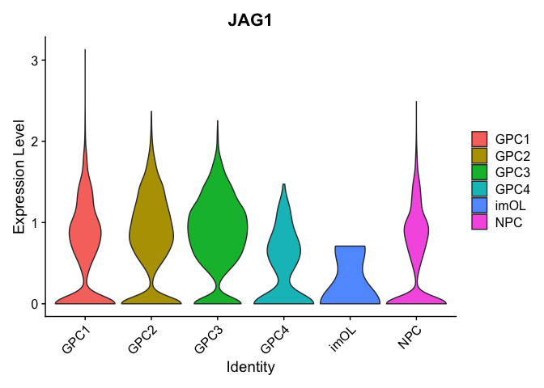<!-- -->

``` r
Idents(atac) <- atac$predicted.id

DimPlotCustom(atac, group.by = "predicted.id", label = T)
```

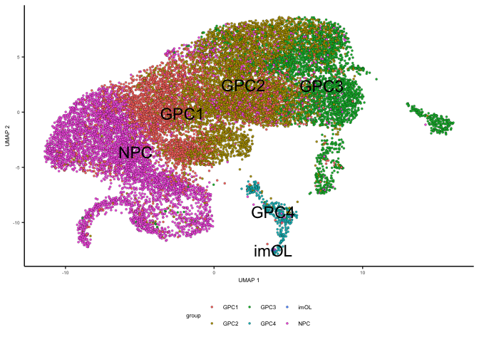<!-- -->

## Use presto FindAllMarkers to calculate subpopulation gene activity enrichment

``` r
DefaultAssay(atac) <- 'RNA'

prestoResultsGene <- wilcoxauc(atac, seurat_assay = "RNA")
prestoResultsGene <- prestoResultsGene[order(prestoResultsGene$logFC, decreasing = T),]

#write.table(prestoResultsGene, "output/DE/scATAC_gene_activity_all.txt", sep = "\t", quote = F, row.names = F)


prestoResultsGene.filt <- prestoResultsGene[prestoResultsGene$padj < 0.01,]
prestoResultsGene.filt <- prestoResultsGene.filt[prestoResultsGene.filt$group != "imOL",]

#write.table(prestoResultsGene.filt, "output/DE/scATAC_gene_activity_de.txt", sep = "\t", quote = F, row.names = F)
```

``` r
NPCs <- prestoResultsGene.filt[prestoResultsGene.filt$group == "NPC",]
NPCs <- merge(NPCs, NPC.vs.Rest.sig, by.x = "feature", by.y = "gene")

GPC4s <- prestoResultsGene.filt[prestoResultsGene.filt$group == "GPC4",]
GPC4s <- merge(GPC4s, GPC4.vs.Rest.sig, by.x = "feature", by.y = "gene")

GPC3s <- prestoResultsGene.filt[prestoResultsGene.filt$group == "GPC3",]
GPC3s <- merge(GPC3s, GPC3.vs.Rest.sig, by.x = "feature", by.y = "gene")

GPC2s <- prestoResultsGene.filt[prestoResultsGene.filt$group == "GPC2",]
GPC2s <- merge(GPC2s, GPC2.vs.Rest.sig, by.x = "feature", by.y = "gene")

GPC1s <- prestoResultsGene.filt[prestoResultsGene.filt$group == "GPC1",]
GPC1s <- merge(GPC1s, GPC1.vs.Rest.sig, by.x = "feature", by.y = "gene")

allMerged <- rbindlist(list(NPCs, GPC1s, GPC2s, GPC3s, GPC4s))

allMerged <- allMerged[allMerged$logFC.x * allMerged$logFC.y > 0,]

allMerged <- allMerged[order(allMerged$logFC.x, decreasing = T),]


howMany <- 11

topHowMany <- allMerged[allMerged$group == "GPC4",]$feature[1:howMany]
topHowMany <- c(topHowMany, allMerged[allMerged$group == "GPC3" & allMerged$feature %not in% topHowMany & allMerged$feature != "ENSG00000289413",]$feature[1:howMany])
topHowMany <- c(topHowMany, allMerged[allMerged$group == "GPC2" & allMerged$feature %not in% topHowMany,]$feature[1:howMany])
topHowMany <- c(topHowMany, allMerged[allMerged$group == "GPC1" & allMerged$feature %not in% topHowMany & allMerged$feature != "ENSG00000289413",]$feature[1:howMany])
topHowMany <- c(topHowMany, allMerged[allMerged$group == "NPC" & allMerged$feature %not in% topHowMany,]$feature[1:howMany])

allATAC <- prestoResultsGene[prestoResultsGene$feature %in% topHowMany & prestoResultsGene$group != "imOL",]
allATAC$group <- factor(allATAC$group, levels = rev(c("NPC", "GPC1", "GPC2", "GPC3","GPC4")))
allATAC$feature <- factor(allATAC$feature, levels = rev(topHowMany))

allATAC$sig <- symnum(allATAC$padj, cutpoints = c(0, 0.00001,
    0.0001, 0.001, 0.01, 1), symbols = c("****","***", "**", "*"," "))


geneActivityHMFigATAC <- ggplot(allATAC, aes(y = group, x = feature, fill = logFC)) + 
  geom_tile(colour = "black") + 
  scale_fill_gradient2(low = "magenta4", mid = "white", high = "darkorange", midpoint = 0) + 
  scale_y_discrete(expand = c(0,0)) +
  theme_bw() + 
  theme_manuscript() + 
  theme(axis.title = element_blank(), axis.text.x = element_text(angle = 90, hjust = .5, vjust = .5), legend.key.height = unit(.2, "inch")) + 
  geom_text(aes(label = sig), angle = 90, vjust = .75, size = 2) + 
  guides(fill=guide_colorbar(title="Log2FC Gene Activity Enrichment", title.position = "left", title.theme = element_text(angle = 90, hjust = .5, size = 8))) +
  labs(tag = "A")

geneActivityHMFigATAC
```

    ## Don't know how to automatically pick scale for object of type <noquote>.
    ## Defaulting to continuous.

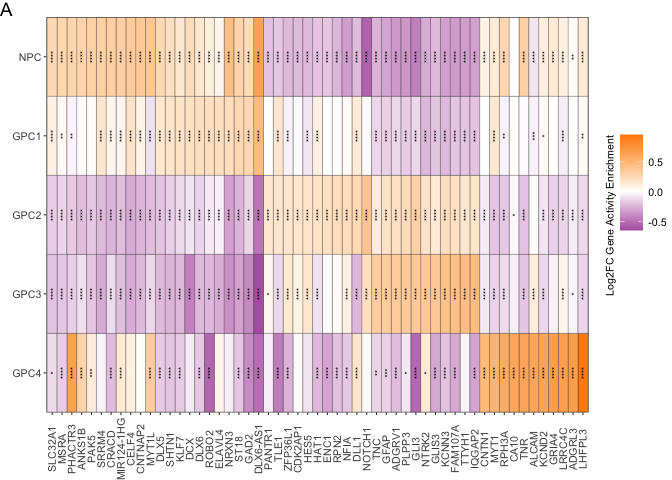<!-- -->

``` r
allDE <- rbindlist(list(GPC4.vs.Rest, GPC3.vs.Rest, GPC2.vs.Rest, GPC1.vs.Rest, NPC.vs.Rest))
allDE <- allDE[allDE$gene %in% topHowMany,]
allDE$comparison <- gsub(x = allDE$comparison, pattern = ".vs.Rest", replacement = "")
allDE$comparison <- factor(allDE$comparison, levels = rev(c("NPC", "GPC1", "GPC2", "GPC3","GPC4")))
allDE$gene <- factor(allDE$gene, levels = rev(topHowMany))

allDE$sig <- symnum(allDE$FDR, c(0, 0.00001,
    0.0001, 0.001, 0.01, 1), symbols = c("****","***", "**", "*"," "))

allDE$sig <- ifelse(abs(allDE$logFC) < .25, " ", allDE$sig)

expressionHMFigATAC <- ggplot(allDE, aes(y = comparison, x = gene, fill = logFC)) + 
  geom_tile(colour = "black") + 
  scale_fill_gradient2(low = "dodgerblue2", mid = "white", high = "red2", midpoint = 0) + 
  scale_y_discrete(expand = c(0,0)) +theme_bw() + 
  scale_x_discrete(position = "top") +
  theme_manuscript() + 
  theme(axis.title = element_blank(), axis.text.x = element_blank(), legend.key.height = unit(.2, "inch"),
        axis.ticks.x.top = element_line(), legend.title = element_text(size = 8)) + 
  geom_text(aes(label = sig), angle = 90, vjust = .75, size = 2) + 
  guides(fill=guide_colorbar(title="Log2FC Gene Enrichment", title.position = "left", title.theme = element_text(angle = 90, hjust = .5, size = 8))) +
  labs(tag = "B")

expressionHMFigATAC
```

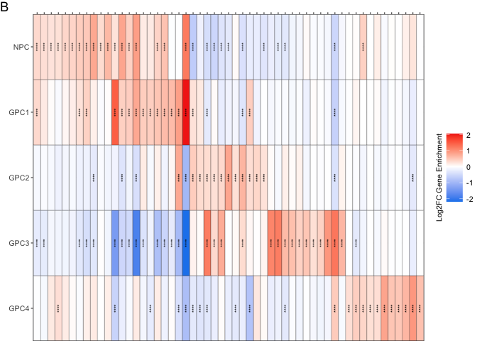<!-- -->

``` r
geneActivityHMFigATAC / expressionHMFigATAC
```

    ## Don't know how to automatically pick scale for object of type <noquote>.
    ## Defaulting to continuous.

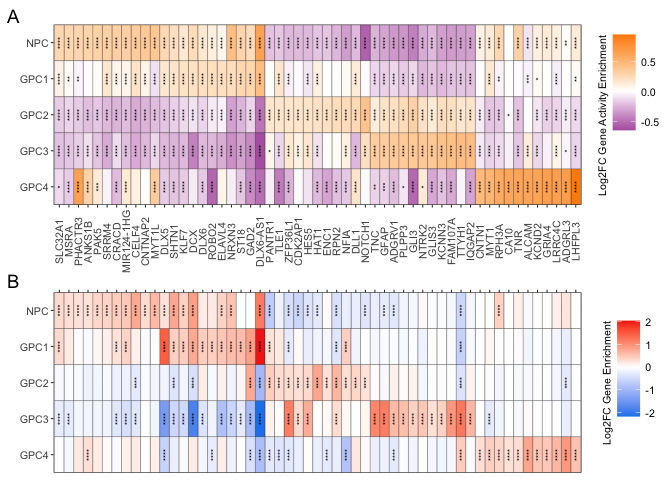<!-- -->

``` r
GPC4.scatter <- prestoResultsGene[prestoResultsGene$group == "GPC4",]


GPC4.scatter <- merge(GPC4.scatter, GPC4.vs.Rest, by.x = "feature", by.y = "gene")
GPC4.scatter <- GPC4.scatter[complete.cases(GPC4.scatter),]

GPC.scatter.both.sig <- GPC4.scatter[GPC4.scatter$FDR < 0.01 & abs(GPC4.scatter$logFC.y) > 0.25 & GPC4.scatter$padj < 0.01,]

table(GPC.scatter.both.sig$logFC.x * GPC.scatter.both.sig$logFC.y > 0)
```

    ## 
    ## FALSE  TRUE 
    ##     6   218

``` r
GPC.scatter.onlyGene.sig <- GPC4.scatter[GPC4.scatter$FDR < 0.01 & abs(GPC4.scatter$logFC.y) > 0.25 & GPC4.scatter$padj > 0.01,]
GPC.scatter.onlyATAC.sig <- GPC4.scatter[GPC4.scatter$padj < 0.01 & GPC4.scatter$feature %not in% GPC4.vs.Rest.sig$gene,]

nrow(GPC.scatter.both.sig)
```

    ## [1] 224

``` r
nrow(GPC.scatter.onlyGene.sig)
```

    ## [1] 129

``` r
nrow(GPC.scatter.onlyATAC.sig)
```

    ## [1] 2728

``` r
GPC.scatter.Gene.sig <- GPC4.scatter[GPC4.scatter$FDR < 0.01 & abs(GPC4.scatter$logFC.y) > 0.25,]

GPC4.scatter$group <- ifelse(GPC4.scatter$feature %in% GPC.scatter.both.sig$feature, "Both", 
                             ifelse(GPC4.scatter$feature %in% GPC.scatter.onlyGene.sig$feature, "Gene only",
                             "Gene Activity only"))

GPC4.scatter$group <- factor(GPC4.scatter$group, levels = (c("Gene Activity only", "Gene only", "Both")))
GPC4.scatter <- GPC4.scatter[order(GPC4.scatter$group),]

GPC4.scatter$label <- ""
GPC4.scatter$label <- ifelse(abs(GPC4.scatter$logFC.y) > 0.5 | abs(GPC4.scatter$logFC.x) > 0.5, GPC4.scatter$feature, GPC4.scatter$label)
GPC4.scatter$label <- ifelse(GPC4.scatter$label %in% GPC4.scatter[grepl(x = GPC4.scatter$feature, pattern = "ENSG"),]$feature, "", GPC4.scatter$label)


GPC4.consesus.scatter.Fig<- ggplot(GPC4.scatter, aes(x = logFC.y, y = logFC.x, fill = group)) + 
  geom_point(shape = 21, colour = "black") + 
  theme_manuscript() + 
  geom_hline(yintercept = 0) +
  geom_vline(xintercept = 0) +
  geom_text_repel(aes(label = label), max.overlaps = 100) + 
  labs(x = "GPC4 Enrichment Gene Expression Log2FC", y= "GPC4 Enrichment Gene Activity Log2FC") + 
  theme(legend.position  = c(0.8, 0.2))


GPC4.consesus.scatter.Fig
```

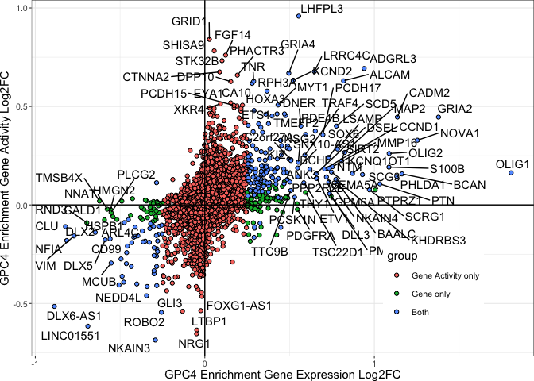<!-- -->

``` r
DefaultAssay(atac) <- 'peaks'

prestoResultsPeaks <- wilcoxauc(atac, seurat_assay = "peaks")

closestFeatures <- ClosestFeature(atac, regions = prestoResultsPeaks$feature)

prestoResultsPeaks <- merge(prestoResultsPeaks, closestFeatures, by.x = 1, by.y = 7)

prestoResultsPeaks <- prestoResultsPeaks[!duplicated(prestoResultsPeaks),]

prestoResultsPeaks <- prestoResultsPeaks[order(prestoResultsPeaks$logFC, decreasing = T),]

prestoResultsPeaks.sig <- prestoResultsPeaks[prestoResultsPeaks$padj < 0.01 & prestoResultsPeaks$group != "imOL",]

#write.table(prestoResultsPeaks.sig, "output/DE/scATAC_peaks_de.txt", sep = "\t", quote = F, row.names = F)
```

``` r
#saveRDS(atac, "output/RDS/atac.rds")
atac.filt <- subset(atac, subset = predicted.id != "imOL")

Idents(atac.filt) <- factor(Idents(atac.filt), levels = c("NPC", "GPC1", "GPC2", "GPC3", "GPC4"))

covPlotFig <- CoveragePlot(
  object = atac.filt,
  region = c("NKX2-2", "OLIG1"),
  #region.highlight = regions_highlight,
  extend.upstream = 1000,
  extend.downstream = 1000,
  peaks = F,
  ncol = 1
) & scale_fill_manual(values = manuscriptPalette)
```

    ## Scale for fill is already present.
    ## Adding another scale for fill, which will replace the existing scale.
    ## Scale for fill is already present.
    ## Adding another scale for fill, which will replace the existing scale.

``` r
covPlotFig 
```

    ## Warning: Removed 1 rows containing missing values (`geom_segment()`).

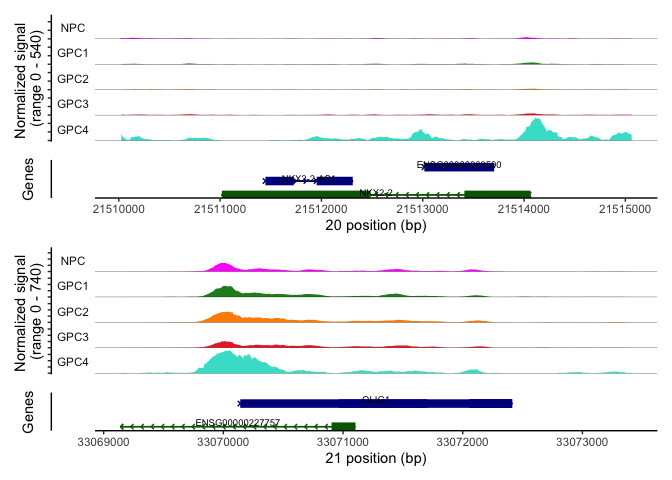<!-- -->

``` r
atacDimPlot <- DimPlotCustom(atac, group.by = "predicted.id", label = T) + scale_fill_manual(values = manuscriptPalette) + theme_manuscript() + theme(legend.position  = c(0.8, 0.2))
atacDimPlot
```

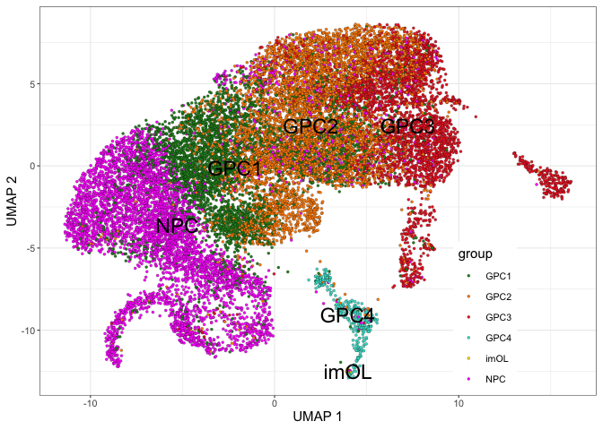<!-- -->

``` r
atacDimPlot | covPlotFig
```

    ## Warning: Removed 1 rows containing missing values (`geom_segment()`).

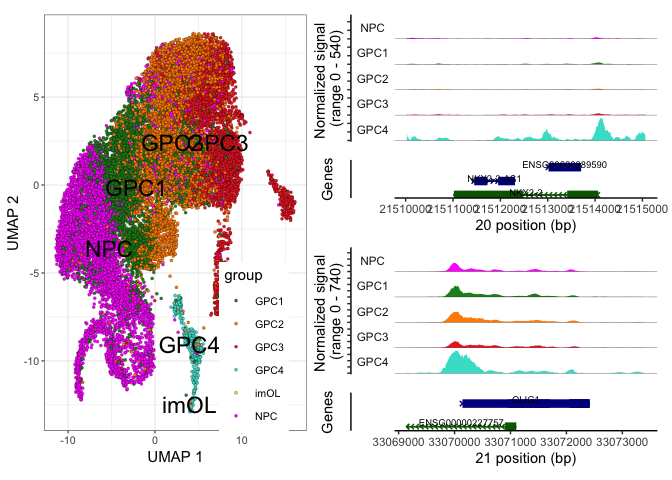<!-- -->

``` r
#ggsave("output/Figures/scATAC/tempCov.pdf", width = 8.5, height = 3.5, units = "in")
```

``` r
(geneActivityHMFigATAC / expressionHMFigATAC / plot_spacer() / free(GPC4.consesus.scatter.Fig, type = "panel")) + plot_layout(heights = c(.3,.3,1,1.6))
```

    ## Don't know how to automatically pick scale for object of type <noquote>.
    ## Defaulting to continuous.

    ## Warning: ggrepel: 2 unlabeled data points (too many overlaps). Consider
    ## increasing max.overlaps

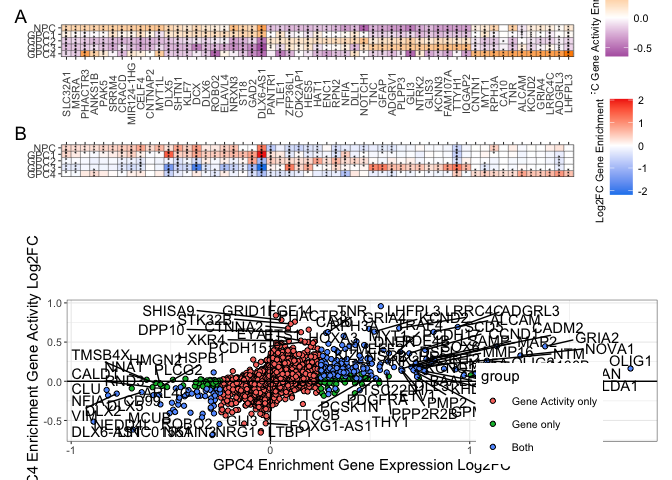<!-- -->

``` r
#ggsave(filename = "output/Figures/scATAC/scATAC.pdf", width = 8.5, height = 11, units = "in")
```

``` r
sessionInfo()
```

    ## R version 4.2.3 (2023-03-15)
    ## Platform: aarch64-apple-darwin20 (64-bit)
    ## Running under: macOS Ventura 13.2.1
    ## 
    ## Matrix products: default
    ## BLAS:   /Library/Frameworks/R.framework/Versions/4.2-arm64/Resources/lib/libRblas.0.dylib
    ## LAPACK: /Library/Frameworks/R.framework/Versions/4.2-arm64/Resources/lib/libRlapack.dylib
    ## 
    ## locale:
    ## [1] en_US.UTF-8/en_US.UTF-8/en_US.UTF-8/C/en_US.UTF-8/en_US.UTF-8
    ## 
    ## attached base packages:
    ## [1] stats4    stats     graphics  grDevices utils     datasets  methods  
    ## [8] base     
    ## 
    ## other attached packages:
    ##  [1] ensembldb_2.22.0           AnnotationFilter_1.22.0   
    ##  [3] GenomicFeatures_1.50.4     AnnotationDbi_1.60.2      
    ##  [5] Biobase_2.58.0             ggrepel_0.9.3             
    ##  [7] AnnotationHub_3.6.0        BiocFileCache_2.6.1       
    ##  [9] dbplyr_2.3.2               presto_1.0.0              
    ## [11] data.table_1.14.8          Rcpp_1.0.10               
    ## [13] GenomicRanges_1.50.2       GenomeInfoDb_1.34.9       
    ## [15] IRanges_2.32.0             S4Vectors_0.36.2          
    ## [17] BiocGenerics_0.44.0        Signac_1.14.0             
    ## [19] patchwork_1.3.0.9000       scPlottingTools_0.0.0.9000
    ## [21] ggplot2_3.4.4              SeuratObject_5.0.2        
    ## [23] Seurat_4.3.0              
    ## 
    ## loaded via a namespace (and not attached):
    ##   [1] utf8_1.2.3                    spatstat.explore_3.2-7       
    ##   [3] reticulate_1.34.0             tidyselect_1.2.0             
    ##   [5] RSQLite_2.3.1                 htmlwidgets_1.6.2            
    ##   [7] grid_4.2.3                    BiocParallel_1.32.6          
    ##   [9] Rtsne_0.16                    munsell_0.5.0                
    ##  [11] codetools_0.2-19              ica_1.0-3                    
    ##  [13] future_1.32.0                 miniUI_0.1.1.1               
    ##  [15] withr_2.5.0                   spatstat.random_3.2-3        
    ##  [17] colorspace_2.1-0              progressr_0.13.0             
    ##  [19] filelock_1.0.2                highr_0.10                   
    ##  [21] knitr_1.42                    rstudioapi_0.14              
    ##  [23] ROCR_1.0-11                   tensor_1.5                   
    ##  [25] listenv_0.9.0                 labeling_0.4.2               
    ##  [27] MatrixGenerics_1.10.0         GenomeInfoDbData_1.2.9       
    ##  [29] polyclip_1.10-4               bit64_4.0.5                  
    ##  [31] farver_2.1.1                  rprojroot_2.0.3              
    ##  [33] parallelly_1.35.0             vctrs_0.6.1                  
    ##  [35] generics_0.1.3                xfun_0.38                    
    ##  [37] biovizBase_1.46.0             R6_2.5.1                     
    ##  [39] ggbeeswarm_0.7.2              hdf5r_1.3.8                  
    ##  [41] DelayedArray_0.24.0           bitops_1.0-7                 
    ##  [43] spatstat.utils_3.1-0          cachem_1.0.7                 
    ##  [45] promises_1.2.0.1              BiocIO_1.8.0                 
    ##  [47] scales_1.3.0                  nnet_7.3-18                  
    ##  [49] beeswarm_0.4.0                gtable_0.3.3                 
    ##  [51] globals_0.16.2                goftest_1.2-3                
    ##  [53] spam_2.10-0                   rlang_1.1.0                  
    ##  [55] RcppRoll_0.3.0                splines_4.2.3                
    ##  [57] rtracklayer_1.58.0            lazyeval_0.2.2               
    ##  [59] dichromat_2.0-0.1             checkmate_2.2.0              
    ##  [61] spatstat.geom_3.2-9           BiocManager_1.30.20          
    ##  [63] yaml_2.3.7                    reshape2_1.4.4               
    ##  [65] abind_1.4-5                   backports_1.4.1              
    ##  [67] httpuv_1.6.9                  Hmisc_5.1-1                  
    ##  [69] tools_4.2.3                   ellipsis_0.3.2               
    ##  [71] RColorBrewer_1.1-3            ggridges_0.5.4               
    ##  [73] plyr_1.8.8                    base64enc_0.1-3              
    ##  [75] progress_1.2.2                zlibbioc_1.44.0              
    ##  [77] purrr_1.0.1                   RCurl_1.98-1.12              
    ##  [79] prettyunits_1.1.1             rpart_4.1.19                 
    ##  [81] deldir_1.0-6                  pbapply_1.7-0                
    ##  [83] cowplot_1.1.1                 zoo_1.8-11                   
    ##  [85] SummarizedExperiment_1.28.0   cluster_2.1.4                
    ##  [87] magrittr_2.0.3                scattermore_0.8              
    ##  [89] lmtest_0.9-40                 RANN_2.6.1                   
    ##  [91] ProtGenerics_1.30.0           fitdistrplus_1.1-8           
    ##  [93] matrixStats_0.63.0            hms_1.1.3                    
    ##  [95] mime_0.12                     evaluate_0.20                
    ##  [97] xtable_1.8-4                  XML_3.99-0.14                
    ##  [99] gridExtra_2.3                 compiler_4.2.3               
    ## [101] biomaRt_2.54.1                tibble_3.2.1                 
    ## [103] KernSmooth_2.23-20            crayon_1.5.2                 
    ## [105] htmltools_0.5.5               later_1.3.0                  
    ## [107] Formula_1.2-5                 tidyr_1.3.0                  
    ## [109] DBI_1.1.3                     MASS_7.3-58.3                
    ## [111] rappdirs_0.3.3                Matrix_1.6-4                 
    ## [113] cli_3.6.1                     parallel_4.2.3               
    ## [115] dotCall64_1.1-1               igraph_2.0.3                 
    ## [117] pkgconfig_2.0.3               GenomicAlignments_1.34.1     
    ## [119] foreign_0.8-84                sp_1.6-0                     
    ## [121] plotly_4.10.1                 spatstat.sparse_3.0-3        
    ## [123] xml2_1.3.3                    vipor_0.4.7                  
    ## [125] XVector_0.38.0                VariantAnnotation_1.44.1     
    ## [127] stringr_1.5.0                 digest_0.6.31                
    ## [129] sctransform_0.3.5             RcppAnnoy_0.0.20             
    ## [131] spatstat.data_3.0-4           Biostrings_2.66.0            
    ## [133] rmarkdown_2.21                leiden_0.4.3                 
    ## [135] fastmatch_1.1-3               htmlTable_2.4.1              
    ## [137] uwot_0.1.14                   restfulr_0.0.15              
    ## [139] curl_5.0.0                    shiny_1.7.4                  
    ## [141] Rsamtools_2.14.0              rjson_0.2.21                 
    ## [143] lifecycle_1.0.3               nlme_3.1-162                 
    ## [145] jsonlite_1.8.4                BSgenome_1.66.3              
    ## [147] viridisLite_0.4.1             fansi_1.0.4                  
    ## [149] pillar_1.9.0                  lattice_0.21-8               
    ## [151] ggrastr_1.0.2                 KEGGREST_1.38.0              
    ## [153] fastmap_1.1.1                 httr_1.4.5                   
    ## [155] survival_3.5-5                interactiveDisplayBase_1.36.0
    ## [157] glue_1.6.2                    png_0.1-8                    
    ## [159] BiocVersion_3.16.0            bit_4.0.5                    
    ## [161] stringi_1.7.12                blob_1.2.4                   
    ## [163] memoise_2.0.1                 dplyr_1.1.1                  
    ## [165] irlba_2.3.5.1                 future.apply_1.10.0
