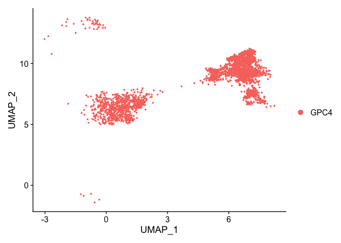
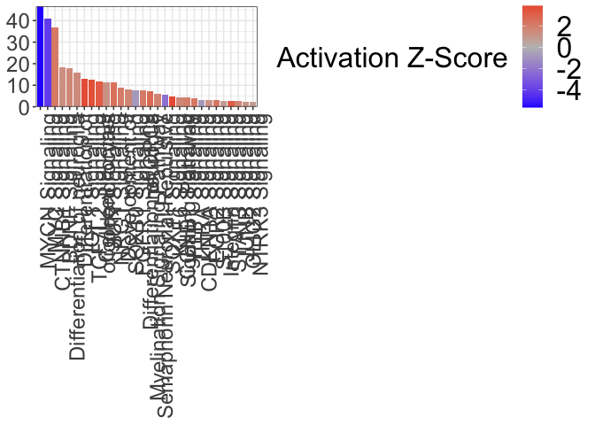
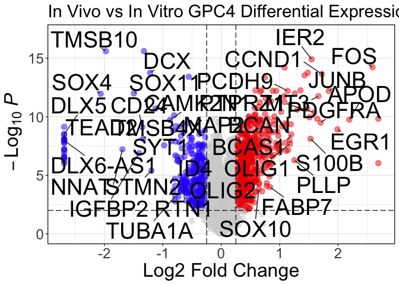
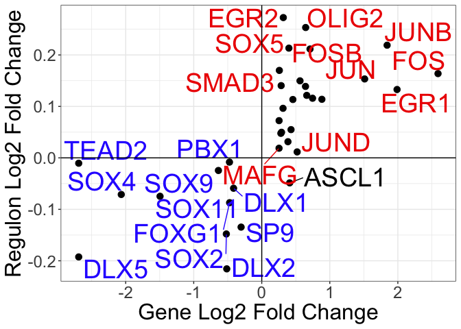
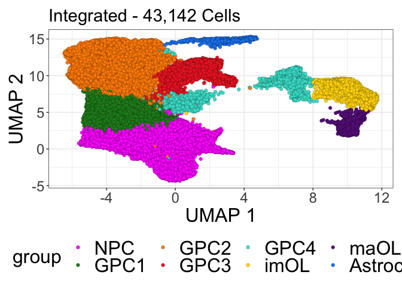
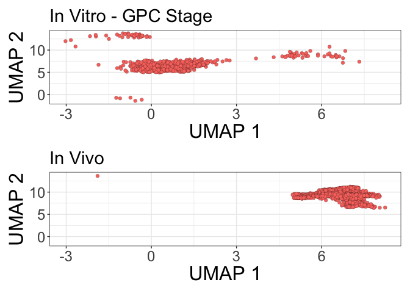
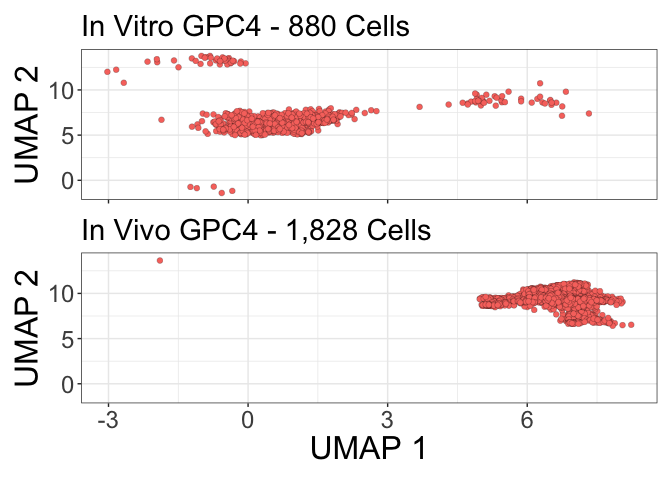
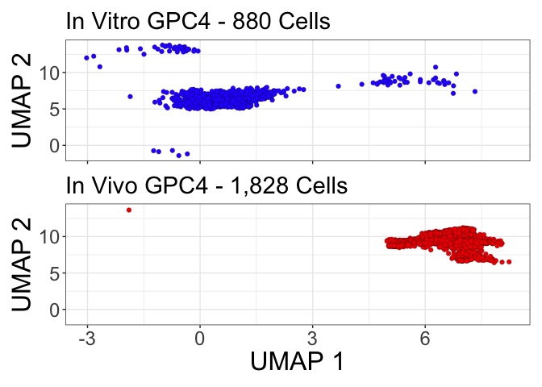

Comparison of In Vitro and In Vivo GPC4s
================
John Mariani
12/6/2022

``` r
library(dplyr)
library(Seurat)
library(devtools)
library(ggplot2)
library(RColorBrewer)
library(cowplot)
library(biomaRt)
library(tidyr)
library(ggplotify)
library(biomaRt)
library(patchwork)
library(dplyr)
library(SeuratDisk)
library(MAST)
library(data.table)
library(scPlottingTools)
library(scales)
library(slingshot)
library(tradeSeq)
library(MAST)
library(EnhancedVolcano)
library(wesanderson)
library(parallel)


`%not in%` <- function(x, table) is.na(match(x, table, nomatch = NA_integer_))

axisTitleSize <- 20
axisTextSize <- 18
labelFont = 18
titleFont = 24
tagSize = 34

source("Scripts/HelperFunctions.R")

theme_manuscript <-  theme(axis.text = element_text(size = axisTextSize), 
        axis.title = element_text(size = axisTitleSize), 
        title = element_text(size = titleFont), 
        legend.title = element_text(size = axisTitleSize),
        legend.text = element_text(size = axisTitleSize),
        plot.tag = element_text(size = tagSize),
        plot.title = element_text(size = titleFont))


manuscriptPalette <- c("In Vivo" = "red2", 
                       "In Vitro - GPC Stage" = "#2E30FF",
                       "NPC" = "magenta",
                       "GPC1" = "forestgreen",
                       "GPC2" = "darkorange",
                       "GPC3" = "firebrick2",
                       "GPC4" = "turquoise",
                       "Astrocyte" = "dodgerblue2",
                       "imOL" = "gold",
                       "maOL" = "darkorchid4")
```

``` r
invitroInvivo <- readRDS("output/RDS/invitroInvivo.rds")
```

## Read in SCENIC data

``` r
invitroInvivoAuc <- read.csv("output/SCENIC/invitroInvivo_AUC.txt", row.names = 1)
dim(invitroInvivoAuc)
```

    ## [1] 43142   340

``` r
names(invitroInvivoAuc) <- gsub(pattern = "\\.\\.\\.", replacement = "", x = names(invitroInvivoAuc))
invitroInvivoAuc <- t(as.matrix(invitroInvivoAuc))
invitroInvivoAuc <- CreateAssayObject(data = invitroInvivoAuc)

invitroInvivo[["SCENIC"]] <- invitroInvivoAuc

rm(invitroInvivoAuc)
gc()
```

    ##             used   (Mb) gc trigger   (Mb) limit (Mb)  max used   (Mb)
    ## Ncells   9182030  490.4   28019969 1496.5         NA  17564743  938.1
    ## Vcells 503062905 3838.1  831498910 6343.9      98304 606082074 4624.1

## Remake Transition with SCENIC data

``` r
invitroInvivo$cellType <- Idents(invitroInvivo)

invitroInvivoMeta <- invitroInvivo@meta.data

## Load In Vivo only object
invivo <- readRDS("output/RDS/invivo.rds")

invivoMeta <- invivo@meta.data

table(invivoMeta$cellType)
```

    ## 
    ##   Astrocyte imAstrocyte        cAPC        cGPC         GPC        imOL 
    ##         290         376         112         261        1584        1717 
    ##        maOL 
    ##         997

``` r
temp <- invivoMeta$cellName
names(temp) <- invivoMeta$cellType


invitroInvivoMeta$invivoCellType <- plyr::mapvalues(x = as.character(invitroInvivoMeta$cellName), from = temp, to =  names(temp))

invitroInvivoMeta[invitroInvivoMeta$invivoCellType %not in% levels(invivo$cellType),]$invivoCellType <- "invitro"

table(invitroInvivoMeta$invivoCellType)
```

    ## 
    ##   Astrocyte        cAPC        cGPC         GPC imAstrocyte        imOL 
    ##         290         112         261        1584         376        1717 
    ##     invitro        maOL 
    ##       37805         997

``` r
identical(invitroInvivoMeta$cellName, Cells(invitroInvivo))
```

    ## [1] TRUE

``` r
invitroInvivo@meta.data <- invitroInvivoMeta

### Make Transition

transition <- subset(invitroInvivo, subset = leiden_clusters == 5)

table(transition$invivoCellType)
```

    ## 
    ##        cAPC        cGPC         GPC imAstrocyte        imOL     invitro 
    ##           1         258        1570           2          16         880 
    ##        maOL 
    ##           1

``` r
transition <- subset(transition, subset = invivoCellType %in% c("GPC", "cGPC", "invitro"))

DimPlot(transition)
```

<!-- -->

## Determine Gene Expresion Fractions and keep those that are present in 10% of either GPC population

``` r
transition$stageDE <- ifelse(transition$stage == "In Vivo", "InVivo", "InVitro")
DefaultAssay(transition) <- "RNA"

expressionFractions <- DotPlot(transition, assay = "RNA", features = row.names(transition), group.by = "stage")$data
```

    ## Warning: Scaling data with a low number of groups may produce misleading
    ## results

``` r
names(expressionFractions)
```

    ## [1] "avg.exp"        "pct.exp"        "features.plot"  "id"            
    ## [5] "avg.exp.scaled"

``` r
expressionFractionsFilt <- expressionFractions[expressionFractions$pct.exp > 10,]
highFraction <- unique(expressionFractionsFilt$features.plot)

expressionFractionsDF <- pivot_wider(data = expressionFractions, values_from = pct.exp, names_from = id, id_cols = "features.plot")
```

## Make ZLM for DE

``` r
# transition.sca <- makeSCA(transition, highFraction)
# 
# transition.sca
# 
# 
# modelMASTinvitroInvivo <- as.formula(
#   object = "~stageDE+line+chemistry+ngeneson+(1|orig.ident)")
# 
# colData(transition.sca)
# 
# options(mc.cores=8)
# getOption("mc.cores")
# 
# 
# ZLMinvitroInvivo <-MAST::zlm(formula = modelMASTinvitroInvivo, sca = transition.sca, method='glmer',ebayes = F,
#                                             strictConvergence = FALSE, parallel = T)
# 
# 
# saveRDS(ZLMinvitroInvivo, "output/DE/ZLM.invitroInvivo.rds")
# 
# ZLMinvitroInvivo <- readRDS("output/DE/ZLM.invitroInvivo.rds")
# colnames(ZLMinvitroInvivo@coefC)
```

## Run Likelihood Ratio Test

``` r
# runLR(ZLMinvitroInvivo, c(0,1,0,0,0), contrast0 = c(1,0,.5,.5,0), contrast1 = c(1,1,.5,.5,0), "Invivo.vs.Invitro.GPC4", FDR = 0.01, logFC = 0.25)
```

## Include infinite FC genes that break the hurdle model

``` r
Invivo.vs.Invitro.GPC4 <- read.delim("output/DE/Invivo.vs.Invitro.GPC4.txt")

tempNA <- Invivo.vs.Invitro.GPC4[!complete.cases(Invivo.vs.Invitro.GPC4),]
tempNA <- tempNA[tempNA$FDR < 0.01,]
tempNA <- tempNA[!is.na(tempNA$FDR),]
expressionFractionsLine <- DotPlot(transition, assay = "RNA", features = tempNA$gene, group.by = "stage", split.by = "line")$data
```

    ## Warning: Scaling data with a low number of groups may produce misleading
    ## results

``` r
expressionFractionsLineDF <- pivot_wider(data = expressionFractionsLine, values_from = pct.exp, names_from = id, id_cols = "features.plot")
expressionFractionsLineDF$C27 <- rowMeans(expressionFractionsLineDF[,c(2,4)])
expressionFractionsLineDF$WA09 <- rowMeans(expressionFractionsLineDF[,c(3,5)])

# Keep genes that are not line dependent 
expressionFractionsLineDFfilt <- expressionFractionsLineDF[expressionFractionsLineDF$C27 > .5 & expressionFractionsLineDF$WA09 > .5,]

# Set them to the absolute max fc + .1 for visualization
expressionFractionsLineDFfilt$logFC <- ifelse(expressionFractionsLineDFfilt$`In Vivo_C27` > expressionFractionsLineDFfilt$`In Vitro - GPC Stage_C27`, max(abs(Invivo.vs.Invitro.GPC4$logFC), na.rm = T) + .1, (max(abs(Invivo.vs.Invitro.GPC4$logFC), na.rm = T) + .1)*-1)

tempNA <- tempNA[tempNA$gene %in% expressionFractionsLineDFfilt$features.plot,]

tempNA$logFC <- plyr::mapvalues(tempNA$gene, from = expressionFractionsLineDFfilt$features.plot, to = expressionFractionsLineDFfilt$logFC)
tempNA$logFC  <- as.numeric(tempNA$logFC )

Invivo.vs.Invitro.GPC4.sig <- Invivo.vs.Invitro.GPC4[complete.cases(Invivo.vs.Invitro.GPC4) & Invivo.vs.Invitro.GPC4$FDR < 0.01 & abs(Invivo.vs.Invitro.GPC4$logFC) > 0.25,]
Invivo.vs.Invitro.GPC4.sig <- rbind(Invivo.vs.Invitro.GPC4.sig, tempNA)


write.table(Invivo.vs.Invitro.GPC4.sig, paste0("output/DE/Invivo.vs.Invitro.GPC4.sig.txt"), sep = "\t", row.names = F, quote = F)
```

## SCENIC DE

``` r
DefaultAssay(transition) <- "SCENIC"

transitionSCENIC <- FindMarkers(transition, ident.1 = "In Vivo", ident.2 = "In Vitro - GPC Stage", group.by = "stage", test.use = "wilcox", logfc.threshold = 0)
transitionSCENIC$regulon <- row.names(transitionSCENIC)
transitionSCENIC$avg_log2FC <- as.numeric(transitionSCENIC$avg_log2FC)
transitionSCENIC.sig <- transitionSCENIC[transitionSCENIC$p_val_adj < 0.01,]

table(abs(Invivo.vs.Invitro.GPC4.sig$logFC) > .25)
```

    ## 
    ## TRUE 
    ## 1005

``` r
sigRegulons <- merge(Invivo.vs.Invitro.GPC4.sig, transitionSCENIC.sig, by.x = "gene", by.y = "regulon")
sigRegulons <- sigRegulons[sigRegulons$avg_log2FC * sigRegulons$logFC > 0,]
sigRegulons <- sigRegulons[,c(1,3,4,9,6)]
names(sigRegulons)
```

    ## [1] "gene"       "FDR"        "logFC"      "p_val_adj"  "avg_log2FC"

``` r
names(sigRegulons) <- c("Gene", "Gene_FDR", "Gene_Log2FC", "AUC_FDR", "AUC_Log2FC")

write.csv(sigRegulons, "output/DE/sigRegulons.csv")

transitionSCENIC.sig.out <- transitionSCENIC.sig[order(transitionSCENIC.sig$avg_log2FC, decreasing = T),]
transitionSCENIC.sig.out <- transitionSCENIC.sig.out[,c(6,5,2)]

write.csv(transitionSCENIC.sig.out, "output/DE/Invivo.vs.Invitro.SCENICE.sig.csv", row.names = F, quote = F)
```

## SCENIC targets

``` r
library(jsonlite)
regs <- read_json("output/SCENIC/invitroInvivo_regulonsTarget.json", simplifyVector = T) 
weight <- read_json("output/SCENIC/invitroInvivo_regulonsWeight.json", simplifyVector = T) # TF to gene2weight based on target order
names(regs) <- gsub("\\(.*", "", names(regs))
names(weight) <- gsub("\\(.*", "", names(weight))

### Make a data frame of all transcription factors and its respective targets and weights
reg_res <- data.frame(TF=character(), Target=character(), Weight=numeric())
for (i in 1:length(regs)) {
  tf <- names(regs)[i]
  numTarget <- length(regs[[i]])
  tmp <- data.frame(TF=rep(tf, numTarget), Target=as.character(regs[[i]]), Weight=as.numeric(weight[[i]]))
  reg_res <- rbind(reg_res, tmp)
}

reg_res_de <- merge(reg_res,  Invivo.vs.Invitro.GPC4.sig, by.x = "TF", by.y = "gene")
reg_res_de <- merge(reg_res_de,  Invivo.vs.Invitro.GPC4.sig, by.x = "Target", by.y = "gene")
names(reg_res_de)
```

    ## [1] "Target"              "TF"                  "Weight"             
    ## [4] "hurdle.Pr..Chisq..x" "FDR.x"               "logFC.x"            
    ## [7] "hurdle.Pr..Chisq..y" "FDR.y"               "logFC.y"

``` r
reg_res_de <- reg_res_de[,c(2,1,3,5,6,8,9)]
names(reg_res_de)[4:7]  <- c("TF FDR", "TF Log2FC", "Target FDR", "Target Log2FC")
reg_res_de <- reg_res_de[reg_res_de$`TF Log2FC` * reg_res_de$`Target Log2FC` > 0,]
reg_res_de <- merge(reg_res_de, sigRegulons, by.x = "TF", by.y = "Gene")
reg_res_de <- reg_res_de[,-c(8,9)]
names(reg_res_de)[8:9]  <- c("AUC FDR", "AUC Log2FC")
names(reg_res_de)[1] <- "Source"
reg_res_de$Type <- "SCENIC"

nodes <- data.frame(node = unique(c(reg_res_de$Source, reg_res_de$Target)))
nodes$type <- "Gene"
nodes[nodes$node %in% reg_res_de$Source,]$type <- "SCENIC"
```

## IPA

``` r
files <- c("output/IPA/Invivo.vs.Invitro.GPC4.IPA.txt")
compNames <- c("In Vivo GPC\nvs\nIn Vitro GPC")

for(i in 1:length(files)){
  canonicalIPA <- fread(files[i], skip = "Canonical",drop = c(4,6))
  names(canonicalIPA) <- c("Pathway", "pVal", "zScore", "Genes")
  canonicalIPA$type <- "Canonical"
  upstreamIPA <- fread(files[i], skip = "Upstream Regulators", drop = c(1:2,4:6,8:10,13:14))
  upstreamIPA <- upstreamIPA[,c(1,3,2,4)]
  names(upstreamIPA) <- c("Pathway", "pVal", "zScore", "Genes")
  upstreamIPA$Pathway <- paste0(upstreamIPA$Pathway, " Signaling")
  upstreamIPA$pVal <- -log10(upstreamIPA$pVal)
  upstreamIPA$type <- "Upstream"
  functionalIPA <- fread(files[i], skip = "Diseases and Bio", drop = c(1,2,5,7,8,10,11))
  names(functionalIPA) <- c("Pathway", "pVal", "zScore", "Genes")
  functionalIPA$pVal <- -log10(functionalIPA$pVal)
  functionalIPA$type <- "Functional"
  if(i == 1){
    IPA <- rbind(canonicalIPA, upstreamIPA, functionalIPA)
    IPA$comparison <- compNames[i]
  } else {
    tempIPA <- rbind(canonicalIPA, upstreamIPA, functionalIPA)
    tempIPA$comparison <- compNames[i]
    IPA <- rbind(IPA, tempIPA)
  }
}
```

    ## Warning in fread(files[i], skip = "Canonical", drop = c(4, 6)): Detected 5
    ## column names but the data has 6 columns (i.e. invalid file). Added 1 extra
    ## default column name for the first column which is guessed to be row names or an
    ## index. Use setnames() afterwards if this guess is not correct, or fix the file
    ## write command that created the file to create a valid file.

    ## Warning in fread(files[i], skip = "Canonical", drop = c(4, 6)): Stopped early
    ## on line 983. Expected 6 fields but found 0. Consider fill=TRUE and
    ## comment.char=. First discarded non-empty line: <<Upstream Regulators for My
    ## Projects->Composition Submission->Invivo.vs.Invitro.GPC4.sig - 2024-01-18 12:22
    ## AM>>

    ## Warning in fread(files[i], skip = "Upstream Regulators", drop = c(1:2, 4:6, :
    ## Stopped early on line 3807. Expected 14 fields but found 0. Consider fill=TRUE
    ## and comment.char=. First discarded non-empty line: <<Causal Networks for My
    ## Projects->Composition Submission->Invivo.vs.Invitro.GPC4.sig - 2024-01-18 12:22
    ## AM>>

    ## Warning in fread(files[i], skip = "Diseases and Bio", drop = c(1, 2, 5, :
    ## Stopped early on line 7781. Expected 11 fields but found 0. Consider fill=TRUE
    ## and comment.char=. First discarded non-empty line: <<Tox Functions for My
    ## Projects->Composition Submission->Invivo.vs.Invitro.GPC4.sig - 2024-01-18 12:22
    ## AM>>

``` r
rm(canonicalIPA)
rm(upstreamIPA)
rm(functionalIPA)

IPA[is.na(IPA$zScore)]$zScore <- 0
ogIPA <- IPA
IPA <- IPA[IPA$pVal > -log10(0.05),]


filterTerms <- c("cancer","glioma", "abdominal", "carcinoma", "endometrium", "eye", "nose", "epidermis", "head", "lymphocyte", "renal", "snout", "tooth", 
                 "connective", "tumor", "fibroblast", "rickets", "mouth", "maxilla", "cartilage", "neoplasm", "oma", "lymph", "liver", "psoriasis", "cardio",
                 "cardiac", "tongue", "disc", "tinea", "herpes", "Picornaviridae", "virus", "killer T", "muscle", "myopathy", "pancreatic", "Onychomycosis",
                 "leukocyte", "oral cavity","osteoclast", "Merkel", "macrophage", "Hydrometrocolpos", "Hand", "Gastric", "Thymocytes", "diabetes",
                 "Dupuytren", "myoblast", "ear$", "implantation", "bone", "limb", "cleft lip", "Calcinosis", "lung", "Benign lesion", 
                 "body axis", "sensory organ", "diabetic", "neutrophil", "infection of mammalia", "leukopoiesis", "neoplasia", "Sensory system development",
                 "T cell", "myeloid", "aorta", "body cavity", "esophagus", "incisor", "kidney", "oesophageal", "respiratory", "skin", "cavity", "urinary",
                 "foot", "digit", "heart", "acute biphenotypic leukemia", "Ankylosis", "Articular rigidity", "Atherosclero", "Blister", "Branching morphogenesis of epithelial tubule",
                 "Cervical spondylotic myelopathy", "epithelial", "exocrine", "gastrointestinal", "Ejection of first polar body", "Familial arrhythmia", "Familial nonsyndromic hearing impairment", 
                 "fibrosis", "mammary", "Hearing", "Morphogenesis of metanephric bud", "cochlea", "nail", "Plasma cell dyscrasia", "Secondary Leukemia", "granulocyte",
                 "Tinnitus", "metastasis", "trunk", "sperm motility", "skull", "dendritic cells", "dehydration", "digestive", "microphthalmia", "myelodysplastic",
                 "semicircular canal", " skeleton", "osteopenia", "osteoarthritis", "Refractory anemia with excess blasts", "rectum", "submandibular", "antiviral", "HIV-1",
                 "antigen present", "gonad", "keratinocyte", "phagocyte", "coronary", "intestinal", "viral replicon", "monocyte", "viral life", "wound", "leukemia", "Airway", "Size of body")

filteredIPA <- IPA[!grepl(paste(filterTerms, collapse = "|"), ignore.case = T, IPA$Pathway),]
deletedIPA <- IPA[grepl(paste(filterTerms, collapse = "|"), ignore.case = T, IPA$Pathway),]


cats <- c("CCND1 Signaling", "JUN Signaling", "PLP1 Signaling", "STAT3 Signaling", "SOX10 Signaling", "OLIG2 Signaling", "FGFR1 Signaling","SOX11 Signaling", "TXNIP Signaling", "CDKN1A Signaling", "JUNB Signaling", "S100B Signaling", "NTRK3 Signaling",  "EGR2 Signaling",
          "TCF7L2 Signaling", "IGF1 Signaling", "KLF6 Signaling", "STAT3 Signaling", "THRA Signaling", "NRG1 Signaling", "Integrin Signaling", "Differentiation of oligodendrocytes", "Myelination of cells", "Development of neuroglia", "BDNF Signaling",
          "MYC Signaling", "MYCN Signaling", "CTNNB1 Signaling", "Myelination Signaling Pathway", "Semaphorin Neuronal Repulsive Signaling Pathway", "Cell-cell contact","Differentiation of oligodendrocyte precursor cells", "Development of neuroglia", "Differentiation of oligodendrocytes", "Differentiation of neuroglia")


transitionCatsGO <- filteredIPA[filteredIPA$Pathway %in% cats]
transitionCatsGO[transitionCatsGO$Pathway == "Differentiation of oligodendrocytes",]$Pathway <- "Differentiation of\noligodendrocytes"
transitionCatsGO[transitionCatsGO$Pathway == "Development of neuroglia",]$Pathway <- "Development of\nneuroglia"
transitionCatsGO[transitionCatsGO$Pathway == "Differentiation of oligodendrocyte precursor cells",]$Pathway <- "Differentiation of OPCs"
transitionCatsGO[transitionCatsGO$Pathway == "Semaphorin Neuronal Repulsive Signaling Pathway",]$Pathway <- "Semaphorin Neuronal Repulsive\nSignaling Pathway"
transitionCatsGO <- transitionCatsGO[-26,]
transitionCatsGO <- transitionCatsGO[order(transitionCatsGO$pVal, decreasing = T),]
transitionCatsGO$Pathway <- factor(transitionCatsGO$Pathway, levels = unique(transitionCatsGO$Pathway))


transitionIPAgg <- ggplot(transitionCatsGO, aes(fill = zScore, y = pVal, x = Pathway)) + geom_col() + theme_bw() + theme_manuscript + scale_fill_gradient2(low = "#2E30FF", mid = "grey", high = "red2", midpoint = 0) +
  theme(legend.position = "right",axis.text.x = element_text(angle = 90, vjust = 1, hjust = 1), axis.text.y = element_text(angle = 0, hjust = 1), axis.title = element_blank()) + guides(fill = guide_colorbar(
      direction = "vertical",
      title.position = "left", title = "Activation Z-Score", )) + scale_y_continuous(expand = c(0,0))


transitionIPAgg
```

<!-- -->

``` r
ggsave("output/Figures/Invitro_Invivo/ipa.pdf", width = 30, height = 8)

IPA <- IPA[,c(1:5)]
IPA <- IPA[order(IPA$zScore, decreasing = T),]

write.table(IPA, "output/IPA/Invivo.vs.Invitro.GPC4.IPA.sig.txt", quote = F, row.names = F, sep = "\t")
```

## Gene Expression Volcano

``` r
volcanoDE <- Invivo.vs.Invitro.GPC4[complete.cases(Invivo.vs.Invitro.GPC4),]
volcanoDE <- rbind(volcanoDE, Invivo.vs.Invitro.GPC4.sig[Invivo.vs.Invitro.GPC4.sig$gene %not in% volcanoDE$gene,])


keyvalsGene <- ifelse(
    volcanoDE$FDR > 0.01, 'lightgrey',
      ifelse(volcanoDE$logFC > .25, 'red2',
        ifelse(volcanoDE$logFC < -.25, "#2E30FF", "lightgrey")))

names(keyvalsGene)[keyvalsGene == 'lightgrey'] <- 'N.S.'
names(keyvalsGene)[keyvalsGene == 'red2'] <- 'In Vivo GPC4 Enriched'
names(keyvalsGene)[keyvalsGene == '#2E30FF'] <- 'In Vitro GPC4 Enriched'

hmGenes1 <- c("PDGFRA", "CCND1", "FABP7", "PTPRZ1", "PLLP", "PCDH9", "BCAN", "FOS", "APOD", "JUNB", "S100B", "EGR1", "IER2", "MT3", "BCAS1", "SOX10", "OLIG1", "OLIG2")
hmGenes2 <- c("STMN2", "NNAT", "CD24", "DCX", "SYT1", "TMSB4X", "CAMK2N1", "SOX4", "SOX11", "DLX6-AS1", "TMSB10", "IGFBP2", "MAP2", "DLX5", "ID4", "RTN1", "TUBA1A", "TEAD2")


#### Gene Volcano
volcanoGene <- EnhancedVolcano(volcanoDE,
                lab = volcanoDE$gene,
                xlab = "Log2 Fold Change",
                x = 'logFC',
                y = 'FDR',
                pCutoff = 0.01,
                FCcutoff = .25,
                drawConnectors = T,
                arrowheads = F,
                colCustom = keyvalsGene,
                xlim = c(-2.7,2.7),
                ylim = c(0,17),
                pointSize = 3,
                labSize = 10,
                selectLab = c(hmGenes1, hmGenes2)) + theme_bw() + theme_manuscript + theme(plot.subtitle = element_blank(), plot.caption = element_blank(), legend.position = "none", legend.title = element_blank()) + labs(title = "In Vivo vs In Vitro GPC4 Differential Expression")

volcanoGene
```

<!-- -->

## SCENIC regulon scatter

``` r
TFs <- read.csv("data_for_import/TF_Functions.csv")
repressors <- TFs$Repressors
repressors <- repressors[repressors != ""]


sigRegulonsScatter <- merge(Invivo.vs.Invitro.GPC4.sig, transitionSCENIC.sig, by.x = "gene", by.y = "regulon")
sigRegulonsScatter <- sigRegulonsScatter[,c(1,3,4,5,6)]
names(sigRegulonsScatter)
```

    ## [1] "gene"       "FDR"        "logFC"      "p_val"      "avg_log2FC"

``` r
names(sigRegulonsScatter) <- c("Gene", "Gene_FDR", "Gene_Log2FC", "AUC_FDR", "AUC_Log2FC")


sigRegulonsScatter <- sigRegulonsScatter[sigRegulonsScatter$Gene %not in% repressors,]
sigRegulonsScatter$color <- ifelse(sigRegulonsScatter$Gene_Log2FC > 0, "red2", "#2E30FF")
sigRegulonsScatter[sigRegulonsScatter$Gene == "ASCL1",]$color <- "black"

scatterRegulon <- ggplot(sigRegulonsScatter, aes(x = Gene_Log2FC, y = AUC_Log2FC, label = Gene)) + geom_point(size = 3) + ggrepel::geom_text_repel(size = 10, aes(color = color)) + geom_hline(yintercept = 0) + geom_vline(xintercept = 0) + theme_bw() + theme_manuscript + xlab("Gene Log2 Fold Change") + ylab("Regulon Log2 Fold Change") + scale_color_manual(values = c("#2E30FF", "black", "red2")) + NoLegend()

scatterRegulon
```

    ## Warning: ggrepel: 13 unlabeled data points (too many overlaps). Consider
    ## increasing max.overlaps

<!-- -->

``` r
cor(sigRegulonsScatter$Gene_Log2FC, sigRegulonsScatter$AUC_Log2FC)
```

    ## [1] 0.6770881

## Integrated

``` r
dim(invitroInvivo)
```

    ## [1] 39605 43142

``` r
integratedDimFig <- DimPlotCustom(invitroInvivo, group.by = "cellType", pt.size = 2) + theme_bw() + theme_manuscript + theme(legend.position = "bottom") + labs(title = "Integrated - 43,142 Cells") & scale_fill_manual(values = manuscriptPalette)

integratedDimFig
```

<!-- -->

## Split by stage dim

``` r
transition$stage <- as.factor(transition$stage)

stageDimFig <- DimPlotCustom(transition, split.by = "stage", group.by = "stage", ncol = 1, pt.size = 2) & theme_bw() & theme_manuscript & NoLegend() 

stageDimFig
```

<!-- -->

``` r
table(transition$stage)
```

    ## 
    ## In Vitro - GPC Stage              In Vivo 
    ##                  880                 1828

``` r
stageDimFig[[1]] <- stageDimFig[[1]] + labs(title = "In Vitro GPC4 - 880 Cells") + theme(axis.text.x = element_blank(), axis.title.x = element_blank())
stageDimFig[[2]] <- stageDimFig[[2]] + xlab("UMAP 1") + labs(title = "In Vivo GPC4 - 1,828 Cells")
stageDimFig
```

<!-- -->

``` r
stageDimFig <- stageDimFig & scale_fill_manual(values = manuscriptPalette)
stageDimFig
```

<!-- -->

``` r
#integratedDimFig <- integratedDimFig + labs(tag = "A")
stageDimFig[[1]] <- stageDimFig[[1]] + labs(tag = "A")
volcanoGene <- volcanoGene + labs(tag = "B")
scatterRegulon <- scatterRegulon + labs(tag = "C")
transitionIPAgg <- transitionIPAgg + labs(tag = "D")

top <- (stageDimFig | volcanoGene | scatterRegulon) + plot_layout(widths = c(1,2,1.25))

ggsave(top, filename  ="output/Figures/Invitro_Invivo/invitroInvivo.pdf", width = 24, height = 12)


bottom <- (transitionIPAgg | plot_spacer()) + plot_layout(widths = c(1,3))

topBottom <- (top / bottom) + plot_layout(heights = c(1,1.5))


ggsave(topBottom, filename  ="output/Figures/Invitro_Invivo/invitroInvivo.pdf", width = 30, height = 30)
```

## Networks

``` r
# #### SCENIC AUC DE
# library(jsonlite)
# regs <- read_json("output/pySCENIC/transitionGPC/regulonsTarget.json", simplifyVector = T) 
# weight <- read_json("output/pySCENIC/transitionGPC/regulonsWeight.json", simplifyVector = T) # TF to gene2weight based on target order
# names(regs) <- gsub("\\(.*", "", names(regs))
# names(weight) <- gsub("\\(.*", "", names(weight))
# 
# 
# 
# ### Make a data frame of all transcription factors and their respective targets and weights
# reg_res <- data.frame(TF=character(), Target=character(), Weight=numeric())
# for (i in 1:length(regs)) {
#   tf <- names(regs)[i]
#   numTarget <- length(regs[[i]])
#   tmp <- data.frame(TF=rep(tf, numTarget), Target=as.character(regs[[i]]), Weight=as.numeric(weight[[i]]))
#   reg_res <- rbind(reg_res, tmp)
# }

Invivo.vs.Invitro.GPC4.SCENIC.sig <- transitionSCENIC.sig
names(Invivo.vs.Invitro.GPC4.SCENIC.sig)[6] <- "TF"


#E Make a df of TFs, their AUCs, and their targets that are appropriately activated
mergeTFgene <- function(gene, SCENIC, comparison){
  temp <- merge(SCENIC, gene, by.x = "TF", by.y = "gene")
  temp <- temp[temp$logFC * temp$avg_log2FC > 0,]
  temp <- temp[,c(1,6,3,8,9)]
  names(temp) <- c("TF","FDR_AUC", "Log2FC_AUC", "FDR_TF", "Log2FC_TF")
  temp <-  merge(temp, reg_res, by.x = "TF", by.y = "TF")
  temp <- merge(temp, gene, by.x = "Target", by.y = "gene")
  temp <- temp[temp$Log2FC_AUC * temp$logFC > 0,]
  temp$comparison <- comparison
  temp <- temp[,c(2,1,3,4,5,6,9,10,11)]
  names(temp)[7:8] <- c("FDR_Target", "Log2FC_Target")
  temp <- temp[order(temp$Log2FC_Target, decreasing = T),]
  return(temp)
}

invitroInvivoTF <- mergeTFgene(gene = Invivo.vs.Invitro.GPC4.sig, Invivo.vs.Invitro.GPC4.SCENIC.sig, "Invivo.vs.Invitro")
invitroInvivoTF$enriched <- ifelse(invitroInvivoTF$Log2FC_TF > 0, "In Vivo GPC4", "In Vitro GPC4")

invitroInvivoTF <- invitroInvivoTF[invitroInvivoTF$TF %not in% repressors,]

invitroInvivoTF$Log2FC_AUC <- abs(invitroInvivoTF$Log2FC_AUC )
invitroInvivoTF$Log2FC_TF <- abs(invitroInvivoTF$Log2FC_TF )
invitroInvivoTF$Log2FC_Target <- abs(invitroInvivoTF$Log2FC_Target)

## Write out networks for supplemental Tables
invitroTF.supp <- invitroInvivoTF[invitroInvivoTF$enriched == "In Vitro GPC4",]
invivoTF.supp <- invitroInvivoTF[invitroInvivoTF$enriched == "In Vivo GPC4",]

invitroTF.supp <- invitroTF.supp[order(invitroTF.supp$TF, invitroTF.supp$Target),]
invivoTF.supp <- invivoTF.supp[order(invivoTF.supp$TF, invivoTF.supp$Target),]

invitroTF.supp <- invitroTF.supp[,c(1:8)]
invivoTF.supp <- invivoTF.supp[,c(1:8)]

write.table(invitroTF.supp, "output/Networks/Invitro_Invivo/invitroTF.supp.txt", quote = F , row.names = F, sep = "\t")
write.table(invivoTF.supp, "output/Networks/Invitro_Invivo/invivoTF.supp.txt", quote = F , row.names = F, sep = "\t")


## Make Figure Network

makeTFnetwork <- function(spec.filt, cellType, TFnodeDegree = 2, nTarget = 25){
  temp.filt <- spec.filt[spec.filt$enriched == cellType,]
  temp.filt <- temp.filt[temp.filt$TF %not in% repressors,]
  temp.filt <- temp.filt[order(temp.filt$Log2FC_Target, decreasing = T),]
  #This takes the first nTarget that are targeted by TFnodeDegree
  tempTarget <- c()
  targets <- c()
  tempTF <- c()
  TFnodeDegree
  for(i in unique(temp.filt$Target)){
    tempTarget <- c(tempTarget, i)
    tempTF <- c(tempTF, temp.filt[temp.filt$Target == i,]$TF)
    keepTF <- unique(tempTF[table(tempTF) >= TFnodeDegree])
    tempTarget <- tempTarget[tempTarget %not in% keepTF]
    if(length(tempTarget) >= nTarget){
      break
    }
  }
  
  temp.filt <- temp.filt[temp.filt$Target %in% tempTarget | temp.filt$Target %in% keepTF,]
  temp.filt <- temp.filt[temp.filt$TF %in% keepTF,]
  
  highGene <- temp.filt[order(temp.filt$Log2FC_Target, decreasing = T),]
  highGene <- highGene[highGene$Target %in% tempTarget,]
  highGene <- highGene[!duplicated(highGene$Target),]
  highGene <- highGene %>% dplyr::slice(1:11)
  
  temp.edges <- temp.filt[,c(1,2,10)]
  names(temp.edges) <- c("Source", "Target", "Comparison")
  temp.edges$tempSource <- paste0(temp.edges$Source, "_", cellType)
  temp.edges$tempTarget <- paste0(temp.edges$Target, "_", cellType)
  
  temp.nodes <- data.frame(node = unique(c(temp.edges$Source, temp.edges$Target)))
  temp.nodes$type <- ifelse(temp.nodes$node %in% temp.edges$Source, "TF", "Gene")
  temp.nodes$show <- ifelse(temp.nodes$node %in% c(highGene$Target, keepTF), "Show", "Hide")
  temp.nodes$tempLabel <- paste0(temp.nodes$node, "_", cellType)
  temp.nodes$cellType <- cellType

  network <- list(as.data.frame(temp.edges), as.data.frame(temp.nodes))
  return(network)
}

spec.filt <- invitroInvivoTF
cellType = "In Vivo GPC4"
TFnodeDegree <- 2
nTarget <- 25

In.Vivo.network <- makeTFnetwork(spec.filt = invitroInvivoTF, cellType = "In Vivo GPC4")
In.Vitro.network <- makeTFnetwork(spec.filt = invitroInvivoTF, cellType = "In Vitro GPC4")

unique(length(In.Vivo.network[1]$TF))
```

    ## [1] 0

``` r
unique(In.Vivo.network[[1]]$Source)
```

    ##  [1] "CREB5"  "JUN"    "JUND"   "EGR1"   "EGR2"   "JUNB"   "FOS"    "EGR3"  
    ##  [9] "STAT3"  "FOSB"   "MAFF"   "IRF1"   "KLF3"   "NFE2L2" "PRRX1"  "CHD1"  
    ## [17] "SMAD3"  "SOX10"  "SOX8"   "OLIG2"  "SOX5"

``` r
unique(In.Vitro.network[[1]]$Source)
```

    ## [1] "SOX4"  "SOX11" "SP9"   "SOX9"  "DLX2"  "DLX5"  "FOXG1" "TEAD2"

``` r
invitroInvivoEdges <- rbindlist(list(In.Vivo.network[[1]], In.Vitro.network[[1]]))
invitroInvivoNodes <- rbindlist(list(In.Vivo.network[[2]], In.Vitro.network[[2]]))


write.table(invitroInvivoEdges, "output/Networks/Invitro_Invivo/invitroInvivoEdges.txt", quote = F , row.names = F, sep = "\t")
write.table(invitroInvivoNodes, "output/Networks/Invitro_Invivo/invitroInvivoNodes.txt", quote = F , row.names = F, sep = "\t")
```

``` r
sessionInfo()
```

    ## R version 4.2.3 (2023-03-15)
    ## Platform: aarch64-apple-darwin20 (64-bit)
    ## Running under: macOS Ventura 13.2.1
    ## 
    ## Matrix products: default
    ## BLAS:   /Library/Frameworks/R.framework/Versions/4.2-arm64/Resources/lib/libRblas.0.dylib
    ## LAPACK: /Library/Frameworks/R.framework/Versions/4.2-arm64/Resources/lib/libRlapack.dylib
    ## 
    ## locale:
    ## [1] en_US.UTF-8/en_US.UTF-8/en_US.UTF-8/C/en_US.UTF-8/en_US.UTF-8
    ## 
    ## attached base packages:
    ## [1] parallel  stats4    stats     graphics  grDevices utils     datasets 
    ## [8] methods   base     
    ## 
    ## other attached packages:
    ##  [1] jsonlite_1.8.4              wesanderson_0.3.6          
    ##  [3] EnhancedVolcano_1.16.0      ggrepel_0.9.3              
    ##  [5] tradeSeq_1.12.0             slingshot_2.6.0            
    ##  [7] TrajectoryUtils_1.6.0       princurve_2.1.6            
    ##  [9] scales_1.3.0                scPlottingTools_0.0.0.9000 
    ## [11] data.table_1.14.8           MAST_1.24.1                
    ## [13] SingleCellExperiment_1.20.1 SummarizedExperiment_1.28.0
    ## [15] Biobase_2.58.0              GenomicRanges_1.50.2       
    ## [17] GenomeInfoDb_1.34.9         IRanges_2.32.0             
    ## [19] S4Vectors_0.36.2            BiocGenerics_0.44.0        
    ## [21] MatrixGenerics_1.10.0       matrixStats_0.63.0         
    ## [23] SeuratDisk_0.0.0.9020       patchwork_1.3.0.9000       
    ## [25] ggplotify_0.1.0             tidyr_1.3.0                
    ## [27] biomaRt_2.54.1              cowplot_1.1.1              
    ## [29] RColorBrewer_1.1-3          ggplot2_3.4.4              
    ## [31] devtools_2.4.5              usethis_2.1.6              
    ## [33] SeuratObject_4.1.3          Seurat_4.3.0               
    ## [35] dplyr_1.1.1                
    ## 
    ## loaded via a namespace (and not attached):
    ##   [1] utf8_1.2.3             spatstat.explore_3.2-7 reticulate_1.34.0     
    ##   [4] tidyselect_1.2.0       RSQLite_2.3.1          AnnotationDbi_1.60.2  
    ##   [7] htmlwidgets_1.6.2      BiocParallel_1.32.6    grid_4.2.3            
    ##  [10] Rtsne_0.16             munsell_0.5.0          ragg_1.2.5            
    ##  [13] codetools_0.2-19       ica_1.0-3              future_1.32.0         
    ##  [16] miniUI_0.1.1.1         withr_2.5.0            spatstat.random_3.2-3 
    ##  [19] colorspace_2.1-0       progressr_0.13.0       filelock_1.0.2        
    ##  [22] highr_0.10             knitr_1.42             rstudioapi_0.14       
    ##  [25] ROCR_1.0-11            tensor_1.5             listenv_0.9.0         
    ##  [28] labeling_0.4.2         GenomeInfoDbData_1.2.9 polyclip_1.10-4       
    ##  [31] bit64_4.0.5            farver_2.1.1           rprojroot_2.0.3       
    ##  [34] parallelly_1.35.0      vctrs_0.6.1            generics_0.1.3        
    ##  [37] xfun_0.38              BiocFileCache_2.6.1    R6_2.5.1              
    ##  [40] locfit_1.5-9.7         hdf5r_1.3.8            bitops_1.0-7          
    ##  [43] spatstat.utils_3.1-0   cachem_1.0.7           gridGraphics_0.5-1    
    ##  [46] DelayedArray_0.24.0    promises_1.2.0.1       gtable_0.3.3          
    ##  [49] globals_0.16.2         processx_3.8.0         goftest_1.2-3         
    ##  [52] rlang_1.1.0            systemfonts_1.0.4      splines_4.2.3         
    ##  [55] lazyeval_0.2.2         spatstat.geom_3.2-9    yaml_2.3.7            
    ##  [58] reshape2_1.4.4         abind_1.4-5            httpuv_1.6.9          
    ##  [61] tools_4.2.3            ellipsis_0.3.2         sessioninfo_1.2.2     
    ##  [64] ggridges_0.5.4         Rcpp_1.0.10            plyr_1.8.8            
    ##  [67] progress_1.2.2         zlibbioc_1.44.0        purrr_1.0.1           
    ##  [70] RCurl_1.98-1.12        ps_1.7.4               prettyunits_1.1.1     
    ##  [73] deldir_1.0-6           viridis_0.6.2          pbapply_1.7-0         
    ##  [76] urlchecker_1.0.1       zoo_1.8-11             cluster_2.1.4         
    ##  [79] fs_1.6.1               magrittr_2.0.3         scattermore_0.8       
    ##  [82] lmtest_0.9-40          RANN_2.6.1             fitdistrplus_1.1-8    
    ##  [85] pkgload_1.3.2          hms_1.1.3              mime_0.12             
    ##  [88] evaluate_0.20          xtable_1.8-4           XML_3.99-0.14         
    ##  [91] gridExtra_2.3          compiler_4.2.3         tibble_3.2.1          
    ##  [94] KernSmooth_2.23-20     crayon_1.5.2           htmltools_0.5.5       
    ##  [97] mgcv_1.8-42            later_1.3.0            DBI_1.1.3             
    ## [100] dbplyr_2.3.2           MASS_7.3-58.3          rappdirs_0.3.3        
    ## [103] Matrix_1.5-4           cli_3.6.1              igraph_2.0.3          
    ## [106] pkgconfig_2.0.3        sp_1.6-0               plotly_4.10.1         
    ## [109] spatstat.sparse_3.0-3  xml2_1.3.3             XVector_0.38.0        
    ## [112] yulab.utils_0.0.6      stringr_1.5.0          callr_3.7.3           
    ## [115] digest_0.6.31          sctransform_0.3.5      RcppAnnoy_0.0.20      
    ## [118] spatstat.data_3.0-4    Biostrings_2.66.0      rmarkdown_2.21        
    ## [121] leiden_0.4.3           edgeR_3.40.2           uwot_0.1.14           
    ## [124] curl_5.0.0             shiny_1.7.4            lifecycle_1.0.3       
    ## [127] nlme_3.1-162           limma_3.54.2           viridisLite_0.4.1     
    ## [130] fansi_1.0.4            pillar_1.9.0           lattice_0.21-8        
    ## [133] KEGGREST_1.38.0        fastmap_1.1.1          httr_1.4.5            
    ## [136] pkgbuild_1.4.0         survival_3.5-5         glue_1.6.2            
    ## [139] remotes_2.4.2          png_0.1-8              bit_4.0.5             
    ## [142] stringi_1.7.12         profvis_0.3.7          blob_1.2.4            
    ## [145] textshaping_0.3.6      memoise_2.0.1          irlba_2.3.5.1         
    ## [148] future.apply_1.10.0
