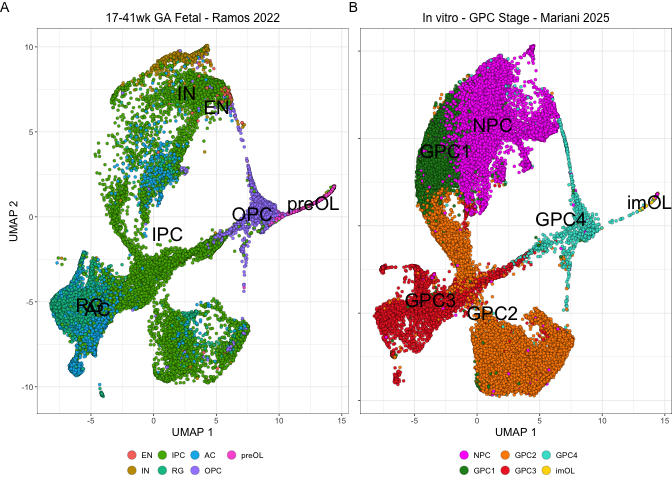
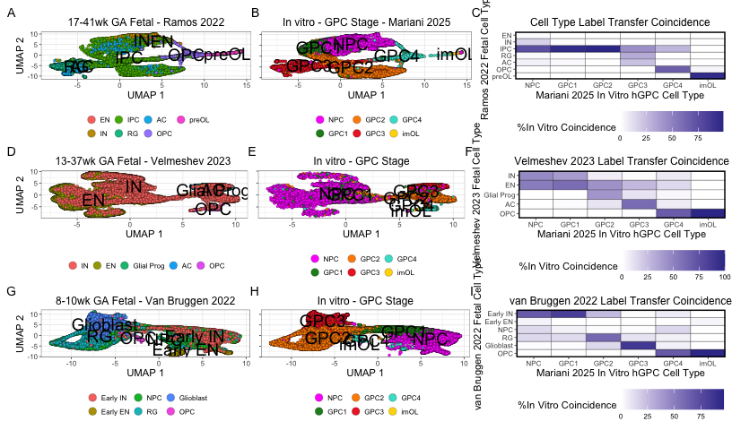

Label Transfer Figure Generation
================
John Mariani
07/30/2025

``` r
library(Seurat)
library(scPlottingTools)
library(ggplot2)
library(tidyr)
library(dplyr)
library(MAST)
library(plyr)
library(xlsx)
library(patchwork)
library(ggplot2)
library(scales)
library(ggVennDiagram)
library(data.table)
library(slingshot)
library(tradeSeq)
library(tidyr)
library(dplyr)
library(plyr)
library(magrittr)
library(viridis)
library(tidyr)
library(EnhancedVolcano)
library(ggalluvial)


source("Scripts/HelperFunctions.R")
source("Scripts/StyleSettings.R")
baseSize = 6

manuscriptPalette <- c("In Vivo" = "red2", 
                       "In Vitro - GPC Stage" = "#2E30FF",
                       "NPC" = "magenta",
                       "GPC1" = "forestgreen",
                       "GPC2" = "darkorange",
                       "GPC3" = "firebrick2",
                       "GPC4" = "turquoise",
                       "Astrocyte" = "dodgerblue2",
                       "imOL" = "gold",
                       "maOL" = "darkorchid4",
                       "GPC" = "turquoise",
                       "imAstrocyte" = "firebrick2",
                       "cGPC" = "darkorange",
                       "cAPC" = "forestgreen")
```

``` r
## Ramos
integratedRamos <- readRDS("output/RDS/integratedRamos.rds")

round((prop.table(table(integratedRamos$predicted.id, integratedRamos$cellType), margin = 2)*100),1)
```

    ##        
    ##         GPC1 GPC2 GPC3 GPC4 imOL  NPC
    ##   AC     2.6  0.3 23.4  0.8  0.0  5.3
    ##   EN     0.0  0.0  0.0  0.0  0.0  1.6
    ##   IN     0.9  0.1  0.1  2.3  0.0 16.0
    ##   IPC   95.8 99.0 44.0 27.3  0.0 74.9
    ##   OPC    0.1  0.1  0.2 67.2  3.7  0.1
    ##   preOL  0.0  0.0  0.0  2.3 96.3  0.1
    ##   RG     0.6  0.6 32.4  0.2  0.0  2.0

``` r
integratedRamos$cellType <- factor(integratedRamos$cellType, c("NPC", "GPC1", "GPC2", "GPC3", "GPC4", "imOL"))

integratedRamos$predicted.id <- factor(integratedRamos$predicted.id, rev(c("EN", "IN", "IPC", "RG", "AC", "OPC", "preOL")))

# integratedRamos$predicted.id <- factor(integratedRamos$predicted.id, rev(c("EN", "IN", "nIPC", "mIPC", "gIPC", "gIPC-A", "gIPC-O", "tRG", 'oRG', "RG/AC", "AC", "AC-p", "AC-f", "OPC", "preOL")))

integratedRamos$celltypes <- factor(integratedRamos$celltypes, levels = rev(levels(integratedRamos$predicted.id)))

hmDFRamos <- as.data.frame(round((prop.table(table(integratedRamos$predicted.id, integratedRamos$cellType), margin = 2)*100),1))

hm.ramos.gg <- ggplot(hmDFRamos, aes(x = Var2, y = Var1, fill = Freq)) + geom_tile(colour = "black") + labs(x = "Mariani 2025 In Vitro hGPC Cell Type", y = "Ramos 2022 Fetal Cell Type", title = "Cell Type Label Transfer Coincidence") + scale_fill_gradient2(low = "white") + scale_x_discrete(expand = c(0,0))  + scale_y_discrete(expand = c(0,0)) + theme_manuscript() + theme(panel.border = element_rect(colour = "black", fill=NA, linewidth=1), legend.position = "bottom") + labs(tag = "C", fill = "%In Vitro Coincidence")

dimplot.ramos.gg <- ((DimPlotCustom(subset(integratedRamos, subset = stage == "Fetal"), group.by = "celltypes", label = T,  label.size = 5) + ggtitle("17-41wk GA Fetal - Ramos 2022") + guides(fill = guide_legend(override.aes = list(size = 3)))) |
    (DimPlotCustom(subset(integratedRamos, subset = stage != "Fetal"), group.by = "cellType", label = T,  label.size = 5) + ggtitle("In vitro - GPC Stage - Mariani 2025") + scale_fill_manual(values = manuscriptPalette) + guides(fill = guide_legend(override.aes = list(size = 3))))) & theme_manuscript() & theme(legend.position = "bottom", legend.key.height = unit(0.1, "in"), legend.key.width = unit(0.01, "in")) & labs(fill = "")

dimplot.ramos.gg[[1]] <- dimplot.ramos.gg[[1]] + labs(tag = "A")
dimplot.ramos.gg[[2]] <- dimplot.ramos.gg[[2]] + labs(tag = "B") + theme(axis.title.y = element_blank(), axis.text.y = element_blank())

dimplot.ramos.gg
```

<!-- -->

``` r
## Velmeshev
integratedVelmeshev <- readRDS("output/RDS/integratedVelmeshev.rds")
integratedVelmeshev
```

    ## An object of class Seurat 
    ## 37436 features across 107533 samples within 3 assays 
    ## Active assay: integrated (2000 features, 2000 variable features)
    ##  2 layers present: data, scale.data
    ##  2 other assays present: RNA, SCT
    ##  2 dimensional reductions calculated: pca, umap

``` r
integratedVelmeshev <- subset(integratedVelmeshev, cells = row.names(integratedVelmeshev@meta.data)[row.names(integratedVelmeshev@meta.data) %not in% row.names(subset(integratedVelmeshev, subset = group == "OL")@meta.data)])
```

    ## Warning: Removing 37803 cells missing data for vars requested

``` r
integratedVelmeshev
```

    ## An object of class Seurat 
    ## 37436 features across 107527 samples within 3 assays 
    ## Active assay: integrated (2000 features, 2000 variable features)
    ##  2 layers present: data, scale.data
    ##  2 other assays present: RNA, SCT
    ##  2 dimensional reductions calculated: pca, umap

``` r
round((prop.table(table(integratedVelmeshev$predicted.id, integratedVelmeshev$cellType), margin = 2)*100),1)
```

    ##             
    ##                NPC  GPC1  GPC2  GPC3  GPC4  imOL
    ##   AC           0.1   0.8   9.5  60.4   7.0   0.0
    ##   EN          52.9  60.1  42.7  26.7  13.9   0.0
    ##   Glial Prog   0.2   0.2  41.3  10.0   2.8   0.0
    ##   IN          46.6  38.8   6.3   1.6   7.8   0.0
    ##   OPC          0.2   0.1   0.2   1.3  68.4 100.0

``` r
integratedVelmeshev$cellType <- factor(integratedVelmeshev$cellType, c("NPC", "GPC1", "GPC2", "GPC3", "GPC4", "imOL"))
integratedVelmeshev$predicted.id <- factor(integratedVelmeshev$predicted.id, rev(c("IN", "EN", "Glial Prog", "AC", "OPC")))

integratedVelmeshev$group <- factor(integratedVelmeshev$group, levels = rev(levels(integratedVelmeshev$predicted.id)))


hmDFVelm <- as.data.frame(round((prop.table(table(integratedVelmeshev$predicted.id, integratedVelmeshev$cellType), margin = 2)*100),1))

hm.Velm.gg <- ggplot(hmDFVelm, aes(x = Var2, y = Var1, fill = Freq)) + geom_tile(colour = "black") + labs(x = "Mariani 2025 In Vitro hGPC Cell Type", y = "Velmeshev 2023 Fetal Cell Type", title = "Velmeshev 2023 Label Transfer Coincidence") + scale_fill_gradient2(low = "white") + scale_x_discrete(expand = c(0,0)) + scale_y_discrete(expand = c(0,0)) + theme_manuscript() + theme(panel.border = element_rect(colour = "black", fill=NA, linewidth=1), legend.position = "bottom") + labs(tag = "F", fill = "%In Vitro Coincidence")

dimplot.velm.gg <- ((DimPlotCustom(subset(integratedVelmeshev, subset = stage == "Fetal"), group.by = "group", label = T,  label.size = 5) + ggtitle("13-37wk GA Fetal - Velmeshev 2023 ") + guides(fill = guide_legend(override.aes = list(size = 3)))) |
                    (DimPlotCustom(subset(integratedVelmeshev, subset = stage != "Fetal"), group.by = "cellType", label = T,  label.size = 5) + ggtitle("In vitro - GPC Stage") + scale_fill_manual(values = manuscriptPalette) +  guides(fill = guide_legend(override.aes = list(size = 3))))) & theme_manuscript() & theme(legend.position = "bottom", legend.key.height = unit(0.1, "in"), legend.key.width = unit(0.01, "in")) & labs(fill = "")


dimplot.velm.gg[[1]] <- dimplot.velm.gg[[1]] + labs(tag = "D")
dimplot.velm.gg[[2]] <- dimplot.velm.gg[[2]] + labs(tag = "E") + theme(axis.title.y = element_blank(), axis.text.y = element_blank())
```

``` r
## van Bruggen
integratedVanBruggen <- readRDS("output/RDS/integratedVanBruggen.rds")

round((prop.table(table(integratedVanBruggen$predicted.id, integratedVanBruggen$cellType), margin = 2)*100),1)
```

    ##            
    ##              NPC GPC1 GPC2 GPC3 GPC4 imOL
    ##   Early IN  67.4 81.5 24.9  1.5  7.3  0.0
    ##   Early EN   4.1  0.1  0.1  0.4  0.6  3.7
    ##   NPC       13.5  4.4  1.1  1.0 14.5  0.0
    ##   RG        13.8 13.1 60.2 10.3  5.3  0.0
    ##   Glioblast  1.0  0.8 13.6 85.4  5.0  0.0
    ##   OPC        0.2  0.0  0.1  1.4 67.3 96.3

``` r
integratedVanBruggen$cellType <- factor(integratedVanBruggen$cellType, c("NPC", "GPC1", "GPC2", "GPC3", "GPC4", "imOL"))

integratedVanBruggen$predicted.id <- factor(integratedVanBruggen$predicted.id , levels = c("OPC", "Glioblast", "RG", "NPC", "Early EN", "Early IN"))


integratedVanBruggen$group <- factor(integratedVanBruggen$group, levels = rev(levels(integratedVanBruggen$predicted.id)))


hmDFVB <- as.data.frame(round((prop.table(table(integratedVanBruggen$predicted.id, integratedVanBruggen$cellType), margin = 2)*100),1))

hm.vb.gg <- ggplot(hmDFVB, aes(x = Var2, y = Var1, fill = Freq)) + geom_tile(colour = "black") + labs(x = "Mariani 2025 In Vitro hGPC Cell Type", y = "van Bruggen 2022 Fetal Cell Type", title = "van Bruggen 2022 Label Transfer Coincidence") + scale_fill_gradient2(low = "white") + scale_x_discrete(expand = c(0,0)) + scale_y_discrete(expand = c(0,0)) + theme_manuscript() + theme(panel.border = element_rect(colour = "black", fill=NA, linewidth=1), legend.position = "bottom") + labs(tag = "I", fill = "%In Vitro Coincidence")

dimplot.vb.gg <- ((DimPlotCustom(subset(integratedVanBruggen, subset = stage == "Fetal"), group.by = "group", label = T, label.size = 5) + ggtitle("8-10wk GA Fetal - Van Bruggen 2022") + guides(fill = guide_legend(override.aes = list(size = 3))) |
    (DimPlotCustom(subset(integratedVanBruggen, subset = stage != "Fetal"), group.by = "cellType", label = T, label.size = 5) + ggtitle("In vitro - GPC Stage") + scale_fill_manual(values = manuscriptPalette) +  guides(fill = guide_legend(override.aes = list(size = 3)))))) & theme_manuscript()  & theme(legend.position = "bottom", legend.key.height = unit(0.1, "in"), legend.key.width = unit(0.01, "in")) & labs(fill = "")

dimplot.vb.gg[[1]] <- dimplot.vb.gg[[1]] + labs(tag = "G")
dimplot.vb.gg[[2]] <- dimplot.vb.gg[[2]] + labs(tag = "H") + theme(axis.title.y = element_blank(), axis.text.y = element_blank())
```

``` r
(dimplot.ramos.gg | hm.ramos.gg) /
  (dimplot.velm.gg | hm.Velm.gg) /
  (dimplot.vb.gg | hm.vb.gg)
```

<!-- -->

``` r
ggsave("output/Figures/LabelTransfer/LabelTransferFig.pdf", width = 8.5, height = 11, units  = "in")
```
