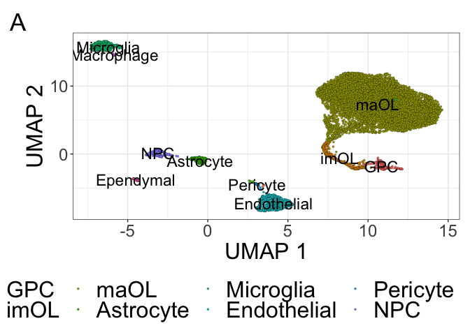

Initial Analysis of Mouse Cells
================
John Mariani
12/6/2022

``` r
library(Seurat)
library(scPlottingTools)
library(ggplot2)
library(tidyr)
library(dplyr)
library(MAST)
library(plyr)
library(xlsx)
library(patchwork)
library(ggplot2)
library(scales)
library(ggVennDiagram)
library(data.table)
library(slingshot)
library(tradeSeq)
library(tidyr)
library(dplyr)
library(plyr)
library(magrittr)
library(viridis)

`%not in%` <- function(x, table) is.na(match(x, table, nomatch = NA_integer_))


axisTitleSize <- 8
axisTextSize <- 6
labelFont = 6
titleFont = 8
tagSize = 10


# axisTitleSize <- 24
# axisTextSize <- 18
# labelFont = 18
# titleFont = 22

source("Scripts/HelperFunctions.R")

theme_manuscript <-  theme(axis.text = element_text(size = axisTextSize), 
        axis.title = element_text(size = axisTitleSize), 
        title = element_text(size = titleFont), 
        legend.title = element_text(size = titleFont),
        legend.text = element_text(size = axisTitleSize),
        plot.tag = element_text(size = tagSize))

manuscriptPalette <- c("In Vivo" = "red2", 
                       "In Vitro - GPC Stage" = "#2E30FF",
                       "NPC" = "magenta",
                       "GPC1" = "forestgreen",
                       "GPC2" = "darkorange",
                       "GPC3" = "firebrick2",
                       "GPC4" = "turquoise",
                       "Astrocyte" = "dodgerblue2",
                       "imOL" = "gold",
                       "maOL" = "darkorchid4",
                       "GPC" = "turquoise",
                       "imAstrocyte" = "firebrick2",
                       "cGPC" = "darkorange",
                       "cAPC" = "forestgreen")
```

``` r
source("Scripts/HelperFunctions.R")
```

## Load In Vivo Data and scVI data

``` r
mouse <- readRDS("output/RDS/mergedM.rds")
mouse <- NormalizeData(mouse)

mouseEmbeddings <- read.csv("output/scVI/Mouse_umapEmbeddings.csv", header = F)
names(mouseEmbeddings) <- c("UMAP_1", "UMAP_2")
row.names(mouseEmbeddings) <- Cells(mouse)
mouse[['umap']] <- CreateDimReducObject(embeddings = as.matrix(mouseEmbeddings), key = "UMAP_", assay = "RNA")

leidenClusters <- read.csv("output/scVI/Mouse_leidenClusters.csv")
mouse$leidenClusters <- factor(leidenClusters$leiden_scVI, levels = 0:max(leidenClusters$leiden_scVI))


DimPlot(mouse, reduction = "umap", group.by = "leidenClusters", label = T) + NoLegend() 
```

<!-- -->

``` r
mouse <- SetIdent(mouse, value = mouse$leidenClusters)
```

## Initial Cell Type markers for simplification

``` r
VlnPlot(mouse, c("Pdgfra", "Bcas1", "Mobp", "Gfap", "Acta2", "Cspg4", "Pdgfrb", "Aif1", "Pecam1"))
```

<!-- -->

## Assign Celltype names

``` r
mouse <- RenameIdents(mouse, c("0" = "maOL",
                          "1" = "maOL",
                          "2" = "maOL",
                          "3" = "maOL",
                          "4" = "maOL",
                          "5" = "maOL",
                          "6" = "maOL",
                          "7" = "Endothelial",
                          "8" = "maOL",
                          "9" = "maOL",
                          "10" = "maOL",
                          "11" = "maOL",
                          "12" = "maOL",
                          "13" = "Microglia",
                          "14" = "imOL",
                          "15" = "GPC",
                          "16" = "Astrocyte",
                          "17" = "NPC",
                          "18" = "Ependymal",
                          "19" = "Pericyte",
                          "20" = "Macrophage"))

DimPlot(mouse)
```

<!-- -->

``` r
otherMarkers <- c("Pf4", "Clec4n", "Dlx1", "Dcx", "Dlx2", "Gad2", "Cd163", "Cxcr4", "Mrc1", "Foxj1", "Pifo")

VlnPlot(mouse, otherMarkers)
```

<!-- -->

``` r
unique(Idents(mouse))
```

    ##  [1] maOL        GPC         Astrocyte   imOL        Microglia   Ependymal  
    ##  [7] Endothelial Pericyte    NPC         Macrophage 
    ## 10 Levels: maOL Endothelial Microglia imOL GPC Astrocyte NPC ... Macrophage

``` r
mouseLevels <- c("GPC", "imOL", "maOL", "Astrocyte", "Microglia", "Endothelial", "Pericyte", "NPC", "Macrophage", "Ependymal")

Idents(mouse) <- factor(Idents(mouse), levels = mouseLevels)

mouse$cellType <- Idents(mouse)

mouseDim <- DimPlotCustom(mouse, group.by = "cellType", label = T) + theme_bw() + theme_manuscript + theme(legend.position = "bottom") + labs(tag = "A")
mouseDim
```

<!-- -->

``` r
# allMouseMarkers <- FindAllMarkers(mouse, test.use = "MAST")
# write.table(allMouseMarkers, "output/DE/MouseMarkers.txt", sep = "\t", quote = F, row.names = F)


# This will limit which come from the next function
mouseMarkers <- c("Pdgfra", "Ptprz1", 
                  "Gpr17", "Bcas1", 
                  "Nkx6-2", "Mog",
                  "Gfap", "Aqp4",
                  "P2ry12", "Itgam",
                  "Cldn5", "Pecam1",
                  "Acta2", "Des",
                  "Dlx2", "Elavl4",
                  "Pf4", "Cd163",
                  "Tmem212", "Ccdc153")

#You can extract percent expression from this seurat function... providing features makes it way faster. $data is what you want 
mouseDotPlot <- DotPlot(mouse, features = mouseMarkers)$data

# For ordering in the plot
mouseDotPlot$id <- factor(mouseDotPlot$id , levels = rev(mouseLevels))


figMouseB <- ggplot(mouseDotPlot, aes(size = pct.exp, color = avg.exp.scaled, y = id, x = features.plot)) + 
  geom_point() + 
  scale_size_area() + 
  scale_color_viridis() + 
  theme_bw() + 
  theme_manuscript +
  theme(axis.title = element_blank(), axis.text.x = element_text(angle = 90, hjust = 1, vjust = .5), legend.position = "bottom") +
  labs(tag = "B", title = "Canonical Marker Expression", size = "% Expressed", colour = "Scaled Expression") + 
    guides(colour = guide_colorbar(title.position = "top", title.theme = element_text(size = axisTitleSize)), 
         size = guide_legend(title.position = "top", title.theme = element_text(size = axisTitleSize))) +
  scale_size(range = c(0,4))
```

    ## Scale for size is already present.
    ## Adding another scale for size, which will replace the existing scale.

``` r
figMouseB
```

<!-- -->

``` r
(mouseDim | figMouseB) + plot_layout(widths = c(1,1.5))
```

<!-- -->

``` r
#ggsave("Figures/mouseFig.pdf", width = 12, height = 6)
```

``` r
saveRDS(mouse, "output/RDS/mouse.rds")
```

``` r
sessionInfo()
```

    ## R version 4.2.3 (2023-03-15)
    ## Platform: aarch64-apple-darwin20 (64-bit)
    ## Running under: macOS Ventura 13.2.1
    ## 
    ## Matrix products: default
    ## BLAS:   /Library/Frameworks/R.framework/Versions/4.2-arm64/Resources/lib/libRblas.0.dylib
    ## LAPACK: /Library/Frameworks/R.framework/Versions/4.2-arm64/Resources/lib/libRlapack.dylib
    ## 
    ## locale:
    ## [1] en_US.UTF-8/en_US.UTF-8/en_US.UTF-8/C/en_US.UTF-8/en_US.UTF-8
    ## 
    ## attached base packages:
    ## [1] stats4    stats     graphics  grDevices utils     datasets  methods  
    ## [8] base     
    ## 
    ## other attached packages:
    ##  [1] viridis_0.6.2               viridisLite_0.4.1          
    ##  [3] magrittr_2.0.3              tradeSeq_1.12.0            
    ##  [5] slingshot_2.6.0             TrajectoryUtils_1.6.0      
    ##  [7] princurve_2.1.6             data.table_1.14.8          
    ##  [9] ggVennDiagram_1.2.2         scales_1.3.0               
    ## [11] patchwork_1.3.0.9000        xlsx_0.6.5                 
    ## [13] plyr_1.8.8                  MAST_1.24.1                
    ## [15] SingleCellExperiment_1.20.1 SummarizedExperiment_1.28.0
    ## [17] Biobase_2.58.0              GenomicRanges_1.50.2       
    ## [19] GenomeInfoDb_1.34.9         IRanges_2.32.0             
    ## [21] S4Vectors_0.36.2            BiocGenerics_0.44.0        
    ## [23] MatrixGenerics_1.10.0       matrixStats_0.63.0         
    ## [25] dplyr_1.1.1                 tidyr_1.3.0                
    ## [27] ggplot2_3.4.4               scPlottingTools_0.0.0.9000 
    ## [29] SeuratObject_4.1.3          Seurat_4.3.0               
    ## 
    ## loaded via a namespace (and not attached):
    ##   [1] igraph_2.0.3           lazyeval_0.2.2         sp_1.6-0              
    ##   [4] splines_4.2.3          BiocParallel_1.32.6    listenv_0.9.0         
    ##   [7] scattermore_0.8        digest_0.6.31          htmltools_0.5.5       
    ##  [10] fansi_1.0.4            tensor_1.5             cluster_2.1.4         
    ##  [13] ROCR_1.0-11            limma_3.54.2           globals_0.16.2        
    ##  [16] spatstat.sparse_3.0-3  RVenn_1.1.0            colorspace_2.1-0      
    ##  [19] ggrepel_0.9.3          xfun_0.38              RCurl_1.98-1.12       
    ##  [22] jsonlite_1.8.4         progressr_0.13.0       spatstat.data_3.0-4   
    ##  [25] survival_3.5-5         zoo_1.8-11             glue_1.6.2            
    ##  [28] polyclip_1.10-4        gtable_0.3.3           zlibbioc_1.44.0       
    ##  [31] XVector_0.38.0         leiden_0.4.3           DelayedArray_0.24.0   
    ##  [34] future.apply_1.10.0    abind_1.4-5            edgeR_3.40.2          
    ##  [37] DBI_1.1.3              spatstat.random_3.2-3  miniUI_0.1.1.1        
    ##  [40] Rcpp_1.0.10            xtable_1.8-4           reticulate_1.34.0     
    ##  [43] htmlwidgets_1.6.2      httr_1.4.5             RColorBrewer_1.1-3    
    ##  [46] ellipsis_0.3.2         ica_1.0-3              pkgconfig_2.0.3       
    ##  [49] rJava_1.0-6            farver_2.1.1           uwot_0.1.14           
    ##  [52] deldir_1.0-6           locfit_1.5-9.7         utf8_1.2.3            
    ##  [55] labeling_0.4.2         tidyselect_1.2.0       rlang_1.1.0           
    ##  [58] reshape2_1.4.4         later_1.3.0            munsell_0.5.0         
    ##  [61] tools_4.2.3            cli_3.6.1              generics_0.1.3        
    ##  [64] ggridges_0.5.4         evaluate_0.20          stringr_1.5.0         
    ##  [67] fastmap_1.1.1          yaml_2.3.7             goftest_1.2-3         
    ##  [70] knitr_1.42             fitdistrplus_1.1-8     purrr_1.0.1           
    ##  [73] RANN_2.6.1             pbapply_1.7-0          future_1.32.0         
    ##  [76] nlme_3.1-162           mime_0.12              ggrastr_1.0.2         
    ##  [79] compiler_4.2.3         rstudioapi_0.14        beeswarm_0.4.0        
    ##  [82] plotly_4.10.1          png_0.1-8              spatstat.utils_3.1-0  
    ##  [85] tibble_3.2.1           stringi_1.7.12         highr_0.10            
    ##  [88] lattice_0.21-8         Matrix_1.5-4           vctrs_0.6.1           
    ##  [91] pillar_1.9.0           lifecycle_1.0.3        spatstat.geom_3.2-9   
    ##  [94] lmtest_0.9-40          RcppAnnoy_0.0.20       cowplot_1.1.1         
    ##  [97] bitops_1.0-7           irlba_2.3.5.1          httpuv_1.6.9          
    ## [100] R6_2.5.1               promises_1.2.0.1       KernSmooth_2.23-20    
    ## [103] gridExtra_2.3          vipor_0.4.7            parallelly_1.35.0     
    ## [106] codetools_0.2-19       MASS_7.3-58.3          xlsxjars_0.6.1        
    ## [109] rprojroot_2.0.3        withr_2.5.0            sctransform_0.3.5     
    ## [112] GenomeInfoDbData_1.2.9 mgcv_1.8-42            parallel_4.2.3        
    ## [115] grid_4.2.3             rmarkdown_2.21         Rtsne_0.16            
    ## [118] spatstat.explore_3.2-7 shiny_1.7.4            ggbeeswarm_0.7.2
