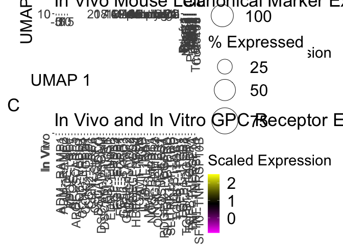

Differential NicheNet Analysis of in vivo and in vitro hGPCs
================
John Mariani
3/6/2023

## Load in Libraries

``` r
library(dplyr)
```

    ## 
    ## Attaching package: 'dplyr'

    ## The following objects are masked from 'package:stats':
    ## 
    ##     filter, lag

    ## The following objects are masked from 'package:base':
    ## 
    ##     intersect, setdiff, setequal, union

``` r
library(Seurat)
```

    ## Attaching SeuratObject

``` r
library(devtools)
```

    ## Loading required package: usethis

``` r
library(patchwork)
library(dplyr)
library(SeuratDisk)
```

    ## Registered S3 method overwritten by 'SeuratDisk':
    ##   method            from  
    ##   as.sparse.H5Group Seurat

``` r
library(biomaRt)
library(Matrix)
library(nichenetr)
library(RColorBrewer)
library(scPlottingTools)
library(data.table)
```

    ## 
    ## Attaching package: 'data.table'

    ## The following objects are masked from 'package:dplyr':
    ## 
    ##     between, first, last

``` r
options(future.globals.maxSize = 16000 * 1024^2)
```

## Read in Human and Mouse Counts

``` r
source("Scripts/HelperFunctions.r")

dualSpecies <- readRDS("output/RDS/finalNiche.rds")
```

## Read in NicheNetV2 Databases

``` r
ligand_target_matrix = readRDS("data_for_import/NicheNet/ligand_target_matrix_nsga2r_final.rds")
lr_network = readRDS("data_for_import/NicheNet/lr_network_human_21122021.rds")
lr_network = lr_network %>% mutate(bonafide = ! database %in% c("ppi_prediction","ppi_prediction_go"))
lr_network = lr_network %>% dplyr::rename(ligand = from, receptor = to) %>% distinct(ligand, receptor, bonafide)

weighted_networks = readRDS("data_for_import/NicheNet/weighted_networks_nsga2r_final.rds")
```

## Make counts to edit

``` r
dualSpecies$stage2 <- dualSpecies$stage
dualSpecies$stage2 <- gsub(x = dualSpecies$stage2, pattern = "In Vitro - GPC Stage", replacement = "In Vitro")
unique(dualSpecies$stage2)
```

    ## [1] "In Vivo"  "In Vitro"

``` r
dualSpecies$cellStage <- paste0(dualSpecies$stage2, " ", dualSpecies$cellType)
dualSpecies$cellStage <- gsub(x = dualSpecies$cellStage, pattern = "Immature Oligodendrocyte", replacement = "imOL")
dualSpecies$cellStage <- gsub(x = dualSpecies$cellStage, pattern = "Mature Oligodendrocyte", replacement = "maOL")

table(dualSpecies$cellStage)
```

    ## 
    ##        In Vitro Astrocyte             In Vitro GPC1             In Vitro GPC2 
    ##                         1                      8362                     10806 
    ##             In Vitro GPC3             In Vitro GPC4             In Vitro imOL 
    ##                      3945                       880                        27 
    ##             In Vitro maOL              In Vitro NPC         In Vivo Astrocyte 
    ##                         1                     13783                       746 
    ##              In Vivo GPC2              In Vivo GPC3              In Vivo GPC4 
    ##                        20                         6                      1848 
    ##              In Vivo imOL              In Vivo maOL   In Vivo Mouse Astrocyte 
    ##                      1713                      1003                       151 
    ## In Vivo Mouse Endothelial   In Vivo Mouse Ependymal         In Vivo Mouse GPC 
    ##                       483                        50                       152 
    ##        In Vivo Mouse imOL  In Vivo Mouse Macrophage        In Vivo Mouse maOL 
    ##                       278                        13                      6763 
    ##   In Vivo Mouse Microglia         In Vivo Mouse NPC    In Vivo Mouse Pericyte 
    ##                       321                       148                        39 
    ##               In Vivo NPC 
    ##                         1

## Showing ligand differences between in vitro cell states

``` r
ligands <- unique(lr_network$ligand)

GPC1 <- read.delim("output/DE/GPC1.vs.Rest.sig.txt")
GPC2 <- read.delim("output/DE/GPC2.vs.Rest.sig.txt")
GPC3 <- read.delim("output/DE/GPC3.vs.Rest.sig.txt")
GPC4 <- read.delim("output/DE/GPC4.vs.Rest.sig.txt")
NPC <- read.delim("output/DE/NPC.vs.Rest.sig.txt")

invitroStateMarkers <- rbind(GPC1, GPC2, GPC3, GPC4, NPC)
invitroStateLigands <- invitroStateMarkers[invitroStateMarkers$gene %in% ligands,]
invitroStateLigands <- invitroStateLigands[!duplicated(invitroStateLigands$gene),]
```

``` r
niches = list(
    "In Vivo" = list(
      "sender" = c("In Vivo Astrocyte","In Vivo imOL", "In Vivo maOL", "In Vivo Mouse Astrocyte", "In Vivo Mouse Endothelial", "In Vivo Mouse Ependymal", "In Vivo Mouse Macrophage", "In Vivo Mouse GPC", "In Vivo Mouse imOL", "In Vivo Mouse maOL", "In Vivo Mouse Microglia", "In Vivo Mouse NPC", "In Vivo Mouse Pericyte"),
      "receiver" = c("In Vivo GPC4")),
    "In Vitro" = list(
      "sender" = c("In Vitro GPC1","In Vitro GPC2", "In Vitro GPC3", "In Vitro NPC"),
      "receiver" = c("In Vitro GPC4"))
  )


Idents(dualSpecies) <- dualSpecies$cellStage

one2oneGenes <- read.csv("data_for_import/NicheNet/one2oneGenes.csv")

#DE_sender = calculate_niche_de(seurat_obj = dualSpecies %>% subset(features = lr_network$ligand %>% intersect(one2oneGenes$x)), niches = niches, type = "sender", assay_oi = "RNA") # only ligands important for sender cell types


#write.csv(DE_sender, "output/NicheNet/DE_sender.csv", quote = F, row.names = F)

DE_sender <- read.csv("output/NicheNet/DE_sender.csv")
DE_sender$sender <- gsub(x = DE_sender$sender, pattern = "Immature Oligodendrocyte", replacement = "imOL")
DE_sender$sender_other_niche <- gsub(x = DE_sender$sender_other_niche, pattern = "Immature Oligodendrocyte", replacement = "imOL")
DE_sender$sender <- gsub(x = DE_sender$sender, pattern = "Mature Oligodendrocyte", replacement = "maOL")
DE_sender$sender_other_niche <- gsub(x = DE_sender$sender_other_niche, pattern = "Mature Oligodendrocyte", replacement = "maOL")
DE_sender$sender <- gsub(x = DE_sender$sender, pattern = "Immature Oligo", replacement = "imOL")
DE_sender$sender_other_niche <- gsub(x = DE_sender$sender_other_niche, pattern = "Immature Oligo", replacement = "imOL")
DE_sender$sender <- gsub(x = DE_sender$sender, pattern = "Mature Oligo", replacement = "maOL")
DE_sender$sender_other_niche <- gsub(x = DE_sender$sender_other_niche, pattern = "Mature Oligo", replacement = "maOL")


deGPC4 <- read.delim("output/DE/Invivo.vs.Invitro.GPC4.txt")
deGPC4.sig <- read.delim("output/DE/Invivo.vs.Invitro.GPC4.sig.txt")
deGPC4 <- deGPC4[complete.cases(deGPC4),]
deGPC4 <- rbind(deGPC4, deGPC4.sig[deGPC4.sig$gene %not in% deGPC4$gene,])

#Format Prior Differential Expression for receiver cells

pct.expr <- DotPlot(dualSpecies, features = deGPC4$gene, idents = c("In Vivo GPC4", "In Vitro GPC4"), group.by = "cellStage")$data
```

    ## Warning: Scaling data with a low number of groups may produce misleading
    ## results

``` r
pct.expr.invivo <- pct.expr[pct.expr$id == "In Vivo GPC4",]
pct.expr.invitro <- pct.expr[pct.expr$id == "In Vitro GPC4",]


DE_receiver_invivo <- data.frame(gene = deGPC4$gene, p_val = deGPC4$FDR, avg_log2FC = deGPC4$logFC, pct.1 = pct.expr.invivo$pct.exp, pct.2 = pct.expr.invitro$pct.exp, p_val_adj = deGPC4$FDR, receiver = "In Vivo GPC4", receiver_other_niche = "In Vitro GPC4")

DE_receiver_invitro <- data.frame(gene = deGPC4$gene, p_val = deGPC4$FDR, avg_log2FC = (deGPC4$logFC*-1), pct.1 = pct.expr.invitro$pct.exp, pct.2 = pct.expr.invivo$pct.exp, p_val_adj = deGPC4$FDR, receiver = "In Vitro GPC4", receiver_other_niche = "In Vivo GPC4")


DE_receiver <- rbind(DE_receiver_invivo, DE_receiver_invitro)


DE_receiver_receptors <- DE_receiver[DE_receiver$gene %in% lr_network$receptor,]

#DE_receiver = calculate_niche_de(seurat_obj = dualSpecies %>% subset(features = lr_network$receptor %>% unique()), niches = niches, type = "receiver", assay_oi = "RNA") # only receptors now, later on: DE analysis to find targets

DE_sender = DE_sender %>% mutate(avg_log2FC = ifelse(avg_log2FC == Inf, max(avg_log2FC[is.finite(avg_log2FC)]), ifelse(avg_log2FC == -Inf, min(avg_log2FC[is.finite(avg_log2FC)]), avg_log2FC)))

DE_receiver_receptors = DE_receiver_receptors %>% mutate(avg_log2FC = ifelse(avg_log2FC == Inf, max(avg_log2FC[is.finite(avg_log2FC)]), ifelse(avg_log2FC == -Inf, min(avg_log2FC[is.finite(avg_log2FC)]), avg_log2FC)))
```

``` r
expression_pct = 10
DE_sender_processed = process_niche_de(DE_table = DE_sender, niches = niches, expression_pct = expression_pct, type = "sender")
DE_receiver_processed = process_niche_de(DE_table = DE_receiver_receptors, niches = niches, expression_pct = expression_pct, type = "receiver")

specificity_score_LR_pairs = "min_lfc"
DE_sender_receiver = combine_sender_receiver_de(DE_sender_processed, DE_receiver_processed, lr_network, specificity_score = specificity_score_LR_pairs)
```

``` r
lfc_cutoff = 0.25 # recommended for 10x as min_lfc cutoff. 
specificity_score_targets = "min_lfc"

#DE_receiver_targets = calculate_niche_de_targets(seurat_obj = dualSpecies, niches = niches, lfc_cutoff = lfc_cutoff, expression_pct = expression_pct, assay_oi = "RNA") 

DE_receiver_processed_targets = process_receiver_target_de(DE_receiver = DE_receiver, niches = niches, expression_pct = expression_pct, specificity_score = specificity_score_targets)
  
background = DE_receiver_processed_targets  %>% pull(target) %>% unique()

geneset_InVivo = DE_receiver_processed_targets %>% filter(receiver == niches$`In Vivo`$receiver & target_score >= lfc_cutoff & target_significant == 1 & target_present == 1) %>% pull(target) %>% unique()


geneset_Invitro = DE_receiver_processed_targets %>% filter(receiver == niches$`In Vitro`$receiver & target_score >= lfc_cutoff & target_significant == 1 & target_present == 1) %>% pull(target) %>% unique()

geneset_InVivo %>% setdiff(rownames(ligand_target_matrix))
```

    ##  [1] "ENSG00000289612" "ENSG00000288765" "MTRNR2L12"       "CEROX1"         
    ##  [5] "ENSG00000274265" "ENSG00000260664" "ENSG00000234104" "MACORIS"        
    ##  [9] "ENSG00000289503" "ENSG00000254139" "ENSG00000273015"

``` r
geneset_Invitro %>% setdiff(rownames(ligand_target_matrix))
```

    ## [1] "TMEM161B-DT"     "ENSG00000289413" "HNRNPA1P48"

``` r
top_n_target = 1000

niche_geneset_list = list(
    "In_Vivo_niche" = list(
      "receiver" = "In Vivo GPC4",
      "geneset" = geneset_InVivo,
      "background" = background),
    "In_Vitro_niche" = list(
      "receiver" = "In Vitro GPC4",
      "geneset" = geneset_Invitro ,
      "background" = background))

ligand_activities_targets = get_ligand_activities_targets(niche_geneset_list = niche_geneset_list, ligand_target_matrix = ligand_target_matrix, top_n_target = top_n_target)
```

    ## [1] "Calculate Ligand activities for: In Vivo GPC4"

    ## Warning in evaluate_target_prediction(setting, ligand_target_matrix,
    ## ligands_position): all target gene probability score predictions have same
    ## value

    ## Warning in cor(prediction, response): the standard deviation is zero

    ## Warning in cor(prediction, response, method = "s"): the standard deviation is
    ## zero

    ## [1] "Calculate Ligand activities for: In Vitro GPC4"

    ## Warning in evaluate_target_prediction(setting, ligand_target_matrix,
    ## ligands_position): all target gene probability score predictions have same
    ## value

    ## Warning in cor(prediction, response): the standard deviation is zero

    ## Warning in cor(prediction, response, method = "s"): the standard deviation is
    ## zero

``` r
write.table(ligand_activities_targets, "output/NicheNet/ligand_activities_targets.txt", sep = "\t", row.names = F, quote = F)
```

``` r
features_oi = union(lr_network$ligand, lr_network$receptor) %>% union(ligand_activities_targets$target) %>% setdiff(NA)
  
dotplot = suppressWarnings(Seurat::DotPlot(dualSpecies %>% subset(idents = niches %>% unlist() %>% unique()), features = features_oi, assay = "RNA"))

exprs_tbl = dotplot$data %>% as_tibble()
exprs_tbl = exprs_tbl %>% dplyr::rename(celltype = id, gene = features.plot, expression = avg.exp, expression_scaled = avg.exp.scaled, fraction = pct.exp) %>%
    mutate(fraction = fraction/100) %>% as_tibble() %>% dplyr::select(celltype, gene, expression, expression_scaled, fraction) %>% distinct() %>% arrange(gene) %>% mutate(gene = as.character(gene))
  
exprs_tbl_ligand = exprs_tbl %>% filter(gene %in% lr_network$ligand) %>% dplyr::rename(sender = celltype, ligand = gene, ligand_expression = expression, ligand_expression_scaled = expression_scaled, ligand_fraction = fraction) 

exprs_tbl_receptor = exprs_tbl %>% filter(gene %in% lr_network$receptor) %>% dplyr::rename(receiver = celltype, receptor = gene, receptor_expression = expression, receptor_expression_scaled = expression_scaled, receptor_fraction = fraction)

exprs_tbl_target = exprs_tbl %>% filter(gene %in% ligand_activities_targets$target) %>% dplyr::rename(receiver = celltype, target = gene, target_expression = expression, target_expression_scaled = expression_scaled, target_fraction = fraction)

exprs_tbl_ligand = exprs_tbl_ligand %>%  mutate(scaled_ligand_expression_scaled = scale_quantile_adapted(ligand_expression_scaled)) %>% mutate(ligand_fraction_adapted = ligand_fraction) %>% mutate_cond(ligand_fraction >= expression_pct, ligand_fraction_adapted = expression_pct)  %>% mutate(scaled_ligand_fraction_adapted = scale_quantile_adapted(ligand_fraction_adapted))

exprs_tbl_receptor = exprs_tbl_receptor %>% mutate(scaled_receptor_expression_scaled = scale_quantile_adapted(receptor_expression_scaled))  %>% mutate(receptor_fraction_adapted = receptor_fraction) %>% mutate_cond(receptor_fraction >= expression_pct, receptor_fraction_adapted = expression_pct)  %>% mutate(scaled_receptor_fraction_adapted = scale_quantile_adapted(receptor_fraction_adapted))
```

``` r
exprs_sender_receiver = lr_network %>% 
  inner_join(exprs_tbl_ligand, by = c("ligand")) %>% 
  inner_join(exprs_tbl_receptor, by = c("receptor")) %>% inner_join(DE_sender_receiver %>% distinct(niche, sender, receiver))
```

    ## Warning in inner_join(., exprs_tbl_ligand, by = c("ligand")): Detected an unexpected many-to-many relationship between `x` and `y`.
    ## ℹ Row 1 of `x` matches multiple rows in `y`.
    ## ℹ Row 1 of `y` matches multiple rows in `x`.
    ## ℹ If a many-to-many relationship is expected, set `relationship =
    ##   "many-to-many"` to silence this warning.

    ## Warning in inner_join(., exprs_tbl_receptor, by = c("receptor")): Detected an unexpected many-to-many relationship between `x` and `y`.
    ## ℹ Row 1 of `x` matches multiple rows in `y`.
    ## ℹ Row 3003 of `y` matches multiple rows in `x`.
    ## ℹ If a many-to-many relationship is expected, set `relationship =
    ##   "many-to-many"` to silence this warning.

    ## Joining with `by = join_by(sender, receiver)`

``` r
ligand_scaled_receptor_expression_fraction_df = exprs_sender_receiver %>% group_by(ligand, receiver) %>% mutate(rank_receptor_expression = dense_rank(receptor_expression), rank_receptor_fraction  = dense_rank(receptor_fraction)) %>% mutate(ligand_scaled_receptor_expression_fraction = 0.5*( (rank_receptor_fraction / max(rank_receptor_fraction)) + ((rank_receptor_expression / max(rank_receptor_expression))) ) )  %>% distinct(ligand, receptor, receiver, ligand_scaled_receptor_expression_fraction, bonafide) %>% distinct() %>% ungroup() 

# No Spatial info
spatial_info = tibble(celltype_region_oi = NA, celltype_other_region = NA) %>% mutate(niche =  niches %>% names() %>% head(1), celltype_type = "sender")
```

## No Spaital info

``` r
include_spatial_info_sender = F # if not spatial info to include: put this to false 
include_spatial_info_receiver = FALSE # if spatial info to include: put this to true 


if(include_spatial_info_sender == FALSE & include_spatial_info_receiver == FALSE){
    spatial_info = tibble(celltype_region_oi = NA, celltype_other_region = NA) %>% mutate(niche =  niches %>% names() %>% head(1), celltype_type = "sender")
} 


if(include_spatial_info_sender == TRUE){
  sender_spatial_DE = calculate_spatial_DE(seurat_obj = seurat_obj %>% subset(features = lr_network$ligand %>% unique()), spatial_info = spatial_info %>% filter(celltype_type == "sender"), assay_oi = assay_oi)
  sender_spatial_DE_processed = process_spatial_de(DE_table = sender_spatial_DE, type = "sender", lr_network = lr_network, expression_pct = expression_pct, specificity_score = specificity_score_spatial)

  # add a neutral spatial score for sender celltypes in which the spatial is not known / not of importance
  sender_spatial_DE_others = get_non_spatial_de(niches = niches, spatial_info = spatial_info, type = "sender", lr_network = lr_network)
  sender_spatial_DE_processed = sender_spatial_DE_processed %>% bind_rows(sender_spatial_DE_others)

  sender_spatial_DE_processed = sender_spatial_DE_processed %>% mutate(scaled_ligand_score_spatial = scale_quantile_adapted(ligand_score_spatial))

} else {
  # # add a neutral spatial score for all sender celltypes (for none of them, spatial is relevant in this case)
  sender_spatial_DE_processed = get_non_spatial_de(niches = niches, spatial_info = spatial_info, type = "sender", lr_network = lr_network)
  sender_spatial_DE_processed = sender_spatial_DE_processed %>% mutate(scaled_ligand_score_spatial = scale_quantile_adapted(ligand_score_spatial))  

}

if(include_spatial_info_receiver == TRUE){
  receiver_spatial_DE = calculate_spatial_DE(seurat_obj = seurat_obj %>% subset(features = lr_network$receptor %>% unique()), spatial_info = spatial_info %>% filter(celltype_type == "receiver"), assay_oi = assay_oi)
  receiver_spatial_DE_processed = process_spatial_de(DE_table = receiver_spatial_DE, type = "receiver", lr_network = lr_network, expression_pct = expression_pct, specificity_score = specificity_score_spatial)

  # add a neutral spatial score for receiver celltypes in which the spatial is not known / not of importance
  receiver_spatial_DE_others = get_non_spatial_de(niches = niches, spatial_info = spatial_info, type = "receiver", lr_network = lr_network)
  receiver_spatial_DE_processed = receiver_spatial_DE_processed %>% bind_rows(receiver_spatial_DE_others)

  receiver_spatial_DE_processed = receiver_spatial_DE_processed %>% mutate(scaled_receptor_score_spatial = scale_quantile_adapted(receptor_score_spatial))

} else {
    # # add a neutral spatial score for all receiver celltypes (for none of them, spatial is relevant in this case)
  receiver_spatial_DE_processed = get_non_spatial_de(niches = niches, spatial_info = spatial_info, type = "receiver", lr_network = lr_network)
  receiver_spatial_DE_processed = receiver_spatial_DE_processed %>% mutate(scaled_receptor_score_spatial = scale_quantile_adapted(receptor_score_spatial))
}
```

``` r
prioritizing_weights = c("scaled_ligand_score" = 5,
                         "scaled_ligand_expression_scaled" = 1,
                         "ligand_fraction" = 1,
                         "scaled_ligand_score_spatial" = 0, 
                         "scaled_receptor_score" = 0.5,
                         "scaled_receptor_expression_scaled" = 0.5,
                          "receptor_fraction" = 1, 
                         "ligand_scaled_receptor_expression_fraction" = 1,
                         "scaled_receptor_score_spatial" = 0,
                         "scaled_activity" = 0,
                         "scaled_activity_normalized" = 1,
                         "bona_fide" = 1)


output = list(DE_sender_receiver = DE_sender_receiver, ligand_scaled_receptor_expression_fraction_df = ligand_scaled_receptor_expression_fraction_df, sender_spatial_DE_processed = sender_spatial_DE_processed, receiver_spatial_DE_processed = receiver_spatial_DE_processed,
         ligand_activities_targets = ligand_activities_targets, DE_receiver_processed_targets = DE_receiver_processed_targets, exprs_tbl_ligand = exprs_tbl_ligand,  exprs_tbl_receptor = exprs_tbl_receptor, exprs_tbl_target = exprs_tbl_target)

prioritization_tables = get_prioritization_tables(output, prioritizing_weights)

prioritization_tables$prioritization_tbl_ligand_receptor %>% filter(receiver == niches[[1]]$receiver) %>% head(10)
```

    ## # A tibble: 10 × 37
    ##    niche   receiver sender ligand_receptor ligand receptor bonafide ligand_score
    ##    <chr>   <chr>    <chr>  <chr>           <chr>  <chr>    <lgl>           <dbl>
    ##  1 In Vivo In Vivo… In Vi… APOE--LRP1      APOE   LRP1     TRUE             2.36
    ##  2 In Vivo In Vivo… In Vi… C1QB--LRP1      C1QB   LRP1     TRUE             2.26
    ##  3 In Vivo In Vivo… In Vi… C1QB--LRP1      C1QB   LRP1     TRUE             2.25
    ##  4 In Vivo In Vivo… In Vi… APOE--APP       APOE   APP      TRUE             2.36
    ##  5 In Vivo In Vivo… In Vi… APOE--LRP1      APOE   LRP1     TRUE             2.15
    ##  6 In Vivo In Vivo… In Vi… CNTN1--PTPRZ1   CNTN1  PTPRZ1   TRUE             1.53
    ##  7 In Vivo In Vivo… In Vi… NFASC--CNTN1    NFASC  CNTN1    TRUE             1.70
    ##  8 In Vivo In Vivo… In Vi… KCNA1--CNTN1    KCNA1  CNTN1    TRUE             1.66
    ##  9 In Vivo In Vivo… In Vi… APOE--LRP1      APOE   LRP1     TRUE             1.93
    ## 10 In Vivo In Vivo… In Vi… ENG--ITGAV      ENG    ITGAV    TRUE             1.73
    ## # ℹ 29 more variables: ligand_significant <dbl>, ligand_present <dbl>,
    ## #   ligand_expression <dbl>, ligand_expression_scaled <dbl>,
    ## #   ligand_fraction <dbl>, ligand_score_spatial <dbl>, receptor_score <dbl>,
    ## #   receptor_significant <dbl>, receptor_present <dbl>,
    ## #   receptor_expression <dbl>, receptor_expression_scaled <dbl>,
    ## #   receptor_fraction <dbl>, receptor_score_spatial <dbl>,
    ## #   ligand_scaled_receptor_expression_fraction <dbl>, …

``` r
prioritization_tables$prioritization_tbl_ligand_receptor %>% filter(receiver == niches[[2]]$receiver) %>% head(10)
```

    ## # A tibble: 10 × 37
    ##    niche   receiver sender ligand_receptor ligand receptor bonafide ligand_score
    ##    <chr>   <chr>    <chr>  <chr>           <chr>  <chr>    <lgl>           <dbl>
    ##  1 In Vit… In Vitr… In Vi… CDH2--CDH2      CDH2   CDH2     TRUE           0.551 
    ##  2 In Vit… In Vitr… In Vi… CDH2--CDH2      CDH2   CDH2     TRUE           0.534 
    ##  3 In Vit… In Vitr… In Vi… FBLN1--ITGB1    FBLN1  ITGB1    TRUE           0.492 
    ##  4 In Vit… In Vitr… In Vi… CDH2--CDH2      CDH2   CDH2     TRUE           0.421 
    ##  5 In Vit… In Vitr… In Vi… SYT1--STX1A     SYT1   STX1A    TRUE           0.956 
    ##  6 In Vit… In Vitr… In Vi… NRXN3--NLGN2    NRXN3  NLGN2    TRUE           0.288 
    ##  7 In Vit… In Vitr… In Vi… NRXN3--NLGN2    NRXN3  NLGN2    TRUE           0.287 
    ##  8 In Vit… In Vitr… In Vi… CDH2--CDH2      CDH2   CDH2     TRUE           0.378 
    ##  9 In Vit… In Vitr… In Vi… ROBO1--NCAM1    ROBO1  NCAM1    TRUE           0.350 
    ## 10 In Vit… In Vitr… In Vi… TNC--PTPRZ1     TNC    PTPRZ1   TRUE           0.0130
    ## # ℹ 29 more variables: ligand_significant <dbl>, ligand_present <dbl>,
    ## #   ligand_expression <dbl>, ligand_expression_scaled <dbl>,
    ## #   ligand_fraction <dbl>, ligand_score_spatial <dbl>, receptor_score <dbl>,
    ## #   receptor_significant <dbl>, receptor_present <dbl>,
    ## #   receptor_expression <dbl>, receptor_expression_scaled <dbl>,
    ## #   receptor_fraction <dbl>, receptor_score_spatial <dbl>,
    ## #   ligand_scaled_receptor_expression_fraction <dbl>, …

``` r
prioritization_tables$prioritization_tbl_ligand_receptor = prioritization_tables$prioritization_tbl_ligand_receptor %>% mutate(receiver = factor(receiver, levels = c("In Vivo GPC4", "In Vitro GPC4")), niche = factor(niche, levels = c("In Vivo","In Vitro"))) 

prioritization_tables$prioritization_tbl_ligand_target = prioritization_tables$prioritization_tbl_ligand_target %>% mutate(receiver = factor(receiver, levels = c("In Vivo GPC4", "In Vitro GPC4")), niche = factor(niche, levels = c("In Vivo", "In Vitro"))) 
```

## Ligand Activities for picking targets

``` r
ligandActivities <- ligand_activities_targets[!duplicated(ligand_activities_targets[c("ligand", "receiver")]),]
ligandActivities <- ligandActivities[,-c(4:5)]

ligandActivitiesInVivo <- ligandActivities[ligandActivities$receiver == "In Vivo GPC4",]
ligandActivitiesInVitro <- ligandActivities[ligandActivities$receiver == "In Vitro GPC4",]

ligandActivitiesInVivo <- ligandActivitiesInVivo[,-4]
ligandActivitiesInVitro <- ligandActivitiesInVitro[,-4]


names(ligandActivitiesInVivo)[2:6] <- paste(names(ligandActivitiesInVivo)[2:6], "InVivo", sep = "_")
names(ligandActivitiesInVitro)[2:6] <- paste(names(ligandActivitiesInVitro)[2:6], "InVitro", sep = "_")

ligandActivities <- merge(ligandActivitiesInVivo, ligandActivitiesInVitro, by.x = 1, by.y = 1)
ligandActivities <- ligandActivities[,c(1,2,7,3,8,4,9,5,10,6,11)]

ligandActivities$activity_normalized_diff <- ligandActivities$activity_normalized_InVivo - ligandActivities$activity_normalized_InVitro
ligandActivities$activity_normalized_div <- ligandActivities$activity_normalized_InVivo / ligandActivities$activity_normalized_InVitro


# ligandActivities$aupr_corrected_diff <- ligandActivities$aupr_corrected_InVivo - ligandActivities$aupr_corrected_InVitro
# ligandActivities$aupr_corrected_div <- ligandActivities$aupr_corrected_InVivo / ligandActivities$aupr_corrected_InVitro
# 
# ligandActivities$activity_diff <- ligandActivities$activity_InVivo - ligandActivities$activity_InVitro
# ligandActivities$activity_div <- ligandActivities$activity_InVivo / ligandActivities$activity_InVitro
# 
# 
# ligandActivities$scaled_activity_normalized_diff <- ligandActivities$scaled_activity_normalized_InVivo - ligandActivities$scaled_activity_normalized_InVitro
# ligandActivities$scaled_activity_normalized_div <- ligandActivities$scaled_activity_normalized_InVivo / ligandActivities$scaled_activity_normalized_InVitro

ligandActivities <- ligandActivities[order(ligandActivities$activity_normalized_diff, decreasing = T),]

pri <- prioritization_tables$prioritization_tbl_ligand_receptor

priInvivo <- pri[pri$niche == "In Vivo",]
priInvivo <- priInvivo[priInvivo$receptor_fraction > .1,]
priInvivo <- priInvivo[priInvivo$ligand %in% ligandActivities[ligandActivities$activity_normalized_diff > 0.6,]$ligand,]
priInvivo <- priInvivo[order(priInvivo$ligand_score, decreasing = T),]
#priInvivo <- priInvivo[priInvivo$receptor %in% deGPC4[deGPC4$logFC > 0,]$gene,] 

ligandActivitiesInvivoReceptor <- ligandActivities[ligandActivities$ligand %in% priInvivo$ligand,]
ligandActivitiesInvivoReceptor <- ligandActivitiesInvivoReceptor[ligandActivitiesInvivoReceptor$activity_normalized_diff > 0.6,]

# Differentially regulated in vitro ligands
ligandActivitiesInvivoReceptor[ligandActivitiesInvivoReceptor$ligand %in% invitroStateLigands$gene,]
```

    ##      ligand aupr_corrected_InVivo aupr_corrected_InVitro activity_InVivo
    ## 1023 SEMA3C            0.04544155             0.01164130       0.1175706
    ## 127   CALM3            0.05341479             0.01215580       0.1224240
    ## 446   FGF12            0.05400186             0.01149026       0.1255259
    ## 70     APOE            0.05454002             0.01380014       0.1146489
    ## 812   NCAM1            0.05831345             0.01759823       0.1389965
    ## 81      B2M            0.05218638             0.01211276       0.1083946
    ## 787   MMP16            0.05350660             0.01241690       0.1258202
    ## 1013   SDC2            0.05107312             0.01453334       0.1230435
    ##      activity_InVitro activity_normalized_InVivo activity_normalized_InVitro
    ## 1023       0.04372115                  0.4766563                 -0.41661049
    ## 127        0.04717234                  0.6724539                 -0.20790640
    ## 446        0.04944298                  0.7975927                 -0.07059425
    ## 70         0.04364842                  0.3587884                 -0.42100864
    ## 812        0.05991294                  1.3410300                  0.56255570
    ## 81         0.04003790                  0.1064761                 -0.63934785
    ## 787        0.05196008                  0.8094660                  0.08162240
    ## 1013       0.05181208                  0.6974465                  0.07267237
    ##      scaled_activity_normalized_InVivo scaled_activity_normalized_InVitro
    ## 1023                         0.7226813                          0.5933509
    ## 127                          0.7510296                          0.6235679
    ## 446                          0.7691476                          0.6434484
    ## 70                           0.7056160                          0.5927141
    ## 812                          0.8478285                          0.7351181
    ## 81                           0.6690853                          0.5611022
    ## 787                          0.7708667                          0.6654869
    ## 1013                         0.7546481                          0.6641911
    ##      scaled_activity_InVivo scaled_activity_InVitro activity_normalized_diff
    ## 1023              0.8466208               0.4053008                0.8932668
    ## 127               0.8756243               0.4259250                0.8803603
    ## 446               0.8941611               0.4394941                0.8681869
    ## 70                0.8291610               0.4048662                0.7797970
    ## 812               0.9746606               0.5020620                0.7784743
    ## 81                0.7917859               0.3832899                0.7458239
    ## 787               0.8959199               0.4545362                0.7278437
    ## 1013              0.8793265               0.4536518                0.6247741
    ##      activity_normalized_div
    ## 1023              -1.1441294
    ## 127               -3.2344067
    ## 446              -11.2982667
    ## 70                -0.8522114
    ## 812                2.3838172
    ## 81                -0.1665386
    ## 787                9.9172050
    ## 1013               9.5971347

## Ligand Activity and Expression for plots

``` r
plotting_tbl <- exprs_tbl

plotting_tbl$stage <- ifelse(grepl("Vivo",plotting_tbl$celltype),"In Vivo","In Vitro")
plotting_tbl$species <- ifelse(grepl("Mouse",plotting_tbl$celltype),"Mouse","Human")
plotting_tbl$ct <- gsub(pattern = "In Vitro ", replacement = "", plotting_tbl$celltype)
plotting_tbl$ct <- gsub(pattern = "In Vivo ", replacement = "", plotting_tbl$ct)
plotting_tbl$ct <- gsub(pattern = "Mouse ", replacement = "", plotting_tbl$ct)
unique(plotting_tbl$ct)
```

    ##  [1] "imOL"        "maOL"        "Astrocyte"   "GPC1"        "GPC2"       
    ##  [6] "NPC"         "GPC3"        "GPC"         "Microglia"   "Ependymal"  
    ## [11] "Endothelial" "Pericyte"    "Macrophage"  "GPC4"

``` r
temp <- unique(plotting_tbl$ct)
temp
```

    ##  [1] "imOL"        "maOL"        "Astrocyte"   "GPC1"        "GPC2"       
    ##  [6] "NPC"         "GPC3"        "GPC"         "Microglia"   "Ependymal"  
    ## [11] "Endothelial" "Pericyte"    "Macrophage"  "GPC4"

``` r
names(temp) <- c("imOL", "maOL", "Astrocyte", "GPC1", "GPC2", "NPC", "GPC3", "GPC", "Microglia", "Ependymal", "Endothelial", "Pericyte", "Macrophage", "GPC4")

temp
```

    ##          imOL          maOL     Astrocyte          GPC1          GPC2 
    ##        "imOL"        "maOL"   "Astrocyte"        "GPC1"        "GPC2" 
    ##           NPC          GPC3           GPC     Microglia     Ependymal 
    ##         "NPC"        "GPC3"         "GPC"   "Microglia"   "Ependymal" 
    ##   Endothelial      Pericyte    Macrophage          GPC4 
    ## "Endothelial"    "Pericyte"  "Macrophage"        "GPC4"

``` r
plotting_tbl$ctRenamed <- plyr::mapvalues(plotting_tbl$ct, from = temp, to = names(temp))

unique(plotting_tbl$ctRenamed)
```

    ##  [1] "imOL"        "maOL"        "Astrocyte"   "GPC1"        "GPC2"       
    ##  [6] "NPC"         "GPC3"        "GPC"         "Microglia"   "Ependymal"  
    ## [11] "Endothelial" "Pericyte"    "Macrophage"  "GPC4"

``` r
plotting_tbl$ctRenamed <- factor(plotting_tbl$ctRenamed, levels = c("GPC1", "GPC2", "GPC3", "GPC4", "GPC", "imOL", "maOL", "Astrocyte", "Microglia", "Macrophage", "NPC", "Ependymal", "Endothelial", "Pericyte"))

write.table(plotting_tbl, "output/NicheNet/plotting_tbl.txt", row.names = F, quote = F, sep = "\t")

ligandsCurated <- c("PDGFA", "OSM", "IL1A", "CSF1", "EGF", "TNF", "EBI3", "IL1B", "NOG", "SLITRK1", "TNFSF10", "GHRH", "TGFB1", "GAS6", "ICAM1", "EDN1", "CCN2", "DSCAM", "MMP13", "ADM", "APOE", "OCLN", "HBEGF", "FGF1")

#ligandsCurated <- ligandActivitiesInvivoReceptor$ligand[81:95]


# ligandsActivity <- c("SLITRK1", "PDGFA", "OSM", "LRRC4", "IL1A", "IFNK", "EGF", "EBI3", "CSF1", "CMTM8", "CLCF1",
#                      "TNFSF10", "TNF", "NOG", "GAS6", "DSCAM", "DKK3", "BDNF")
# 
# ligandsScore <- c("APOE", "CCN2", "DKK3", "EBI3", "GAS6", "ICAM1", "IL1A", "OCLN", "OSM", "PDGFA", "PGF", "TNFSF10", "FGF1",)
# 
# ligandsCurated <- unique(c(ligandsActivity, ligandsScore))
```

``` r
ligandOrder <- rev(ligandActivities[ligandActivities$ligand %in% ligandsCurated,]$ligand)
ligandPlot <- plotting_tbl[plotting_tbl$gene %in% ligandsCurated,]
ligandPlot$gene <- factor(ligandPlot$gene, levels = ligandOrder)

activityPlot <- ligandActivities[ligandActivities$ligand %in% ligandsCurated,]
activityPlot$ligand <- factor(activityPlot$ligand, levels = ligandOrder)
```

## Ligand Activity and Expression plot

``` r
ligandActivityGG <- ggplot(activityPlot, aes(x = "In Vivo", y = ligand, fill = scale(activity_normalized_diff))) + 
  geom_tile(colour = "black") + 
  viridis::scale_fill_viridis(option = "D", expand = c(0,0)) + 
  scale_x_discrete(expand = c(0,0)) +
  scale_y_discrete(expand = c(0,0)) +
  theme_bw() +
  theme_manuscript + 
  theme(axis.title = element_blank(), legend.title = element_blank(), legend.position = "left", axis.text.y = element_blank()) +
  labs(title = "Ligand Activity", tag = "C")
  

ligandExpressionGG <- ggplot(ligandPlot, aes(x = ctRenamed, y = gene, colour = expression_scaled, size = ifelse(fraction==0, NA, fraction))) + 
  geom_point() + 
  viridis::scale_color_viridis(option = "D") + 
  facet_grid(rows = ~species + stage, scales = "free", space = "free") + 
  theme_bw() +
  theme_manuscript + 
  theme(axis.text.x = element_text(angle = 90, hjust = 1, vjust = .5), legend.position = "bottom", axis.title = element_blank(), legend.title = element_blank()) +
  scale_size(range = c(0,4)) +
  labs(title = "Ligand Expression", tag = "D")


(ligandActivityGG | ligandExpressionGG) + plot_layout(widths = c(.5,10))
```

    ## Warning: Removed 128 rows containing missing values (`geom_point()`).

<!-- -->

## Circos

``` r
curatedCircos <- c("PDGFA", "IL1A", "OSM", "EBI3", "TGFB1", "TNF", "MMP13", "GAS6", "HBEGF", "ICAM1", "IL1B", "APOE", "EGF", "CSF1", "NOG", "ADM", "TNFSF10", "OCLN", "EDN1", "ADM")

curatedCircos <- c("PDGFA", "OSM", "IL1A", "EBI3", "EGF", "CSF1", "TGFB1", "TNF", "ICAM1", "OCLN")

tempPri <- prioritization_tables$prioritization_tbl_ligand_receptor
tempPri <- tempPri[tempPri$sender %not in% c("In Vivo Mouse NPC", "In Vivo imOL", "In Vivo maOL", "In Vivo Mouse GPC", "In Vivo Mouse Ependymal", "In Vivo Astrocyte"),]

tempPri <- tempPri[tempPri$niche == "In Vivo",]
tempPri <- tempPri[tempPri$receptor_fraction > .1,]


top_ligand_receptor_niche_df = tempPri %>% dplyr::select(niche, sender, receiver, ligand, receptor, prioritization_score) %>% group_by(ligand, receptor) %>% top_n(1, prioritization_score) %>% ungroup() %>% dplyr::select(ligand, receptor, niche) 


prioritized_tbl_oi = tempPri %>% dplyr::filter(ligand %in% curatedCircos) %>% dplyr::select(niche, sender, receiver, ligand,  receptor, ligand_receptor, prioritization_score) %>% distinct() %>% inner_join(top_ligand_receptor_niche_df) %>% group_by(ligand) %>% dplyr::filter(receiver == "In Vivo GPC4") %>% top_n(2, prioritization_score) %>% ungroup() 
```

    ## Joining with `by = join_by(niche, ligand, receptor)`

``` r
unique(prioritized_tbl_oi$sender)
```

    ## [1] "In Vivo Mouse Microglia"   "In Vivo Mouse imOL"       
    ## [3] "In Vivo Mouse Macrophage"  "In Vivo Mouse Pericyte"   
    ## [5] "In Vivo Mouse Endothelial" "In Vivo Mouse Astrocyte"  
    ## [7] "In Vivo Mouse maOL"

``` r
colors_sender <- c("#00BF7D","#D89000", "#E76BF3", "#00B0F6", "#00BFC4", "#39B600", "#A3A500")
names(colors_sender) <- unique(prioritized_tbl_oi$sender)

colors_receiver <- "turquoise"
names(colors_receiver) <- unique(prioritized_tbl_oi$receiver)


circos_output = make_circos_lr(prioritized_tbl_oi, colors_sender, colors_receiver)
```

    ## Joining with `by = join_by(sender)`
    ## Joining with `by = join_by(receiver)`
    ## Joining with `by = join_by(receptor)`

<!-- --><!-- -->

``` r
unique(prioritized_tbl_oi$sender)
```

    ## [1] "In Vivo Mouse Microglia"   "In Vivo Mouse imOL"       
    ## [3] "In Vivo Mouse Macrophage"  "In Vivo Mouse Pericyte"   
    ## [5] "In Vivo Mouse Endothelial" "In Vivo Mouse Astrocyte"  
    ## [7] "In Vivo Mouse maOL"

``` r
circos_output = make_circos_lr(prioritized_tbl_oi, colors_sender, colors_receiver)
```

    ## Joining with `by = join_by(sender)`
    ## Joining with `by = join_by(receiver)`
    ## Joining with `by = join_by(receptor)`

<!-- --><!-- -->
\## Receptors for Supp Table

``` r
receptorSup <- pri
receptorSup <- receptorSup[,c(2,5,6,18,20)]
receptorSup <- receptorSup[!duplicated(receptorSup),]
receptorSup <- receptorSup[order(receptorSup$receptor, receptorSup$ligand),]

write.table(receptorSup, "output/NicheNet/receptorSuppTable.txt", quote = F, row.names = F, sep = "\t")
```

## Receptor Expression for plotting

``` r
##
tempDF <- pri[pri$ligand %in% ligandsCurated,]
length(unique(tempDF$receptor))
```

    ## [1] 51

``` r
tempDF <- tempDF[,c(1, 4:6, 18:20)]
tempDF <- tempDF[!duplicated(tempDF),]
unique(tempDF$receptor)
```

    ##  [1] "LRP1"      "APP"       "LRP5"      "PDGFRA"    "SCARB1"    "MSN"      
    ##  [7] "VLDLR"     "IL1RAP"    "LRP8"      "SORL1"     "TNFRSF21"  "EGFR"     
    ## [13] "ITGAV"     "LDLR"      "EZR"       "ITGB8"     "CD82"      "TYRO3"    
    ## [19] "LRP6"      "TNFRSF1A"  "ERBB4"     "DSCAM"     "ITGB1"     "TGFBR1"   
    ## [25] "TRAF2"     "FGFR1"     "DCC"       "IL6ST"     "OCLN"      "CD9"      
    ## [31] "EDNRB"     "IGF2R"     "FURIN"     "PTPRK"     "SDC2"      "ECE1"     
    ## [37] "RAMP1"     "CALCRL"    "PTPRS"     "BMPR2"     "LIFR"      "TNFRSF10B"
    ## [43] "RAMP2"     "SIRPA"     "PTPRD"     "ERBB2"     "CD44"      "ERBB3"    
    ## [49] "BMPR1A"    "F12"       "ADCYAP1R1"

``` r
tempDF <- tempDF[tempDF$receptor %in% priInvivo$receptor,]

tempDF$niche <- factor(tempDF$niche, levels = c("In Vivo", "In Vitro"))


#activityPlot <- activityPlot[activityPlot$ligand %not in% ligandRemove,]
#ligandPlot <- ligandPlot[ligandPlot$gene %not in% ligandRemove,]

tempDF$ligand_receptor <- factor(tempDF$ligand_receptor, levels = unique(tempDF[order(tempDF$ligand, tempDF$receptor),]$ligand_receptor))

tempDF$receptor_fraction <- tempDF$receptor_fraction * 100
```

## Receptor Plot

``` r
receptorGG <- ggplot(tempDF, aes(y = niche, x = ligand_receptor, fill = receptor_expression_scaled, size = ifelse(receptor_fraction==0, NA, receptor_fraction))) + 
  geom_point(color = "black", pch = 21) + 
  theme_bw() +
  theme_manuscript + 
  scale_fill_gradientn(colors = PurpleAndYellow()) + 
  theme(legend.position = "right", panel.spacing=unit(0, "lines"), axis.title = element_blank(), axis.text = element_text(angle = 90, hjust = 1)) + 
  scale_size(range = c(0,20)) +
  labs(tag = "C", title = "In Vivo and In Vitro GPC Receptor Expression of Curated Ligands", size = "% Expressed", fill = "Scaled Expression") + 
    guides(colour = guide_colorbar(title.position = "top", title.theme = element_text(size = axisTitleSize)), 
         size = guide_legend(title.position = "top", title.theme = element_text(size = axisTitleSize)))

receptorGG
```

<!-- -->

## Combined Plots

``` r
mouse <- readRDS("output/RDS/mouse.rds")

mouseDim <- DimPlotCustom(mouse, group.by = "cellType", label = T) + theme_bw() + theme_manuscript + theme(legend.position = "bottom") + labs(tag = "A")

# This will limit which come from the next function
mouseMarkers <- c("Pdgfra", "Ptprz1", 
                  "Gpr17", "Bcas1", 
                  "Nkx6-2", "Mog",
                  "Gfap", "Aqp4",
                  "P2ry12", "Itgam",
                  "Cldn5", "Pecam1",
                  "Acta2", "Des",
                  "Dlx2", "Elavl4",
                  "Pf4", "Cd163",
                  "Tmem212", "Ccdc153")

#You can extract percent expression from this seurat function... providing features makes it way faster. $data is what you want 
mouseDotPlot <- DotPlot(mouse, features = mouseMarkers)$data

# For ordering in the plot
mouseLevels <- c("GPC", "imOL", "maOL", "Astrocyte", "Microglia", "Endothelial", "Pericyte", "NPC", "Macrophage", "Ependymal")
mouseDotPlot$id <- factor(mouseDotPlot$id , levels = rev(mouseLevels))


figMouseB <- ggplot(mouseDotPlot, aes(size = pct.exp, color = avg.exp.scaled, y = id, x = features.plot)) + 
  geom_point() + 
  scale_size_area() + 
  viridis::scale_color_viridis() + 
  theme_bw() + 
  theme_manuscript +
  theme(axis.title = element_blank(), axis.text.x = element_text(angle = 90, hjust = 1, vjust = .5), legend.position = "bottom") +
  labs(tag = "B", title = "Canonical Marker Expression", size = "% Expressed", colour = "Scaled Expression") + 
    guides(colour = guide_colorbar(title.position = "top", title.theme = element_text(size = axisTitleSize)), 
         size = guide_legend(title.position = "top", title.theme = element_text(size = axisTitleSize))) +
  scale_size(range = c(0,4))
```

    ## Scale for size is already present.
    ## Adding another scale for size, which will replace the existing scale.

``` r
figMouseB
```

<!-- -->

``` r
top <- (mouseDim | figMouseB) + plot_layout(widths = c(1,1.5))


middle <- (ligandActivityGG | ligandExpressionGG) +  plot_layout(widths = c(.5,10))
middle
```

    ## Warning: Removed 128 rows containing missing values (`geom_point()`).

<!-- -->

``` r
(top / middle / receptorGG )
```

    ## Warning: Removed 128 rows containing missing values (`geom_point()`).

<!-- -->

``` r
ggsave("output/Figures/Nichenet/nichenet_figure.pdf", width = 8.5, height = 12)
```

    ## Warning: Removed 128 rows containing missing values (`geom_point()`).

## Ligand, receptor, target Network construction

``` r
# 
# invivoNetwork <- ligand_activities_targets[ligand_activities_targets$ligand %in% tempDF$ligand,]
# invivoNetwork <- invivoNetwork[invivoNetwork$receiver == "In Vivo GPC4",]
# 
# sigRegulons <- read.csv("output/DE/sigRegulons.csv")
# sigRegulons <- sigRegulons[sigRegulons$Gene_Log2FC >0 & sigRegulons$AUC_Log2FC > 0,]
# 
# TF_Functions <- read.csv("data_for_import/TF_Functions.csv")
# 
# sigRegulons[sigRegulons$Gene %in% TF_Functions$Repressors,]
# 
# 
# oligoTargets <- c("APOD", "S100B", "CCND1", "PTPRZ1", "MT3", "BCAS1", "OLIG1", "CNTN1", "CSPG4", "TNR", "LUZP2", "PCDH9", "BCAN", "FABP7", "CA10", "NRXN1", "PLLP", "PLP1", "BAMBI", "MBP", "OLIG2", "OLIG1", "ITM2B", "NKX2-2", "CNP")
# 
# networkTargets <- unique(c(as.character(tempDF$ligand), tempDF$receptor, 
#                            sigRegulons$Gene, oligoTargets))
# 
# invivoNetworkFilt <- invivoNetwork[invivoNetwork$target %in% networkTargets,]
# 
# invivoNodes <- data.frame(node = unique(c(invivoNetworkFilt$ligand, invivoNetworkFilt$target)))
# 
# invivoNodes$type <- "Gene Target"
# invivoNodes$type <- ifelse(invivoNodes$node %in% tempDF$receptor, "Receptor", invivoNodes$type)
# invivoNodes$type <- ifelse(invivoNodes$node %in% tempDF$ligand, "Ligand", invivoNodes$type)
# invivoNodes$type <- ifelse(invivoNodes$node %in% sigRegulons$Gene, "Regulon", invivoNodes$type)
# invivoNodes <- merge(invivoNodes, deGPC4.sig, by.x = "node", by.y = "gene", all.x = T)
# invivoNodes <- invivoNodes[,c(1,2,5)]
# 
# 
# 
# 
# 
# 
# write.table(invivoNetworkFilt, "output/Networks/NicheNet/invivoNetworkNichenet.txt", sep = "\t", quote = F, row.names = F)
# write.table(invivoNodes, "output/Networks/NicheNet/invivoNodesNichenet.txt", sep = "\t", quote = F, row.names = F)
```

## Ligand, receptor, target Network construction

``` r
invivoNetwork <- ligand_activities_targets[ligand_activities_targets$ligand %in% tempDF$ligand,]
invivoNetwork <- invivoNetwork[invivoNetwork$receiver == "In Vivo GPC4",]

sigRegulons <- read.csv("output/DE/sigRegulons.csv")
sigRegulons <- sigRegulons[sigRegulons$Gene_Log2FC >0 & sigRegulons$AUC_Log2FC > 0,]


oligoTargets <- c("KLF6", "CCND1", "MBP", "CSPG4", "SULF2", "PCDH9", "BCAS1", "GPR17", "SEMA3E", "CA10", "OMG", "PLP1", "BAMBI", "CSPG5", "S100B", "APOD", "NRXN1", "TNR", "PLLP", "CNP", "CNTN1", "SOX10", "OLIG1", "OLIG2", "NKX2-2","PTPRZ1", "LUZP2" )

regulonEdges <- invivoNetwork[invivoNetwork$target %in% sigRegulons$Gene,]
regulonEdges$type <- "Regulon"
regulonEdges$tempLigand <- paste0(regulonEdges$ligand, "_", regulonEdges$type)
regulonEdges$tempTarget <- paste0(regulonEdges$target, "_", regulonEdges$type)
regulonNodes <- data.frame(node = unique(c(regulonEdges$ligand, regulonEdges$target)),
                           network = "Regulon")


oligoEdges <- invivoNetwork[invivoNetwork$target %in% oligoTargets,]
oligoEdges$type <- "Oligo"
oligoEdges$tempLigand <- paste0(oligoEdges$ligand, "_", oligoEdges$type)
oligoEdges$tempTarget <- paste0(oligoEdges$target, "_", oligoEdges$type)
oligoNodes <- data.frame(node = unique(c(oligoEdges$ligand, oligoEdges$target)),
                           network = "Oligo")


receptorEdges <- invivoNetwork[invivoNetwork$target %in% tempDF$receptor,]
receptorEdges$type <- "Receptor"
receptorEdges$tempLigand <- paste0(receptorEdges$ligand, "_", receptorEdges$type)
receptorEdges$tempTarget <- paste0(receptorEdges$target, "_", receptorEdges$type)
receptorNodes <- data.frame(node = unique(c(receptorEdges$ligand, receptorEdges$target)),
                           network = "Receptor")

invivoNetworkFilt <- rbindlist(list(regulonEdges, oligoEdges, receptorEdges))
invivoNetworkFilt <- invivoNetworkFilt[invivoNetworkFilt$ligand_target_weight > 0.05,]


invivoNodes <- rbindlist(list(regulonNodes, oligoNodes, receptorNodes))

invivoNodes$type <- "Gene Target"
invivoNodes$type <- ifelse(invivoNodes$node %in% tempDF$receptor, "Receptor", invivoNodes$type)
invivoNodes$type <- ifelse(invivoNodes$node %in% tempDF$ligand, "Ligand", invivoNodes$type)
invivoNodes$type <- ifelse(invivoNodes$node %in% sigRegulons$Gene, "Regulon", invivoNodes$type)
invivoNodes <- merge(invivoNodes, deGPC4.sig, by.x = "node", by.y = "gene", all.x = T)
invivoNodes <- invivoNodes[,c(1,2,3,6)]
invivoNodes$tempNode <- paste0(invivoNodes$node, "_", invivoNodes$network)
invivoNodes
```

    ##         node  network        type     logFC         tempNode
    ##   1:     ADM  Regulon      Ligand        NA      ADM_Regulon
    ##   2:     ADM    Oligo      Ligand        NA        ADM_Oligo
    ##   3:     ADM Receptor      Ligand        NA     ADM_Receptor
    ##   4:    APOD    Oligo Gene Target 2.1929251       APOD_Oligo
    ##   5:    APOE  Regulon      Ligand        NA     APOE_Regulon
    ##  ---                                                        
    ## 132: TNFSF10  Regulon      Ligand        NA  TNFSF10_Regulon
    ## 133: TNFSF10    Oligo      Ligand        NA    TNFSF10_Oligo
    ## 134: TNFSF10 Receptor      Ligand        NA TNFSF10_Receptor
    ## 135:     TNR    Oligo Gene Target 1.3030701        TNR_Oligo
    ## 136:    ZEB1  Regulon     Regulon 0.4329293     ZEB1_Regulon

``` r
TF_Functions <- read.csv("data_for_import/TF_Functions.csv")

invivoNodes[invivoNodes$type == "Regulon" & invivoNodes$node %not in% c(TF_Functions$Activators, TF_Functions$Repressors),]
```

    ##     node network    type     logFC      tempNode
    ## 1:  CHD1 Regulon Regulon 0.2810188  CHD1_Regulon
    ## 2:  KLF3 Regulon Regulon 0.2544722  KLF3_Regulon
    ## 3:  MAFG Regulon Regulon 0.2539225  MAFG_Regulon
    ## 4: SMAD3 Regulon Regulon 0.2585586 SMAD3_Regulon

``` r
invivoNodes <- invivoNodes[invivoNodes$node %not in% TF_Functions$Repressors,]

invivoNetworkFilt <- invivoNetworkFilt[invivoNetworkFilt$target %not in% TF_Functions$Repressors,]


write.table(invivoNetworkFilt, "output/Networks/NicheNet/invivoNetworkNichenet.txt", sep = "\t", quote = F, row.names = F)
write.table(invivoNodes, "output/Networks/NicheNet/invivoNodesNichenet.txt", sep = "\t", quote = F, row.names = F)
```

# Supplementary

``` r
dimLeidenFig <- DimPlotCustom(mouse, group.by = "leidenClusters", ncol = 1, label = T, pt.size = 3) & theme_bw() & theme_manuscript & NoLegend()  & ggtitle("In Vivo Mouse Leiden Clusters") & labs(tag = "A")

dimLeidenFig
```

<!-- -->

## Leiden Markers

``` r
DefaultAssay(mouse) <- "RNA"

canonicalMarkers <- c("Pdgfra", "Ptprz1", 
                  "Gpr17", "Bcas1", 
                  "Nkx6-2", "Mog",
                  "Gfap", "Aqp4",
                  "P2ry12", "Itgam",
                  "Cldn5", "Pecam1",
                  "Acta2", "Des",
                  "Dlx2", "Elavl4",
                  "Pf4", "Cd163",
                  "Tmem212", "Ccdc153")

markerDotPlotSupp <- DotPlot(mouse, features = canonicalMarkers, group.by = "leidenClusters")$data

leidenTemp <- c("0" = "maOL",
                          "1" = "maOL",
                          "2" = "maOL",
                          "3" = "maOL",
                          "4" = "maOL",
                          "5" = "maOL",
                          "6" = "maOL",
                          "7" = "Endothelial",
                          "8" = "maOL",
                          "9" = "maOL",
                          "10" = "maOL",
                          "11" = "maOL",
                          "12" = "maOL",
                          "13" = "Microglia",
                          "14" = "imOL",
                          "15" = "GPC",
                          "16" = "Astrocyte",
                          "17" = "NPC",
                          "18" = "Ependymal",
                          "19" = "Pericyte",
                          "20" = "Macrophage")


leidenTemp <- paste0(0:20, " - ", leidenTemp)
names(leidenTemp) <- 0:20

markerDotPlotSupp$id <- plyr::mapvalues(as.character(markerDotPlotSupp$id), from = names(leidenTemp), to = leidenTemp)

markerDotPlotSupp$id <- factor(markerDotPlotSupp$id, levels = rev(c("15 - GPC",
                                                                    "14 - imOL",
                                                                    "5 - maOL",
                                                                    "0 - maOL",
                                                                    "1 - maOL",
                                                                    "2 - maOL",
                                                                    "3 - maOL",
                                                                    "4 - maOL",
                                                                    "6 - maOL",
                                                                    "8 - maOL",
                                                                    "9 - maOL",
                                                                    "10 - maOL",
                                                                    "11 - maOL",
                                                                    "12 - maOL",
                                                                    "16 - Astrocyte",
                                                                    "13 - Microglia",
                                                                    "7 - Endothelial",
                                                                    "19 - Pericyte",
                                                                    "17 - NPC",
                                                                    "20 - Macrophage",
                                                                    "18 - Ependymal")))


figSuppMarkerPlot<- ggplot(markerDotPlotSupp, aes(size = pct.exp, fill = avg.exp.scaled, y = id, x = features.plot)) +
  geom_point(color = "black", pch = 21) + 
  scale_size_area(max_size = 15) + 
  scale_fill_gradientn(colors = PurpleAndYellow()) + 
  theme_bw() + 
  theme_manuscript +
  theme(axis.title = element_blank(), axis.text.x = element_text(angle = 90, hjust = 1, vjust = .5), legend.position = "right", panel.spacing=unit(0, "lines")) +
  labs(tag = "B", title = "Canonical Marker Expression", size = "% Expressed", fill = "Scaled Expression") + 
    guides(colour = guide_colorbar(title.position = "top", title.theme = element_text(size = axisTitleSize)), 
         size = guide_legend(title.position = "top", title.theme = element_text(size = axisTitleSize)))


figSuppMarkerPlot
```

<!-- -->

## Piece together

``` r
((dimLeidenFig | figSuppMarkerPlot) / receptorGG) + plot_layout(heights = c(1,.25))
```

<!-- -->

``` r
ggsave("output/Figures/Nichenet/nichenetSupplement.pdf", width = 30, height = 20)
```

``` r
sessionInfo()
```

    ## R version 4.2.3 (2023-03-15)
    ## Platform: aarch64-apple-darwin20 (64-bit)
    ## Running under: macOS Ventura 13.2.1
    ## 
    ## Matrix products: default
    ## BLAS:   /Library/Frameworks/R.framework/Versions/4.2-arm64/Resources/lib/libRblas.0.dylib
    ## LAPACK: /Library/Frameworks/R.framework/Versions/4.2-arm64/Resources/lib/libRlapack.dylib
    ## 
    ## locale:
    ## [1] en_US.UTF-8/en_US.UTF-8/en_US.UTF-8/C/en_US.UTF-8/en_US.UTF-8
    ## 
    ## attached base packages:
    ## [1] stats     graphics  grDevices utils     datasets  methods   base     
    ## 
    ## other attached packages:
    ##  [1] ggplot2_3.4.4              data.table_1.14.8         
    ##  [3] scPlottingTools_0.0.0.9000 RColorBrewer_1.1-3        
    ##  [5] nichenetr_1.1.1            Matrix_1.5-4              
    ##  [7] biomaRt_2.54.1             SeuratDisk_0.0.0.9020     
    ##  [9] patchwork_1.3.0.9000       devtools_2.4.5            
    ## [11] usethis_2.1.6              SeuratObject_4.1.3        
    ## [13] Seurat_4.3.0               dplyr_1.1.1               
    ## 
    ## loaded via a namespace (and not attached):
    ##   [1] rappdirs_0.3.3         scattermore_0.8        ModelMetrics_1.2.2.2  
    ##   [4] ragg_1.2.5             tidyr_1.3.0            bit64_4.0.5           
    ##   [7] knitr_1.42             irlba_2.3.5.1          rpart_4.1.19          
    ##  [10] KEGGREST_1.38.0        hardhat_1.3.0          RCurl_1.98-1.12       
    ##  [13] doParallel_1.0.17      generics_0.1.3         BiocGenerics_0.44.0   
    ##  [16] callr_3.7.3            cowplot_1.1.1          RSQLite_2.3.1         
    ##  [19] RANN_2.6.1             proxy_0.4-27           future_1.32.0         
    ##  [22] DiagrammeR_1.0.9       bit_4.0.5              tzdb_0.3.0            
    ##  [25] spatstat.data_3.0-4    xml2_1.3.3             lubridate_1.9.2       
    ##  [28] httpuv_1.6.9           viridis_0.6.2          gower_1.0.1           
    ##  [31] xfun_0.38              hms_1.1.3              evaluate_0.20         
    ##  [34] promises_1.2.0.1       fansi_1.0.4            progress_1.2.2        
    ##  [37] caTools_1.18.2         dbplyr_2.3.2           igraph_2.0.3          
    ##  [40] DBI_1.1.3              htmlwidgets_1.6.2      spatstat.geom_3.2-9   
    ##  [43] stats4_4.2.3           purrr_1.0.1            ellipsis_0.3.2        
    ##  [46] backports_1.4.1        deldir_1.0-6           vctrs_0.6.1           
    ##  [49] Biobase_2.58.0         remotes_2.4.2          ROCR_1.0-11           
    ##  [52] abind_1.4-5            caret_6.0-94           cachem_1.0.7          
    ##  [55] withr_2.5.0            progressr_0.13.0       checkmate_2.2.0       
    ##  [58] sctransform_0.3.5      fdrtool_1.2.17         prettyunits_1.1.1     
    ##  [61] goftest_1.2-3          cluster_2.1.4          lazyeval_0.2.2        
    ##  [64] crayon_1.5.2           hdf5r_1.3.8            spatstat.explore_3.2-7
    ##  [67] labeling_0.4.2         recipes_1.0.6          pkgconfig_2.0.3       
    ##  [70] GenomeInfoDb_1.34.9    nlme_3.1-162           pkgload_1.3.2         
    ##  [73] nnet_7.3-18            rlang_1.1.0            globals_0.16.2        
    ##  [76] lifecycle_1.0.3        miniUI_0.1.1.1         filelock_1.0.2        
    ##  [79] BiocFileCache_2.6.1    randomForest_4.7-1.1   rprojroot_2.0.3       
    ##  [82] polyclip_1.10-4        matrixStats_0.63.0     lmtest_0.9-40         
    ##  [85] zoo_1.8-11             base64enc_0.1-3        ggridges_0.5.4        
    ##  [88] GlobalOptions_0.1.2    processx_3.8.0         png_0.1-8             
    ##  [91] viridisLite_0.4.1      rjson_0.2.21           bitops_1.0-7          
    ##  [94] KernSmooth_2.23-20     visNetwork_2.1.2       pROC_1.18.0           
    ##  [97] Biostrings_2.66.0      blob_1.2.4             shape_1.4.6           
    ## [100] stringr_1.5.0          parallelly_1.35.0      spatstat.random_3.2-3 
    ## [103] readr_2.1.4            S4Vectors_0.36.2       scales_1.3.0          
    ## [106] memoise_2.0.1          magrittr_2.0.3         plyr_1.8.8            
    ## [109] ica_1.0-3              zlibbioc_1.44.0        compiler_4.2.3        
    ## [112] clue_0.3-64            fitdistrplus_1.1-8     cli_3.6.1             
    ## [115] XVector_0.38.0         urlchecker_1.0.1       listenv_0.9.0         
    ## [118] pbapply_1.7-0          ps_1.7.4               htmlTable_2.4.1       
    ## [121] Formula_1.2-5          MASS_7.3-58.3          tidyselect_1.2.0      
    ## [124] stringi_1.7.12         textshaping_0.3.6      highr_0.10            
    ## [127] yaml_2.3.7             ggrepel_0.9.3          grid_4.2.3            
    ## [130] tools_4.2.3            timechange_0.2.0       future.apply_1.10.0   
    ## [133] parallel_4.2.3         circlize_0.4.15        rstudioapi_0.14       
    ## [136] foreach_1.5.2          foreign_0.8-84         gridExtra_2.3         
    ## [139] prodlim_2023.03.31     farver_2.1.1           Rtsne_0.16            
    ## [142] digest_0.6.31          shiny_1.7.4            lava_1.7.2.1          
    ## [145] Rcpp_1.0.10            later_1.3.0            RcppAnnoy_0.0.20      
    ## [148] httr_1.4.5             AnnotationDbi_1.60.2   ComplexHeatmap_2.14.0 
    ## [151] colorspace_2.1-0       XML_3.99-0.14          fs_1.6.1              
    ## [154] tensor_1.5             reticulate_1.34.0      IRanges_2.32.0        
    ## [157] splines_4.2.3          uwot_0.1.14            spatstat.utils_3.1-0  
    ## [160] sp_1.6-0               systemfonts_1.0.4      plotly_4.10.1         
    ## [163] sessioninfo_1.2.2      xtable_1.8-4           jsonlite_1.8.4        
    ## [166] timeDate_4022.108      ipred_0.9-14           R6_2.5.1              
    ## [169] profvis_0.3.7          Hmisc_5.1-1            pillar_1.9.0          
    ## [172] htmltools_0.5.5        mime_0.12              glue_1.6.2            
    ## [175] fastmap_1.1.1          class_7.3-21           codetools_0.2-19      
    ## [178] pkgbuild_1.4.0         utf8_1.2.3             lattice_0.21-8        
    ## [181] spatstat.sparse_3.0-3  tibble_3.2.1           curl_5.0.0            
    ## [184] leiden_0.4.3           survival_3.5-5         limma_3.54.2          
    ## [187] rmarkdown_2.21         munsell_0.5.0          e1071_1.7-13          
    ## [190] GetoptLong_1.0.5       GenomeInfoDbData_1.2.9 iterators_1.0.14      
    ## [193] reshape2_1.4.4         gtable_0.3.3
