Figure creation for xenium data
================
John Mariani
09/08/2025

``` r
library(Seurat)
library(ggplot2)
library(scPlottingTools)
library(patchwork)
library(presto)
library(viridis)
library(tidyr)
library(dplyr)
```

``` r
source("Scripts/HelperFunctions.R")
source("Scripts/StyleSettings.R")
baseSize = 6
```

## Import Xenium data to analyze like scRNA-seq

``` r
counts <- t(read.csv("output/Xenium/files_for_R/raw_counts_combined_human.csv", row.names = 1))
metadata <- read.csv("output/Xenium/files_for_R/adata_combined_human_comprehensive_cell_metadata.csv") 
allCellMetadata <- read.csv("output/Xenium/files_for_R/adata_combined_pre_filtering_comprehensive_cell_metadata.csv") # This is for making the plots including the mouse and lq cells

# Format for future plotting
allCellMetadata <- allCellMetadata[,c(17,26:28)]
allCellMetadata <- merge(allCellMetadata, metadata[,c(17,43,42)], by.x = 2, by.y = 2, all.x = T)
allCellMetadata$size <- .9
allCellMetadata[is.na(allCellMetadata$final_cell_type),]$size <- .8
allCellMetadata$size <- as.numeric(allCellMetadata$size)
allCellMetadata[is.na(allCellMetadata$final_cell_type),]$final_cell_type <- "Mouse"
allCellMetadata$final_cell_type <- factor(allCellMetadata$final_cell_type , levels = rev(c("GPC", "imOL", "maOL", "Astrocyte", "imAstrocyte", "Mouse")))
levels(allCellMetadata$final_cell_type)
```

    ## [1] "Mouse"       "imAstrocyte" "Astrocyte"   "maOL"        "imOL"       
    ## [6] "GPC"

``` r
xenium <- CreateSeuratObject(counts = counts, meta.data = metadata)

xenium <- NormalizeData(xenium)
xenium$final_cell_type <- factor(xenium$final_cell_type, levels = c("Astrocyte", "imAstrocyte", "GPC", "imOL", "maOL"))
xenium$line <- ifelse(xenium$sample_id %in% c("C27_31900", "C27_33475"), "C27", "WA09")
xenium <- SetIdent(xenium, value = "final_cell_type")

embeddings <- metadata[,c("UMAP_1", "UMAP_2")]
row.names(embeddings) <- metadata$current_cell_id
identical(Cells(xenium), row.names(embeddings))
```

    ## [1] TRUE

``` r
xenium[['umap']] <- CreateDimReducObject(embeddings = as.matrix(embeddings), key = "UMAP_", assay = "RNA")

fig.DimPlotLine <- DimPlotCustom(xenium, group.by = "final_cell_type", label = F,plotLegend = F, split.by = "line") & theme_manuscript() & scale_fill_manual(values = manuscriptPalette)  & theme(legend.position = "none")

fig.DimPlotLine[[1]] <- fig.DimPlotLine[[1]] + labs(tag = "B", title = "WA09 (n = 4)") + theme(axis.text.y = element_blank(), axis.title.y = element_blank(), axis.title.x = element_blank(), axis.text.x = element_blank())
fig.DimPlotLine[[2]] <- fig.DimPlotLine[[2]] + labs(title = "C27 (n = 2)") + theme(axis.text.y = element_blank(), axis.title.y = element_blank())


fig.DimPlotMerged <- DimPlotCustom(xenium, group.by = "final_cell_type", label = T,plotLegend = F) + labs(tag = "A", title = "Merged Xenium (n = 6)") & theme_manuscript() & scale_fill_manual(values = manuscriptPalette)  & theme(legend.position = "none") 

fig.DimPlotMerged
```

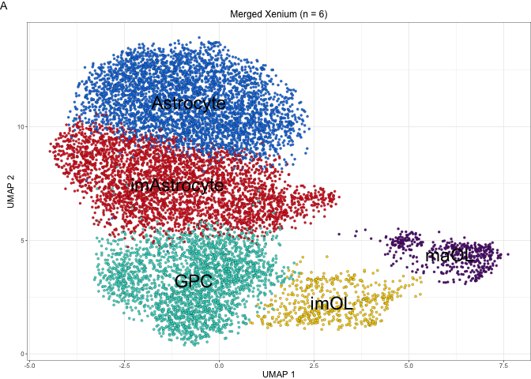<!-- -->

## Stacked Plot Cell Type

``` r
StackedCellType <- as.data.frame(table(xenium$final_cell_type))

unique(StackedCellType$Var1)
```

    ## [1] Astrocyte   imAstrocyte GPC         imOL        maOL       
    ## Levels: Astrocyte imAstrocyte GPC imOL maOL

``` r
stackedPlotXenium <- ggplot(StackedCellType, aes(fill = Var1, y = Freq, x = "Var1"))+
  geom_bar(position = "fill", stat = "identity")+
  guides(fill = guide_legend(override.aes = list(size = .6))) + theme_bw() + theme_manuscript() + scale_y_continuous(expand = c(0,0))  + labs(y = "Fraction Celltype", x = "Stage", fill = "Cell Type", tag = "C") + theme(legend.key.size = unit(.6, "lines")) + xlab(element_blank()) + NoLegend() & scale_fill_manual(values = manuscriptPalette)

stackedPlotXenium 
```

<!-- -->

``` r
(fig.DimPlotMerged | (fig.DimPlotLine[[1]] / fig.DimPlotLine[[2]]) | stackedPlotXenium) + plot_layout(widths = c(2,1,.25))
```

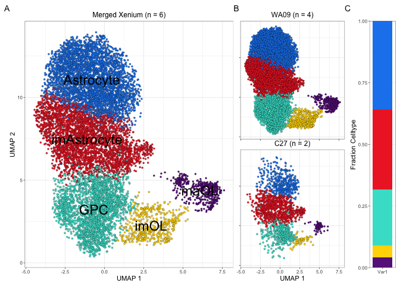<!-- -->

## Stacked Plot Cell Type by Sample

``` r
StackedCellType <- as.data.frame(table(xenium$final_cell_type))

unique(StackedCellType$Var1)
```

    ## [1] Astrocyte   imAstrocyte GPC         imOL        maOL       
    ## Levels: Astrocyte imAstrocyte GPC imOL maOL

``` r
stackedPlotXenium <- ggplot(StackedCellType, aes(fill = Var1, y = Freq, x = ""))+
  geom_bar(position = "fill", stat = "identity")+
  guides(fill = guide_legend(override.aes = list(size = .6))) + theme_bw() + theme_manuscript() + scale_y_continuous(expand = c(0,0))  + labs(y = "Fraction Celltype", x = "Stage", fill = "Cell Type", tag = "C") + theme(legend.key.size = unit(.6, "lines")) + xlab(element_blank()) + NoLegend() & scale_fill_manual(values = manuscriptPalette)

stackedPlotXenium 
```

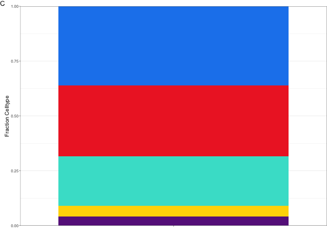<!-- -->

``` r
(fig.DimPlotMerged | (fig.DimPlotLine[[1]] / fig.DimPlotLine[[2]]) | stackedPlotXenium) + plot_layout(widths = c(2,1,.25))
```

<!-- -->

## Cell Type Marker Dot Plot

``` r
DefaultAssay(xenium) <- "RNA"
allMarkers <- presto::wilcoxauc(xenium)
astroMarkers <- presto::wilcoxauc(xenium, groups_use = c("Astrocyte", "imAstrocyte"))

canonicalMarkers <- c("BST2", "CRB2", "ABCC9", "GFAP", "AQP4", "SOX9", "SLC1A2", "SLC1A3", "FGFR3", "EGFR", "PDGFRA", "CSPG4", "PCDH17", "CA10", "ALCAM", "OLIG1", "OLIG2", "THY1", "SOX10", "GPR17", "SIRT2", "FYN", "BCAS1", "MBP", "CNP", "PLP1", "MOBP", "NKX6-2", "MOG", "MAL", "ENPP2")

#canonicalMarkers <- unique(allSpecificity[(allSpecificity$Specificity > .7 & allSpecificity$Group == "GPC4"),]$Gene)

markerDotPlot <- DotPlot(xenium, features = canonicalMarkers)$data

markerDotPlot$id <- factor(markerDotPlot$id, levels = rev(c("Astrocyte", "imAstrocyte", "GPC", "imOL", "maOL")))


fig.MarkerDotPlot <- ggplot(markerDotPlot, aes(size = pct.exp, fill = avg.exp.scaled, y = id, x = features.plot)) + 
  geom_point(color = "black", pch = 21) + 
  scale_size_area(max_size = 4) + 
  scale_fill_gradientn(colors = PurpleAndYellow()) + 
  theme_bw() + 
  theme_manuscript() +
  theme(axis.title = element_blank(), 
        axis.text.x = element_text(angle = 90, hjust = 1, vjust = .5), 
        legend.position = "bottom") +
  guides(fill = guide_colorbar(barheight = unit(0.25, "cm"), title.position = "bottom", title.theme = element_text(size = axisTitleSize*baseSize), barwidth = 5), 
         size = guide_legend(title.position = "bottom", title.theme = element_text(size = axisTitleSize*baseSize))) +
    labs(tag = "D", title = "Canonical Marker Expression", size = "% Expressed", fill = "Scaled Expression") 


fig.MarkerDotPlot
```

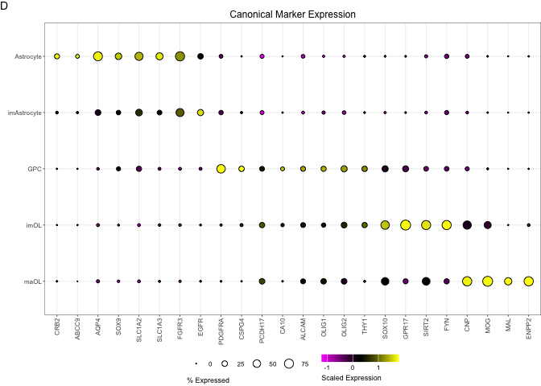<!-- -->

## Spatial Cell Type Plot

``` r
plot_data_wa09 <- allCellMetadata[allCellMetadata$sample_id.x == "WA09_40012",]
plot_data_wa09 <- plot_data_wa09 %>%
  dplyr::arrange(desc(final_cell_type == "Mouse")) 

min(plot_data_wa09$spatial_x)
```

    ## [1] 2378.093

``` r
min(plot_data_wa09$spatial_y)
```

    ## [1] 28.41381

``` r
plot_data_wa09$spatial_x <- plot_data_wa09$spatial_x - min(plot_data_wa09$spatial_x)
plot_data_wa09$spatial_y <- plot_data_wa09$spatial_y - min(plot_data_wa09$spatial_y)


fig.wa09plot <- ggplot(plot_data_wa09, aes(x = spatial_y, y = spatial_x, fill = final_cell_type, size = size)) + geom_point(shape = 21, colour = "black", stroke = .15) + scale_fill_manual(values = manuscriptPalette) + theme_manuscript() + scale_size_continuous(range = c(.3, 1.2)) + NoLegend() + coord_fixed()  + labs(x = "Microns", y = "Microns", title = "Human Engraftment - Xenium", tag = "E")

fig.wa09plot
```

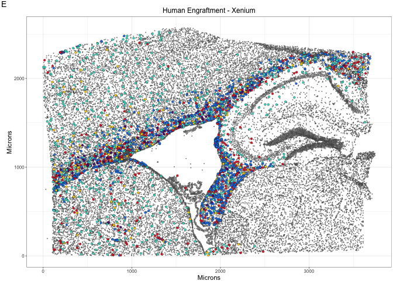<!-- -->

## Receptor Bar Plot

``` r
DefaultAssay(xenium) <- "RNA"

receptors <- c("RAMP1", "RAMP2", "APP", "LRP5", "SCARB1", "VLDLR", "ERBB4", "IGF2R", "LRP1", "LRP6", "SIRPA", "DCC", 'DSCAM', "PTPRK", "IL6ST", "EDNRB", "ERBB3", "FGFR1", "TYRO3", "CD82", "CD9", "MSN", "IL1RAP", "BMPR1A", "BMPR2", "TGFBR1", "PDGFRA", "PTPRD", "PTPRS", "ITGAV", "ITGB1", "ITGB8", "TNFRSF1A", "TNFRSF21", "TNFRSF10B")


markerDotPlot <- DotPlot(xenium, features = receptors, idents = "GPC")$data
```

    ## Warning: The following requested variables were not found (10 out of 11 shown):
    ## RAMP1, RAMP2, ERBB4, DCC, DSCAM, PTPRK, CD9, PTPRD, PTPRS, ITGB1

    ## Warning: Only one identity present, the expression values will be not scaled

``` r
markerDotPlot <- markerDotPlot[order(markerDotPlot$avg.exp, decreasing = T),]
markerDotPlot$features.plot <- factor(markerDotPlot$features.plot, levels = markerDotPlot$features.plot)


fig.BarPlot <- ggplot(markerDotPlot[markerDotPlot$id == "GPC",], aes(fill = pct.exp, y = log1p(avg.exp), x = features.plot)) + 
  geom_col() +
  scale_fill_viridis() + 
    scale_y_continuous(expand  = expansion(mult = c(0, 0.05))) +
  theme_bw() + 
  theme_manuscript() +
   labs(tag = "F", title = "GPC Receptor Expression", fill = "% Expressed", y = "Normalized Xenium Expression") +
  theme(axis.title.x = element_blank(), axis.text.x = element_text(angle = 90, hjust = 1, vjust = .5),
        legend.position = "bottom") + guides(fill = guide_colorbar(barheight = unit(0.25, "cm"), barwidth = 5))

fig.BarPlot
```

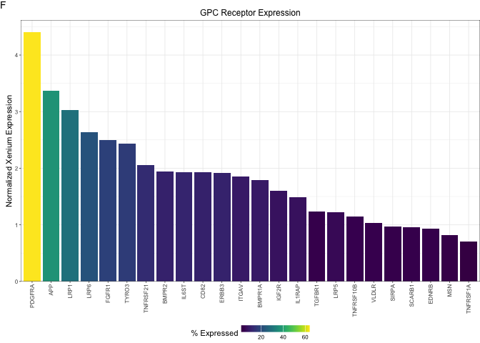<!-- -->

## scRNA-seq reception expression and detection

``` r
invivo <- readRDS("output/RDS/invivo.rds")
DefaultAssay(invivo) <- "RNA"
invivo <- NormalizeData(invivo)


markerDotPlotInvivo <- DotPlot(invivo, features = unique(markerDotPlot$features.plot), idents = "GPC")$data
markerDotPlotInvivo <- markerDotPlotInvivo[order(markerDotPlotInvivo$avg.exp, decreasing = T),]
markerDotPlotInvivo$features.plot <- factor(markerDotPlotInvivo$features.plot, levels = markerDotPlot$features.plot)

markerDotPlot$group <- "All_Cells_Xenium"
markerDotPlotInvivo$group <- "scRNA-Seq"

markeRDotPlotCombined <- rbind(markerDotPlot, markerDotPlotInvivo)

plot_df <- markeRDotPlotCombined %>%
  pivot_wider(names_from = group, values_from = avg.exp, names_prefix = "avg.exp_")

pivoted_df <- markeRDotPlotCombined %>%
  pivot_wider(
    names_from = group,
    values_from = -c(features.plot, id, group)
  )

fig.ScatterPlotInvivo <- ggplot(pivoted_df, aes(x = pct.exp_All_Cells_Xenium, y = `pct.exp_scRNA-Seq`)) + geom_point(shape = 21, fill = "turquoise", colour = "black") + ggrepel::geom_text_repel(aes(label = features.plot), size = 2, max.overlaps = 25) + ggtitle("GPC Receptor Detection Comparison") + labs(tag = "G", x = "%Xenium Expressed", y = "%scRNA-Seq Expressed") + theme_manuscript() 

fig.BarPlot | free(fig.ScatterPlotInvivo)
```

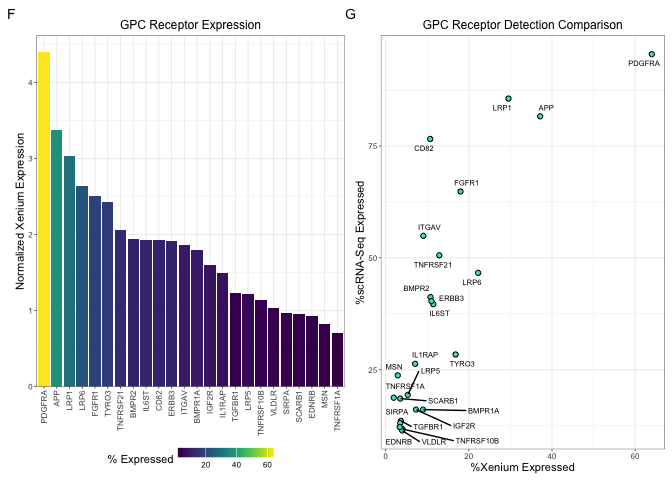<!-- -->

``` r
color0 = "grey60"
colPalette = c("dodgerblue2", 
        "gold", "red2")


GPC <- subset(xenium, subset = final_cell_type == "GPC")
metadataGPC <- GPC@meta.data

receptorFetch <- FetchData(GPC, vars = c(receptors, "CCND1", "spatial_x", "spatial_y", "sample_id"))
```

    ## Warning: The following requested variables were not found (10 out of 11 shown):
    ## RAMP1, RAMP2, ERBB4, DCC, DSCAM, PTPRK, CD9, PTPRD, PTPRS, ITGB1

``` r
receptorFetch$cellID <- row.names(receptorFetch)

receptorFetchLong <- pivot_longer(receptorFetch, cols = names(receptorFetch)[1:25])

receptorFetchLongFilt <- receptorFetchLong[receptorFetchLong$sample_id == "WA09_40012",]


gene <- "PDGFRA"
fig.pdgfra <- ggplot(receptorFetchLongFilt[receptorFetchLongFilt$name == gene,], aes(x = spatial_y, y = spatial_x, colour = value)) + 
  geom_point(size = 1) + 
  scale_colour_gradientn(colors = c(color0, colorRampPalette(colPalette)(100))) + 
  theme_manuscript() + 
  ggtitle(gene) +
  labs(x = "Microns", y = "Microns", tag = "H") + 
  theme(axis.text.x = element_blank(), axis.title.x = element_blank())

fig.pdgfra
```

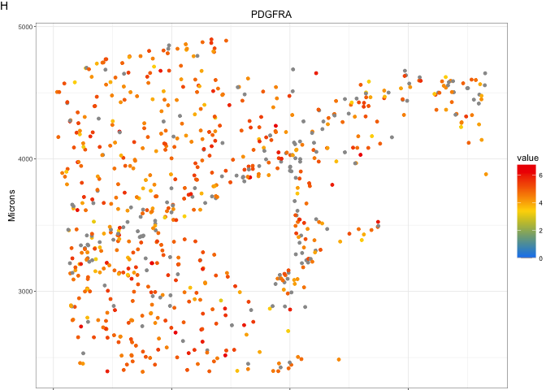<!-- -->

``` r
gene <- "CD82"
fig.cd82 <- ggplot(receptorFetchLongFilt[receptorFetchLongFilt$name == gene,], aes(x = spatial_y, y = spatial_x, colour = value)) + 
  geom_point(size = 1) + 
  scale_colour_gradientn(colors = c(color0, colorRampPalette(colPalette)(100))) + 
  theme_manuscript() + 
  ggtitle(gene) +
  labs(x = "Microns", y = "Microns") + 
  theme(axis.text = element_blank(), axis.title = element_blank())

fig.cd82
```

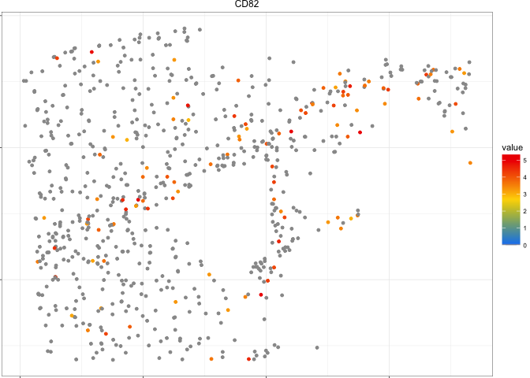<!-- -->

``` r
gene <- "LRP1"
fig.lrp1 <- ggplot(receptorFetchLongFilt[receptorFetchLongFilt$name == gene,], aes(x = spatial_y, y = spatial_x, colour = value)) + 
  geom_point(size = 1) + 
  scale_colour_gradientn(colors = c(color0, colorRampPalette(colPalette)(100))) + 
  theme_manuscript() + 
  ggtitle(gene) +
  labs(x = "Microns", y = "Microns")  

fig.lrp1
```

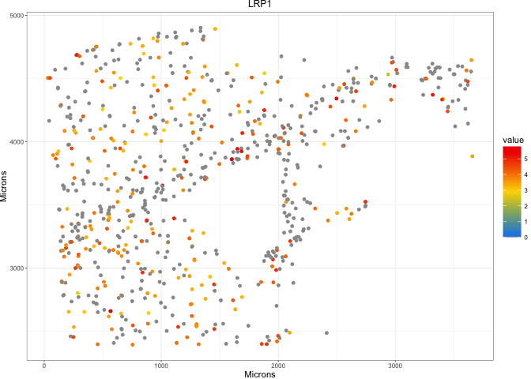<!-- -->

``` r
gene <- "LRP6"
fig.lrp6 <- ggplot(receptorFetchLongFilt[receptorFetchLongFilt$name == gene,], aes(x = spatial_y, y = spatial_x, colour = value)) + 
  geom_point(size = 1) + 
  scale_colour_gradientn(colors = c(color0, colorRampPalette(colPalette)(100))) + 
  theme_manuscript() + 
  ggtitle(gene) +
  labs(x = "Microns", y = "Microns") + 
  theme(axis.text.y = element_blank(), axis.title.y = element_blank())

fig.lrp6
```

<!-- -->

``` r
gene <- "CCND1"
fig.ccnd1 <- ggplot(receptorFetchLongFilt[receptorFetchLongFilt$name == gene,], aes(x = spatial_y, y = spatial_x, colour = value)) + 
  geom_point(size = 1) + 
  scale_colour_gradientn(colors = c(color0, colorRampPalette(colPalette)(100))) + 
  theme_manuscript() + 
  ggtitle(gene) +
  labs(x = "Microns", y = "Microns") + 
  theme(axis.text = element_blank(), axis.title = element_blank())

fig.ccnd1
```

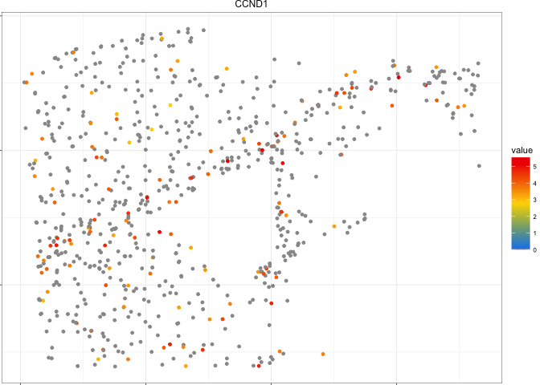<!-- -->

``` r
gene <- "ERBB3"
fig.erbb3 <- ggplot(receptorFetchLongFilt[receptorFetchLongFilt$name == gene,], aes(x = spatial_y, y = spatial_x, colour = value)) + 
  geom_point(size = 1) + 
  scale_colour_gradientn(colors = c(color0, colorRampPalette(colPalette)(100))) + 
  theme_manuscript() + 
  ggtitle(gene) +
  labs(x = "Microns", y = "Microns") + 
  guides(colour = guide_colorbar(lims = c(0, 9))) + 
  theme(axis.text.y = element_blank(), axis.title.y = element_blank())

fig.erbb3
```

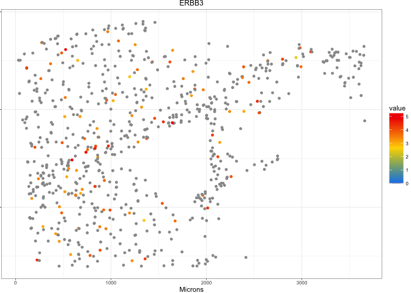<!-- -->

``` r
(fig.pdgfra | fig.cd82 | fig.ccnd1) / 
  (fig.lrp1 | fig.lrp6 | fig.erbb3) + plot_layout(guides = "collect") 
```

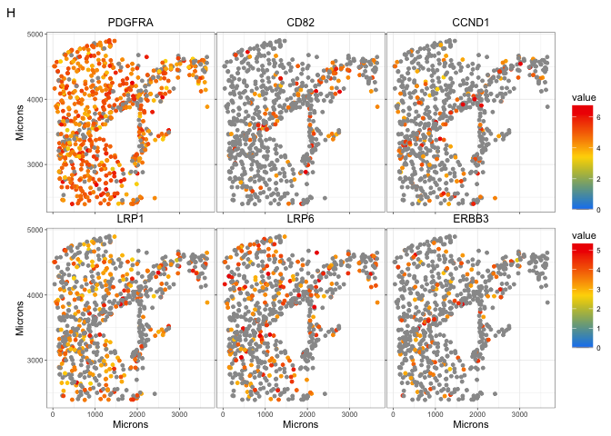<!-- -->

``` r
bottom <- wrap_plots(fig.pdgfra, fig.cd82, fig.ccnd1, fig.lrp1, fig.lrp6, fig.erbb3)  * scale_colour_gradientn(limits = c(0, 6.8), colors = c(color0, colorRampPalette(colPalette)(100)), name = "Expression")  + plot_layout(guides = "collect")
```

    ## Scale for colour is already present.
    ## Adding another scale for colour, which will replace the existing scale.
    ## Scale for colour is already present.
    ## Adding another scale for colour, which will replace the existing scale.
    ## Scale for colour is already present.
    ## Adding another scale for colour, which will replace the existing scale.
    ## Scale for colour is already present.
    ## Adding another scale for colour, which will replace the existing scale.
    ## Scale for colour is already present.
    ## Adding another scale for colour, which will replace the existing scale.
    ## Scale for colour is already present.
    ## Adding another scale for colour, which will replace the existing scale.

``` r
bottom
```

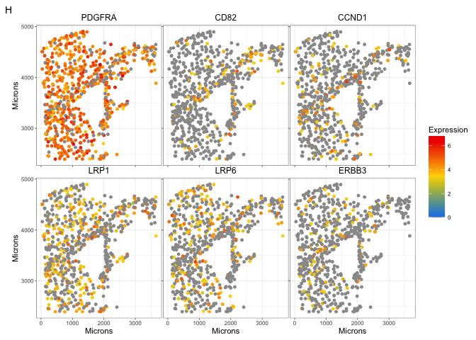<!-- -->

``` r
top <- ((fig.DimPlotMerged | (fig.DimPlotLine[[1]] / fig.DimPlotLine[[2]]) | stackedPlotXenium | free(fig.MarkerDotPlot)) + plot_layout(widths = c(2,1,.25,2)))
top
```

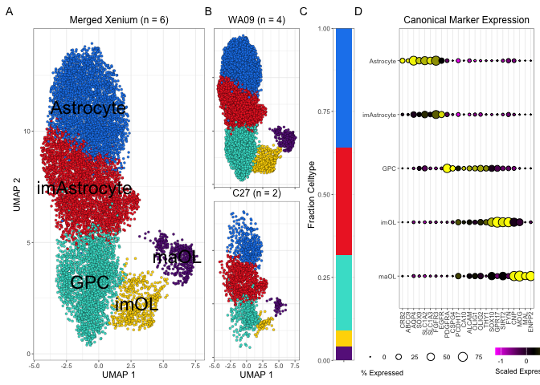<!-- -->

``` r
ggsave(top, filename = "output/Figures/Xenium/top.pdf", units = "in", width = 8.5, height = 3)
```

``` r
middle <- (fig.wa09plot | free(fig.BarPlot) | free(fig.ScatterPlotInvivo, type = "label"))
middle
```

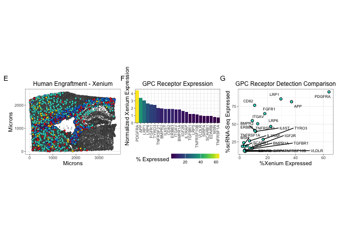<!-- -->

``` r
ggsave(middle, filename = "output/Figures/Xenium/middle.pdf", units = "in", width = 8.5, height = 4)
```

``` r
bottomWhole <- (plot_spacer() / bottom) + plot_layout(heights = c(8,2.5))
bottomWhole
```

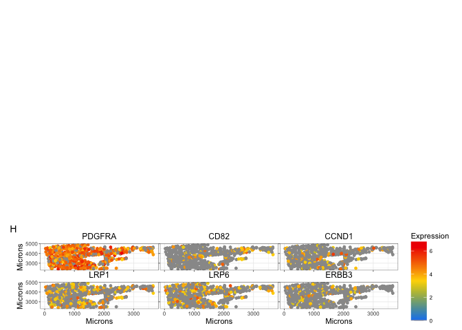<!-- -->

``` r
ggsave(bottomWhole,  filename = "output/Figures/Xenium/bottom.pdf", width = 8.5, height = 10.5, units = "in")
```

``` r
sessionInfo()
```

    ## R version 4.2.3 (2023-03-15)
    ## Platform: aarch64-apple-darwin20 (64-bit)
    ## Running under: macOS Ventura 13.2.1
    ## 
    ## Matrix products: default
    ## BLAS:   /Library/Frameworks/R.framework/Versions/4.2-arm64/Resources/lib/libRblas.0.dylib
    ## LAPACK: /Library/Frameworks/R.framework/Versions/4.2-arm64/Resources/lib/libRlapack.dylib
    ## 
    ## locale:
    ## [1] en_US.UTF-8/en_US.UTF-8/en_US.UTF-8/C/en_US.UTF-8/en_US.UTF-8
    ## 
    ## attached base packages:
    ## [1] stats     graphics  grDevices utils     datasets  methods   base     
    ## 
    ## other attached packages:
    ##  [1] dplyr_1.1.1                tidyr_1.3.0               
    ##  [3] viridis_0.6.2              viridisLite_0.4.1         
    ##  [5] presto_1.0.0               data.table_1.14.8         
    ##  [7] Rcpp_1.0.10                patchwork_1.3.0.9000      
    ##  [9] scPlottingTools_0.0.0.9000 ggplot2_3.5.2             
    ## [11] SeuratObject_5.0.2         Seurat_4.3.0              
    ## 
    ## loaded via a namespace (and not attached):
    ##   [1] Rtsne_0.16             colorspace_2.1-0       deldir_1.0-6          
    ##   [4] ellipsis_0.3.2         ggridges_0.5.7         rprojroot_2.0.3       
    ##   [7] rstudioapi_0.14        spatstat.data_3.0-4    leiden_0.4.3          
    ##  [10] listenv_0.9.0          farver_2.1.1           ggrepel_0.9.3         
    ##  [13] fansi_1.0.4            codetools_0.2-19       splines_4.2.3         
    ##  [16] knitr_1.42             polyclip_1.10-4        spam_2.10-0           
    ##  [19] jsonlite_1.8.4         ica_1.0-3              cluster_2.1.4         
    ##  [22] png_0.1-8              uwot_0.1.14            shiny_1.7.4           
    ##  [25] sctransform_0.3.5      spatstat.sparse_3.0-3  compiler_4.2.3        
    ##  [28] httr_1.4.5             Matrix_1.6-4           fastmap_1.1.1         
    ##  [31] lazyeval_0.2.2         cli_3.6.1              later_1.3.0           
    ##  [34] htmltools_0.5.5        tools_4.2.3            igraph_2.0.3          
    ##  [37] dotCall64_1.1-1        gtable_0.3.3           glue_1.6.2            
    ##  [40] RANN_2.6.1             reshape2_1.4.4         scattermore_0.8       
    ##  [43] vctrs_0.6.1            nlme_3.1-162           spatstat.explore_3.2-7
    ##  [46] progressr_0.13.0       lmtest_0.9-40          spatstat.random_3.2-3 
    ##  [49] xfun_0.38              stringr_1.5.0          globals_0.16.2        
    ##  [52] mime_0.12              miniUI_0.1.1.1         lifecycle_1.0.3       
    ##  [55] irlba_2.3.5.1          goftest_1.2-3          future_1.32.0         
    ##  [58] MASS_7.3-58.3          zoo_1.8-11             scales_1.3.0          
    ##  [61] ragg_1.2.5             promises_1.2.0.1       spatstat.utils_3.1-0  
    ##  [64] parallel_4.2.3         RColorBrewer_1.1-3     yaml_2.3.7            
    ##  [67] reticulate_1.43.0      pbapply_1.7-0          gridExtra_2.3         
    ##  [70] stringi_1.7.12         highr_0.10             systemfonts_1.0.4     
    ##  [73] rlang_1.1.0            pkgconfig_2.0.3        matrixStats_0.63.0    
    ##  [76] evaluate_0.20          lattice_0.21-8         ROCR_1.0-11           
    ##  [79] purrr_1.0.1            tensor_1.5             labeling_0.4.2        
    ##  [82] htmlwidgets_1.6.2      cowplot_1.1.1          tidyselect_1.2.0      
    ##  [85] parallelly_1.35.0      RcppAnnoy_0.0.20       plyr_1.8.8            
    ##  [88] magrittr_2.0.3         R6_2.5.1               generics_0.1.3        
    ##  [91] DBI_1.1.3              withr_2.5.0            pillar_1.9.0          
    ##  [94] fitdistrplus_1.1-8     survival_3.5-5         abind_1.4-5           
    ##  [97] sp_1.6-0               tibble_3.2.1           future.apply_1.10.0   
    ## [100] KernSmooth_2.23-20     utf8_1.2.3             spatstat.geom_3.2-9   
    ## [103] plotly_4.10.1          rmarkdown_2.21         grid_4.2.3            
    ## [106] digest_0.6.31          xtable_1.8-4           httpuv_1.6.9          
    ## [109] textshaping_0.3.6      munsell_0.5.0
